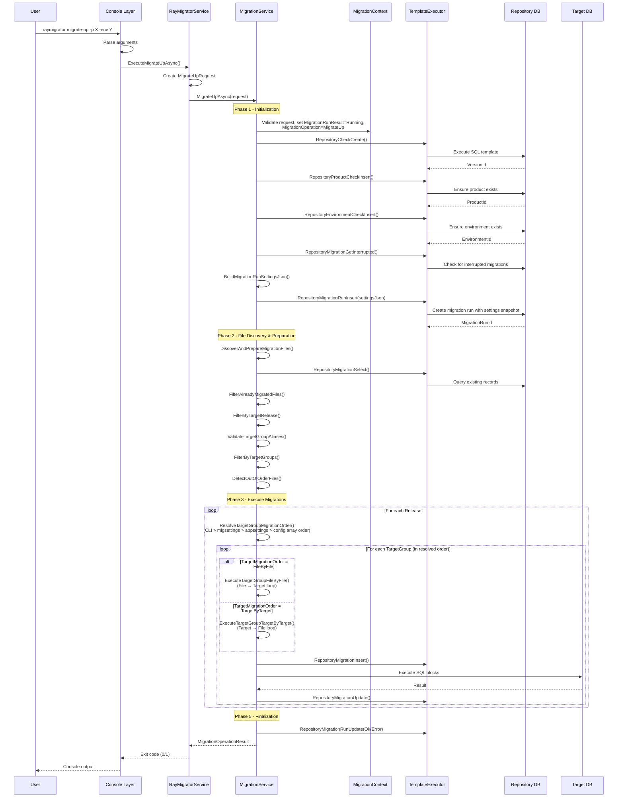
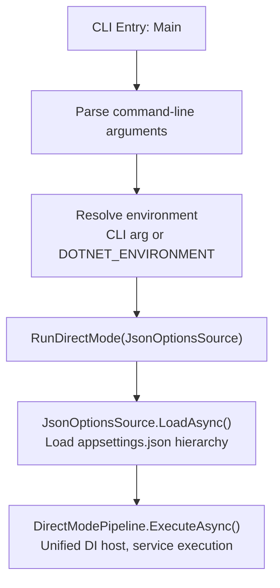
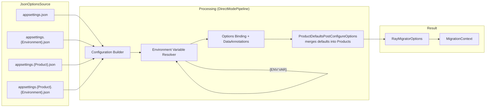
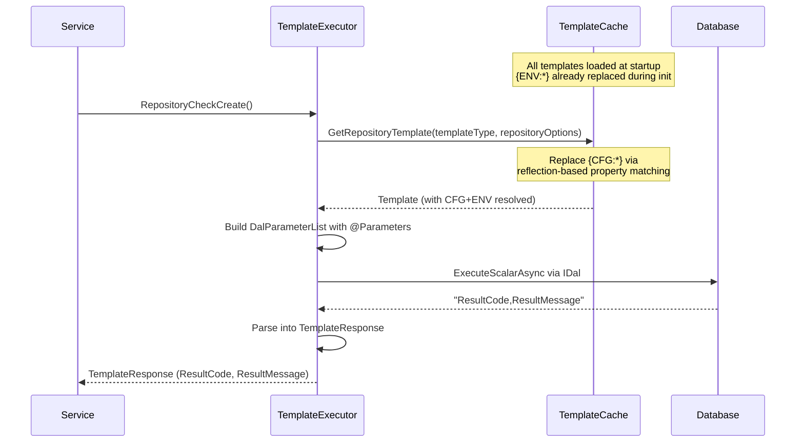
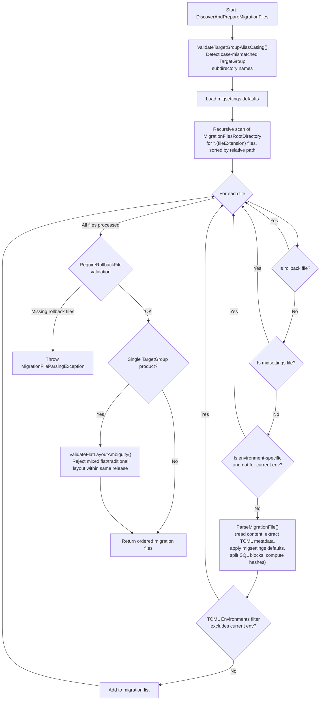
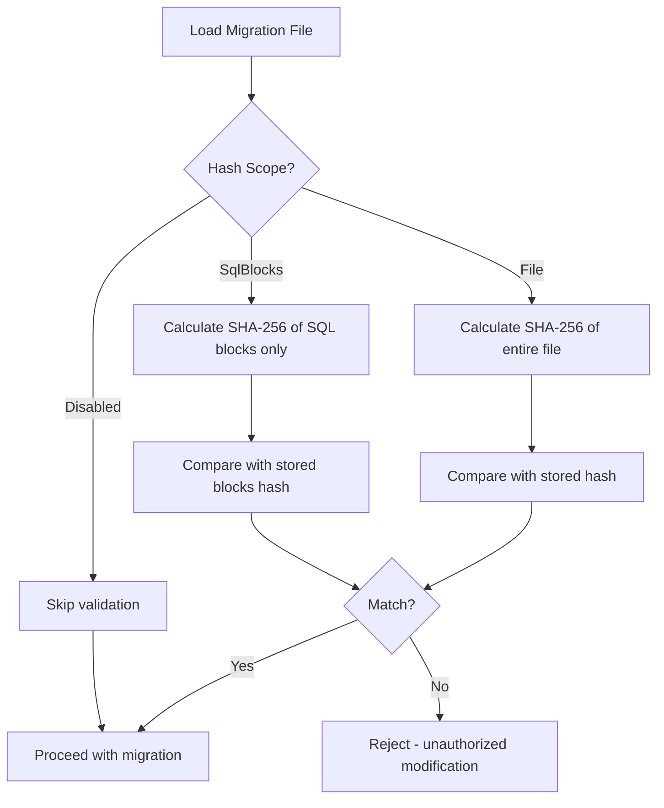
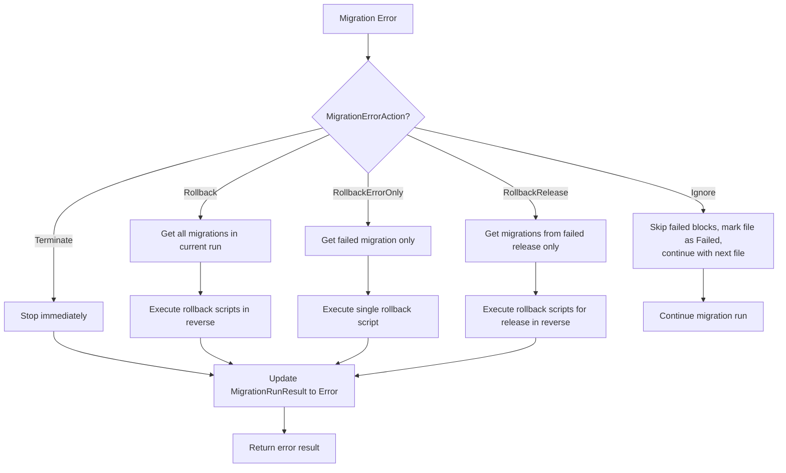
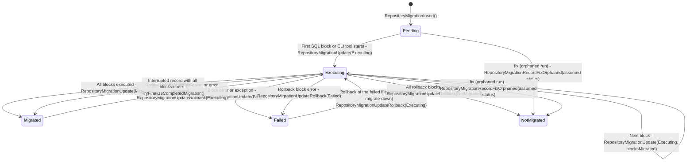
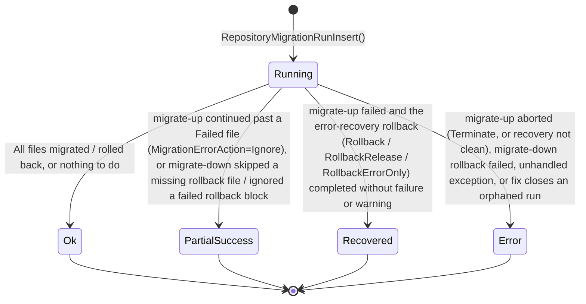

# Data Flow

This document describes how data flows through RayMigrator during migration operations.

## Migration Execution Flow



## Console Startup Flow



## Configuration Loading Flow (Standalone Mode)



## Template Execution Flow



## Migration File Discovery Flow



## Hash Validation Flow



## Error Handling Flow



## Request/Response Pattern

### MigrateUpRequest
```json
{
  "productAlias": "RayMigratorTests",
  "environment": "Docker",
  "runMode": "Migrate",
  "targetReleaseVersion": "Release 1.2",
  "showInfo": true,
  "revealSensitiveData": false,
  "allowOutOfOrder": false,
  "targetGroupAliases": null,
  "targetGroupMigrationOrder": null
}
```

### MigrationOperationResult
```json
{
  "success": true,
  "runId": "guid",
  "productAlias": "RayMigratorTests",
  "environment": "Docker",
  "operation": "MigrateUp",
  "result": "Ok",
  "totalMigrations": 5,
  "successfulMigrations": 5,
  "failedMigrations": 0,
  "currentRelease": "Release 1.2",
  "migrationResults": [
    {
      "fileName": "001_CreateTable.sql",
      "releaseVersion": "Release 1.0",
      "targetGroup": "Backend",
      "success": true,
      "errorMessage": null,
      "executedAt": "2026-02-20T12:00:00Z",
      "duration": "00:00:01.234"
    }
  ],
  "errorMessage": null,
  "errorCode": null,
  "messages": [
    "Successfully executed 5 migration(s)"
  ],
  "executedAt": "2026-02-20T12:00:00Z",
  "duration": "00:00:05.678"
}
```

## MigrationContext State Transitions

`MigrationState` carries two persisted state enums: `MigrationStatus` (per migration record, `MigrationRecord.MigrationStatusId`) and `MigrationRunResult` (per run, `MigrationRun.MigrationRunResultId`). Both are written by `MigrationService` through `TemplateExecutor`.

### MigrationStatus (per record)



`fix` writes the `--assumed-status` (`NotMigrated` or `Migrated`) to every `Pending`/`Executing` record of an orphaned run; the auto-fix in `RepositoryMigrationRunInsertWithAutoFix()` always uses `NotMigrated`. `Undefined` (0) is never persisted.

### MigrationRunResult (per run)



Every terminal value is written by `RepositoryMigrationRunUpdate()`; `fix` and the auto-fix close an orphaned run with `RepositoryMigrationRunFixOrphaned()` (result `Error`). See [Migration State Machine](../02-core-concepts/migration-state-machine.md) for the per-command flows.

## Related Documentation

- [Overview](overview.md) - Architecture overview
- [Component Responsibilities](component-responsibilities.md) - Component details
- [Patterns](patterns.md) - Implementation patterns
- [Execution Modes](../02-core-concepts/execution-modes.md) - Operating modes, migration order, run modes
- [Error Handling](../02-core-concepts/error-handling.md) - MigrationErrorAction and RollbackErrorAction strategies
- [Migration Service](../04-service-layer/migration-service.md) - Service implementation details
