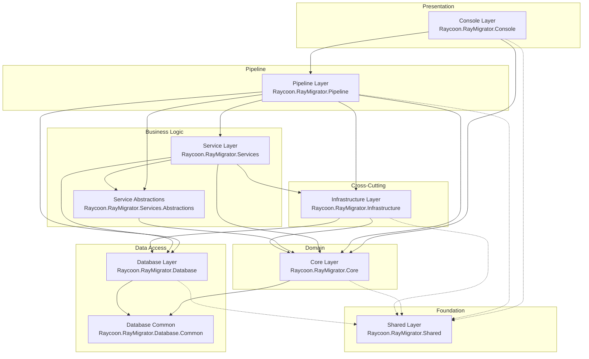
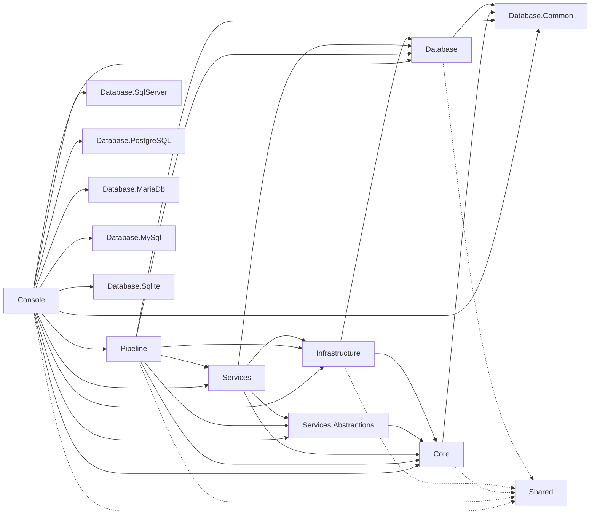

# Architecture Overview

RayMigrator implements a service-oriented, layered architecture with clear separation of concerns. This design enables testability, extensibility, and maintainability across multiple database systems.

## 7-Layer Architecture



## Layer Responsibilities

### 1. Console Layer (`Raycoon.RayMigrator.Console`)

The CLI entry point that handles user interaction.

**Key Components:**
- `Program.cs` - Application entry point, command-line parsing, environment resolution, and dispatch
- `AssemblyInfoHelper` - Local helper delegating to `Shared.AssemblyInfoHelper.GetAsciiHeader()`

**Responsibilities:**
- Parse command-line arguments via `CommandLineConfiguration` (System.CommandLine)
- Resolve environment from CLI arguments or `DOTNET_ENVIRONMENT` variable via `EnvironmentResolver`
- Dispatch to `RunDirectMode()` using `JsonOptionsSource` (constructed with the `--config-dir` value, defaulting to the current working directory)
- `RunDirectMode()` delegates to `DirectModePipeline.ExecuteAsync()`
- Convert service results to exit codes

**Project References:**
- Pipeline, Core, Database.Common, Database, Database.SqlServer, Database.PostgreSQL, Database.MariaDb, Database.MySql, Database.Sqlite, Infrastructure, Shared, Services, Services.Abstractions

Post-build MSBuild targets copy each DAL DLL into `DataAccessLayers/{Type}/` and (on publish) also copy the DAL `Templates/*.sql` files into the same directories for plugin discovery by `DalFactory`.

### 2. Pipeline Layer (`Raycoon.RayMigrator.Pipeline`)

The unified execution pipeline for Direct mode, handling the complete lifecycle after options have been loaded (both Standalone/JSON and Managed/Admin-DB configurations).

**Key Components:**
- `DirectModePipeline` - Unified execution pipeline: Serilog creation, DI host build, DatabaseLogWriter init, DAL properties, connection validation, `RayMigratorService` execution, and shutdown
- `JsonOptionsSource` - `IOptionsSource` implementation that loads configuration from JSON files (appsettings.json hierarchy); accepts an optional `configDir` parameter (from `--config-dir` global option) that overrides the base path used to locate configuration files
- `RayMigratorService` - Bridge between CLI commands and `IMigrationService`
- `SerilogFactory` - Creates Serilog logger (with optional database sink) from `IConfigurationSection`

**Responsibilities:**
- Build and configure the DI container
- Initialize logging (Serilog with optional database sink)
- Register options, services, TemplateCache, TemplateExecutor, and MigrationContext
- Validate product alias, connections, and schema names
- Initialize `DalSpecificPropertiesDictionary`
- Execute the requested migration command via `RayMigratorService`
- Manage application shutdown

**Project References:**
- Core, Database, Database.Common, Infrastructure, Services, Services.Abstractions, Shared

### 3. Service Layer (`Raycoon.RayMigrator.Services`)

Business logic orchestration using request/response patterns.

**Key Components:**
- `MigrationService` - Implements `IMigrationService`
- `ICliToolExecutor` / `CliToolExecutor` - Executes external CLI tools (sqlcmd, psql, mysql, mariadb, sqlite3) as an alternative to DAL-based SQL execution
- `CliToolExecutionRequest` / `CliToolExecutionResult` - Request/result models for CLI tool execution
- Request DTOs: `MigrateUpRequest`, `MigrateDownRequest`, `ValidateHashRequest`, `UpdateHashRequest`, `BaselineRequest`, `FixIssuesRequest`
- Response DTOs: `OperationResult` (abstract base), `MigrationOperationResult`, `ValidationResult`, `HashUpdateResult`, `BaselineResult`, `FixIssuesResult`

**Responsibilities:**
- Orchestrate migration operations
- Coordinate between presentation and core layers
- Execute migrations via DAL or external CLI tools
- Validate requests against configuration
- Return strongly-typed results

**Interfaces:** `Raycoon.RayMigrator.Services.Abstractions`

### 4. Core Layer (`Raycoon.RayMigrator.Core`)

The domain model layer containing configuration, state, and core abstractions.

**Key Components:**
- `MigrationContext` - Central state object
- `MigrationState` / `MigrationStateSnapshot` - Runtime state tracking
- `MigrationLoggingContext` - Static `AsyncLocal`-backed ambient context used by the Serilog enricher
- `IMigrationContextAccessor` / `IMigrationContextFactory` - Context lifetime abstractions
- `RayMigratorHostMode` - Enum distinguishing CLI mode (`Cli`) from API mode (`Api`) for DI registration
- Configuration Options classes (`RayMigratorOptions` hierarchy, `RayMigratorBootstrapOptions`, `AdminDbOptions`, `CliToolOptions`, `ExitCodeMatcher`)
- `TemplateExecutor` (namespace `Raycoon.RayMigrator.Core`) and `TemplateCache` (namespace `Raycoon.RayMigrator.Core.Templates`), both physically in Infrastructure project
- Enumerations (`MigrationCommand`, `MigrationErrorAction`, `RollbackErrorAction`, `TargetMigrationOrder`, `HashValidationScope`, `MigrationRunMode`, `MigrationOperation`, `MigrationRunResult`, `MigrationStatus`, `FixIssues`, `OperatingMode`, `CliToolInputMode`)
- Configuration sources (`IOptionsSource` interface and `OptionsSourceResult` in `Core/Configuration/Sources/`)
- `MigrationEvent` class (static `EventId` constants for structured logging)
- `TemplateType` enum (in `Core/Templates/`, defining all 18 SQL template types + Undefined); companion `Template` and `TemplateResponse` classes
- Domain models: `MigrationFileInfo`, `MigrationRecord`, `InterruptedMigrationInfo`, `MigrationStateSnapshot`
- `CultureDependentSorting` - Culture-aware file sorting helper
- `EnvironmentResolver` - Resolves target environment from CLI arguments or `DOTNET_ENVIRONMENT` variable
- Environment variable replacer, `SensitiveDataMasker`, custom validation attributes (`RayAttributes/`)
- Extension methods: `EnumTypeExtensions`, `ExceptionExtensions`, `StringExtensions`, `MigrationRunModeExtensions`, `RayMigratorOptionsExtensions`

**Responsibilities:**
- Configuration binding and validation (Options pattern)
- Migration state management
- Template execution and caching
- Environment variable resolution (`{ENV:VAR}` syntax)
- Environment resolution for CLI arguments

**Project References:**
- Database.Common, Shared

### 5. Infrastructure Layer (`Raycoon.RayMigrator.Infrastructure`)

Cross-cutting concerns shared across layers, primarily logging.

**Key Components:**
- `Logging/DatabaseLogWriter` - Writes log entries to a database table via Serilog sink
- `Logging/RayMigratorDatabaseSink` - Custom Serilog sink for database logging
- `Logging/MigrationContextEnricher` - Serilog enricher adding migration context to log entries
- `Logging/DatabaseLoggerQueue` - Buffered async log writing queue with deterministic `Flush()` shutdown

**Responsibilities:**
- Database logging infrastructure (Serilog integration)
- Log context enrichment with migration state

> **Note**: Several files physically reside in the Infrastructure project directory but declare themselves in `Raycoon.RayMigrator.Core` namespaces: `TemplateExecutor` (`Raycoon.RayMigrator.Core`), `TemplateCache` (`Raycoon.RayMigrator.Core.Templates`), `ConnectionValidator` (`Raycoon.RayMigrator.Core.Configuration.Validation`), and `RepositoryExtensions` (`Raycoon.RayMigrator.Core.Extensions`). They are referenced via Core namespaces.

**Project References:**
- Core, Database, Shared

### 6. Database Layer (Plugin Architecture)

Uses a plugin architecture where each database provider is an independent assembly:

#### `Raycoon.RayMigrator.Database.Common` (NuGet package)
- `IDal` interface and `DalBase` abstract base class
- `IDalSettings` interface and `DalSettings` implementation
- `DalSpecificProperties` (fields: `SqlBlockDelimiter`, `SqlMultiLineCommentStart`, `SqlMultiLineCommentEnd`, `SupportsSchema`, `SupportsTransactionalDdl`, `IdentifierQuoteStart`, `IdentifierQuoteEnd`, `DefaultSchema`, `FoldsUnquotedIdentifiersToLower`), `DalParameter`, `DalParameterList`
- `DatabaseTypeAttribute` for reflection-based discovery
- `RetryHelper` with transient-predicate-based retry logic (`Func<Exception, (bool isTransient, string? errorCode)>`) and linear backoff
- `RetryExhaustedException` for exhausted retry attempts

#### `Raycoon.RayMigrator.Database`
- `DalFactory` - static factory with **dual-mode plugin discovery**: DependencyContext-based scanning for built-in DALs (works with single-file publish) and filesystem-based scanning of `DataAccessLayers/` subdirectories for external DAL plugins

#### Built-in DAL Plugins (separate assemblies)
- `Database.SqlServer` - SQL Server provider (`Microsoft.Data.SqlClient`)
- `Database.PostgreSQL` - PostgreSQL provider (`Npgsql`)
- `Database.MariaDb` - MariaDB provider (`MySqlConnector`)
- `Database.MySql` - MySQL provider (`MySqlConnector`)
- `Database.Sqlite` - SQLite provider (`Microsoft.Data.Sqlite`)
- Each plugin contains a DAL class + SQL templates
- External DALs can be developed independently using `Database.Common` and `Shared` NuGet packages

#### External DAL Development
- `Database.Example` - Skeleton template project for building custom DAL plugins. Contains `DalExample.cs` and placeholder SQL template files as a starting point for implementing new database providers.

### 7. Shared Layer (`Raycoon.RayMigrator.Shared`)

Common types used across all layers. Has no project references.

**Contents:**
- Custom exceptions (16 exception types, e.g., `TemplateExecutionException`, `TemplateResultException`, `MigrationExecutionException`, `MigrationAlreadyRunningException`, `CliToolExecutionException`, `CliToolTimeoutException`)
- Constants (`InternalConstants`, `TemplateResultCode`)
- `AssemblyInfoHelper` - Version and assembly metadata utility (`GetRayMigratorVersion`, `GetAsciiLogoLines`, `GetAsciiHeader`)

> **Note**: Enumerations (`MigrationCommand`, `MigrationErrorAction`, `RollbackErrorAction`, `TargetMigrationOrder`, `MigrationRunMode`, `MigrationOperation`, `MigrationRunResult`, `MigrationStatus`, `HashValidationScope`, `FixIssues`, `OperatingMode`, `CliToolInputMode`) and the `MigrationEvent` class (static `EventId` constants) reside in the **Core** layer (`Raycoon.RayMigrator.Core/Configuration/Enums/`), not the Shared layer. The `TemplateType` enum resides in `Raycoon.RayMigrator.Core/Templates/`. Request/Response DTOs reside in `Services.Abstractions`.

## Dependency Flow



**Solid lines**: Direct project references
**Dashed lines**: Shared types dependency

> **Note**: `Database.Common` and `Shared` have no project references (leaf nodes).

## Build Configuration

The solution targets .NET 10, .NET 9, and .NET 8:

```xml
<TargetFrameworks>net10.0;net9.0;net8.0</TargetFrameworks>
```

Each DAL plugin copies its templates and DLL to `DataAccessLayers/{DatabaseType}/` during build:

```xml
<!-- In each DAL .csproj -->
<ItemGroup>
    <Content Include="Templates\**\*.sql">
        <CopyToOutputDirectory>PreserveNewest</CopyToOutputDirectory>
        <Link>DataAccessLayers\$(RayMigratorDatabaseType)\%(RecursiveDir)%(Filename)%(Extension)</Link>
        <Pack>true</Pack>
        <PackagePath>contentFiles\any\any\DataAccessLayers\$(RayMigratorDatabaseType)\</PackagePath>
        <PackageCopyToOutput>true</PackageCopyToOutput>
    </Content>
</ItemGroup>
```

## Related Documentation

- [Design Decisions](design-decisions.md) - Why this architecture was chosen
- [Component Responsibilities](component-responsibilities.md) - Detailed component breakdown
- [Data Flow](data-flow.md) - Request processing sequence
- [Dependency Injection](dependency-injection.md) - DI container configuration
- [Patterns](patterns.md) - Architectural patterns used
