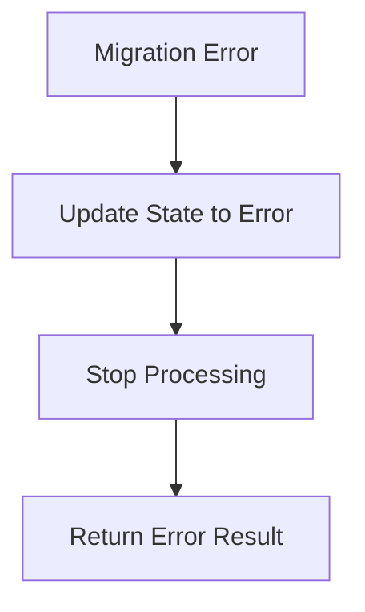
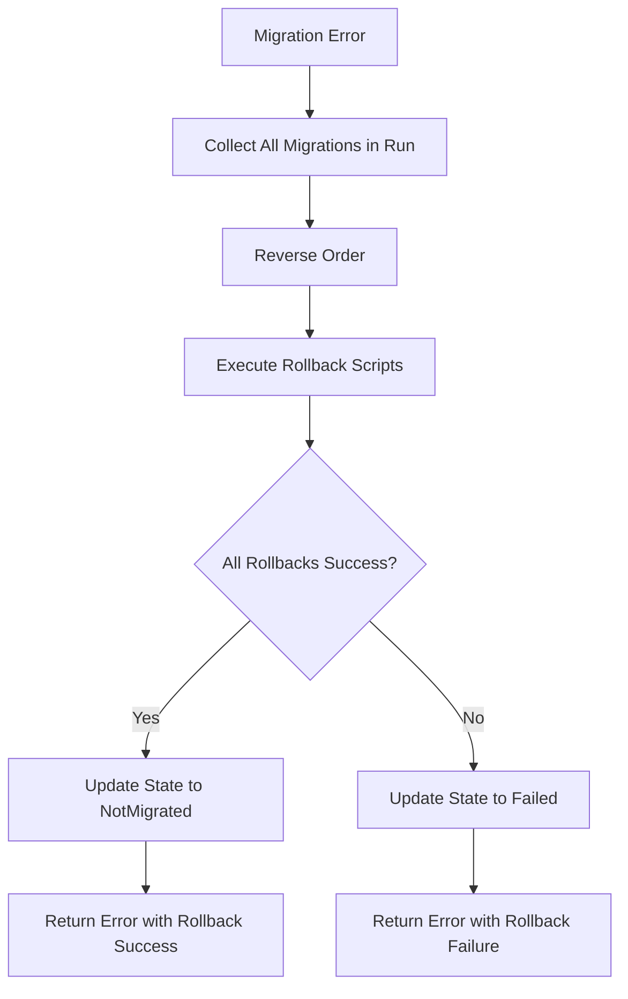
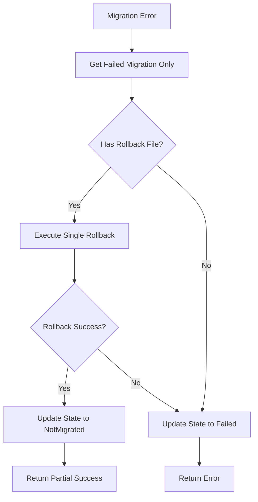
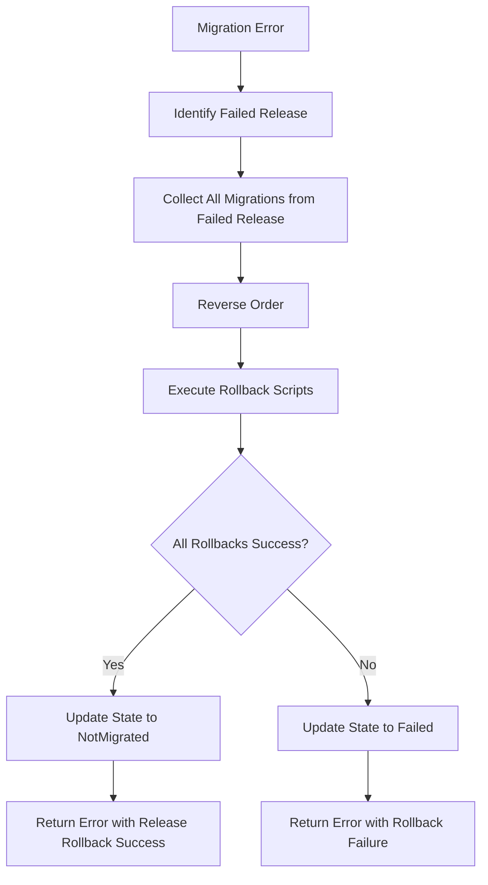
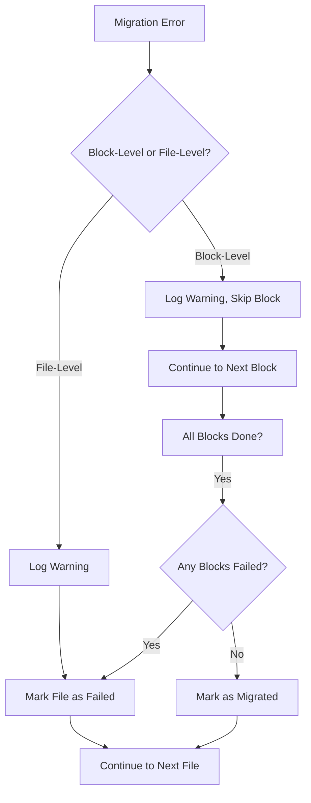
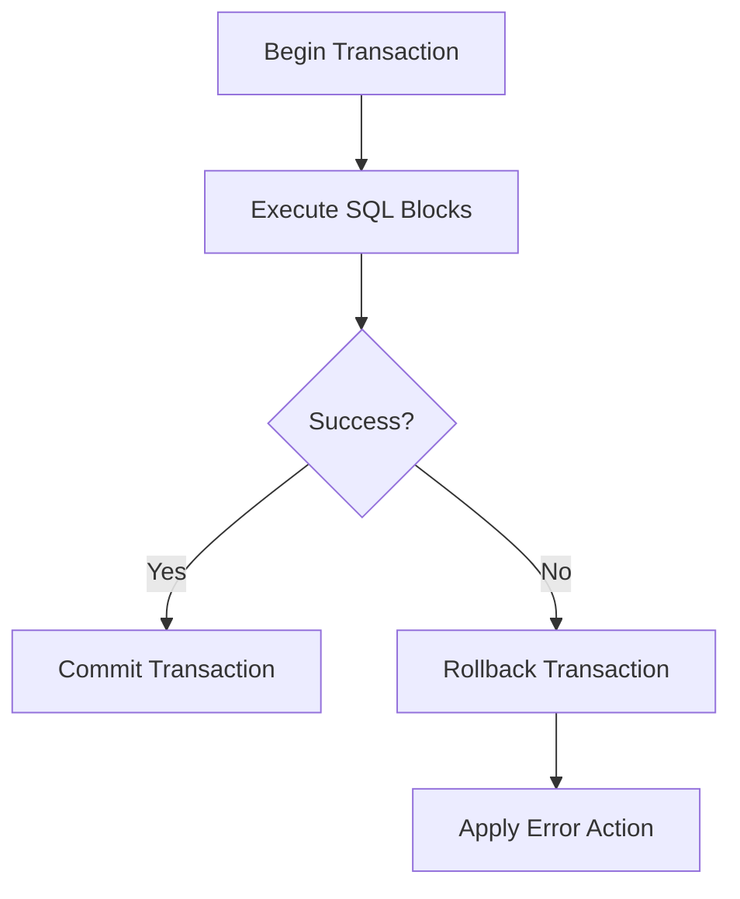

# Error Handling

RayMigrator provides configurable error handling strategies to control behavior when migrations fail.

## Error Action Modes

### Enum Values

| Name | Value | Description |
|------|-------|-------------|
| `Undefined` | 0 | Invalid — not set |
| `Terminate` | 10 | Stop immediately, no rollback |
| `Rollback` | 20 | Rollback all migrations in current run |
| `RollbackErrorOnly` | 21 | Rollback only the failed migration |
| `RollbackRelease` | 22 | Rollback all migrations from the failed release |
| `Ignore` | 30 | Ignore the error and continue execution |

Source: `Raycoon.RayMigrator.Core/Configuration/Enums/MigrationErrorAction.cs` (namespace `Raycoon.RayMigrator.Core.Configuration.Enums`)

Configure via `MigrationErrorAction` at multiple levels:

```json
{
  "ProductDefaults": {
    "MigrationErrorAction": "Terminate"
  },
  "Products": [{
    "Alias": "MyProduct",
    "MigrationErrorAction": "Rollback"
  }]
}
```

### Priority Chain

`MigrationErrorAction` supports a full configuration hierarchy with three conceptual levels (appsettings, migsettings, TOML), each with sub-levels. Listed from lowest to highest priority:

```
ProductDefaults (appsettings)
  ← Product (appsettings)
    ← Product/migsettings.txt
      ← Product/migsettings.{Env}.txt
        ← Release/migsettings.txt
          ← Release/migsettings.{Env}.txt
            ← TargetGroup/migsettings.txt
              ← TargetGroup/migsettings.{Env}.txt
                ← Migration file TOML (highest priority)
```

This allows per-directory or per-file error handling. For example, a directory of seed data scripts can use `Terminate` while schema migrations use `Rollback`:

**`Release 1.0/Backend/migsettings.txt`**:
```toml
[RayMigrator]
MigrationErrorAction = Rollback
```

**`Release 1.0/Backend/99_SeedData.sql`**:
```sql
/*
[RayMigrator]
Description = "Seed data — terminate on error"
MigrationErrorAction = Terminate
*/
INSERT INTO LookupData VALUES (...);
```

### Terminate (Default)

Stop immediately on error. No rollback is performed.



**Characteristics**:
- Fastest error response
- Preserves partial state
- Requires manual intervention
- Database may be in partial state

**Use Cases**:
- Production environments (prevent cascading changes)
- Debugging (preserve state for investigation)
- When rollback is riskier than partial state

### Rollback

Execute all rollback scripts for the current migration run in reverse order.



**Implementation detail**: The rollback list is built from `successfullyMigratedRecords`, a `List<(MigrationFileInfo File, int MigrationId, string TargetAlias)>`. Each record stores the `TargetAlias` at the time the migration was executed, ensuring that rollbacks target the correct database even when multiple targets exist. The failed migration itself uses the current `MigrationState.TargetAlias`.

**Characteristics**:
- Attempts to restore pre-migration state
- Rollback failures leave `Failed` status
- Requires rollback files for all migrations
- May not be possible for all operations

**Use Cases**:
- Development environments
- Test environments
- When atomic success/failure is required

### RollbackErrorOnly

Rollback only the failed migration, keep successful ones.



**Characteristics**:
- Preserves successful migrations
- Only rollback the problem migration
- Balance between progress and safety
- May leave targets in different states

**Use Cases**:
- When partial progress is acceptable
- Long migration sequences
- Independent migration files

### RollbackRelease

Rollback all migrations from the release where the error occurred, keep migrations from previous releases.



**Characteristics**:
- Scoped to the release that failed — previous releases remain intact
- Balance between full rollback and error-only rollback
- Requires rollback files for all migrations in the failed release
- Preserves progress from earlier releases

**Use Cases**:
- Multi-release migration runs where earlier releases should be preserved
- When releases represent logical units of change
- Staged deployments where partial rollback is desired

### Ignore

Ignore the error and continue execution. Failed SQL blocks are skipped, and the migration file is marked as `Failed`. The migration run proceeds with the next file.



**Two-Level Ignore**:
- **Block level**: Each SQL block that fails is logged and skipped. The remaining blocks in the file still execute.
- **File level**: If any blocks failed, the file is marked as `Failed` in the repository. Execution continues with the next migration file.

**Characteristics**:
- Does not abort the migration run
- Failed files are marked as `Failed` (re-attempted on next run)
- Failed files are NOT added to `successfullyMigratedRecords` — they won't be rolled back if a later file fails with Rollback
- In Simultaneously mode: if a file fails on one target, remaining targets for that file are skipped
- The overall `MigrationRunResult` is `Error` when any ignored failures occurred

**Use Cases**:
- Seed data or optional lookups where partial failure is acceptable
- Development environments where you want to run as many migrations as possible
- Non-critical migrations that should not block the rest of the run

### Error Handling in Simultaneously vs Successively Modes

Both `TargetMigrationOrder` modes handle errors identically:

- **Simultaneously** (file -> target loop): If a file fails on one target, remaining targets for that file are skipped. With `Ignore`, the file is marked as `Failed` and execution continues to the next file. With any other error action, the `TargetGroup` is aborted immediately.
- **Successively** (target -> file loop): If a file fails on a target, with `Ignore`, the file is marked as `Failed` and execution continues to the next file for that target. With any other error action, the `TargetGroup` is aborted immediately.

In both modes, when a non-Ignore error aborts a `TargetGroup`, the caller (`MigrateUpAsync` Phase 3) invokes `HandleMigrationError` to execute the configured error action (Terminate, Rollback, RollbackErrorOnly, or RollbackRelease), then updates the `MigrationRun` to `MigrationRunResult.Error` and returns.

See also: [Product Options](../06-configuration-reference/product-options.md) for `MigrationErrorAction` configuration.

---

## Rollback Error Handling

When a rollback operation itself encounters an error (e.g., a rollback SQL block fails), the `RollbackErrorAction` setting controls what happens. Since a failed rollback cannot itself be rolled back, the options are limited to **stopping** or **continuing**.

### RollbackErrorAction Enum Values

| Name | Value | Description |
|------|-------|-------------|
| `Undefined` | 0 | Invalid — not set |
| `Terminate` | 10 | Stop the rollback chain immediately (default) |
| `Ignore` | 30 | Skip the failed block, continue with remaining blocks and files |

Source: `Raycoon.RayMigrator.Core/Configuration/Enums/RollbackErrorAction.cs` (namespace `Raycoon.RayMigrator.Core.Configuration.Enums`)

### Configuration

Configure via `RollbackErrorAction` at multiple levels. In appsettings, `RollbackErrorAction` is available on `ProductDefaultsOptions` and `ProductOptions` only (not on `TargetGroupOptions`). However, migsettings files at any directory level and per-file TOML metadata can override it:

```json
{
  "ProductDefaults": {
    "RollbackErrorAction": "Terminate"
  },
  "Products": [{
    "Alias": "MyProduct",
    "RollbackErrorAction": "Ignore"
  }]
}
```

The full priority chain (lowest to highest):

```
ProductDefaults (appsettings)
  ← Product (appsettings)
    ← Product/migsettings.txt
      ← Product/migsettings.{Env}.txt
        ← Release/migsettings.txt
          ← Release/migsettings.{Env}.txt
            ← TargetGroup/migsettings.txt
              ← TargetGroup/migsettings.{Env}.txt
                ← Migration file TOML (highest priority)
```

### Terminate (Default)

When a rollback SQL block fails, the entire rollback chain is aborted immediately. The failed migration is marked as `Failed`.

**Characteristics**:
- Prevents executing further rollbacks that may depend on the failed one
- Failed migration remains in `Failed` status
- Remaining migrations stay in their current status (e.g., `Migrated`)

### Ignore

When a rollback SQL block fails, it is logged as a warning and skipped. Remaining blocks in the file and remaining files in the chain continue executing.

**Characteristics**:
- Failed blocks are skipped, remaining blocks still execute
- If any blocks in a file failed, that file is marked as `Failed`
- The rollback chain continues with the next file
- Log level is downgraded from `Fatal` to `Warning`

### Missing Rollback Files

Missing rollback files during an error-recovery rollback chain are controlled by `RequireRollbackFile` and `StopRollbackOnMissingRollbackFile`:

| RequireRollbackFile | StopRollbackOnMissingRollbackFile | File Missing | Behavior |
|---------------------|-----------------------------------|-------------|----------|
| `true` | *(any)* | yes | **Abort** — structural error, chain stops immediately, migration marked `Failed` |
| `false` | `true` (default) | yes | **Stop** — chain stops, warning logged, migration status **unchanged** |
| `false` | `false` | yes | **Continue** — warning logged, migration status **unchanged**, chain proceeds |
| - | - | no (block error) | see `RollbackErrorAction` |

`StopRollbackOnMissingRollbackFile` is configured at `ProductDefaults`, `Product`, and `TargetGroup` levels (lowest to highest priority) and can also be overridden per-run via the CLI option `--stop-rollback-on-missing-rollback-file` / `-sromrf` (highest priority). It can also be set in migsettings files and per-file TOML metadata, though those values are parsed but not used in the runtime rollback resolution (only appsettings and CLI levels are consulted).

This setting **only applies to error-recovery rollback** (triggered by `MigrationErrorAction = Rollback`, `RollbackRelease`, or `RollbackErrorOnly`). It does **not** affect explicit `Migrate-Down` operations.

**Important**: `StopRollbackOnMissingRollbackFile` does **not** override `RequireRollbackFile = true`. A required but missing rollback file is a structural configuration error that always aborts the chain.

## Error Categories

### Custom Exception Types

All custom exceptions are defined in `Raycoon.RayMigrator.Shared/Exceptions/CustomExceptions.cs` (namespace `Raycoon.RayMigrator.Shared.Exceptions`) unless otherwise noted.

#### Pre-Migration Exceptions

| Exception | AbortMessage Prefix | Description |
|-----------|---------------------|-------------|
| `ApplicationStartupException` | "RayMigrator aborted due to startup-problems." | Host or DI configuration failures |
| `ConfigurationValidationException` | "RayMigrator aborted due to problems processing the configuration." | Invalid options, unknown database types, missing required properties |

#### Template Exceptions

| Exception | AbortMessage Prefix | Description |
|-----------|---------------------|-------------|
| `TemplateExecutionException` | "RayMigrator aborted due to an error at template execution." | SQL template execution failure (e.g., cannot create DAL) |
| `TemplateResultException` | "RayMigrator aborted due to a negative result at a template execution." | Negative `ResultCode` from a template SELECT. Has `ResultCode` property. |
| `UndefinedTemplateResultException` | *(inherits from `TemplateResultException`)* | Negative ResultCode not in the known catalog (custom user templates). Always causes abort. |

#### Migration-Run Exceptions

| Exception | AbortMessage Prefix | Description |
|-----------|---------------------|-------------|
| `MigrationHashValidationException` | *(none)* | Hash mismatch during validation |
| `MigrationFileParsingException` | "RayMigrator aborted due to problems parsing the migration script." | TOML parse errors, unknown keys, `RequireRollbackFile` validation failure. Has optional `ErrorCode` property. |
| `MigrationExecutionException` | *(none)* | General migration execution failure |
| `CliToolExecutionException` | "RayMigrator aborted due to a CLI tool execution error." | External CLI tool process start failure or unexpected exit code. Inherits from `MigrationExecutionException`. Has `ExecutablePath` and optional `ExitCode` properties. |
| `CliToolTimeoutException` | *(inherits from `CliToolExecutionException`)* | CLI tool execution exceeded the configured timeout. Has `TimeoutSeconds` property. |
| `RayMigratorInternalException` | "RayMigrator aborted due to an internal error." | Unexpected internal errors |

#### Database and Recovery Exceptions

| Exception | AbortMessage Prefix | Description |
|-----------|---------------------|-------------|
| `DatabaseParameterException` | "RayMigrator aborted due to a database parameter conversion error." | Parameter conversion failure. Has `ParameterCount` property. |
| `MigrationAlreadyRunningException` | "RayMigrator aborted because another migration is already running." | Concurrent migration guard. Has `ProductId` and `ExistingMigrationRunId` properties. |
| `MigrationRecoveryException` | "RayMigrator encountered an error during migration recovery." | Recovery/fix operation failure. Has `MigrationRunId` and `MigrationId` properties. |
| `DatabaseTransientException` | "RayMigrator aborted after exhausting retry attempts for transient database error." | Thrown after all retries exhausted. Has `AttemptsMade` (int) and `LastErrorCode` (string?) properties. |

#### Retry Exception (Database.Common)

Defined in `Raycoon.RayMigrator.Database.Common/RetryHelper.cs` (namespace `Raycoon.RayMigrator.Database.Common`):

| Exception | Description |
|-----------|-------------|
| `RetryExhaustedException` | All retry attempts exhausted for a transient error. Has `AttemptsMade` (int) and `LastErrorCode` (string?) properties. |

#### Not Yet Implemented

| Exception | AbortMessage Prefix | Description |
|-----------|---------------------|-------------|
| `NotYetImplementedException` | "This feature is not yet implemented." | Feature exists in CLI but business logic is not implemented. Message: `"'{feature}' is planned for a future release."` |

**Affected Features**: None currently -- all commands are fully implemented.

### Exception Handling in DoWorkAsync

`RayMigratorService.DoWorkAsync` in the Pipeline layer (`Raycoon.RayMigrator.Pipeline`) handles exceptions with two catch blocks:

1. **`MigrationAlreadyRunningException`**: Logged as error with a guidance message suggesting the Fix command to clean up orphaned runs. Returns exit code `1`.
2. **Generic `Exception`**: All other exceptions (including `NotYetImplementedException`, `ConfigurationValidationException`, etc.) are caught, logged as error, and return exit code `1`.

### Configuration Errors

Occur before migration execution:
- Invalid connection strings
- Missing required properties
- Unknown database types
- Invalid file paths

**Handling**: Fail fast at startup. Throws `ApplicationStartupException` or `ConfigurationValidationException`.

### Connection Errors

Occur when connecting to databases:
- Network failures
- Authentication failures
- Database not available
- Timeout

**Handling**: Based on retry configuration (see [Transient Error Retry](#transient-error-retry) below):
```json
{
  "Targets": [{
    "DbCommandMaxRetries": 3,
    "DbCommandWaitTimeInMsBeforeRetry": 500
  }]
}
```

### Execution Errors

Occur during SQL execution:
- Syntax errors
- Constraint violations
- Deadlocks
- Timeout

**Handling**: Based on `MigrationErrorAction`

### Validation Errors

Occur during pre-execution validation:
- Hash mismatch (`MigrationHashValidationException`)
- Missing rollback file when `RequireRollbackFile = true` (`MigrationFileParsingException`)
- Invalid TOML metadata (`MigrationFileParsingException`)

**Handling**: Reject migration, don't execute

## Transaction Support

### With Transactions (Default)

```json
// In migration file TOML
[RayMigrator]
UseTransaction = true
```



**Behavior**:
- All blocks in file are atomic
- Database handles rollback on error
- Consistent state guaranteed

### Without Transactions

```json
// In migration file TOML
[RayMigrator]
UseTransaction = false
```

**Use Cases**:
- DDL operations that can't be in transactions (MariaDB/MySQL)
- Large data migrations
- Operations requiring intermediate commits

**Warning**: Partial execution possible on error

### Database-Specific DDL Transaction Limitations

| Database | DDL in Transactions | Notes |
|----------|---------------------|-------|
| SQL Server | Full support | All DDL statements are transactional |
| PostgreSQL | Full support | All DDL statements are transactional |
| MariaDB | Limited | DDL causes implicit commit |
| MySQL | Limited | DDL causes implicit commit |
| SQLite | Full support | All DDL statements are transactional |

For details on database-specific behavior, see:
- [SQL Dialects](../03-database-layer/sql-dialects.md) — Delimiter and transaction differences per database
- [Design Decisions](../01-architecture/design-decisions.md) — Why transaction handling is delegated to the DAL
- [TOML Metadata](../07-migration-files/toml-metadata.md) — `UseTransaction` setting per migration file

## Atomic Shared Connection

When the Repository and a migration Target share the **same ConnectionString** (same physical database), RayMigrator automatically wraps all SQL blocks of a migration file AND the repository status updates in a **single atomic transaction**.

### The Atomicity Gap Problem

Without this feature, each SQL block executes on its own connection, and each repository status write uses a separate connection. If a crash occurs after a target SQL block commits but before the corresponding repository status write completes, the system is left in an inconsistent state: the database has the DDL/DML changes, but the repository does not reflect this.

Existing recovery mechanisms (`TryFinalizeCompletedMigration`, `FindResumableBlock`, `Fix` command) mitigate this gap but cannot eliminate it entirely.

### How It Works

When the guard conditions are met (see below), `ExecuteSqlBlocks` delegates to `ExecuteSqlBlocksAtomic`:

1. A single database connection is opened via `IDal.CreateConnection()`
2. A transaction is started on that connection
3. Each SQL block is executed on the shared connection/transaction
4. After each block, the repository migration status is updated on the **same** connection/transaction
5. After all blocks succeed, the final `Migrated` status is written — still inside the transaction
6. The transaction commits atomically — either all blocks + the repository status are persisted, or nothing is

### Guard Conditions

All four conditions must be true for the atomic path to activate:

| Condition | Rationale |
|-----------|-----------|
| `UseTransaction = true` | The migration file must support transactional execution |
| `MigrationErrorAction != Ignore` | Block-error-ignore is incompatible with a shared transaction (a failed transaction is dead on all DB engines) |
| Repository `DatabaseType` = Target `DatabaseType` | Both must be the same engine to share a connection |
| Repository `ConnectionString` = Target `ConnectionString` | Ordinal (byte-exact) string comparison — the user is responsible for using identical strings |

When **any** guard condition is not met, RayMigrator falls back to the existing per-block-connection behavior with no change in functionality.

### File-Level Retry

When `DbCommandMaxRetries > 0` is configured on the target, retries operate at the **file level** within the atomic path:

1. On a transient error (timeout, connection drop), the entire transaction is rolled back
2. A new connection and transaction are created
3. **All blocks are re-executed from scratch** (not just the failed block)
4. This repeats up to `DbCommandMaxRetries` times
5. If all retries are exhausted, the exception propagates and the migration fails (nothing is committed)

**Example**: Migration with 3 blocks, `DbCommandMaxRetries = 1`:

```
Attempt 1:
  Block 1 → OK (in transaction buffer)
  Block 2 → OK (in transaction buffer)
  Block 3 → TRANSIENT ERROR (e.g., timeout)
  → Transaction ROLLBACK (blocks 1-3 undone, repository updates undone)
  → Wait RetryDelayMs

Attempt 2 (retry):
  NEW connection, NEW transaction
  Block 1 → OK (re-executed)
  Block 2 → OK (re-executed)
  Block 3 → OK (transient issue resolved)
  Repository status: Migrated
  → Transaction COMMIT (all blocks + status persisted atomically)
```

This is safe because database transactions guarantee that a rolled-back transaction leaves the database in the exact state it was before the transaction started.

### Rollback Atomicity

The same atomic behavior applies to rollback operations (Migrate-Down, error-triggered rollback via `MigrationErrorAction.Rollback`):

- All rollback blocks + the repository status (`NotMigrated`) are committed in a single transaction
- File-level retry applies to rollback as well
- If a rollback block itself fails (broken rollback file) and `RollbackErrorAction = Terminate`, the `Failed` status is written via a **separate connection** (outside the rolled-back transaction), ensuring the failure is always recorded

### Concurrency

Each migration run creates its own connection and transaction as stack-local variables. Multiple products or environments running in parallel against the same database are fully isolated — no shared mutable state is involved.

### Limitations

- **Same database only**: The atomic path activates only when Repository and Target are on the same physical database (same ConnectionString). When they are on different databases, the existing non-atomic behavior applies.
- **Ordinal ConnectionString comparison**: The comparison is byte-exact. Different key ordering or casing in the connection string will prevent the atomic path (safe fallback).
- **MariaDB/MySQL DDL**: DDL statements (`CREATE TABLE`, `ALTER TABLE`) cause implicit commits that break the shared transaction. The safety warning system (Rule 2.08) warns about this.

> **See also**: [Migration Service — Atomic Shared Connection Execution](../04-service-layer/migration-service.md#atomic-shared-connection-execution) for implementation details.

## Transient Error Retry

RayMigrator includes a `RetryHelper` (in `Raycoon.RayMigrator.Database.Common`) that provides automatic retry logic for transient database errors with linear backoff.

### Configuration

```json
{
  "TargetGroupDefaults": {
    "TargetDefaults": {
      "DbCommandTimeoutInSeconds": 20,
      "DbCommandMaxRetries": 0,
      "DbCommandWaitTimeInMsBeforeRetry": 250
    }
  }
}
```

- `DbCommandMaxRetries`: Number of retry attempts. `0` disables retries (default).
- `DbCommandWaitTimeInMsBeforeRetry`: Base delay in milliseconds. Actual delay = `base * attempt` (linear backoff).

### Transient Error Codes Per Database

Each DAL plugin overrides the `IsTransient(Exception)` virtual method from `DalBase` to detect database-specific transient errors. The base class handles `TimeoutException` for all providers, and recursively inspects `InnerException`.

| Database | Exception Type | Transient Error Codes |
|----------|---------------|----------------------|
| SQL Server | `Microsoft.Data.SqlClient.SqlException` | -2 (timeout), 20, 64, 233, 10053, 10054, 10060, 40197, 40501, 40613, 49918, 49919, 49920 |
| PostgreSQL | `Npgsql.PostgresException` | SQLSTATE codes: 08000, 08001, 08003, 08004, 08006, 57P01, 57P02, 57P03, 40001, 40P01 |
| MariaDB | `MySqlConnector.MySqlException` | 1040, 1205, 1213, 1614, 2002, 2003, 2006, 2013, 2055 |
| MySQL | `MySqlConnector.MySqlException` | 1040, 1205, 1213, 1614, 2002, 2003, 2006, 2013, 2055 |
| SQLite | `Microsoft.Data.Sqlite.SqliteException` | 5 (SQLITE_BUSY), 6 (SQLITE_LOCKED) |

Additionally, `TimeoutException` is always considered transient. Inner exceptions are also checked recursively.

### Custom Transient Predicates

External DAL developers override the `IsTransient(Exception)` virtual method in their DAL class. `RetryHelper` accepts a `Func<Exception, (bool isTransient, string? errorCode)>` predicate as a required parameter, which each DAL passes from its `IsTransient` implementation.

### Retry Exhaustion

When all retries are exhausted, a `RetryExhaustedException` is thrown containing `AttemptsMade` (int) and `LastErrorCode` (string?), with the original exception as `InnerException`.

---

## Rollback File Requirements

For rollback to work, migration files need corresponding rollback files:

```
migrations/
├── 001_CreateTable.sql           # Forward migration
├── 001_CreateTable.rollback.sql  # Rollback migration
├── 002_InsertData.sql
└── 002_InsertData.rollback.sql
```

### Rollback File Naming

Default pattern: `{filename}.rollback.sql`

Configure via:
```json
{
  "Products": [{
    "MigrationRollbackFilesPreExtension": "rollback"
  }]
}
```

### Missing Rollback Files

Missing rollback files are checked at two points:

1. **During file discovery** (before any SQL executes): When `RequireRollbackFile = true`, `DiscoverAndPrepareMigrationFiles` validates that every migration file has a corresponding rollback file on disk. If any are missing, the entire run is aborted with a `MigrationFileParsingException` before any migration executes. See [File Discovery](../04-service-layer/file-discovery.md).

2. **During rollback execution**: If a rollback file is missing when the rollback chain reaches it (this can happen when `RequireRollbackFile = false` since the discovery-time check was skipped):

- **`RequireRollbackFile = true`**: The rollback chain is **aborted immediately** as a structural error, regardless of `RollbackErrorAction` or `StopRollbackOnMissingRollbackFile`. The migration is marked as `Failed`.
- **`RequireRollbackFile = false`, `StopRollbackOnMissingRollbackFile = true` (default)**: The rollback chain is **stopped**. A warning is logged and the migration status is left **unchanged** (the file retains its previous status, e.g., `Migrated`). This is the default behavior when `RequireRollbackFile = false`.
- **`RequireRollbackFile = false`, `StopRollbackOnMissingRollbackFile = false`**: A warning is logged and the rollback chain **continues** to the next file. The migration status is left **unchanged**.

When `RequireRollbackFile = false`, the migration record status is never changed by the missing-file logic — it retains its original status. Only `RequireRollbackFile = true` causes the record to be explicitly set to `Failed`.

## Error Recovery Steps

### 1. Identify the Error

Check logs for error details:
```bash
# Console output
# or database logs
SELECT * FROM logs.MigrationLog
WHERE MigrationRunId = @RunId
ORDER BY CreatedAt DESC;
```

### 2. Assess Database State

Query the repository:
```sql
SELECT
    m.Filename,
    m.MigrationStatusId,
    s.Name as Status,
    m.FileUpBlocksMigrated,
    m.FileUpBlocksTotal
FROM MigrationRecord m
JOIN MigrationStatus s ON m.MigrationStatusId = s.Id
WHERE m.MigrationRunId = @RunId
ORDER BY m.FileOrderId;
```

### 3. Fix the Issue

Options:
1. **Fix migration file**: Correct SQL error, re-run
2. **Fix database manually**: Apply change manually, update hash
3. **Skip migration**: If change is no longer needed

### 4. Fix Orphaned Runs

If a previous migration was interrupted (e.g., process crash), the migration run may remain in `Running` state, blocking new runs with `MigrationAlreadyRunningException`.

**Automatic**: Orphaned runs older than 10 minutes are automatically cleaned up when starting a new migration (`RepositoryMigrationRunInsertWithAutoFix`). No manual intervention is needed in this case.

**Manual**: For orphaned runs newer than 10 minutes or when the auto-fix does not apply, use the Fix command:

```bash
# Dry run — see what would be fixed
RayMigrator Fix --product MyProduct --environment Production --scope OrphanedRuns --dry-run

# Fix orphaned runs older than 60 minutes (default)
RayMigrator Fix --product MyProduct --environment Production --scope OrphanedRuns
```

### 5. Resume or Restart

```bash
# Continue from where it stopped
RayMigrator Migrate-Up --product MyProduct --environment Production

# Or update hashes if manual fix was applied
RayMigrator Update-Hash --product MyProduct --environment Production
```

## Best Practices

### Production
- Use `Terminate` to prevent cascading issues
- Always have rollback files
- Test migrations in lower environments first

### Development
- Use `Rollback` for quick iteration
- Use `Simulate` before actual migration

### Testing
- Test both success and failure paths
- Verify rollback scripts work
- Test partial failure scenarios

## Related Documentation

- [Error Scenarios and Recovery](error-scenarios-and-recovery.md) - Concrete scenario outcomes with step-by-step recovery procedures
- [Migration State Machine](migration-state-machine.md) - State transitions on error
- [Execution Modes](execution-modes.md) - How modes affect error handling
- [Resilience and Recovery](resilience.md) - Transient error retry, block-level resume, and orphaned run handling
- [Migration Service](../04-service-layer/migration-service.md) - `HandleMigrationError` implementation details
- [Troubleshooting](../appendix/troubleshooting.md) - Common error solutions
