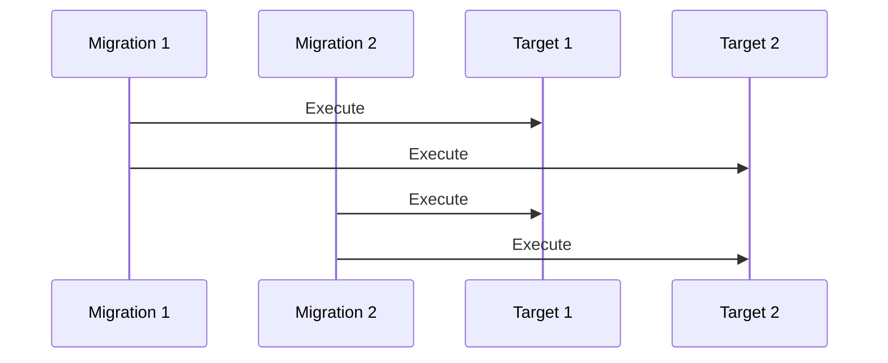
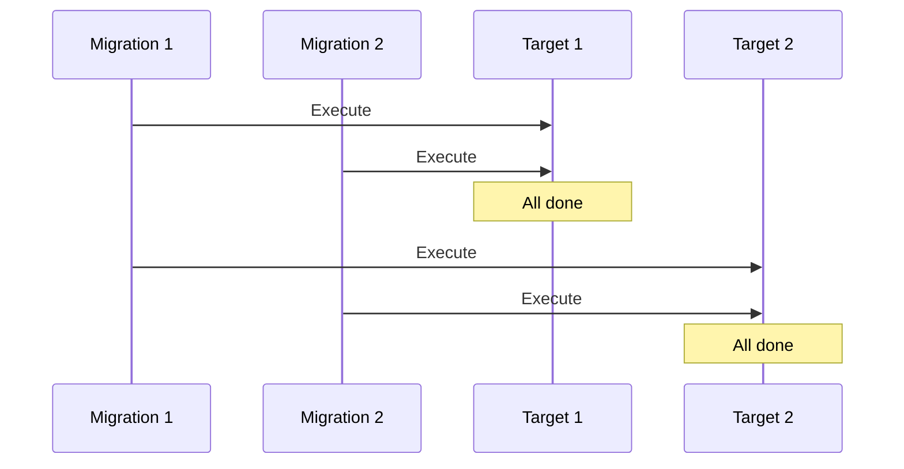
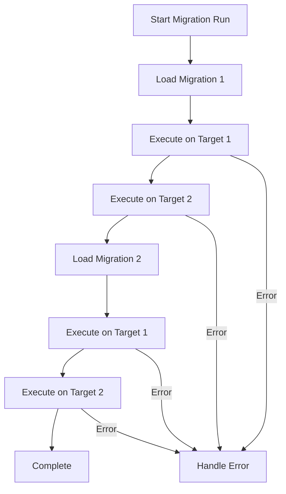
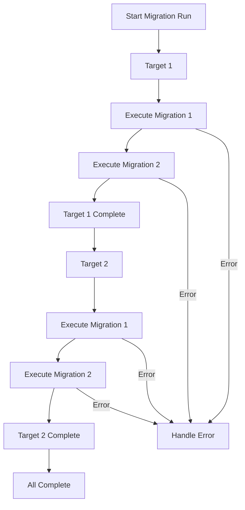

# Execution Modes

RayMigrator supports different execution modes that control how migrations are applied to target databases. This covers three orthogonal dimensions:

1. **Operating Mode** (`OperatingMode` enum) — How the CLI connects to infrastructure (Standalone, ManagedLocal, or ManagedRemote)
2. **Target Migration Order** — How files and targets are iterated within a TargetGroup (FileByFile or TargetByTarget)
3. **Run Mode** (`MigrationRunMode` enum) — Whether SQL is actually executed (Validate, Simulate, or Migrate)

## Operating Mode

The `OperatingMode` enum defines three possible modes for RayMigrator:

| Mode | Description |
|------|-------------|
| **Standalone** | All configuration (products, targets, repository, etc.) loaded from `appsettings.json` files. This is the default and currently the only active mode. |
| **ManagedLocal** | Configuration loaded from a local Admin-DB. Products, environments, targets, and repository config come from the Admin-DB; Serilog config still from `appsettings.json`. |
| **ManagedRemote** | CLI operates as a thin client, sending HTTP requests to a remote RayMigrator API server instead of accessing databases directly. |

Source: `Raycoon.RayMigrator.Core/Configuration/Enums/OperatingMode.cs`

> **Implementation Status**: The Engine's `Program.Main` only wires up **Standalone** mode — it always creates a `JsonOptionsSource` and calls `RunDirectMode()`. The `ManagedLocal` and `ManagedRemote` enum values and supporting types (`AdminDbOptions`, `RayMigratorBootstrapOptions`) are consumed by **RayMigrator Studio** (a separate repository) for its Admin-DB and API hosting. These types are part of Engine's Core NuGet contract.

## Release-Based Execution Order

Migrations are executed **release by release**. Within each release, TargetGroups are processed in their configuration order. Within each TargetGroup, the `TargetMigrationOrder` setting controls the inner file/target iteration.

**Outer loop (always)**:
```
Release 1.0 → Release 1.1 → Release 1.2 → ...
```

**Within each release**:
```
TargetGroup 1 → TargetGroup 2 → ...
```

By default, TargetGroups are processed in their configuration array order. This order can be overridden via:

1. **CLI**: `--target-group-migration-order "Frontend, Backend"` / `-tgmo` (highest priority)
2. **migsettings TOML** (release-level): `TargetGroupMigrationOrder = ["Frontend", "Backend"]`
3. **appsettings JSON** (product-level): `"TargetGroupMigrationOrder": "Frontend, Backend"`

The override applies to `migrate-up` and `baseline`. `migrate-down` always derives order from repository records and is not affected. See [Product Options — TargetGroupMigrationOrder](../06-configuration-reference/product-options.md#targetgroupmigrationorder) for validation rules and the full configuration reference.

**Within each TargetGroup** (controlled by `TargetMigrationOrder`):
- **FileByFile**: file → target
- **TargetByTarget**: target → file

### Example: 2 Releases, 2 TargetGroups

```
Release 1.0:
  Backend (FileByFile):  File1→T1, File1→T2, File2→T1, File2→T2
  Frontend (TargetByTarget):   T1→File3, T1→File4, T2→File3, T2→File4
Release 1.1:
  Backend (FileByFile):  File5→T1, File5→T2
  Frontend (TargetByTarget):   T1→File6, T2→File6
```

This ensures that all TargetGroups complete a release before any TargetGroup starts the next release.

## Target Migration Order

The `TargetMigrationOrder` setting controls the sequence of execution across multiple targets within a TargetGroup for a given release.

Whether a file is executed at all is decided **per file and target**: a `(file, target)` pair is skipped only when that target has a `Migrated` record whose hash matches under the TargetGroup's `HashValidationScope`. A file that succeeded on one target and failed (or never ran) on another is therefore executed on the lagging target only; `info` counts pending `(file, target)` pairs, `baseline` marks only the pending pairs, and the out-of-order check compares a file's release against the highest migrated release **of each pending target**, so a lagging target catching up is not out of order (#8).

### Enum Values

| Value | Name | Description |
|-------|------|-------------|
| 0 | Undefined | Not set |
| 1 | FileByFile | Execute on all targets per migration |
| 2 | TargetByTarget | Complete all migrations per target |

### FileByFile

Execute each migration on all targets before moving to the next migration.



**Execution Order**:
1. Migration 1 → Target 1
2. Migration 1 → Target 2
3. Migration 2 → Target 1
4. Migration 2 → Target 2

**Configuration**:
```json
{
  "TargetGroups": [{
    "Alias": "Backend",
    "TargetMigrationOrder": "FileByFile"
  }]
}
```

**Use Cases**:
- Tightly coupled databases
- Sharded databases requiring consistent schema
- Replicated database systems

**Advantages**:
- All targets stay in sync
- Easier to reason about state
- Schema consistency guaranteed

**Disadvantages**:
- Error affects all targets
- All-or-nothing for each migration
- Can't partially succeed

**Complete Example** (based on the RayMigratorTests product):

The test product has 2 TargetGroups: **Backend** (`FileByFile`, 2 targets) and **Frontend** (`TargetByTarget`, 1 target). Here is the full execution order across all 4 releases:

```
Release 1.0:
  Backend (FileByFile — file → target):
    10_CreateDataModel.sql       → Backend1
    10_CreateDataModel.sql       → Backend2
    20_InsertMasterData.sql      → Backend1
    20_InsertMasterData.sql      → Backend2
  Frontend (TargetByTarget — target → file):
    00_CreateDataModel.sql       → Frontend

Release 1.1:
  Backend (FileByFile):
    01_InsertDynamicData.sql     → Backend1
    01_InsertDynamicData.sql     → Backend2
  Frontend (TargetByTarget):
    01_InsertDynamicData.sql     → Frontend

Release 1.2:
  Backend (FileByFile):
    00_AddSexOther.sql           → Backend1
    00_AddSexOther.sql           → Backend2
    01_AddLoginPersonOther.sql   → Backend1
    01_AddLoginPersonOther.sql   → Backend2
  Frontend (TargetByTarget):
    01_AddUserProfileAndUserPreferences.sql → Frontend

Release 1.3:
  Backend (FileByFile):
    01_AddAlexLee2.sql           → Backend1
    01_AddAlexLee2.sql           → Backend2
  Frontend (TargetByTarget):
    01_AddAlexLee2ProfileAndUserPreferences-Error.sql → Frontend  ← ERROR
```

Key observations:
- The **outer loop** is always Release → TargetGroup (config order). Backend completes before Frontend starts within each release.
- **Backend** (FileByFile): The inner loop is file → target. Each file is applied to all targets before the next file. Backend1 and Backend2 always have the same schema state.
- **Frontend** has only 1 target, so `FileByFile` vs `TargetByTarget` makes no difference here (see [Single Target Note](#single-target-note) below).

### TargetByTarget (Default)

Complete all migrations on one target before moving to the next target.



**Execution Order**:
1. Migration 1 → Target 1
2. Migration 2 → Target 1
3. Migration 1 → Target 2
4. Migration 2 → Target 2

**Configuration**:
```json
{
  "TargetGroups": [{
    "Alias": "Backend",
    "TargetMigrationOrder": "TargetByTarget"
  }]
}
```

**Use Cases**:
- Independent databases
- Blue/green deployments
- Staged rollouts

**Advantages**:
- Better for independent systems
- Each target gets all its migrations before next target starts

**Disadvantages**:
- Temporary inconsistency between targets
- Targets may be at different schema levels during execution

**Complete Example** (same product, but hypothetical: Frontend gets a 2nd target):

To make the difference between both modes visible, imagine the Frontend TargetGroup also has 2 targets (Frontend1, Frontend2). Now both TargetGroups have multiple targets but use different `TargetMigrationOrder` settings:

```
Release 1.2:
  Backend (FileByFile — file → target):
    00_AddSexOther.sql           → Backend1
    00_AddSexOther.sql           → Backend2
    01_AddLoginPersonOther.sql   → Backend1
    01_AddLoginPersonOther.sql   → Backend2
  Frontend (TargetByTarget — target → file):
    01_AddUserProfileAndUserPreferences.sql → Frontend1
    01_AddUserProfileAndUserPreferences.sql → Frontend2
```

With only 1 file per TargetGroup per release, the difference is not visible. Release 1.0 has 2 Backend files — here the contrast becomes clear:

```
Release 1.0:
  Backend (FileByFile — file → target):
    10_CreateDataModel.sql       → Backend1
    10_CreateDataModel.sql       → Backend2
    20_InsertMasterData.sql      → Backend1
    20_InsertMasterData.sql      → Backend2
  Frontend (TargetByTarget — target → file):
    00_CreateDataModel.sql       → Frontend1
    00_CreateDataModel.sql       → Frontend2
```

If Frontend also had 2 files and 2 targets, the difference would be:

```
FileByFile (file → target):  FileA→T1, FileA→T2, FileB→T1, FileB→T2
TargetByTarget   (target → file):  T1→FileA, T1→FileB, T2→FileA, T2→FileB
```

The inner loop is **target → file**: one target receives all migration files for the release before the next target starts.

### Single Target Note

> **When a TargetGroup has only 1 target**, the `TargetMigrationOrder` setting has no effect on execution order. Both `FileByFile` and `TargetByTarget` produce the same result because the inner loop (file→target or target→file) only has one element on one side. For example, the Frontend TargetGroup in the test product has a single target — switching it between `FileByFile` and `TargetByTarget` would not change anything.

## Run Mode

The `MigrationRunMode` enum controls whether changes are actually applied. Available modes: `Migrate`, `Simulate`, `Validate` (enum values: `Undefined=0`, `Validate=10`, `Simulate=20`, `Migrate=100`).

The behavior of each mode is determined by extension methods on `MigrationRunMode` (defined in `MigrationRunModeExtensions`):

| Extension Method | Validate | Simulate | Migrate |
|-----------------|----------|----------|---------|
| `ShouldExecuteSql()` | false | false | **true** |
| `ShouldWriteRepository()` | false | false | **true** |
| `ShouldReadRepository()` | false | **true** | **true** |

`--run-mode` applies to `migrate-up`, `migrate-down` and `fix` (`migrate` or `simulate`, #22); every other command runs in `Migrate` mode and decides its side effects by command. The single source for those decisions is `MigrationCommandExtensions.GetProfile()` (`Raycoon.RayMigrator.Core/Extensions/MigrationCommandExtensions.cs`), which returns a `CommandProfile` per command (#6). The start-up connection check (`ConnectionValidator`), the DatabaseLogging sink gate (`DbLogEnabled`, emitted by `MigrationContextEnricher`) and the product/environment bookkeeping in `MigrationService` all read the profile instead of the run mode:

| Command | RunMode | ConnectsToTargets | WritesRepository | WritesDatabaseLog |
|---------|---------|:-:|:-:|:-:|
| `migrate-up` / `migrate-down` | Migrate | yes | yes | yes |
| `migrate-up` / `migrate-down` | Simulate | yes | no | no |
| `migrate-up` / `migrate-down` | Validate | no | no | no |
| `baseline` | Migrate | no | yes | yes |
| `update-hash` | Migrate | no | yes | yes |
| `fix` | Migrate | no | yes | yes |
| `fix` | Simulate | no | no | no |
| `info` | Migrate | no | no | no |
| `validate-hash` | Migrate | no | no | no |

A command that does not connect to the targets starts even when a target database is unreachable. A command that does not write the repository looks the product and environment up read-only (`Repository_Product_Select` / `Repository_Environment_Select`) instead of registering them, so a read-only command on a fresh repository leaves no rows behind. `RepositoryCheckCreate` still runs for every command because the read paths need the tables. The `MigrationRunModeId` stamped into `MigrationRun` / `MigrationRecord` / `MigrationLog` rows is still the context run mode, i.e. `100` for everything that writes records.

### Migrate (Default)

Execute actual database changes.

```bash
raymigrator migrate-up --product MyProduct --environment Production
# or explicitly:
raymigrator migrate-up --product MyProduct --environment Production --run-mode migrate
```

### Simulate

Validate and process everything, connect to target databases for connectivity validation, but do not execute SQL on target databases.

```bash
raymigrator migrate-up --product MyProduct --environment Production --run-mode simulate
```

**Simulate Mode**:
- Parses all migration files
- Validates TOML metadata
- Checks environment/target filters
- Calculates hashes
- Connects to target databases (validates connectivity)
- Reads repository records to determine what is already migrated (same as Migrate mode). The product and environment ids are resolved read-only via `Repository_Product_Select` / `Repository_Environment_Select`; if either is not registered yet, Simulate logs that and treats all files as pending
- Does NOT write repository records
- Does NOT execute SQL on targets
- Does NOT write database log entries (DatabaseLogging sink is inactive)

**Use Cases**:
- Dry run before production deployment
- CI/CD pipeline validation
- Testing migration order

### Validate

Validate configuration, migration files, and rollback files without any database operations.

```bash
raymigrator migrate-up --product MyProduct --environment Production --run-mode validate
raymigrator migrate-down --product MyProduct --environment Production --to-release "Release 1.0" --run-mode validate
```

**Validate Mode**:
- Parses all migration files (TOML metadata, SQL blocks)
- Checks environment/target filters
- Calculates file hashes
- For migrate-down: validates rollback file existence and parseability
- Does NOT connect to target databases
- Does NOT connect to repository database
- Does NOT execute SQL
- Does NOT create repository records
- Processes ALL files regardless of prior migration status

**Use Cases**:
- CI/CD pre-deployment checks (no database access needed)
- Validating migration file syntax on developer machines
- Checking rollback file completeness
- Environments where database access is not available

> **Note**: The `validate-hash` command is a separate command that validates file hashes against repository records (exit code `1` for `Modified` or `Missing` files, `0` otherwise; unmigrated files are listed as `New` and do not affect the exit code). The `--run-mode validate` option for `migrate-up`/`migrate-down` is a different feature that validates file structure without any database access. Internally `validate-hash` runs in `Migrate` mode like every other non-migrate command (#6); its side effects (repository read-only, no target connections, no audit log) come from its command profile, and the repository record query always reads `Migrate`-mode records because records are only ever written in `Migrate` mode (#5).

## Execution Flow Comparison

### FileByFile + Migrate



### TargetByTarget + Migrate



> **Note**: Both FileByFile and TargetByTarget modes abort the TargetGroup and the entire migration run on error, **unless** `MigrationErrorAction` is `Ignore`. With `Ignore`, the failed file is marked as `Failed` and execution continues with the next file. For all other error actions (Terminate, Rollback, RollbackErrorOnly, RollbackRelease), the TargetGroup is aborted immediately and the caller handles rollback or termination.

## Target Group Scope

Migration order is configured per **TargetGroup**, not globally:

```json
{
  "Products": [{
    "Alias": "MyProduct",
    "TargetGroups": [
      {
        "Alias": "MainDatabases",
        "TargetMigrationOrder": "FileByFile",
        "Targets": [
          { "Alias": "Primary" },
          { "Alias": "Secondary" }
        ]
      },
      {
        "Alias": "AnalyticsDatabases",
        "Targets": [
          { "Alias": "Reporting" },
          { "Alias": "Warehouse" }
        ]
      }
    ]
  }]
}
```

In this example:
- Main databases migrate simultaneously (stay in sync)
- Analytics databases migrate successively (independent)

## Best Practices

### Use FileByFile When:
- Databases must be schema-consistent
- Application queries span multiple databases
- Sharded or replicated systems
- Schema changes have cross-database dependencies

### Use TargetByTarget When:
- Databases are independent
- Risk mitigation is priority
- Blue/green deployment patterns
- Staged rollout is desired

### Use Simulate When:
- Before production deployments
- Testing migration sequences
- CI/CD validation
- Documentation generation

## Out-of-Order Migration

### Overview

By default, RayMigrator executes migration files strictly in order — based on release directory sorting and filename sorting within each release. Any migration file that was added after a later migration has already been executed will be skipped or flagged as a conflict.

**Out-of-Order Migration** relaxes this constraint: it allows executing migration files that were added between already-executed migrations, without treating this as an error.

### Use Case

In teams with multiple developers working on different features in parallel, migration files may be merged into the main branch in a different order than their filename/release sequence:

```
Timeline:
  Dev A creates: Release 2.0/Backend/003_AddIndex.sql
  Dev B creates: Release 2.0/Backend/002_AddColumn.sql  (merged later)

Repository state after Dev A's migration:
  001_CreateTable.sql  → Migrated
  003_AddIndex.sql     → Migrated
  002_AddColumn.sql    → Not yet migrated (added later, out of order)
```

Without out-of-order support, `002_AddColumn.sql` would be skipped or cause a validation error because it precedes an already-executed migration (`003_AddIndex.sql`).

With out-of-order support enabled, RayMigrator would detect `002_AddColumn.sql` as a pending migration and execute it normally.

### Configuration

Out-of-Order Migration is controlled via the CLI parameter:

```bash
# One-time opt-in for a specific migration run
raymigrator migrate-up -p MyProduct -env Production -rm migrate --allow-out-of-order
```

| Parameter | Short | Default | Description |
|-----------|-------|---------|-------------|
| `--allow-out-of-order` | `-ooo` | `false` | Allow execution of migration files that precede already-executed migrations |

This is a deliberate, per-run decision — not a permanent setting.

**Typical workflow:**

1. Normal run detects gap: "Migration 002 precedes already-executed 003"
2. Developer/DBA reviews the situation
3. Re-run with `--allow-out-of-order` — explicit, one-time approval

### Behavior

| Scenario | Out-of-Order disabled | Out-of-Order enabled |
|----------|------------------------|----------------------|
| New file after all executed | Execute normally | Execute normally |
| New file before executed files | Skip or error | Execute as pending |
| New file between executed files | Skip or error | Execute as pending |

### Considerations

- **Hash validation**: Out-of-order files still undergo hash validation if enabled
- **Dependencies**: Files executed out of order may reference objects created by later-numbered files — developers must ensure correctness
- **Audit trail**: Repository records should clearly indicate that a migration was executed out of order
- **Rollback**: Rolling back to a release that was partially executed out of order requires careful handling

## Implementation Details

The execution order logic is implemented in `MigrationService.cs` (Services project) using the following internal types and methods:

### TargetGroupExecutionResult

Internal result type returned by both `ExecuteTargetGroupFileByFile` and `ExecuteTargetGroupTargetByTarget`:

```csharp
internal class TargetGroupExecutionResult
{
    public bool Success { get; set; } = true;
    public int SuccessCount { get; set; }
    public int FailCount { get; set; }
    public MigrationFileInfo? FailedFile { get; set; }
    public int FailedMigrationRecordId { get; set; }
    public string? ErrorMessage { get; set; }
}
```

### ExecuteTargetGroupFileByFile

Executes migrations in file-then-target order (`foreach file -> foreach target`). On error with `MigrationErrorAction.Ignore`, marks the file as `Failed` and continues to the next file. For all other error actions, aborts the TargetGroup immediately and returns the result to the caller for rollback handling.

### ExecuteTargetGroupTargetByTarget

Executes migrations in target-then-file order (`foreach target -> foreach file`). Error handling is identical to `ExecuteTargetGroupFileByFile`.

### MigrateUpAsync Phase 3

The main migration loop in `MigrateUpAsync` dispatches to the appropriate method per TargetGroup:

```
foreach release in orderedReleases:
    orderedTargetGroups = resolve from: CLI --target-group-migration-order
                                      → release migsettings TargetGroupMigrationOrder
                                      → product appsettings TargetGroupMigrationOrder
                                      → productOptions.TargetGroups (config array order)
    foreach targetGroup in orderedTargetGroups:
        if targetGroup.TargetMigrationOrder == FileByFile:
            ExecuteTargetGroupFileByFile(...)
        else:
            ExecuteTargetGroupTargetByTarget(...)
        if result failed → HandleMigrationError → abort entire run
```

### BaselineAsync Phase 4

`BaselineAsync` uses the same Release -> TargetGroup -> TargetMigrationOrder dispatch pattern (including the same `TargetGroupMigrationOrder` resolution) but without executing SQL. It records each file as `Migrated` in the repository using a local `BaselineFile()` function:

```
foreach release in orderedReleases:
    orderedTargetGroups = resolve from: CLI → release migsettings → appsettings → config order
    foreach targetGroup in orderedTargetGroups:
        if FileByFile: foreach file -> foreach target -> BaselineFile()
        else:              foreach target -> foreach file -> BaselineFile()
```

### Static Helpers (for Unit Testing)

Two pure static helper methods expose the execution order logic without requiring `TemplateExecutor` or database access:

- **`GetExecutionOrder(files, targetGroup)`** — Returns a `List<(int FileOrderId, string TargetAlias)>` representing the inner file/target iteration order for a single TargetGroup. Uses `FileByFile` (file -> target) when `TargetMigrationOrderEnum == TargetMigrationOrder.FileByFile`, otherwise falls back to `TargetByTarget` (target -> file), including for `Undefined`.

- **`GetFullExecutionOrder(files, targetGroups, targetGroupMigrationOrder?)`** — Returns a `List<(int FileOrderId, string TargetGroupAlias, string TargetAlias)>` representing the complete execution order across all releases and TargetGroups. Iterates Release -> TargetGroup (config order or explicit order when `targetGroupMigrationOrder` is provided) -> delegates to `GetExecutionOrder()` for the inner loop.

## Related Documentation

- [Error Handling](error-handling.md) - How errors are handled in each mode
- [Migration State Machine](migration-state-machine.md) - State transitions
- [Target Group Options](../06-configuration-reference/target-group-options.md) - TargetMigrationOrder configuration
- [Migration Service](../04-service-layer/migration-service.md) - Implementation details for ExecuteTargetGroupFileByFile/TargetByTarget
- [Product Options](../06-configuration-reference/product-options.md) - MigrationErrorAction configuration
