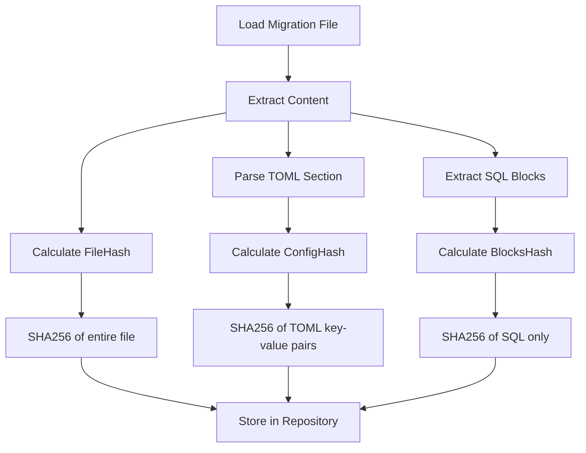
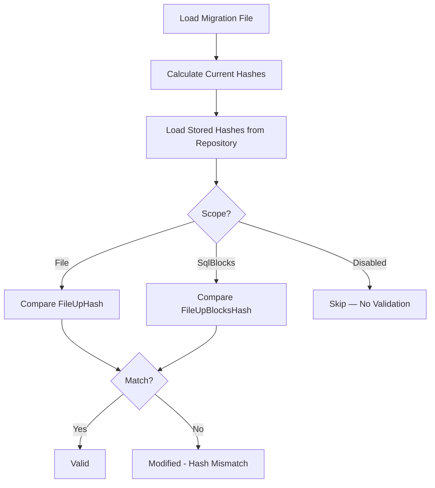

# Hash Validation

Hash validation ensures migration file integrity by detecting unauthorized modifications to previously executed migrations.

## Purpose

- **Prevent tampering**: Detect unauthorized changes to migration files
- **Audit compliance**: Ensure executed migrations haven't changed
- **Immutability enforcement**: Once migrated, files should not change

## Hash Validation Scope

Configure via `HashValidationScope` on TargetGroup. This setting affects all commands: **Migrate-Up** (determines which hash is compared when checking if already-migrated files have changed), **Baseline**, and **Validate-Hash**.

| Scope | Value | Validates | Use Case |
|-------|-------|-----------|----------|
| `Undefined` | 0 | (invalid) | Not set |
| `File` | 1 | Entire file hash | Strictest - any change detected |
| `SqlBlocks` | 2 | SQL content only (excludes [RayMigrator] section) | Allow metadata changes |
| `Disabled` | 3 | No validation | Development/legacy systems |

```json
{
  "TargetGroups": [{
    "Alias": "Backend",
    "HashValidationScope": "File"
  }]
}
```

## Three-Level Hashing

RayMigrator calculates three separate hashes per migration file:

### 1. FileHash (FileUpHash / FileDownHash)

Hash of the entire file content including the [RayMigrator] metadata section.

```
FileUpHash = SHA256(entire file content)
```

**Changes detected**: Any modification to the file

### 2. ConfigHash (FileUpConfigHash / FileDownConfigHash)

Hash of the TOML key-value pairs inside the `[RayMigrator]` block (excluding the `/*`, `[RayMigrator]` header, and `*/` delimiters).

```
FileUpConfigHash = SHA256(TOML key-value content inside [RayMigrator] block)
```

**Changes detected**: Metadata changes (Targets, Environments, etc.)

### 3. BlocksHash (FileUpBlocksHash / FileDownBlocksHash)

Hash of the SQL content excluding the [RayMigrator] section.

```
FileUpBlocksHash = SHA256(SQL content only)
```

**Changes detected**: Actual SQL changes

## Hash Calculation



### Example File

```sql
/*
[RayMigrator]
Description = "Create users table"
Environments = ["*"]
Targets = ["*"]
*/

CREATE TABLE Users (
    Id INT PRIMARY KEY,
    Name NVARCHAR(100)
);
```

**Hash Components**:
- `FileHash`: SHA256 of entire file content (all lines including metadata block)
- `ConfigHash`: SHA256 of the TOML key-value pairs inside the `[RayMigrator]` block (lines 3-5, excluding `/*`, `[RayMigrator]` header, and `*/` delimiters)
- `BlocksHash`: SHA256 of the SQL content after the metadata block (lines 8-11)

## Validation Flow



## Hash Mismatch Behavior During Migrate-Up

Hash comparison during `Migrate-Up` is performed by `FilterAlreadyMigratedFiles` in `MigrationService`. The behavior depends on the file's current status:

- **Status `Migrated` (100), hash matches**: File is **skipped** (already applied). No log output at info level.
- **Status `Migrated` (100), hash does NOT match**: File is **re-executed** with a warning log:
  ```
  Migration file {Filename} has changed since last execution (hash mismatch, scope: {Scope}). Re-executing.
  ```
  The file runs again from block 1 and the hashes in the repository are updated on success. This can cause errors (e.g., duplicate `CREATE TABLE`). Never modify an already-migrated file without running `Migrate-Down` first or using `Update-Hash` to acknowledge the change.
- **Status `Migrated` (100), `Disabled` scope**: File is always **skipped** regardless of content.
- **Status `Failed` (30) or `NotMigrated` (50)**: File is always included in the execution list (hash is not checked for filtering purposes).

> **Important**: `Validate-Hash` and `Update-Hash` commands use the same hash comparison but do not re-execute SQL. For `Migrate-Up`, a mismatch on an already-migrated file causes re-execution, not an abort. If you want to reject mismatches rather than re-execute, use `Validate-Hash` before running `Migrate-Up`.

## Repository Storage

Hashes are stored in the `MigrationRecord` table:

```sql
-- MigrationRecord table hash and block columns
FileUpHash             VARCHAR(100) NOT NULL,  -- SHA256 of entire up file
FileUpConfigHash       VARCHAR(100) NULL,      -- SHA256 of config section
FileUpBlocksHash       VARCHAR(100) NOT NULL,  -- SHA256 of SQL blocks
FileUpBlocksMigrated   INT          NOT NULL,  -- Blocks successfully executed
FileUpBlocksTotal      INT          NOT NULL,  -- Total blocks in file

MigrateDownFileExists  BIT          NOT NULL,  -- Does .rollback.sql exist?
FileDownHash           VARCHAR(100) NULL,      -- SHA256 of entire down file
FileDownConfigHash     VARCHAR(100) NULL,      -- SHA256 of down config
FileDownBlocksHash     VARCHAR(100) NULL,      -- SHA256 of down SQL blocks
FileDownBlocksMigrated INT          NULL,      -- Down blocks executed
FileDownBlocksTotal    INT          NULL,      -- Total down blocks
```

## Validate-Hash Command

Check file integrity without executing migrations:

```bash
# Validate using per-TargetGroup configured scope (no --scope override)
RayMigrator Validate-Hash -p MyProduct -env Production

# Override scope to SqlBlocks for all TargetGroups
RayMigrator Validate-Hash -p MyProduct -env Production -s SqlBlocks
```

When `--scope` is omitted, each file is validated using its TargetGroup's configured `HashValidationScope`. When `--scope` is provided, it overrides the configuration for all TargetGroups. See [Validate-Hash Command](../08-cli-reference/validate-hash.md) for all options.

**Output categories**:
- **Valid**: File hash matches the stored hash in the repository
- **Modified**: File hash differs from the stored hash (unauthorized change)
- **Missing**: File was migrated but no longer exists on disk
- **New**: File exists on disk but has not been migrated yet

```
Validation completed: 2 valid, 1 modified, 0 missing, 1 new (not yet migrated)
```

## Update-Hash Command

Update stored hashes after approved changes:

```bash
RayMigrator Update-Hash -p MyProduct -env Production
```

Update-Hash always recalculates and updates all three hashes (FileUpHash, FileUpConfigHash, FileUpBlocksHash) for every migrated file where any hash has changed. It does not use HashValidationScope -- all hashes are updated regardless.

**Use Cases**:
1. Legitimate bug fix in executed migration
2. Metadata update (description, comments)
3. Recovery from accidental modification

**Important**: Only use after verifying the change is intentional and the database state matches the updated migration.

## Handling Hash Mismatches

### 1. Investigation

```sql
-- Check stored vs expected hash
SELECT
    Filename,
    FileUpHash,
    FileUpBlocksHash,
    MigrationStatusId
FROM MigrationRecord
WHERE ProductId = @ProductId
    AND Filename = '003_UpdateSchema.sql';
```

### 2. Determine Cause

- **Unintentional change**: Restore file from version control
- **Intentional fix**: Review and approve, then update hash
- **Line ending change**: Normalize line endings (CRLF vs LF)
- **Encoding change**: Ensure consistent file encoding

### 3. Resolution

**Option A**: Restore original file
```bash
git checkout HEAD -- migrations/003_UpdateSchema.sql
```

**Option B**: Accept change and update hash
```bash
RayMigrator Update-Hash -p MyProduct -env Production
```

## Block-Level Tracking

For multi-block migrations, track progress at block level:

| Column | Description |
|--------|-------------|
| `FileUpBlocksTotal` | Total blocks in file |
| `FileUpBlocksMigrated` | Blocks successfully executed |

This enables:
- Resume from failed block
- Partial execution tracking
- Detailed progress reporting

## Best Practices

1. **Use `File` scope in production** - Maximum integrity protection
2. **Use `SqlBlocks` in development** - Flexibility for metadata changes
3. **Never use `Disabled` in production** - No protection against tampering
4. **Version control all migrations** - Enable recovery of original files
5. **Review before Update-Hash** - Ensure changes are intentional

## Related Documentation

- [Migration State Machine](migration-state-machine.md) - How hash validation affects state
- [Validate-Hash Command](../08-cli-reference/validate-hash.md)
- [Update-Hash Command](../08-cli-reference/update-hash.md)
- [Target Group Options](../06-configuration-reference/target-group-options.md) - `HashValidationScope` configuration
- [Resilience and Recovery](resilience.md) - Block-level tracking used alongside hash validation
