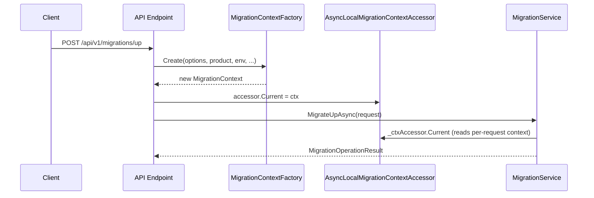
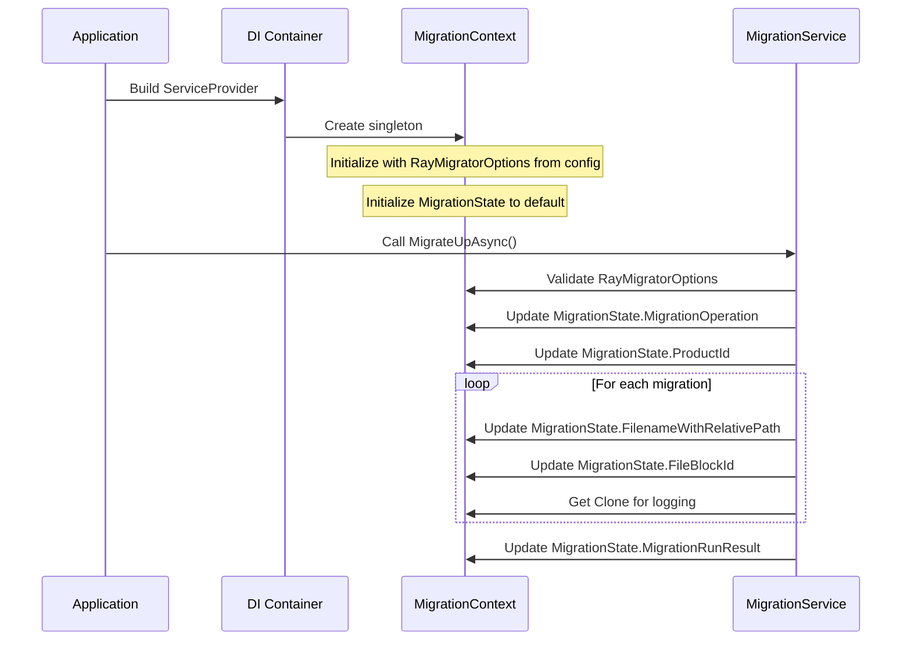

# MigrationContext

The `MigrationContext` is the central state object that flows through the entire RayMigrator execution pipeline. It carries both configuration (immutable) and runtime state (mutable).

## Purpose

- **Single source of truth** for migration configuration and state
- **Dependency injection** friendly — singleton (CLI) or per-request via AsyncLocal (API)
- **Immutable snapshots** for safe logging and auditing
- **State tracking** across the migration lifecycle

## Class Structure

```csharp
public class MigrationContext
{
    // Configuration (set at creation)
    public RayMigratorOptions RayMigratorOptions { get; set; }
    public RayMigratorConsoleOptions RayMigratorConsoleOptions { get; set; }
    public string RayMigratorVersion { get; set; }

    // Target group shortcut
    public IEnumerable<TargetGroupOptions>? ProductTargetGroupOptionsEnumerable { get; init; }

    // Runtime state (updated during execution)
    public MigrationState MigrationState { get; set; }

    // DAL-specific properties
    public ConcurrentDictionary<string, DalSpecificProperties> DalSpecificPropertiesDictionary { get; set; }

    // Safe copy for logging
    public MigrationContext Clone { get; }
}
```

## Configuration Properties

### RayMigratorOptions

Bound from `appsettings.json`:

```csharp
public class RayMigratorOptions
{
    public RepositoryOptions? Repository { get; set; }
    public DatabaseLoggingOptions? DatabaseLogging { get; set; }
    public SerilogOptions? Serilog { get; set; }
    public ProductDefaultOptions? ProductDefaults { get; set; }  // [Required]
    public List<ProductOptions>? Products { get; set; }          // [Required]
    public List<CliToolOptions>? CliTools { get; set; }
}
```

### RayMigratorConsoleOptions

Set from command-line arguments:

```csharp
public class RayMigratorConsoleOptions
{
    public required MigrationCommand Command { get; init; }
    public required string Product { get; init; }
    public required string Environment { get; init; }
    public required MigrationRunMode RunMode { get; init; }
    public string? TargetReleaseVersion { get; init; }
    public string[]? TargetGroupAliases { get; init; }
    public string[]? TargetGroupMigrationOrder { get; init; }
    public HashValidationScope? HashValidationScope { get; init; }
    public required bool ShowStartupInfo { get; set; }
    public required bool RevealSensitiveData { get; init; }
    public FixIssues? FixIssues { get; init; }
    public bool? AllowOutOfOrder { get; init; }
    public int? FixOlderThanMinutes { get; init; }
    public bool? FixDryRun { get; init; }
    public MigrationStatus? FixAssumedMigrationStatus { get; init; }
    public bool? StopRollbackOnMissingRollbackFile { get; init; }
    public string? ConfigDir { get; init; }
}
```

## MigrationState

Tracks current operation progress:

```csharp
public class MigrationState
{
    // Migration Process
    public MigrationEvent? MigrationEvent { get; set; }

    // RunId's
    public int MigratorMetaId { get; set; }
    public int ProductId { get; set; }
    public int EnvironmentId { get; set; }
    public int MigrationRunId { get; set; }
    public int MigrationRecordId { get; set; }

    // File metadata
    public string ReleaseVersionFromFileNameWithPath { get; set; }
    public string FilenameWithRelativePath { get; set; }
    public int FileOrderId { get; set; }
    public int FileBlockId { get; set; }

    // Step / Result
    public MigrationRunResult MigrationRunResult { get; set; }
    public MigrationOperation MigrationOperation { get; set; }
    public MigrationStatus MigrationStatus { get; set; }

    // TargetGroup- / Target-settings
    public string TargetGroupAlias { get; set; }
    public HashValidationScope? HashValidationScope { get; set; }
    public string TargetAlias { get; set; }
}
```

## Context Accessor Pattern

Services do not inject `MigrationContext` directly. Instead, they depend on `IMigrationContextAccessor`, which provides the current context for the execution scope. This enables both CLI (singleton) and API (per-request) hosting modes with the same service code.

### `IMigrationContextAccessor`

```csharp
public interface IMigrationContextAccessor
{
    MigrationContext Current { get; set; }
}
```

### `SingletonMigrationContextAccessor` (CLI)

Wraps a single `MigrationContext` instance. Used in CLI mode where only one migration runs per process.

```csharp
public class SingletonMigrationContextAccessor : IMigrationContextAccessor
{
    public MigrationContext Current { get; set; } = null!;
}
```

### `AsyncLocalMigrationContextAccessor` (API)

Uses `AsyncLocal<T>` for per-request isolation, analogous to `IHttpContextAccessor` in ASP.NET Core. Each API request gets its own `MigrationContext` via the factory.

```csharp
public class AsyncLocalMigrationContextAccessor : IMigrationContextAccessor
{
    private static readonly AsyncLocal<MigrationContext?> _current = new();
    public MigrationContext Current
    {
        get => _current.Value ?? throw new InvalidOperationException(
            "No MigrationContext available for the current execution context. " +
            "Ensure the context is set before accessing it.");
        set => _current.Value = value;
    }
}
```

### `IMigrationContextFactory` / `MigrationContextFactory`

Factory for creating `MigrationContext` instances. CLI creates one at startup; API creates one per request.

```csharp
public interface IMigrationContextFactory
{
    MigrationContext Create(
        RayMigratorOptions options, string product, string environment,
        MigrationRunMode runMode, string version,
        string? targetReleaseVersion = null, bool revealSensitiveData = false);
}

public class MigrationContextFactory : IMigrationContextFactory
{
    public MigrationContext Create(
        RayMigratorOptions options, string product, string environment,
        MigrationRunMode runMode, string version,
        string? targetReleaseVersion = null, bool revealSensitiveData = false)
    {
        var consoleOptions = new RayMigratorConsoleOptions
        {
            Command = MigrationCommand.MigrateUp, // Will be overridden per operation
            Product = product,
            Environment = environment,
            RunMode = runMode,
            TargetReleaseVersion = targetReleaseVersion,
            ShowStartupInfo = false,
            RevealSensitiveData = revealSensitiveData,
        };
        return new MigrationContext(options, consoleOptions, version);
    }
}
```

### `RayMigratorHostMode`

Enum controlling DI registration behavior:

```csharp
public enum RayMigratorHostMode
{
    Cli,  // SingletonMigrationContextAccessor
    Api   // AsyncLocalMigrationContextAccessor (Scoped)
}
```

### API-Mode Lifecycle

> **Note**: The API hosting mode is implemented in **RayMigrator Studio** (a separate repository). The classes `AsyncLocalMigrationContextAccessor`, `MigrationContextFactory`, and `RayMigratorHostMode` are part of the Engine's Core NuGet contract and are consumed by Studio. The Engine itself always uses `RayMigratorHostMode.Cli` (singleton accessor). The following diagram illustrates the per-request lifecycle as implemented in Studio.



## Lifecycle



## State Transitions

### MigrationOperation

| Value | Meaning |
|-------|---------|
| `Undefined` (0) | Not set |
| `Rollback` (5) | Error recovery rollback |
| `MigrateDown` (50) | Rollback to version |
| `MigrateUp` (100) | Forward migration |

### MigrationRunResult

| Value | Meaning |
|-------|---------|
| `Undefined` (0) | Invalid value -- ResultId has not been set properly |
| `Running` (10) | Migration process is currently running |
| `Error` (90) | Migration(s) stopped due to error(s) |
| `Ok` (100) | Migration(s) successfully executed and finished |

### MigrationStatus

| Value | Meaning |
|-------|---------|
| `Undefined` (0) | Value has not been set properly |
| `Pending` (10) | Migration record created, execution has not started yet |
| `Executing` (20) | SQL blocks are currently being executed |
| `Failed` (30) | Execution failed, database state is unclear |
| `NotMigrated` (50) | File is not deployed on target database (rolled back or never executed) |
| `Migrated` (100) | File is successfully deployed on target database |

## Usage Examples

### Accessing Configuration

```csharp
public class MigrationService
{
    private readonly IMigrationContextAccessor _ctxAccessor;

    public MigrationService(IMigrationContextAccessor ctxAccessor)
    {
        _ctxAccessor = ctxAccessor;
    }

    public async Task<MigrationOperationResult> MigrateUpAsync(MigrateUpRequest request)
    {
        // Access product configuration
        var product = _ctxAccessor.Current.RayMigratorOptions.Products
            .FirstOrDefault(p => p.Alias == request.ProductAlias);

        if (product == null)
            throw new InvalidOperationException($"Product '{request.ProductAlias}' not found");

        // Access repository configuration
        var repoConnectionString = _ctxAccessor.Current.RayMigratorOptions.Repository.ConnectionString;
    }
}
```

### Updating State

```csharp
public async Task ExecuteMigrationAsync(MigrationFile file)
{
    var ctx = _ctxAccessor.Current;

    // Update state before execution
    ctx.MigrationState.FilenameWithRelativePath = file.Filename;
    ctx.MigrationState.MigrationRunResult = MigrationRunResult.Running;
    ctx.MigrationState.FileBlockId = 0;

    try
    {
        foreach (var block in file.SqlBlocks)
        {
            ctx.MigrationState.FileBlockId++;
            await ExecuteBlockAsync(block);
        }

        ctx.MigrationState.MigrationRunResult = MigrationRunResult.Ok;
    }
    catch (Exception)
    {
        ctx.MigrationState.MigrationRunResult = MigrationRunResult.Error;
        throw;
    }
}
```

### Using Clone for Logging

```csharp
public void LogProgress(string message)
{
    // Get immutable snapshot
    var snapshot = _ctxAccessor.Current.Clone;

    _logger.LogInformation(
        "Migration progress: {Message} | File: {Filename} | Block: {Block}",
        message,
        snapshot.MigrationState.FilenameWithRelativePath,
        snapshot.MigrationState.FileBlockId);
}
```

### Checking Console Options

```csharp
public void ExecuteWithOptions()
{
    var ctx = _ctxAccessor.Current;

    // Check run mode
    if (ctx.RayMigratorConsoleOptions.RunMode == MigrationRunMode.Simulate)
    {
        _logger.LogInformation("SIMULATION MODE - No changes will be made");
    }

    // Check environment
    var environment = ctx.RayMigratorConsoleOptions.Environment;

    // Sensitive data logging
    if (ctx.RayMigratorConsoleOptions.RevealSensitiveData)
    {
        _logger.LogDebug("Connection: {Connection}",
            ctx.RayMigratorOptions.Repository.ConnectionString);
    }
}
```

## Thread Safety

The `MigrationContext` is designed for single-threaded execution within its scope:

- **RayMigratorOptions**: Immutable after creation - thread-safe
- **RayMigratorConsoleOptions**: Immutable after creation - thread-safe
- **MigrationState**: Mutable - not thread-safe

**CLI Mode**: Migrations execute sequentially in a single thread. The singleton `MigrationContext` is safe for this use case.

**API Mode**: Each API request gets its own `MigrationContext` via `AsyncLocalMigrationContextAccessor`. The `AsyncLocal<T>` storage ensures per-request isolation — concurrent requests do not share state. Within a single request, migrations still execute sequentially.

## Best Practices

1. **Always use Clone for logging** to avoid race conditions
2. **Validate context early** in service methods
3. **Update state at boundaries** (before/after each operation)
4. **Never modify RayMigratorOptions directly** after context creation

## Related Documentation

- [Configuration System](configuration-system.md) - How options are loaded
- [Migration State Machine](migration-state-machine.md) - State transitions
- [Error Handling](error-handling.md) - Error state management
