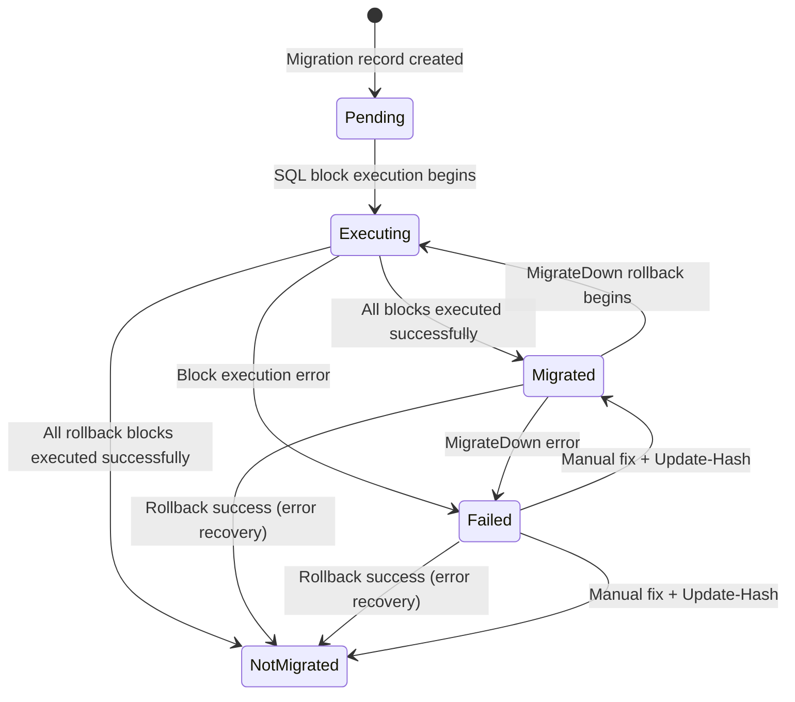
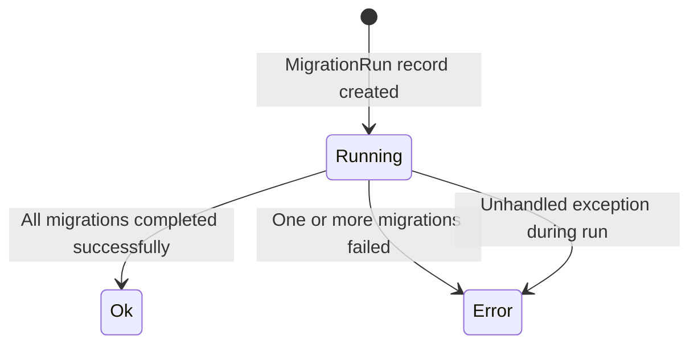
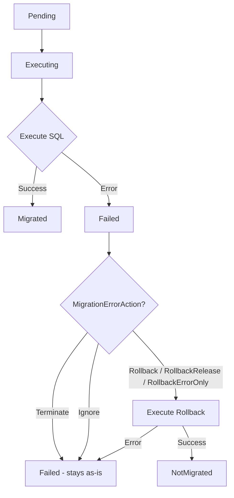
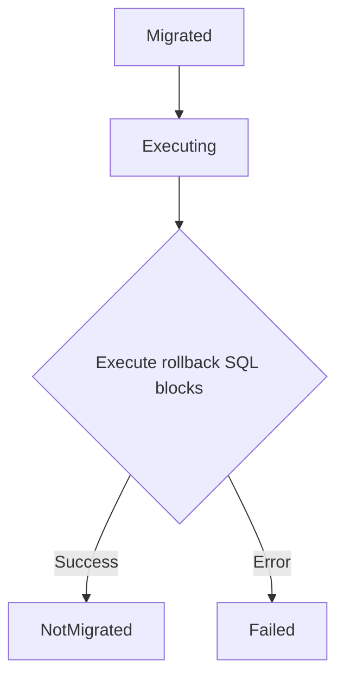
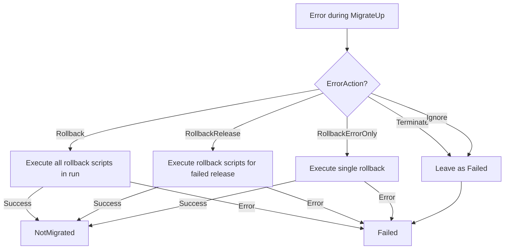

# Migration State Machine

The migration state machine tracks the current status of each migration file and the overall result of each migration run. States determine what operations are valid and what happens during errors.

## Overview

RayMigrator uses two separate status enums:

- **`MigrationStatus`** -- Tracks per-file status in the `MigrationRecord` table (`MigrationStatusId` column)
- **`MigrationRunResult`** -- Tracks the overall run outcome in the `MigrationRun` table (`MigrationRunResultId` column)

## MigrationStatus (Per-File)



## MigrationStatus Definitions

| Status | Value | Description |
|--------|-------|-------------|
| `Undefined` | 0 | Invalid value -- value has not been set properly |
| `Pending` | 10 | Migration record created, execution has not started yet |
| `Executing` | 20 | SQL blocks are currently being executed |
| `Failed` | 30 | Execution failed, database state is unclear |
| `NotMigrated` | 50 | File is not deployed on target database (rolled back or never executed) |
| `Migrated` | 100 | File is successfully deployed on target database |

### Pending (10)

A migration file is in `Pending` status when:
- A migration record has been inserted but SQL execution has not started
- The process was interrupted before execution began

**Valid Operations**: Execution proceeds to `Executing`

### Executing (20)

A migration file is in `Executing` status when:
- SQL blocks are actively being executed against the target database (MigrateUp)
- Rollback blocks are actively being executed against the target database (MigrateDown / error recovery)
- Progress is tracked per block (`FileUpBlocksMigrated` for up-migrations, `FileDownBlocksMigrated` for rollbacks)

**Valid Operations**: Completes to `Migrated` on up-migration success, `NotMigrated` on rollback success, transitions to `Failed` on error

### NotMigrated (50)

A migration file is in `NotMigrated` status when:
- Newly discovered (never executed)
- Successfully rolled back via `Migrate-Down`
- Successfully rolled back via error recovery
- Skipped due to environment/target filters
- Ignored due to configuration

**Valid Operations**: `MigrateUp`

### Migrated (100)

A migration file is in `Migrated` status when:
- Successfully executed via `MigrateUp`
- Forward migration completed without errors
- Baselined (marked as migrated without executing SQL)
- Rollback file was missing with `RequireRollbackFile=false` (status is not updated — remains `Migrated`)

**Valid Operations**: `MigrateDown`

### Failed (30)

A migration file is in `Failed` status when:
- Error occurred during `MigrateUp` and rollback was not attempted (Terminate/Ignore) or rollback itself failed
- Error occurred during `MigrateDown` rollback execution
- Error occurred during error recovery rollback (rollback block failed)
- Partial block execution with `MigrationErrorAction=Ignore` (some blocks succeeded, some failed)
- Rollback file missing during rollback chain when `RequireRollbackFile=true` (status updated to `Failed` explicitly)

**Valid Operations**: Manual investigation required

## MigrationRunResult (Per-Run)

The `MigrationRunResult` enum tracks the overall outcome of a migration run in the `MigrationRun` table (`MigrationRunResultId` column). This was renamed from `MigrationResult`/`MigrationResultId` in a breaking change.

| Result | Value | Description |
|--------|-------|-------------|
| `Undefined` | 0 | Invalid value -- ResultId has not been set properly |
| `Running` | 10 | Migration process is currently running |
| `Error` | 90 | Migration(s) stopped due to error(s) |
| `Ok` | 100 | Migration(s) successfully executed and finished |

### Run Result Transitions



The `MigrationRunResult` is stored in the `MigrationRun` table and linked via the `fk_MigrationRun_MigrationRunResult` foreign key to the `MigrationRunResult` lookup table.

## State Transitions

### MigrateUp



### MigrateDown



### Rollback (Error Recovery)



## Block-Level State

For multi-block migrations (SQL Server with `GO` separator), state is tracked at block level for both up-migrations and rollbacks:

### Up-Migration Blocks

| Field | Description |
|-------|-------------|
| `FileUpBlocksTotal` | Total blocks in the up-migration file |
| `FileUpBlocksMigrated` | Blocks successfully executed |

### Rollback Blocks

| Field | Description |
|-------|-------------|
| `FileDownBlocksTotal` | Total blocks in the rollback file |
| `FileDownBlocksMigrated` | Rollback blocks successfully executed |

**Example**: A file with 5 up-migration blocks where block 3 fails:

```
Block 1: Executed (ok)
Block 2: Executed (ok)
Block 3: Failed (error)
Block 4: Not executed
Block 5: Not executed

FileUpBlocksTotal = 5
FileUpBlocksMigrated = 2
MigrationStatus = Failed
```

## Repository Database Tracking

### Per-File Status (MigrationRecord Table)

File-level status is stored in the `MigrationRecord` and `MigrationRecordHistory` tables via the `MigrationStatusId` column:

```sql
-- Current file status
SELECT
    Filename,
    MigrationStatusId,
    FileUpBlocksMigrated,
    FileUpBlocksTotal,
    FileDownBlocksMigrated,
    FileDownBlocksTotal
FROM MigrationRecord
WHERE ProductId = @ProductId
    AND EnvironmentId = @EnvironmentId
    AND TargetAlias = @TargetAlias;
```

### Per-Run Result (MigrationRun Table)

Run-level results are stored in the `MigrationRun` table via the `MigrationRunResultId` column:

```sql
-- Current run result
SELECT
    Id,
    MigrationRunResultId,
    StartedAt,
    FinishedAt,
    DurationInMs
FROM MigrationRun
WHERE ProductId = @ProductId;
```

### MigrationStatus Lookup Table

```sql
INSERT INTO MigrationStatus (Id, Name, Description) VALUES
    (10, 'Pending', 'Record created, execution pending'),
    (20, 'Executing', 'SQL blocks are being executed'),
    (30, 'Failed', 'Execution failed, DB state unclear'),
    (50, 'NotMigrated', 'Not deployed / rolled back'),
    (100, 'Migrated', 'Successfully deployed');
```

### MigrationRunResult Lookup Table

```sql
INSERT INTO MigrationRunResult (Id, Name, Description) VALUES
    (10, 'Running', 'Migration process is currently running'),
    (90, 'Error', 'Migration(s) stopped due to error(s)'),
    (100, 'Ok', 'Migration(s) successfully executed');
```

## Handling Failed State

When a migration is in `Failed` status, manual intervention is required:

### 1. Investigate the Error

Check the Serilog output (console or file sink) for error details. You can also inspect the repository for block-level progress:

```sql
SELECT
    Filename,
    MigrationStatusId,
    FileUpBlocksMigrated,
    FileUpBlocksTotal
FROM MigrationRecord
WHERE MigrationStatusId = 30;  -- Failed
```

### 2. Fix the Database

Manually repair the database state:
- Complete partially executed changes
- Or rollback partially executed changes

### 3. Update Repository

Use `Update-Hash` to synchronize repository with actual database state:

```bash
RayMigrator Update-Hash -p MyProduct -env Production
```

### 4. Manually Set Status (if needed)

Direct database update (use with caution):

```sql
UPDATE MigrationRecord
SET MigrationStatusId = 50  -- NotMigrated
WHERE Id = @MigrationRecordId;
```

## State Queries

### Find Migrations in Failed Status

```sql
SELECT
    p.Name AS Product,
    m.EnvironmentId,
    m.ReleaseVersion,
    m.Filename,
    m.FileUpBlocksMigrated,
    m.FileUpBlocksTotal
FROM MigrationRecord m
JOIN Product p ON m.ProductId = p.Id
WHERE m.MigrationStatusId = 30;  -- Failed
```

### Find Not-Yet-Migrated Files

```sql
SELECT
    m.ReleaseVersion,
    m.Filename,
    m.FileOrderId
FROM MigrationRecord m
WHERE m.ProductId = @ProductId
    AND m.TargetAlias = @TargetAlias
    AND m.MigrationStatusId = 50  -- NotMigrated
ORDER BY m.FileOrderId;
```

### Find Failed or Orphaned Migration Runs

```sql
SELECT
    mr.Id,
    mr.MigrationRunResultId,
    mr.StartedAt,
    mr.FinishedAt,
    mr.DurationInMs
FROM MigrationRun mr
WHERE mr.ProductId = @ProductId
    AND mr.MigrationRunResultId IN (10, 90);  -- Running (orphaned) or Error
```

## Related Documentation

- [Migration Context](migration-context.md) - Context state management
- [Error Handling](error-handling.md) - Error recovery strategies
- [Error Scenarios and Recovery](error-scenarios-and-recovery.md) - Concrete scenario outcomes with step-by-step recovery procedures
- [Execution Modes](execution-modes.md) - How execution affects state
- [Resilience and Recovery](resilience.md) - Block-level tracking and resume
- [Concurrency Control](concurrency-control.md) - Orphaned run detection and cleanup
