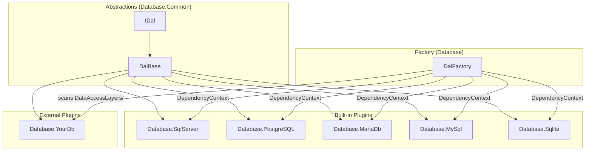

# DAL Architecture

The Database Access Layer (DAL) provides database-specific implementations for RayMigrator using a **plugin architecture**. Each database provider is a separate assembly that can be developed, built, and deployed independently.

## Architecture Overview



## IDal Interface

**Location**: `Raycoon.RayMigrator.Database.Common/IDal.cs`

```csharp
public interface IDal
{
    string DatabaseType { get; }
    DalSpecificProperties DalSpecificProperties { get; }

    Task ExecuteNonQueryAsync(string sqlCode, IDalSettings dalSettings, DalParameterList? dalParameterList = null);
    void ExecuteNonQuery(string sqlCode, IDalSettings dalSettings, DalParameterList? dalParameterList = null);
    Task<object?> ExecuteScalarAsync(string sqlCode, IDalSettings dalSettings, DalParameterList? dalParameterList = null);
    Task<List<Dictionary<string, object?>>> ExecuteReaderAsync(string sqlCode, IDalSettings dalSettings, DalParameterList? dalParameterList = null);
    Task<bool> IsConnectionValid(string connectionString, IDalSettings dalSettings);
    void CheckConnectionStringOrValidateConnection(bool validateConnection);
    bool TryGetDbTypeForType(Type type, out DbType dbType);
    bool TryGetDbSpecificSqlParameter<T>(DalParameterList dalParameterList, out List<T>? sqlParameterList) where T : class, IDbDataParameter, new();

    // Shared-connection methods: caller controls the connection and transaction lifecycle.
    // Used for atomic execution where repository updates and target SQL blocks share one transaction.
    DbConnection CreateConnection();
    Task ExecuteNonQueryAsync(string sqlCode, DbConnection connection, DbTransaction transaction, int commandTimeoutInSeconds, DalParameterList? dalParameterList = null);
    Task<object?> ExecuteScalarAsync(string sqlCode, DbConnection connection, DbTransaction transaction, int commandTimeoutInSeconds, DalParameterList? dalParameterList = null);
}
```

## Database-Specific Settings

Database-specific properties are carried by the `DalSpecificProperties` class (`Raycoon.RayMigrator.Database.Common/DalSpecificProperties.cs`), which each DAL implementation populates in its constructor. These properties control SQL parsing, schema handling, identifier quoting, and transactional DDL behavior:

| Field | SQL Server | PostgreSQL | MariaDB | MySQL | SQLite |
|-------|------------|------------|---------|-------|--------|
| `SqlBlockDelimiter` | `GO` | `;` | `;` | `;` | `;` |
| `SqlMultiLineCommentStart` | `/*` | `/*` | `/*` | `/*` | `/*` |
| `SqlMultiLineCommentEnd` | `*/` | `*/` | `*/` | `*/` | `*/` |
| `SupportsSchema` | `true` | `true` | `false` | `false` | `false` |
| `SupportsTransactionalDdl` | `true` | `true` | `false` | `false` | `true` |
| `IdentifierQuoteStart` | `[` | `"` | `` ` `` | `` ` `` | `"` |
| `IdentifierQuoteEnd` | `]` | `"` | `` ` `` | `` ` `` | `"` |
| `DefaultSchema` | `dbo` | `public` | _(empty)_ | _(empty)_ | _(empty)_ |
| `FoldsUnquotedIdentifiersToLower` | `false` | `true` | `false` | `false` | `false` |

## Project Structure (Plugin Architecture)

Each DAL is an independent project/assembly:

```
Raycoon.RayMigrator.Database/                  <- DalFactory only (depends on Microsoft.Extensions.DependencyModel for built-in DAL discovery)
├── DalFactory.cs
└── Raycoon.RayMigrator.Database.csproj

Raycoon.RayMigrator.Database.Common/           <- Abstractions and shared types
├── DalBase.cs
├── DalParameter.cs
├── DalParameterList.cs
├── DalSettings.cs
├── DalSpecificProperties.cs
├── DatabaseTypeAttribute.cs
├── IDal.cs
├── IDalSettings.cs
├── RetryHelper.cs
└── Raycoon.RayMigrator.Database.Common.csproj

Raycoon.RayMigrator.Database.SqlServer/        <- Separate project
├── DalSqlServer.cs
├── Templates/
│   ├── DatabaseLogging_CheckCreate.sql
│   ├── DatabaseLogging_Insert.sql
│   ├── Repository_CheckCreate.sql
│   ├── Repository_Drop.sql
│   ├── Repository_Environment_CheckInsert.sql
│   ├── Repository_MigrationRecord_FixOrphaned.sql
│   ├── Repository_MigrationRecord_GetInterrupted.sql
│   ├── Repository_MigrationRecord_Insert.sql
│   ├── Repository_MigrationRecord_Select.sql
│   ├── Repository_MigrationRecord_Update.sql
│   ├── Repository_MigrationRecord_UpdateHash.sql
│   ├── Repository_MigrationRecord_UpdateRollback.sql
│   ├── Repository_MigrationRun_FixOrphaned.sql
│   ├── Repository_MigrationRun_Insert.sql
│   ├── Repository_MigrationRun_Select.sql
│   ├── Repository_MigrationRun_SelectOrphaned.sql
│   ├── Repository_MigrationRun_Update.sql
│   └── Repository_Product_CheckInsert.sql
└── Raycoon.RayMigrator.Database.SqlServer.csproj

Raycoon.RayMigrator.Database.PostgreSQL/       <- Separate project
├── DalPostgreSql.cs
├── Templates/ (same 18 templates, PostgreSQL syntax)
└── Raycoon.RayMigrator.Database.PostgreSQL.csproj

Raycoon.RayMigrator.Database.MariaDb/          <- Separate project
├── DalMariaDb.cs
├── Templates/ (same 18 templates, MariaDB syntax)
└── Raycoon.RayMigrator.Database.MariaDb.csproj

Raycoon.RayMigrator.Database.MySql/            <- Separate project
├── DalMySql.cs
├── Templates/ (same 18 templates, MySQL syntax)
└── Raycoon.RayMigrator.Database.MySql.csproj

Raycoon.RayMigrator.Database.Sqlite/           <- Separate project
├── DalSqlite.cs
├── Templates/ (same 18 templates, SQLite syntax)
└── Raycoon.RayMigrator.Database.Sqlite.csproj

Raycoon.RayMigrator.Database.Example/          <- Skeleton template for external DAL development
├── DalExample.cs
├── Templates/ (19 placeholder templates: 18 required by the engine + Repository_MigrationRecordHistory_Archive.sql)
└── Raycoon.RayMigrator.Database.Example.csproj
```

**Runtime directory structure:**
```
bin/Debug/{TargetFramework}/   (e.g., net10.0, net9.0, or net8.0)
├── RayMigrator.dll
├── Raycoon.RayMigrator.Database.Common.dll
├── DataAccessLayers/
│   ├── SqlServer/
│   │   ├── Raycoon.RayMigrator.Database.SqlServer.dll
│   │   └── *.sql (18 template files)
│   ├── PostgreSQL/
│   │   ├── Raycoon.RayMigrator.Database.PostgreSQL.dll
│   │   └── *.sql (18 template files)
│   ├── MariaDb/
│   │   ├── Raycoon.RayMigrator.Database.MariaDb.dll
│   │   └── *.sql (18 template files)
│   ├── MySql/
│   │   ├── Raycoon.RayMigrator.Database.MySql.dll
│   │   └── *.sql (18 template files)
│   └── Sqlite/
│       ├── Raycoon.RayMigrator.Database.Sqlite.dll
│       └── *.sql (18 template files)
```

## DatabaseType Attribute

**Location**: `Raycoon.RayMigrator.Database.Common/DatabaseTypeAttribute.cs`

Each DAL class must be decorated with a `[DatabaseType]` attribute that declares its database type string. This attribute is used by `DalFactory` for type discovery and by the DAL class itself to set its `DatabaseType` property.

```csharp
[AttributeUsage(AttributeTargets.Class, Inherited = false)]
public class DatabaseTypeAttribute : Attribute
{
    public string DatabaseType { get; }

    public DatabaseTypeAttribute(string databaseType)
    {
        DatabaseType = databaseType;
    }
}
```

**Registered database types:**

| Attribute Value | DAL Class | Namespace |
|-----------------|-----------|-----------|
| `"SqlServer"` | `DalSqlServer` | `Raycoon.RayMigrator.Database.SqlServer` |
| `"PostgreSQL"` | `DalPostgreSql` | `Raycoon.RayMigrator.Database.PostgreSQL` |
| `"MariaDb"` | `DalMariaDb` | `Raycoon.RayMigrator.Database.MariaDb` |
| `"MySql"` | `DalMySql` | `Raycoon.RayMigrator.Database.MySql` |
| `"Sqlite"` | `DalSqlite` | `Raycoon.RayMigrator.Database.Sqlite` |

## Template Deployment

Each DAL project's `.csproj` includes templates as `<Content>` items that propagate transitively through ProjectReference and as `contentFiles` in NuGet packages. A build target copies the DAL DLL into the same subdirectory.

```xml
<PropertyGroup>
    <RayMigratorDatabaseType>SqlServer</RayMigratorDatabaseType>
</PropertyGroup>

<!-- Templates as Content (transitive propagation + NuGet contentFiles) -->
<ItemGroup>
    <Content Include="Templates\**\*.sql">
        <CopyToOutputDirectory>PreserveNewest</CopyToOutputDirectory>
        <Link>DataAccessLayers\$(RayMigratorDatabaseType)\%(RecursiveDir)%(Filename)%(Extension)</Link>
        <Pack>true</Pack>
        <PackagePath>contentFiles\any\any\DataAccessLayers\$(RayMigratorDatabaseType)\</PackagePath>
        <PackageCopyToOutput>true</PackageCopyToOutput>
    </Content>
</ItemGroup>

<!-- Copy DAL DLL into DataAccessLayers/{Type}/ -->
<Target Name="CopyDalToDataAccessLayers" AfterTargets="Build">
    <MakeDir Directories="$(OutputPath)DataAccessLayers\$(RayMigratorDatabaseType)" />
    <Copy SourceFiles="$(TargetPath)"
          DestinationFolder="$(OutputPath)DataAccessLayers\$(RayMigratorDatabaseType)\"
          SkipUnchangedFiles="true" />
</Target>
```

The Console project additionally has a post-build target (`CopyDalAssembliesToDataAccessLayers`) that copies the built-in DAL DLLs into the correct subdirectories for plugin discovery by `DalFactory`.

**Runtime Path**: `TemplateCache` scans each database type subdirectory for `.sql` files during construction:
```csharp
var dataAccessLayersPath = Path.Combine(
    AppDomain.CurrentDomain.BaseDirectory,
    "DataAccessLayers");      // ConfigurationConstants.DatabaseAccessLayersRootDirectory

// For each subDir in DataAccessLayers/ (e.g., SqlServer/, PostgreSQL/):
Directory.GetFiles(subDir, "*.sql");
```

## DalBase Abstract Class

**Location**: `Raycoon.RayMigrator.Database.Common/DalBase.cs`

`DalBase` provides a base implementation for all DAL classes, implementing `IDal`. It declares abstract members that each database-specific DAL must override and provides default implementations for common functionality such as parameter conversion and type mapping.

```csharp
public abstract class DalBase : IDal
{
    public abstract string DatabaseType { get; }
    public abstract DalSpecificProperties DalSpecificProperties { get; }

    public abstract Task ExecuteNonQueryAsync(string sqlCode, IDalSettings dalSettings, DalParameterList? dalParameterList = null);
    public abstract void ExecuteNonQuery(string sqlCode, IDalSettings dalSettings, DalParameterList? dalParameterList = null);
    public abstract Task<object?> ExecuteScalarAsync(string sqlCode, IDalSettings dalSettings, DalParameterList? dalParameterList = null);
    public abstract Task<List<Dictionary<string, object?>>> ExecuteReaderAsync(string sqlCode, IDalSettings dalSettings, DalParameterList? dalParameterList = null);
    public abstract Task<bool> IsConnectionValid(string connectionString, IDalSettings dalSettings);
    public abstract void CheckConnectionStringOrValidateConnection(bool validateConnection);

    // Shared-connection abstracts: each DAL must implement using its own connection/command types.
    public abstract DbConnection CreateConnection();
    public abstract Task ExecuteNonQueryAsync(string sqlCode, DbConnection connection, DbTransaction transaction, int commandTimeoutInSeconds, DalParameterList? dalParameterList = null);
    public abstract Task<object?> ExecuteScalarAsync(string sqlCode, DbConnection connection, DbTransaction transaction, int commandTimeoutInSeconds, DalParameterList? dalParameterList = null);

    // Transient error detection: override in each DAL with database-specific exception types
    // and error codes. The base implementation handles TimeoutException
    // and recursively checks InnerException.
    public virtual (bool isTransient, string? errorCode) IsTransient(Exception ex) { ... }

    // Retry helpers: delegate to RetryHelper using this DAL's IsTransient method
    protected async Task<T> ExecuteWithRetryAsync<T>(
        Func<Task<T>> operation, IDalSettings dalSettings, string? operationDescription = null) { ... }
    protected async Task ExecuteWithRetryAsync(
        Func<Task> operation, IDalSettings dalSettings, string? operationDescription = null) { ... }
    protected void ExecuteWithRetry(
        Action operation, IDalSettings dalSettings, string? operationDescription = null) { ... }

    // Default implementation: maps .NET types to DbType
    public bool TryGetDbTypeForType(Type type, out DbType dbType) { ... }

    // Default implementation: converts DalParameterList to database-specific parameters
    public virtual bool TryGetDbSpecificSqlParameter<T>(DalParameterList dalParameterList, out List<T>? sqlParameterList)
        where T : class, IDbDataParameter, new() { ... }

    // Helper methods for parameter creation
    protected virtual T CreateParameter<T>(DbType dbType, string parameterName, object? parameterValue)
        where T : class, IDbDataParameter, new() { ... }
    protected virtual object ConvertToDbValue(object? value) { ... }
}
```

### SQL Server Example

```csharp
[DatabaseType("SqlServer")]
public class DalSqlServer : DalBase, IDal
{
    private readonly string _connectionString;
    public override string DatabaseType { get; }
    public override DalSpecificProperties DalSpecificProperties { get; }

    public DalSqlServer(string connectionString)
    {
        _connectionString = connectionString;
        DatabaseType = this.GetType().GetCustomAttribute<DatabaseTypeAttribute>()!.DatabaseType;
        DalSpecificProperties = new DalSpecificProperties
        {
            SqlBlockDelimiter = "GO",
            SqlMultiLineCommentStart = "/*",
            SqlMultiLineCommentEnd = "*/",
            SupportsSchema = true,
            SupportsTransactionalDdl = true,
            IdentifierQuoteStart = "[",
            IdentifierQuoteEnd = "]",
            DefaultSchema = "dbo",
        };
    }

    private static readonly string[] s_transientCodes =
        ["-2", "20", "64", "233", "10053", "10054", "10060",
         "40197", "40501", "40613", "49918", "49919", "49920"];

    public override (bool isTransient, string? errorCode) IsTransient(Exception ex)
    {
        if (ex is SqlException sqlEx)
        {
            var code = sqlEx.Number.ToString();
            return (s_transientCodes.Contains(code), code);
        }
        return base.IsTransient(ex);
    }

    // ... ExecuteNonQueryAsync, ExecuteScalarAsync, IsConnectionValid, etc.
}
```

## Factory Resolution (Plugin Discovery)

DAL instances are created and cached by the static `DalFactory` class (`Raycoon.RayMigrator.Database/DalFactory.cs`). The factory uses **dual-mode discovery** to find DAL plugins.

### How it works

The factory uses **DependencyContext-based discovery** for built-in DALs (works with single-file publish) and **filesystem scanning** for external DAL plugins.

1. **Mode 0 -- DependencyContext discovery** (built-in DALs): On first access, `DalFactory` reads from `DependencyContext.Default` (the `.deps.json` metadata available in all deployment modes including single-file publish bundles). It iterates `RuntimeLibraries` whose name starts with `"Raycoon.RayMigrator."` and loads each via `Assembly.Load`. No hardcoded assembly list is needed -- any ProjectReference within the namespace is discovered automatically.
2. **Mode 1 -- Filesystem-based discovery** (external DAL plugins): After DependencyContext scanning, `DalFactory` scans the `DataAccessLayers/` directory under the application base directory. For each subdirectory (e.g., `DataAccessLayers/SqlServer/`), all `.dll` files are loaded via `Assembly.LoadFrom`.
3. **Type scanning**: Each loaded assembly is scanned for non-abstract classes that implement `IDal` and are decorated with the `[DatabaseType]` attribute.
4. **Type mapping**: Each discovered class is mapped by its `DatabaseType` attribute value (e.g., `"SqlServer"`, `"PostgreSQL"`, `"MariaDb"`, `"MySql"`, `"Sqlite"`). Duplicates are skipped (`TryAdd`).
5. **Instance caching**: DAL instances are cached in a `ConcurrentDictionary` keyed by `"{databaseType}_{connectionString}"`, so the same connection reuses the same DAL instance.
6. **Instance creation**: Instances are created via `Activator.CreateInstance(dalType, connectionString)`, passing the connection string to the constructor.
7. **Error handling**: `TryGetDal` throws a `ConfigurationValidationException` if the requested `databaseType` has no registered DAL type mapping.

```csharp
public static class DalFactory
{
    private static readonly Dictionary<string, Type> DalTypeMapping = new();
    private static readonly ConcurrentDictionary<string, IDal> DalInstances = new();

    static DalFactory()
    {
        // Mode 0: Discover built-in DAL assemblies from dependency metadata.
        // DependencyContext.Default reads from deps.json, which is available in all
        // deployment modes including single-file publish bundles.
        var context = DependencyContext.Default;
        if (context != null)
        {
            foreach (var lib in context.RuntimeLibraries)
            {
                if (lib.Name.StartsWith("Raycoon.RayMigrator."))
                {
                    try
                    {
                        var assembly = Assembly.Load(new AssemblyName(lib.Name));
                        ScanAssemblyForDals(assembly);
                    }
                    catch (FileNotFoundException) { /* Assembly not available in this deployment */ }
                    catch (FileLoadException) { /* Assembly version conflict, skip */ }
                }
            }
        }

        // Mode 1: Filesystem-based discovery (external DAL plugins)
        string dalRootPath = Path.Combine(
            AppDomain.CurrentDomain.BaseDirectory,
            "DataAccessLayers");

        if (Directory.Exists(dalRootPath))
        {
            foreach (string subDir in Directory.GetDirectories(dalRootPath))
            {
                foreach (string dllFile in Directory.GetFiles(subDir, "*.dll"))
                {
                    try
                    {
                        var assembly = Assembly.LoadFrom(dllFile);
                        ScanAssemblyForDals(assembly);
                    }
                    catch (BadImageFormatException) { /* Native DLL, skip */ }
                    catch (FileLoadException) { /* Already loaded, skip */ }
                }
            }
        }
    }

    // ...
}
```

### Adding External DAL Plugins

To add a new database provider at runtime:

1. Build your DAL project (must reference `Database.Common` and `Shared`)
2. Copy the output DLL to `DataAccessLayers/{YourDatabaseType}/`
3. Copy your 18 SQL templates to `DataAccessLayers/{YourDatabaseType}/` (same directory as the DLL)
4. RayMigrator will auto-discover and register the DAL on next startup via Mode 1 (filesystem scanning)

See [External DAL Development](../09-extending/external-dal-development.md) for a complete guide.

### Usage

```csharp
// TryGetDal returns true for known database types and provides the cached instance.
// For unknown database types it throws ConfigurationValidationException (never returns false).
DalFactory.TryGetDal("SqlServer", connectionString, out IDal? dal);
await dal!.ExecuteNonQueryAsync(sql, dalSettings);
```

## NuGet Dependencies

Each DAL project has its own NuGet dependencies:

| Project | Package |
|---------|---------|
| `Database.SqlServer` | `Microsoft.Data.SqlClient` |
| `Database.PostgreSQL` | `Npgsql` |
| `Database.MariaDb` | `MySqlConnector` |
| `Database.MySql` | `MySqlConnector` |
| `Database.Sqlite` | `Microsoft.Data.Sqlite` |

For external DALs, `Database.Common` and `Shared` are available as NuGet packages.

## IDalSettings and DalSettings

**Location**: `Raycoon.RayMigrator.Database.Common/IDalSettings.cs`, `Raycoon.RayMigrator.Database.Common/DalSettings.cs`

Every DAL method that executes SQL receives an `IDalSettings` instance that controls execution behavior:

```csharp
public interface IDalSettings
{
    bool UseTransaction { get; set; }
    int DbCommandTimeoutInSeconds { get; set; }
    int MaxRetries { get; set; }
    int RetryDelayMs { get; set; }
}
```

`DalSettings` provides the default implementation. The class-level property defaults are `MaxRetries = 3` and `RetryDelayMs = 500`, but in practice these are always overridden at the call site. Two different defaults apply depending on the context:

- **Repository calls** (`RepositoryExtensions.GetDalSettings`): `MaxRetries = repository.DbCommandMaxRetries ?? 3` and `RetryDelayMs = repository.DbCommandWaitTimeInMsBeforeRetry ?? 500`. When no explicit configuration is set, retries are **enabled** with 3 attempts and 500 ms base delay.
- **Target calls** (migration SQL execution): `MaxRetries = targetOptions.DbCommandMaxRetries ?? 0` and `RetryDelayMs = targetOptions.DbCommandWaitTimeInMsBeforeRetry ?? 250`. When no explicit configuration is set, retries are **disabled**.

See [Resilience and Retry](../02-core-concepts/resilience.md) for the configuration-level defaults.

## DalParameter and DalParameterList

**Location**: `Raycoon.RayMigrator.Database.Common/DalParameter.cs`, `Raycoon.RayMigrator.Database.Common/DalParameterList.cs`

`DalParameter` carries a parameter name, value, and .NET type. `DalParameterList` is a dictionary-backed collection of `DalParameter` instances. The `TryGetDbSpecificSqlParameter<T>` method on `DalBase` converts these to database-specific `IDbDataParameter` implementations (e.g., `SqlParameter`, `NpgsqlParameter`).

## RetryHelper

**Location**: `Raycoon.RayMigrator.Database.Common/RetryHelper.cs`

`RetryHelper` provides retry logic for transient database errors with **linear backoff** (delay * attemptNumber). It accepts a `Func<Exception, (bool isTransient, string? errorCode)>` transient error predicate and offers three sets of overloads:

1. **Async with return value**: `ExecuteWithRetryAsync<T>(Func<Task<T>>, ...)`
2. **Async void**: `ExecuteWithRetryAsync(Func<Task>, ...)`
3. **Sync with return value**: `ExecuteWithRetry<T>(Func<T>, ...)`

Transient error detection is delegated entirely to each DAL. `DalBase` provides the `IsTransient(Exception)` virtual method that each concrete DAL overrides with its database-specific exception types and error codes. The base implementation handles `TimeoutException` and recursively checks `InnerException`. The protected `ExecuteWithRetryAsync` and `ExecuteWithRetry` methods in `DalBase` call `RetryHelper`, passing the DAL's own `IsTransient` method as the predicate.

To add transient error detection to a custom DAL, override `IsTransient` in the DAL class (see the commented-out example in `DalExample.cs`):

```csharp
private static readonly string[] s_transientCodes = ["1205", "2006", "40001"];

public override (bool isTransient, string? errorCode) IsTransient(Exception ex)
{
    if (ex is YourDbException dbEx)
    {
        var code = dbEx.ErrorNumber.ToString();
        return (s_transientCodes.Contains(code), code);
    }
    return base.IsTransient(ex); // handles TimeoutException, InnerException recursion
}
```

When all retries are exhausted, a `RetryExhaustedException` is thrown containing `AttemptsMade` (int) and `LastErrorCode` (string?). Error codes are returned as `string?` so the same predicate can carry both numeric driver codes (e.g., SQL Server `"233"`) and SQLSTATE codes (e.g., PostgreSQL `"08000"`).

## Related Documentation

- [Template System](template-system.md) - How templates work
- [Repository Schema](repository-schema.md) - Repository tables
- [SQL Dialects](sql-dialects.md) - Dialect differences
- [Adding New Database](adding-new-database.md) - Extension guide
- [External DAL Development](../09-extending/external-dal-development.md) - External plugin development
