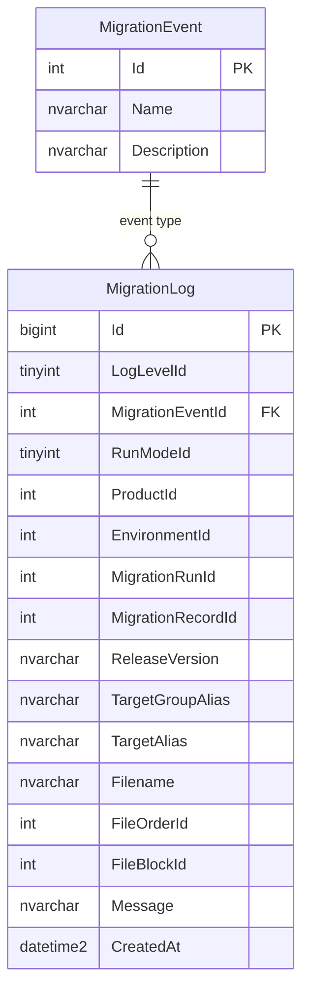

# Logging Schema

RayMigrator can optionally log migration events to a database for centralized logging and monitoring.

## Entity Relationship Diagram



## Tables

### MigrationEvent

Lookup table for migration event types.

| Column | Type | Description |
|--------|------|-------------|
| `Id` | INT | Primary key |
| `Name` | NVARCHAR(100) | Event name |
| `Description` | NVARCHAR(1000) | Event description |

### MigrationLog

Main logging table. Types shown are SQL Server canonical types. PostgreSQL stores all `NVARCHAR(n)` string columns as `TEXT` and the `CreatedAt` audit column as `TIMESTAMPTZ`. After DAL-017, PostgreSQL uses unquoted snake_case column names throughout (e.g., `log_level_id`, `migration_event_id`, `migration_run_id`, `created_at`). After DAL-018, MariaDB and MySQL use the same unquoted snake_case convention — `migration_log` and `migration_event` table names, `log_level_id`, `migration_event_id`, etc. SQL Server and SQLite retain PascalCase. The Mermaid ERD above uses PascalCase as engine-neutral canonical names; the snake_case names follow the mechanical conversion rule documented in [Naming Conventions per Engine](sql-dialects.md#naming-conventions-per-engine).

| Column | Type | Description |
|--------|------|-------------|
| `Id` | BIGINT | Primary key (auto-increment) |
| `LogLevelId` | TINYINT | Log level (Debug, Info, Warning, Error) |
| `MigrationEventId` | INT | FK to MigrationEvent |
| `RunModeId` | TINYINT | Run mode (Validate/Simulate/Migrate) |
| `ProductId` | INT | Product ID (nullable) |
| `EnvironmentId` | INT | Environment ID (nullable; no FK — logging DB may differ from repository DB) |
| `MigrationRunId` | INT | Migration run ID (nullable) |
| `MigrationRecordId` | INT | Migration record ID (nullable) |
| `ReleaseVersion` | NVARCHAR(100) | Release version |
| `TargetGroupAlias` | NVARCHAR(100) | Target group |
| `TargetAlias` | NVARCHAR(100) | Target database |
| `Filename` | NVARCHAR(300) | Migration filename |
| `FileOrderId` | INT | File execution order |
| `FileBlockId` | INT | Block index within file |
| `Message` | NVARCHAR(MAX) | Log message |
| `CreatedAt` | DATETIME2(3) | Timestamp (default: SYSUTCDATETIME()) |

## MigrationEvent Lookup Table

The `MigrationEvent` table contains base event types inserted by the `DatabaseLogging_CheckCreate` template. These are the events stored in the database lookup table:

| Id | Name | Description |
|----|------|-------------|
| 0 | UnspecifiedEvent | Generic event |
| 10 | CommandLineParsing | CLI argument parsing |
| 20 | EnvironmentVariableReplacement | Env var resolution |
| 31 | CreateDatabaseLogger | Database logger setup |
| 32 | CreateCompositeLogger | Composite logger setup |
| 40 | ValidateRayMigratorOptions | Options validation |
| 50 | CreateApplicationHost | Host creation |
| 60 | InitializeDalSpecificProperties | DAL initialization |
| 70 | ValidateConnectionStrings | Connection validation |
| 80 | RayMigratorServiceStart | Service startup |
| 100 | CreateAndStartRayMigratorService | RayMigrator service creation and startup |
| 1000 | RayMigratorServiceShutdown | Service shutdown |

## EventId Values (C# MigrationEvent Class)

The C# `MigrationEvent` class (`Raycoon.RayMigrator.Core.Configuration.Enums.MigrationEvent`) defines EventId values used throughout the application for structured logging. Some overlap with the database lookup table IDs, and some are unique to C# code. These appear in `MigrationLog.MigrationEventId`:

**Application Startup Events:**

| Id | Name | Description |
|----|------|-------------|
| 0 | UnspecifiedEvent | Generic event |
| 10 | CommandLineParsing | CLI argument parsing |
| 20 | EnvironmentVariableReplacement | Env var resolution |
| 31 | CreateDatabaseLogger | Database logger setup |
| 40 | ValidateRayMigratorOptions | Options validation |
| 50 | CreateApplicationHost | Host creation |
| 60 | InitializeDalSpecificProperties | DAL initialization |
| 70 | ValidateConnectionStrings | Connection validation |
| 80 | RayMigratorServiceStart | Service startup |

**Template Execution Events:**

| Id | Name | Description |
|----|------|-------------|
| 100 | TemplateExecutionRepositoryCheckCreate | Repository check/create |
| 110 | TemplateExecutionMigrationRunInsert | MigrationRun insert |
| 111 | TemplateExecutionMigrationRunUpdate | MigrationRun update |
| 112 | TemplateExecutionMigrationRunSelectOrphaned | Select orphaned runs |
| 113 | TemplateExecutionMigrationRunFixOrphaned | Fix orphaned migration runs |
| 114 | TemplateExecutionMigrationFixOrphaned | Fix orphaned migrations |
| 120 | TemplateExecutionProductCheckInsert | Product check/insert |
| 121 | TemplateExecutionEnvironmentCheckInsert | Environment check/insert |
| 130 | TemplateExecutionMigrationInsert | Migration record insert |
| 131 | TemplateExecutionMigrationUpdate | Migration record update |
| 132 | TemplateExecutionMigrationGetInterrupted | Check for interrupted migrations |
| 133 | TemplateExecutionMigrationUpdateRollback | Migration rollback update |
| 134 | TemplateExecutionMigrationSelect | Query migration records |
| 135 | TemplateExecutionMigrationUpdateHash | Update migration hashes |
| 136 | TemplateExecutionMigrationRunSelect | Query MigrationRun records |

**Application Shutdown Events:**

| Id | Name | Description |
|----|------|-------------|
| 1000 | RayMigratorServiceShutdown | Service shutdown |

> **Note**: EventId 100 is used for both `CreateAndStartRayMigratorService` (in the MigrationEvent database lookup table) and `TemplateExecutionRepositoryCheckCreate` (in the C# code). The database lookup table also contains `CreateCompositeLogger` (32), which is no longer defined in the C# `MigrationEvent` class. There is no FK constraint from `MigrationLog.MigrationEventId` to `MigrationEvent.Id`, so log entries can reference any EventId value.

## Log Levels

| Id | Name |
|----|------|
| 0 | Trace |
| 1 | Debug |
| 2 | Information |
| 3 | Warning |
| 4 | Error |
| 5 | Critical |

## Configuration

Database logging is activated by the presence of the `DatabaseLogging` section in the configuration. If the section is omitted, database logging is disabled:

```json
{
  "RayMigrator": {
    "DatabaseLogging": {
      "DatabaseType": "SqlServer",
      "ConnectionString": "{ENV:LOG_CONNECTION}",
      "SchemaName": "logs",
      "TableBaseName": "",
      "MinimumLevel": "Information",
      "DbCommandTimeoutInSeconds": 20
    }
  }
}
```

### Options

| Property | Type | Required | Default | Description |
|----------|------|----------|---------|-------------|
| `DatabaseType` | string | Yes | - | Database type (SqlServer, PostgreSQL, MariaDb, MySql, Sqlite) |
| `ConnectionString` | string | Yes | - | Database connection string |
| `SchemaName` | string | No | - | Schema for logging tables |
| `TableBaseName` | string | No | - | Table name prefix |
| `MinimumLevel` | string | No | Information | Minimum log level |
| `DbCommandTimeoutInSeconds` | int | No | 20 | Command timeout |

## SQL Templates

Two SQL templates implement database logging, available for each supported database engine (SqlServer, PostgreSQL, MariaDb, MySql, Sqlite):

- **`DatabaseLogging_CheckCreate.sql`** -- Creates the logging schema, tables, and lookup data if they do not exist
- **`DatabaseLogging_Insert.sql`** -- Inserts a single log entry into the MigrationLog table

### DatabaseLogging_CheckCreate.sql

The `DatabaseLogging_CheckCreate.sql` template creates the logging infrastructure:

```sql
-- Check if tables exist
IF (OBJECT_ID('{CFG:SchemaName}.{CFG:TableBaseName}MigrationLog', 'U') IS NULL)
BEGIN
    -- Create schema if needed
    IF SCHEMA_ID('{CFG:SchemaName}') IS NULL
        EXECUTE('CREATE SCHEMA [{CFG:SchemaName}]');

    -- Create MigrationEvent table
    CREATE TABLE [{CFG:SchemaName}].[{CFG:TableBaseName}MigrationEvent] (
        Id INT NOT NULL PRIMARY KEY,
        Name VARCHAR(100) NOT NULL,
        Description NVARCHAR(1000) NULL
    );

    -- Create MigrationLog table
    CREATE TABLE [{CFG:SchemaName}].[{CFG:TableBaseName}MigrationLog] (
        Id BIGINT IDENTITY(1,1) PRIMARY KEY,
        LogLevelId TINYINT NOT NULL,
        MigrationEventId INT NULL,
        RunModeId TINYINT NULL,
        ProductId INT NULL,
        EnvironmentId INT NULL,
        MigrationRunId INT NULL,
        MigrationRecordId INT NULL,
        ReleaseVersion NVARCHAR(100) NULL,
        TargetGroupAlias NVARCHAR(100) NULL,
        TargetAlias NVARCHAR(100) NULL,
        Filename NVARCHAR(300) NULL,
        FileOrderId INT NULL,
        FileBlockId INT NULL,
        Message NVARCHAR(MAX) NULL,
        CreatedAt DATETIME2(3) DEFAULT SYSUTCDATETIME() NOT NULL
    );

    -- Insert event master data
    INSERT INTO [{CFG:SchemaName}].[{CFG:TableBaseName}MigrationEvent]
        (Id, Name, Description)
    VALUES
        (0, 'UnspecifiedEvent', N''),
        (10, 'CommandLineParsing', N''),
        -- ... more events ...
        (1000, 'RayMigratorServiceShutdown', N'');

    SELECT '1,Database logging infrastructure successfully created';
END
ELSE
BEGIN
    SELECT '0,Database logging infrastructure already exists';
END;
```

### DatabaseLogging_Insert.sql

The `DatabaseLogging_Insert.sql` template inserts a single log entry. It is called by `DatabaseLogWriter` via the `DatabaseLoggerQueue` (asynchronous queue). All parameters except `LogLevelId` are nullable:

```sql
INSERT INTO [{CFG:SchemaName}].[{CFG:TableBaseName}MigrationLog]
(
    [LogLevelId],
    [MigrationEventId],
    [RunModeId],
    [ProductId],
    [EnvironmentId],
    [MigrationRunId],
    [MigrationRecordId],
    [ReleaseVersion],
    [TargetGroupAlias],
    [TargetAlias],
    [Filename],
    [FileOrderId],
    [FileBlockId],
    [Message],
    [CreatedAt]
)
VALUES
(
    @LogLevelId,
    @MigrationEventId,
    @RunModeId,
    @ProductId,
    @EnvironmentId,
    @MigrationRunId,
    @MigrationRecordId,
    @ReleaseVersion,
    @TargetGroupAlias,
    @TargetAlias,
    @Filename,
    @FileOrderId,
    @FileBlockId,
    @Message,
    SYSUTCDATETIME()
);
```

## Querying Logs

### Recent Errors

```sql
SELECT
    CreatedAt,
    EnvironmentId,
    Filename,
    Message
FROM logs.MigrationLog
WHERE LogLevelId >= 4  -- Error and above
ORDER BY CreatedAt DESC;
```

### Logs for Specific Run

```sql
SELECT
    e.Name AS Event,
    l.Message,
    l.Filename,
    l.FileBlockId,
    l.CreatedAt
FROM logs.MigrationLog l
LEFT JOIN logs.MigrationEvent e ON l.MigrationEventId = e.Id
WHERE l.MigrationRunId = @RunId
ORDER BY l.CreatedAt;
```

### Logs for Specific Migration

```sql
SELECT
    e.Name AS Event,
    l.Message,
    l.FileBlockId,
    l.CreatedAt
FROM logs.MigrationLog l
LEFT JOIN logs.MigrationEvent e ON l.MigrationEventId = e.Id
WHERE l.MigrationRecordId = @MigrationRecordId
ORDER BY l.CreatedAt;
```

### Migration Duration Analysis

```sql
SELECT
    Filename,
    MIN(CreatedAt) AS StartedAt,
    MAX(CreatedAt) AS FinishedAt,
    DATEDIFF(MILLISECOND, MIN(CreatedAt), MAX(CreatedAt)) AS DurationMs
FROM logs.MigrationLog
WHERE MigrationRunId = @RunId
    AND Filename IS NOT NULL
GROUP BY Filename
ORDER BY StartedAt;
```

## Serilog Integration

RayMigrator uses Serilog for logging. Console and file sinks are configured alongside database logging. The `Serilog` section must be placed **inside** the `RayMigrator` section:

```json
{
  "RayMigrator": {
    "Serilog": {
      "MinimumLevel": {
        "Default": "Information"
      },
      "WriteTo": [
        {
          "Name": "Console"
        },
        {
          "Name": "File",
          "Args": {
            "path": "logs/raymigrator-.txt",
            "rollingInterval": "Day"
          }
        }
      ]
    }
  }
}
```

## Best Practices

1. **Use separate database** for logs vs repository
2. **Set appropriate retention** - logs can grow quickly
3. **Index by MigrationRunId** for efficient queries
4. **Monitor disk space** - NVARCHAR(MAX) columns can be large
5. **Consider log level** - Debug is verbose, Information is balanced

## Related Documentation

- [Repository Schema](repository-schema.md) - Migration tracking tables
- [Logging Options](../06-configuration-reference/logging-options.md)
- [Configuration System](../02-core-concepts/configuration-system.md)
