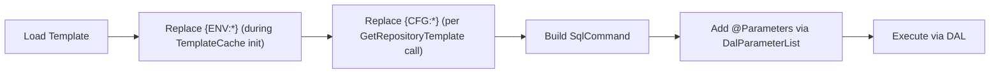

# Template System

RayMigrator uses SQL templates with placeholder substitution for database-agnostic repository operations.

## Template Types

| Template | Purpose |
|----------|---------|
| `Repository_CheckCreate` | Create repository schema and tables |
| `Repository_Product_CheckInsert` | Ensure product exists |
| `Repository_Environment_CheckInsert` | Ensure environment exists |
| `Repository_MigrationRun_Insert` | Create new migration run |
| `Repository_MigrationRun_Update` | Update migration run status |
| `Repository_MigrationRun_SelectOrphaned` | Select orphaned migration runs |
| `Repository_MigrationRun_FixOrphaned` | Fix an orphaned MigrationRun entry |
| `Repository_MigrationRecord_FixOrphaned` | Fix orphaned Migration entries for a MigrationRun |
| `Repository_MigrationRecord_Select` | Query migration records |
| `Repository_MigrationRecord_Insert` | Create new migration record |
| `Repository_MigrationRecord_Update` | Update migration record |
| `Repository_MigrationRecord_UpdateRollback` | Update migration record with rollback (FileDown) fields |
| `Repository_MigrationRecord_UpdateHash` | Update hash fields of a migration record |
| `Repository_MigrationRecord_GetInterrupted` | Check for interrupted migrations |
| `Repository_MigrationRun_Select` | Query MigrationRun records for history |
| `Repository_Drop` | Drop repository (cleanup) |
| `DatabaseLogging_CheckCreate` | Create logging tables |
| `DatabaseLogging_Insert` | Insert log entry |

| Template | SQL Server | PostgreSQL | MariaDB | MySQL | SQLite |
|----------|:----------:|:----------:|:-------:|:-----:|:------:|
| `DatabaseLogging_CheckCreate` | Active | Active | Active | Active | Active |
| `DatabaseLogging_Insert` | Active | Active | Active | Active | Active |
| `Repository_CheckCreate` | Active | Active | Active | Active | Active |
| `Repository_Drop` | Active | Active | Active | Active | Active |
| `Repository_Product_CheckInsert` | Active | Active | Active | Active | Active |
| `Repository_Environment_CheckInsert` | Active | Active | Active | Active | Active |
| `Repository_MigrationRun_Insert` | Active | Active | Active | Active | Active |
| `Repository_MigrationRun_Update` | Active | Active | Active | Active | Active |
| `Repository_MigrationRun_SelectOrphaned` | Active | Active | Active | Active | Active |
| `Repository_MigrationRun_FixOrphaned` | Active | Active | Active | Active | Active |
| `Repository_MigrationRun_Select` | Active | Active | Active | Active | Active |
| `Repository_MigrationRecord_Select` | Active | Active | Active | Active | Active |
| `Repository_MigrationRecord_FixOrphaned` | Active | Active | Active | Active | Active |
| `Repository_MigrationRecord_Insert` | Active | Active | Active | Active | Active |
| `Repository_MigrationRecord_Update` | Active | Active | Active | Active | Active |
| `Repository_MigrationRecord_UpdateRollback` | Active | Active | Active | Active | Active |
| `Repository_MigrationRecord_UpdateHash` | Active | Active | Active | Active | Active |
| `Repository_MigrationRecord_GetInterrupted` | Active | Active | Active | Active | Active |

> **Note:** The 18 templates listed above are shared by all DAL plugins, including the SQLite DAL.

## Template Location

Source templates are stored in each DAL project (e.g., `Database.SqlServer/Templates/`, `Database.PostgreSQL/Templates/`). They are deployed as `<Content>` items that propagate transitively through ProjectReference and as `contentFiles` in NuGet packages:

```xml
<!-- In each DAL .csproj (e.g., Database.SqlServer.csproj) -->
<PropertyGroup>
    <RayMigratorDatabaseType>SqlServer</RayMigratorDatabaseType>
</PropertyGroup>

<!-- Templates as Content (transitive propagation + NuGet contentFiles) -->
<ItemGroup>
    <Content Include="Templates\**\*.sql">
        <CopyToOutputDirectory>PreserveNewest</CopyToOutputDirectory>
        <Link>DataAccessLayers\$(RayMigratorDatabaseType)\%(RecursiveDir)%(Filename)%(Extension)</Link>
        <Pack>true</Pack>
        <PackagePath>contentFiles\any\any\DataAccessLayers\$(RayMigratorDatabaseType)\</PackagePath>
        <PackageCopyToOutput>true</PackageCopyToOutput>
    </Content>
</ItemGroup>
```

Each DAL project also copies its own DLL into the `DataAccessLayers/{Type}/` directory via a post-build target:

```xml
<Target Name="CopyDalToDataAccessLayers" AfterTargets="Build">
    <MakeDir Directories="$(OutputPath)DataAccessLayers\$(RayMigratorDatabaseType)" />
    <Copy SourceFiles="$(TargetPath)"
          DestinationFolder="$(OutputPath)DataAccessLayers\$(RayMigratorDatabaseType)\"
          SkipUnchangedFiles="true" />
</Target>
```

The Console project additionally copies all DAL DLLs into the correct subdirectories via its own post-build target (`CopyDalAssembliesToDataAccessLayers`).

The resulting output directory structure:

```
bin/{Configuration}/{TargetFramework}/
└── DataAccessLayers/
    ├── SqlServer/
    │   ├── Raycoon.RayMigrator.Database.SqlServer.dll
    │   ├── Repository_CheckCreate.sql
    │   ├── Repository_Drop.sql
    │   └── ...
    ├── PostgreSQL/
    │   ├── Raycoon.RayMigrator.Database.PostgreSQL.dll
    │   └── ...
    ├── MariaDb/
    │   └── ...
    ├── MySql/
    │   └── ...
    └── Sqlite/
        └── ...
```

**Runtime access**: `TemplateCache` scans each database type subdirectory for `.sql` files during construction:
```csharp
var dataAccessLayersPath = Path.Combine(
    AppDomain.CurrentDomain.BaseDirectory,
    "DataAccessLayers");          // ConfigurationConstants.DatabaseAccessLayersRootDirectory

// For each subDir in DataAccessLayers/ (e.g., SqlServer/, PostgreSQL/):
Directory.GetFiles(subDir, "*.sql");
```

## Placeholder Types

### Configuration Placeholders: `{CFG:PropertyName}`

Replaced with values from configuration options.

```sql
CREATE TABLE [{CFG:SchemaName}].[{CFG:TableBaseName}MigrationRecord] (
    ...
);
```

**Source**: Configuration section depends on template type:
- `Repository_*` templates → `Repository` options
- `DatabaseLogging_*` templates → `DatabaseLogging` options

**Allowed placeholders** (defined in `ConfigurationConstants.AllowedTemplateVariableNameReplacements`):
- `{CFG:SchemaName}` - Schema name (e.g., `migrations`)
- `{CFG:TableBaseName}` - Table prefix (e.g., `Ray`)

Only these two property names are permitted in `{CFG:*}` placeholders within templates. The replacement uses reflection-based property matching against the passed options object via `ReplacePlaceholdersFromPropertyClass()`.

### Environment Placeholders: `{ENV:VariableName}`

Replaced with environment variable values.

```sql
-- Example: Insert current user
INSERT INTO MigrationRecord (CreatedBy)
VALUES ('{ENV:USERNAME}');
```

### SQL Parameters: `@ParameterName`

Used for parameterized queries (safe from SQL injection).

```sql
INSERT INTO Product (Name, NameLower, CreatedAt)
VALUES (@Name, @NameLower, SYSUTCDATETIME());
```

## Placeholder Resolution Order



`{ENV:*}` placeholders are replaced eagerly when the private `Initialize()` method loads all templates from the filesystem during `TemplateCache` construction. Missing or empty environment variables cause a `ConfigurationValidationException` during initialization. `{CFG:*}` placeholders are replaced later, each time a template is retrieved via `GetRepositoryTemplate<T>()` or `GetTemplate<T>()`, using reflection-based property matching against the passed options object (limited to `AllowedTemplateVariableNameReplacements`). After replacement, any remaining `{CFG:*}` placeholders trigger a `ConfigurationValidationException`.

## Template Structure

### Header Metadata

Each template includes TOML metadata in a standardized format:

```sql
/*
================================================================================
RayMigrator SQL Template
================================================================================
[RayMigratorTemplate]
TemplateType   = "Repository_CheckCreate"
DatabaseType   = "SqlServer"
Author         = "RAYCOON.com GmbH (https://raycoon.com)"
Version        = "2026-04-18.1"

[Description]
Function = """
Checks for repository existence and completeness. Creates RayMigrator
infrastructure on the target database if necessary. Returns the VersionId.
"""

Behaviour = """
- Return value >= 0: Success (logged at Debug level)
- Return value < 0: Error (logged at Error level, migration aborted)
- Creates schema if not exists
- Creates all 11 repository tables with master data
- Inserts new MigratorMeta record on first run or version change
"""

[ConfigPlaceholders]
# Replaced when loading the template (compile-time)
SchemaName    = "Database schema from Repository configuration (e.g., 'ray')"
TableBaseName = "Table name prefix from Repository configuration (e.g., '' or 'RM_')"

[Parameters]
# SQL parameters bound at runtime
RayMigratorVersion     = "VARCHAR(20) | REQUIRED | The RayMigrator application version (e.g., '3.0.0')"
RepositoryDatabaseType = "VARCHAR(20) | REQUIRED | The database type for the repository (e.g., 'SqlServer')"

[ReturnValues]
# Format: SELECT 'code,message'
Success_N           = "N (VersionId),RayMigrator repository already exists. Using VersionId [N]."
Success_N_Created   = "N (VersionId),RayMigrator repository-tables with master data and new VersionId [N] successfully created"
Success_N_NewVer    = "N (VersionId),RayMigrator repository already exists. New VersionId [N] created."
Error_-10_Incomplete        = "-10,RayMigrator repository incomplete or corrupt. Repository contains [X] tables instead of [11]."
Error_-11_PartialNoVersion  = "-11,RayMigrator repository incomplete or corrupt. Repository contains [X] tables instead of the expected amount of [0]."
Error_-12_MultipleVersions  = "-12,Multiple [MigratorMeta]-entries found for RepositoryVersion [...] RepositoryDatabaseType [...] RayMigratorVersion [...]."

[ModificationNotes]
Note1 = "SELECT result format: 'code,message' - DO NOT change this format"
Note2 = "No commas allowed in error messages"
Note3 = "Use SYSUTCDATETIME() for all timestamps"
Note4 = "RepositoryVersion constant MUST match Version in header"
Note5 = "Tables created: MigratorMeta, Product, Environment, MigrationRun, MigrationRunMeta, MigrationRecord, MigrationRecordHistory, MigrationRunMode, MigrationOperation, MigrationRunResult, MigrationStatus"
Note6 = "ResultCode catalog: see TemplateResultCode.cs in Shared project"
================================================================================
*/
```

### Result Convention

Templates return results via SELECT:

```sql
-- Success: ResultCode >= 0
SELECT '1,Repository created successfully';

-- Error: ResultCode < 0
SELECT '-1,Error message without commas';
```

**Format**: `{ResultCode},{Message}`

- `ResultCode >= 0`: Success (code can carry additional info like VersionId)
- `ResultCode < 0`: Error (triggers migration abort)

## Template Class

**Location**: `Raycoon.RayMigrator.Core/Templates/Template.cs` (namespace: `Raycoon.RayMigrator.Core.Templates`)

Represents a loaded SQL template with its metadata and content. Created by `TemplateCache` when templates are loaded and when `{CFG:*}` placeholders are replaced.

```csharp
public class Template
{
    public TemplateType TemplateType { get; set; } = TemplateType.Undefined;
    public string DatabaseType { get; set; } = string.Empty;
    public string Filename { get; set; } = string.Empty;
    public string Content { get; set; } = string.Empty;

    public override string ToString()
        => $"TemplateType: {TemplateType}, DatabaseType: {DatabaseType}, file: {Filename}";
}
```

## TemplateExecutor

**Location**: `Raycoon.RayMigrator.Infrastructure/TemplateExecutor.cs` (namespace: `Raycoon.RayMigrator.Core`)

All methods are **synchronous** (they internally call async DAL methods with `.GetAwaiter().GetResult()`). The class uses `IMigrationContextAccessor` for per-request context isolation (supporting both CLI and API modes).

### Constructor

```csharp
public TemplateExecutor(TemplateCache templateCache, ILogger<TemplateExecutor> logger, IMigrationContextAccessor ctxAccessor)
```

The constructor stores references but does **not** resolve the repository DAL immediately. DAL resolution is deferred to first use via the lazy `_repository` and `_repositoryDal` properties, which call `InitializeFromContext()` on demand. This supports API endpoints where `MigrationContext` is set after DI resolution. When first accessed, `InitializeFromContext()` reads `Repository.DatabaseType` and `Repository.ConnectionString` from the current `MigrationContext` and calls `DalFactory.TryGetDal()` to obtain the DAL instance.

### Key Methods

```csharp
public class TemplateExecutor
{
    // Repository Setup
    public void RepositoryCheckCreate();
    public void RepositoryProductCheckInsert();
    public void RepositoryEnvironmentCheckInsert();

    // Migration Run Operations
    public void RepositoryMigrationRunInsert(string migrationRunSettingsJson);
    public void RepositoryMigrationRunUpdate(MigrationRunResult runResult);
    public List<Dictionary<string, object?>> RepositoryMigrationRunSelectOrphaned(int productId, int environmentId);
    public void RepositoryMigrationRunFixOrphaned(int migrationRunId);
    public List<Dictionary<string, object?>> RepositoryMigrationRunSelect(int limit);

    // Fix Operations
    public int RepositoryMigrationRecordFixOrphaned(int migrationRunId, MigrationStatus status);

    // Migration Record Operations
    public int RepositoryMigrationInsert(
        int existingMigrationRecordId,
        string filename, string releaseVersion,
        string targetGroupAlias, string targetAlias, int fileOrderId,
        string fileUpHash, string? fileUpConfigHash, string fileUpBlocksHash,
        int fileUpBlocksTotal, string? fileUpConfigJson, bool migrateDownFileExists);

    // Standard overload: manages its own connection
    public void RepositoryMigrationUpdate(int migrationRecordId,
        MigrationStatus migrationStatus, int fileUpBlocksMigrated);
    // Shared-connection overload: caller provides connection + transaction for atomic execution
    public void RepositoryMigrationUpdate(int migrationRecordId,
        MigrationStatus migrationStatus, int fileUpBlocksMigrated,
        DbConnection connection, DbTransaction transaction, int repoCommandTimeoutInSeconds);

    // Standard overload: manages its own connection
    public void RepositoryMigrationUpdateRollback(int migrationRecordId,
        MigrationStatus migrationStatus, string fileDownHash, string? fileDownConfigHash,
        string fileDownBlocksHash, int fileDownBlocksMigrated, int fileDownBlocksTotal,
        string? fileDownConfigJson);
    // Shared-connection overload: caller provides connection + transaction for atomic execution
    public void RepositoryMigrationUpdateRollback(int migrationRecordId,
        MigrationStatus migrationStatus, string fileDownHash, string? fileDownConfigHash,
        string fileDownBlocksHash, int fileDownBlocksMigrated, int fileDownBlocksTotal,
        string? fileDownConfigJson,
        DbConnection connection, DbTransaction transaction, int repoCommandTimeoutInSeconds);

    public void RepositoryMigrationUpdateHash(int migrationRecordId, string fileUpHash,
        string? fileUpConfigHash, string fileUpBlocksHash);
    // Optional overrideRunMode allows Simulate mode to query records written by Migrate mode
    public List<MigrationRecord> RepositoryMigrationSelect(MigrationRunMode? overrideRunMode = null);
    public InterruptedMigrationInfo? RepositoryMigrationGetInterrupted();

    // Core Execution — standard (DAL manages connection)
    public TemplateResponse ExecuteScalarWithNegativeResultCodeException(
        Template template, IDal dal, DalSettings dalSettings,
        DalParameterList? dalParameterList, ILogger? logger = null, EventId? eventId = null);

    // Core Execution — shared-connection overload (caller controls connection/transaction)
    public TemplateResponse ExecuteScalarWithNegativeResultCodeException(
        Template template, IDal dal, DbConnection connection, DbTransaction transaction,
        int commandTimeoutInSeconds, DalParameterList? dalParameterList,
        ILogger? logger = null, EventId? eventId = null);
}
```

### TemplateResponse

**Location**: `Raycoon.RayMigrator.Core/Templates/TemplateResponse.cs` (namespace: `Raycoon.RayMigrator.Core.Templates`)

```csharp
public class TemplateResponse
{
    public int ResultCode { get; set; }
    public string? ResultMessage { get; set; }

    public override string ToString()
        => $"ResultCode: {ResultCode}, ResultMessage: {(string.IsNullOrWhiteSpace(ResultMessage) ? "{NullOrEmpty}" : ResultMessage)}";
}
```

Templates return a comma-separated string `"ResultCode,ResultMessage"`. A negative `ResultCode` causes `ExecuteScalarWithNegativeResultCodeException` to throw a `TemplateResultException`. Known negative codes (defined in `TemplateResultCode` in `Raycoon.RayMigrator.Shared.Constants`) throw `TemplateResultException`, while unknown negative codes throw `UndefinedTemplateResultException`.

## TemplateCache

**Location**: `Raycoon.RayMigrator.Infrastructure/TemplateCache.cs` (namespace: `Raycoon.RayMigrator.Core.Templates`)

The cache is eagerly initialized at construction time (not lazy-loaded). The `_options` field is nullable to support deferred validation when Products/Repository configuration is not yet known (e.g., Admin-DB mode).

```csharp
public class TemplateCache
{
    private readonly RayMigratorOptions? _options;  // nullable: options may not be available at construction time
    private Dictionary<string, Dictionary<TemplateType, Template>> _templateDictionary;

    public TemplateCache(IOptions<RayMigratorOptions>? options, bool revealSensitiveData,
        ILogger<TemplateCache> logger, bool validateConfiguration = true)
    {
        _options = options?.Value;
        Initialize();                            // Load all templates from filesystem, replace {ENV:*}
        if (validateConfiguration && _options != null)
            ValidateConfigurationAgainstTemplateCache(_options); // Verify configured DB types exist
    }

    // Returns a Template with {CFG:*} placeholders replaced from the options object
    public Template GetRepositoryTemplate<T>(TemplateType templateType, T propertyClass)
        where T : RepositoryOptions;

    // Generic version for non-repository templates
    public Template GetTemplate<T>(string databaseType, TemplateType templateType, T propertyClass);

    // Returns only the content string with {CFG:*} replaced
    public string GetTemplateContent<T>(string databaseType, TemplateType templateType, T propertyClass);

    // Validates configured DatabaseTypes against loaded templates. Can be called on-demand
    // when Products/Repository config becomes available (e.g., from Admin-DB).
    public void ValidateConfigurationAgainstTemplateCache(RayMigratorOptions options);

    // Returns all available DatabaseType names from loaded DAL templates (e.g., "SqlServer", "PostgreSQL")
    public List<string> GetAvailableDatabaseTypes();
}
```

### Constructor Parameters

| Parameter | Purpose |
|-----------|---------|
| `options` | RayMigrator configuration. Can be `null` when validation is deferred (Admin-DB mode). |
| `revealSensitiveData` | Whether to include sensitive data (paths, env values) in log output. |
| `logger` | Logger instance for template loading diagnostics. |
| `validateConfiguration` | When `true` (default), validates that configured DatabaseTypes have matching templates at construction time. Set to `false` when Products/Repository config is not yet known. |

### Validation

`ValidateConfigurationAgainstTemplateCache(RayMigratorOptions)` is a **public** method that can be called at any time after construction. It validates:

1. The Repository's `DatabaseType` has a matching DAL with templates
2. Every TargetGroup's `DatabaseType` across all Products has a matching DAL with templates

If validation fails, a `ConfigurationValidationException` is thrown with a list of available DatabaseTypes.

`GetAvailableDatabaseTypes()` is a **public** method that returns the list of DatabaseType names for which templates were successfully loaded (e.g., `["SqlServer", "PostgreSQL", "MariaDb", "MySql", "Sqlite"]`).

### Template Loading

Templates are loaded from the filesystem: `DataAccessLayers/{DatabaseType}/*.sql` under the application base directory. SQL template files are delivered as `<Content>` items that propagate transitively through ProjectReference and as `contentFiles` in NuGet packages.

Each template file maps to a `TemplateType` enum value (unrecognized filenames are skipped with a debug log). The cache validates that all `TemplateType` enum values (except `Undefined`) have a corresponding file for each DAL.

## Example: Repository_CheckCreate

Current `RepositoryVersion` values per engine (also stored in `SET @v_repository_version` / `@v_version` inside the template body):

| Engine | Repository_CheckCreate | DatabaseLogging_CheckCreate |
|--------|------------------------|------------------------------|
| SQL Server | `2026-04-18.1` | `2026-04-18.1` |
| PostgreSQL | `2026-04-18.1` | `2026-04-18.1` |
| MariaDB | `2026-04-18.1` | `2026-04-18.1` |
| MySQL | `2026-04-18.1` | `2026-04-18.1` |
| SQLite | `2026-04-18.1` | `2026-04-18.1` |

Per-engine version numbers are independent. Bumping one engine's version does not require bumping the others.

### SQL Server Version

```sql
/*
[RayMigratorTemplate]
TemplateType = "Repository_CheckCreate"
DatabaseType = "SqlServer"
Version = "2026-04-18.1"
*/

SET NOCOUNT ON;
SET XACT_ABORT ON;

BEGIN TRY
    -- Check if repository exists
    IF OBJECT_ID('{CFG:SchemaName}.{CFG:TableBaseName}MigratorMeta', 'U') IS NOT NULL
    BEGIN
        -- Repository exists, return existing VersionId
        SELECT @VersionId + ',Repository already exists';
        RETURN;
    END;

    -- Create schema
    IF SCHEMA_ID('{CFG:SchemaName}') IS NULL
        EXECUTE('CREATE SCHEMA [{CFG:SchemaName}]');

    -- Create tables
    CREATE TABLE [{CFG:SchemaName}].[{CFG:TableBaseName}MigratorMeta] (
        Id INT IDENTITY(1,1) PRIMARY KEY,
        RepositoryVersion NVARCHAR(100) NOT NULL,
        RepositoryDatabaseType NVARCHAR(100) NOT NULL,
        CreatedByRayMigratorVersion NVARCHAR(100) NOT NULL,
        CreatedAt DATETIME2(3) NOT NULL
    );

    -- ... more tables ...

    SELECT '1,Repository created successfully';
END TRY
BEGIN CATCH
    IF @@TRANCOUNT > 0 ROLLBACK;
    THROW;
END CATCH;
```

### PostgreSQL Version

```sql
/*
[RayMigratorTemplate]
TemplateType = "Repository_CheckCreate"
DatabaseType = "PostgreSQL"
Version = "2026-04-18.1"
*/

DO $$
DECLARE
    v_version_id INT;
BEGIN
    -- Check if repository exists
    IF EXISTS (SELECT 1 FROM pg_tables
               WHERE schemaname = '{CFG:SchemaName}'
               AND tablename = '{CFG:TableBaseName}migrator_meta')
    THEN
        -- Repository exists
        RAISE NOTICE '1,Repository already exists';
        RETURN;
    END IF;

    -- Create schema
    CREATE SCHEMA IF NOT EXISTS {CFG:SchemaName};

    -- Create tables (unquoted snake_case identifiers — DAL-017)
    CREATE TABLE {CFG:SchemaName}.{CFG:TableBaseName}migrator_meta (
        id INT GENERATED ALWAYS AS IDENTITY PRIMARY KEY,
        repository_version TEXT NOT NULL,
        repository_database_type TEXT NOT NULL,
        created_by_raymigrator_version TEXT NOT NULL,
        created_at TIMESTAMPTZ NOT NULL
    );

    -- ... more tables ...

    RAISE NOTICE '1,Repository created successfully';
END $$;
```

## Best Practices

1. **Always use parameterized queries** for user-provided values
2. **Return standardized result format** for consistent parsing
3. **Include version metadata** in template headers
4. **Document placeholder usage** in template comments
5. **Handle errors with CATCH blocks** and return negative codes

## Related Documentation

- [DAL Architecture](dal-architecture.md) - Database layer overview
- [Repository Schema](repository-schema.md) - Table structures
- [SQL Dialects](sql-dialects.md) - Database-specific syntax
- [Template Customization](../09-extending/template-customization.md) - TemplateResultCode catalog, full template list with descriptions
