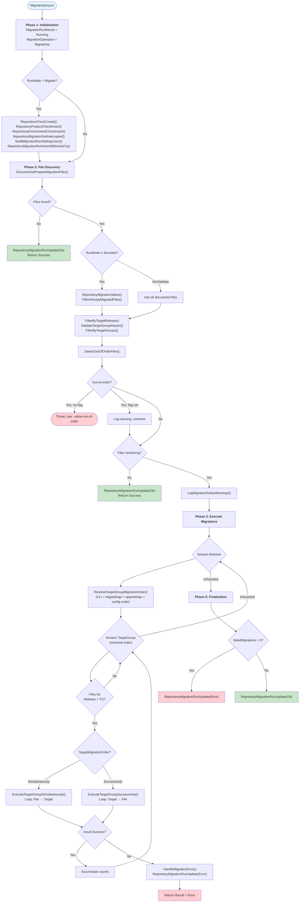
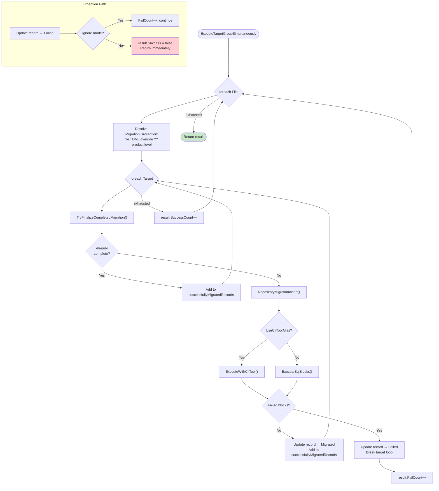
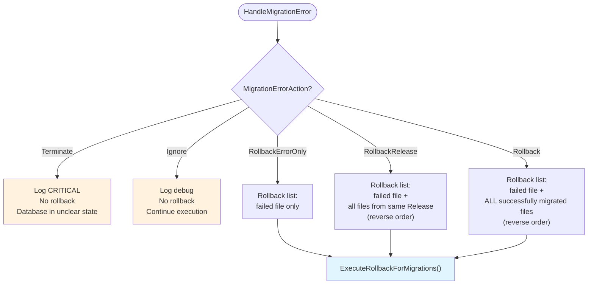
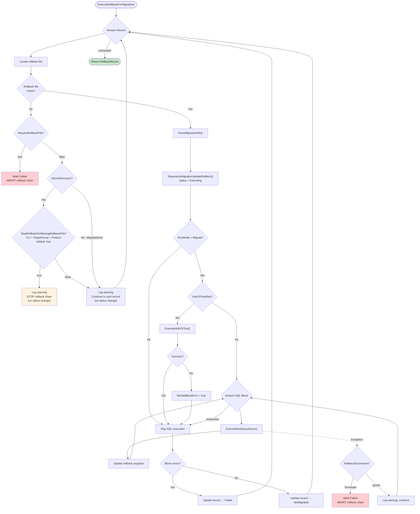
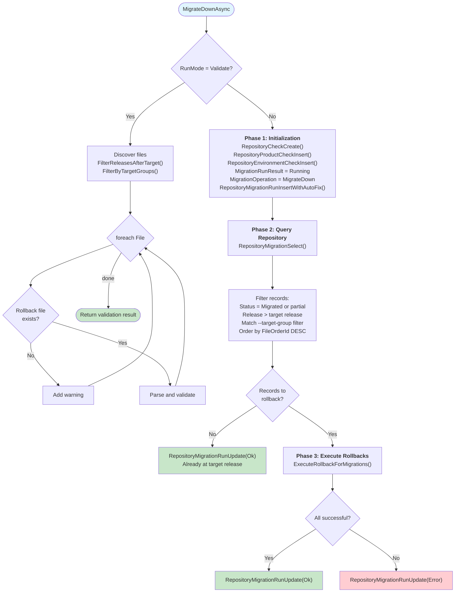
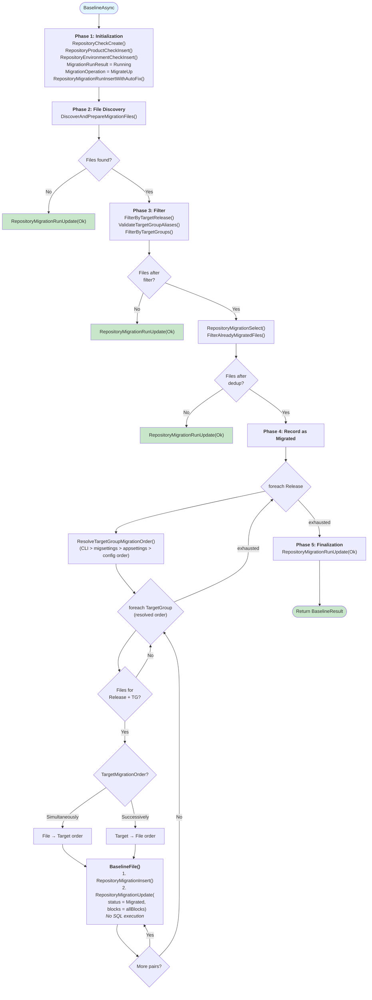

# Command Activity Diagrams

Activity diagrams for the main migration commands. All flows are implemented in `MigrationService.cs` within the Services project.

## Migrate-Up

### Main Flow

### TargetGroup Execution (Simultaneously Mode)

In Simultaneously mode, the outer loop is files, the inner loop is targets. Each file is applied to all targets before moving to the next file.

### Error Handling (HandleMigrationError)

When a TargetGroup execution fails (non-Ignore), this method determines the rollback scope based on the resolved `MigrationErrorAction`.

### Rollback Execution (ExecuteRollbackForMigrations)

Shared by both Migrate-Up (error recovery) and Migrate-Down (explicit rollback). Processes records in the provided order and is fail-fast by default.

---

## Migrate-Down

Migrate-Down rolls back all migrations after the target release. It reuses `ExecuteRollbackForMigrations` (see [above](#rollback-execution-executerollbackformigrations)).

**Key difference from Migrate-Up**: Migrate-Down operates on a flat list of repository records (ordered by FileOrderId descending), not the nested Release → TargetGroup → Target loop structure.

---

## Baseline

Baseline marks migration files as applied in the repository **without executing any SQL**. Uses the same Release → TargetGroup loop as Migrate-Up but skips all SQL execution.

**Note**: Baseline records `MigrationOperation = MigrateUp` in the repository, making baselined files indistinguishable from executed ones at the record level.

---

## Related Documentation

- [migration-service.md](migration-service.md) — Method signatures and phase descriptions
- [block-execution.md](block-execution.md) — SQL block parsing and execution details
- [file-discovery.md](file-discovery.md) — Migration file scanning and filtering
- [../02-core-concepts/error-handling.md](../02-core-concepts/error-handling.md) — MigrationErrorAction and RollbackErrorAction enums
- [../02-core-concepts/execution-modes.md](../02-core-concepts/execution-modes.md) — TargetMigrationOrder and RunMode details
