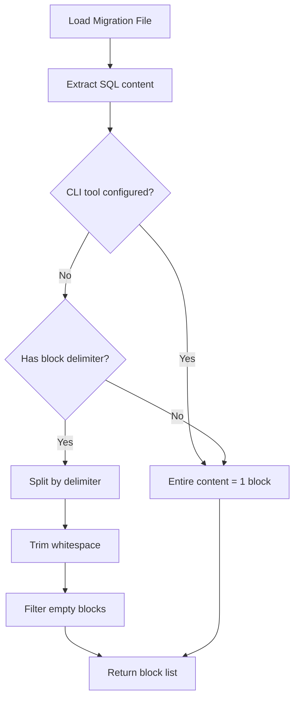
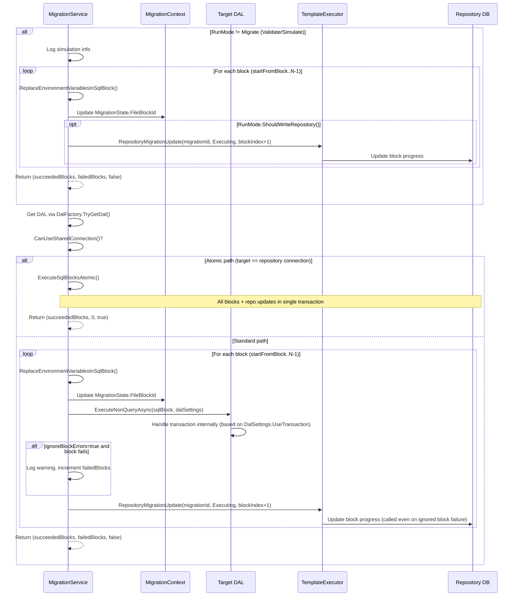

# Block Execution

RayMigrator supports executing SQL files that contain multiple blocks separated by database-specific delimiters.

## Block Separation

### SQL Server: GO

```sql
CREATE TABLE Users (
    Id INT PRIMARY KEY
);
GO

CREATE INDEX IX_Users ON Users(Id);
GO

INSERT INTO Users VALUES (1);
```

**Result**: 3 blocks

### PostgreSQL/MariaDB/MySQL/SQLite: Single Block

```sql
CREATE TABLE users (
    id INT PRIMARY KEY
);

CREATE INDEX ix_users ON users(id);

INSERT INTO users VALUES (1);
```

**Result**: 1 block (multiple statements)

These database types use `;` as their block delimiter, but the regex only matches `;` on its own line (`^\s*;\s*$`). A semicolon at the end of a statement (the typical SQL style) does not trigger a split. To split into separate blocks, place `;` on a dedicated line between statements.

## Block Parsing



### CLI Tool Skip

**Location**: `MigrationService.ShouldSkipBlockSplitting()` (internal static method)

When a CLI tool is configured for a migration file (via file-level `UseCliToolAlias` in TOML/migsettings, or when all targets in the file's target group have `UseCliToolAlias` set in appsettings), block splitting is skipped during file parsing. CLI tools execute the entire file as a single unit, so delimiter-based splitting is unnecessary. The SQL content is stored as a single block.

### Parsing Code

**Location**: `MigrationService.SplitSqlIntoBlocks()` (internal static method)

SQL blocks are represented as `List<string>` — there is no separate `SqlBlock` class.

```csharp
internal static List<string> SplitSqlIntoBlocks(string sqlContent, string blockDelimiter)
{
    if (string.IsNullOrWhiteSpace(blockDelimiter))
    {
        // No delimiter - treat entire content as one block
        return string.IsNullOrWhiteSpace(sqlContent)
            ? new List<string>()
            : new List<string> { sqlContent.Trim() };
    }

    // Split by delimiter on its own line (case-insensitive)
    var pattern = $@"^\s*{Regex.Escape(blockDelimiter)}\s*$";
    var blocks = Regex.Split(sqlContent, pattern,
            RegexOptions.Multiline | RegexOptions.IgnoreCase)
        .Select(b => b.Trim())
        .Where(b => !string.IsNullOrWhiteSpace(b))
        .ToList();

    // Fallback: if all blocks are empty after split, return original content
    return blocks.Count > 0
        ? blocks
        : (string.IsNullOrWhiteSpace(sqlContent)
            ? new List<string>()
            : new List<string> { sqlContent.Trim() });
}
```

Block count is exposed via `MigrationFileInfo.FileUpBlocksTotal` (computed: `=> SqlBlocks.Count`).

### Known Limitation

The regex-based splitting does not understand SQL syntax. A `GO` keyword appearing inside multi-line comments (`/* ... */`) or string literals will still be treated as a block delimiter. Avoid placing `GO` on its own line within comments or strings in SQL Server migration files.

## Execution Flow

> **Note**: Block-wise execution via `ExecuteSqlBlocks()` is used when the built-in DAL handles SQL execution. When a CLI tool is configured via `UseCliToolAlias`, the entire file is executed as a single unit by `ExecuteWithCliTool()` instead -- see [CLI Tool Execution](migration-service.md#cli-tool-execution).

**Location**: `MigrationService.ExecuteSqlBlocks()` (internal async method)



Transaction handling is delegated to the DAL layer via `DalSettings.UseTransaction` in the standard path. When the target and repository share the same connection string, `ExecuteSqlBlocksAtomic` is used instead — all blocks and repository updates execute in a single database transaction. Block iteration starts from `startFromBlock` (default 0), which is computed by `FindResumableBlock()` to support resuming partially-executed migrations. See [Atomic Shared Connection](migration-service.md#atomic-shared-connection-execution) for details.

## Block-Level Tracking

The repository tracks block-level progress:

| Column | Description |
|--------|-------------|
| `FileUpBlocksTotal` | Total blocks in migration file |
| `FileUpBlocksMigrated` | Blocks successfully executed |
| `FileUpBlocksHash` | Combined hash of all blocks |

### Example: Partial Failure

File with 5 blocks, block 3 fails:

```
Block 1: Executed ✓ (FileUpBlocksMigrated = 1)
Block 2: Executed ✓ (FileUpBlocksMigrated = 2)
Block 3: FAILED ✗
Block 4: Not executed
Block 5: Not executed

Final state:
- FileUpBlocksTotal = 5
- FileUpBlocksMigrated = 2
- MigrationStatus = Failed
```

## Transaction Handling

Transaction behavior is controlled by the `UseTransaction` TOML property (default: `true`) and passed to the DAL via `DalSettings`:

```csharp
internal async Task<(int succeededBlocks, int failedBlocks, bool atomicCommitCompleted)> ExecuteSqlBlocks(
    MigrationFileInfo file,
    TargetGroupOptions targetGroupOptions,
    TargetOptions targetOptions,
    int migrationId,
    MigrationRunMode runMode,
    bool ignoreBlockErrors = false,
    int startFromBlock = 0)
{
    int succeededBlocks = 0;
    int failedBlocks = 0;

    if (startFromBlock > 0)
    {
        _logger.LogInformation(
            "Skipping blocks 1-{SkippedCount}, resuming from block {ResumeBlock}/{Total} in {Filename} on target {Target}",
            startFromBlock, startFromBlock + 1, file.FileUpBlocksTotal, file.Filename, targetOptions.Alias);
    }

    if (!runMode.ShouldExecuteSql())
    {
        // Validate/Simulate mode: log blocks without executing SQL; repository block-progress updates only in Migrate mode
        for (int i = startFromBlock; i < file.SqlBlocks.Count; i++)
        {
            string sqlBlock = ReplaceEnvironmentVariablesInSqlBlock(
                file.SqlBlocks[i], file.Filename, i + 1, file.FileUpBlocksTotal);
            _ctxAccessor.Current.MigrationState.FileBlockId = i + 1;

            if (runMode.ShouldWriteRepository())
            {
                await Task.Run(() => _templateExecutor.RepositoryMigrationUpdate(
                    migrationId, MigrationStatus.Executing, i + 1));
            }
            succeededBlocks++;
        }
        return (succeededBlocks, failedBlocks, false);
    }

    // Get DAL for the target database.
    // TryGetDal throws ConfigurationValidationException for unknown database types (never returns false).
    if (!DalFactory.TryGetDal(targetGroupOptions.DatabaseType!, targetOptions.ConnectionString!, out var targetDal))
    {
        throw new TemplateExecutionException(
            $"Cannot create DAL for database type [{targetGroupOptions.DatabaseType}]");
    }

    var dalSettings = new DalSettings
    {
        UseTransaction = file.UseTransaction,
        DbCommandTimeoutInSeconds = targetOptions.DbCommandTimeoutInSeconds ?? 20,
        MaxRetries = targetOptions.DbCommandMaxRetries ?? 0,
        RetryDelayMs = targetOptions.DbCommandWaitTimeInMsBeforeRetry ?? 250
    };

    // When target and repository share the same connection string and database type,
    // delegate to ExecuteSqlBlocksAtomic for a single-transaction commit.
    bool useSharedConnection = CanUseSharedConnection(
        file, targetOptions, _ctxAccessor.Current.RayMigratorOptions.Repository!,
        targetGroupOptions.DatabaseType!, ignoreBlockErrors);

    if (useSharedConnection)
        return await ExecuteSqlBlocksAtomic(file, targetDal!, dalSettings, migrationId, runMode, startFromBlock);

    for (int blockIndex = startFromBlock; blockIndex < file.SqlBlocks.Count; blockIndex++)
    {
        string sqlBlock = ReplaceEnvironmentVariablesInSqlBlock(
            file.SqlBlocks[blockIndex], file.Filename, blockIndex + 1, file.FileUpBlocksTotal);
        _ctxAccessor.Current.MigrationState.FileBlockId = blockIndex + 1;

        if (ignoreBlockErrors)
        {
            try
            {
                await targetDal!.ExecuteNonQueryAsync(sqlBlock, dalSettings);
                succeededBlocks++;
            }
            catch (Exception blockEx)
            {
                failedBlocks++;
                _logger.LogWarning(blockEx,
                    "MigrationErrorAction=Ignore: Block {Block}/{Total} from {Filename} failed ...",
                    blockIndex + 1, file.FileUpBlocksTotal, file.Filename);
            }
        }
        else
        {
            await targetDal!.ExecuteNonQueryAsync(sqlBlock, dalSettings);
            succeededBlocks++;
        }

        // Update block progress in repository
        await Task.Run(() => _templateExecutor.RepositoryMigrationUpdate(
            migrationId, MigrationStatus.Executing, blockIndex + 1));
    }

    return (succeededBlocks, failedBlocks, false);
}
```

The method returns a `(int succeededBlocks, int failedBlocks, bool atomicCommitCompleted)` tuple. The `atomicCommitCompleted` flag is `true` only when the atomic shared connection path ran (see [Atomic Shared Connection](migration-service.md#atomic-shared-connection-execution)); callers use this flag to skip a redundant final `RepositoryMigrationUpdate(Migrated)` call. When `ignoreBlockErrors` is `true` (used with `MigrationErrorAction.Ignore`), failed blocks are logged and skipped instead of throwing. In non-Migrate run modes (e.g., Simulate), blocks are iterated and logged but not executed against the database. The DAL implementation handles transaction creation/commit/rollback internally based on `DalSettings.UseTransaction`. The service layer does not manage connections or transactions directly in the non-atomic path.

## Block Hash Generation

Hashes are computed during file parsing (not validation) in `MigrationService.ParseMigrationFile()`. For hash validation, see [Hash Validation](../02-core-concepts/hash-validation.md).

```csharp
// SHA256 of entire file content (TOML + SQL)
string fileUpHash = fileContent.GenerateSha256();

// SHA256 of TOML configuration section only
string? fileUpConfigHash = tomlContent?.GenerateSha256();

// SHA256 of SQL content (after TOML extraction, before block splitting)
string fileUpBlocksHash = sqlContent.GenerateSha256();
```

The `GenerateSha256()` extension method is defined in `StringExtensions.cs`. Note that the blocks hash covers the entire SQL content as a single string, not individual block hashes combined.

## Resume After Failure

**Location**: `MigrationService.FindResumableBlock()` (internal method)

RayMigrator automatically resumes partially-executed migrations. When a migration run starts, each file+target combination is checked for a resumable partial execution via `FindResumableBlock()`.

### Resume Conditions

All four conditions must be met for a resume to occur:

1. A **Failed** or **Executing** record exists in the repository for the same file, release, target group, and target
2. Some blocks were migrated but not all (`FileUpBlocksMigrated > 0` and `< FileUpBlocksTotal`)
3. No rollback was attempted (`FileDownHash` is null)
4. The file's SQL blocks hash has not changed since the partial execution (`FileUpBlocksHash` match)

If the hash has changed (i.e., the migration file was modified), the file is re-executed from block 1 with a warning logged.

### Resume Flow

```csharp
internal int FindResumableBlock(
    MigrationFileInfo file,
    string targetAlias,
    List<MigrationRecord> existingRecords)
{
    var partialRecord = existingRecords
        .Where(r => r.Filename == file.Filename
            && r.ReleaseVersion == file.ReleaseVersion
            && r.TargetGroupAlias == file.TargetGroupAlias
            && r.TargetAlias == targetAlias
            && r.MigrationStatusId is MigrationStatus.Failed or MigrationStatus.Executing
            && r.FileUpBlocksMigrated > 0
            && r.FileUpBlocksMigrated < r.FileUpBlocksTotal
            && r.FileDownHash == null)
        .OrderByDescending(r => r.Id)
        .FirstOrDefault();

    if (partialRecord == null)
        return 0;

    if (partialRecord.FileUpBlocksHash != file.FileUpBlocksHash)
    {
        _logger.LogWarning("File {Filename} has changed since last partial execution ...", file.Filename);
        return 0;
    }

    return partialRecord.FileUpBlocksMigrated; // 0-based: skip first N blocks
}
```

The returned value is passed as `startFromBlock` to `ExecuteSqlBlocks()`, which skips already-completed blocks and resumes from the next one.

### Interrupted Migration Detection

At the start of each `MigrateUpAsync` call (when `RunMode.ShouldWriteRepository()` is true, i.e., Migrate mode only), `TemplateExecutor.RepositoryMigrationGetInterrupted()` checks for migrations with status **Pending (10)** or **Executing (20)** that have incomplete blocks (`FileUpBlocksMigrated < FileUpBlocksTotal`). These indicate a migration where execution was interrupted before all blocks were completed (e.g., a process crash or unexpected termination). If found, a warning is logged with the migration ID, filename, and block progress.

### Repository Tracking

When a migration has partially executed blocks, the repository stores the progress:

1. `FileUpBlocksMigrated` records how many blocks completed successfully
2. `MigrationStatus = Failed` or `Executing` marks the migration as partially applied
3. On the next run, `FindResumableBlock()` determines the resume point

## Best Practices

### SQL Server

Use `GO` to separate:
- Objects that must exist before being referenced
- `CREATE PROCEDURE` statements
- Statements that can't be in same batch

```sql
CREATE TABLE Orders (
    Id INT PRIMARY KEY
);
GO

-- Function references table, so GO is needed
CREATE FUNCTION GetOrderCount()
RETURNS INT AS
BEGIN
    RETURN (SELECT COUNT(*) FROM Orders);
END
GO
```

### PostgreSQL/MariaDB/MySQL/SQLite

Use semicolons within single block:

```sql
CREATE TABLE orders (
    id INT PRIMARY KEY
);

CREATE INDEX ix_orders ON orders(id);

-- All executed as one block (semicolons at end of line do not split)
```

### Large Data Migrations

Consider disabling transactions:

```sql
/*
[RayMigrator]
UseTransaction = false
Description = "Large data migration"
*/

-- Block 1: Insert batch 1
INSERT INTO Archive SELECT * FROM Data WHERE Id < 1000000;
GO

-- Block 2: Insert batch 2
INSERT INTO Archive SELECT * FROM Data WHERE Id >= 1000000;
GO
```

## Related Documentation

- [File Discovery](file-discovery.md) - How files are found
- [SQL Dialects](../03-database-layer/sql-dialects.md) - Delimiter differences
- [Error Handling](../02-core-concepts/error-handling.md) - Failure scenarios
- [Hash Validation](../02-core-concepts/hash-validation.md) - Block hashing
