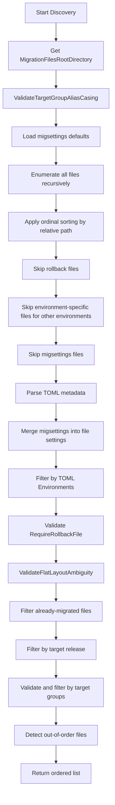

# File Discovery

RayMigrator discovers migration files by scanning the configured directory structure.

## Discovery Process



## Directory Structure

```
{MigrationFilesRootDirectory}/
├── migsettings.txt                     # Product-level settings
├── migsettings.{Environment}.txt       # Environment overrides
├── {ReleaseVersion}/                   # e.g., "Release 1.0"
│   ├── migsettings.txt                 # Release-level settings
│   ├── migsettings.{Env}.txt           # Release-level environment overrides
│   ├── {TargetGroupAlias}/             # e.g., "Backend"
│   │   ├── migsettings.txt             # Target group settings
│   │   ├── migsettings.{Env}.txt       # Environment overrides
│   │   ├── ###_Description.sql         # Migration file
│   │   ├── ###_Description.rollback.sql
│   │   └── ###_Description.{Env}.sql   # Environment-specific
│   └── {AnotherTargetGroup}/
│       └── ...
└── {AnotherRelease}/
    └── ...
```

## File Matching

### Migration Files

All files matching `*.{Extension}` are enumerated recursively from `MigrationFilesRootDirectory`. The release version and target group alias are then extracted from the relative path segments. The first segment is always the release version. The second segment is matched against the configured `TargetGroups` aliases; if it matches, the traditional layout is used. If it does not match and the product has exactly one target group, the flat layout is assumed and the single target group alias is assigned automatically. See [Directory Structure](../07-migration-files/directory-structure.md) for layout details.

**Default extension**: `.sql` (configurable via `MigrationFilesExtension`)

### Rollback Files

Pattern: `{BaseName}.{RollbackPreExtension}.{Extension}`

Example: `001_CreateTable.rollback.sql` for `001_CreateTable.sql`

The rollback pre-extension defaults to `rollback` and is configurable via `MigrationRollbackFilesPreExtension`.

### Environment-Specific Files

Pattern: `{BaseName}.{Environment}.{Extension}`

Example: `001_CreateTable.Production.sql`

Detection: a file is environment-specific when the filename (without the file extension) contains a dot. The text after the last dot is treated as the environment name (case-insensitive comparison).

## Sorting

Files are sorted by their relative path using ordinal case-insensitive comparison:

```csharp
var allFiles = Directory.EnumerateFiles(rootDirectory, $"*.{fileExtension}", SearchOption.AllDirectories)
    .Select(f => new FileInfo(f))
    .OrderBy(f => Path.GetRelativePath(rootDirectory, f.FullName), StringComparer.OrdinalIgnoreCase)
    .ToList();
```

This means files sort strictly by character code, not by locale-specific rules. Use zero-padded numeric prefixes (`001_`, `002_`, `010_`) for predictable ordering.

## Filtering

### By Environment

Filtering happens in two stages:

**1. Filename-based filtering** (before TOML parsing): Files with an environment suffix in the filename are only used for that environment:

| File | Development | Production |
|------|-------------|------------|
| `001_Create.sql` | Yes | Yes |
| `001_Create.Development.sql` | Yes | No |
| `001_Create.Production.sql` | No | Yes |

**2. TOML `Environments` filtering** (after TOML parsing): If a file's TOML metadata specifies `Environments` and the list is non-empty, does not contain `"*"`, and does not contain the current environment (case-insensitive), the file is excluded.

### By Target

TOML metadata filters files to specific targets:

```sql
/*
[RayMigrator]
Targets = ["Backend1", "Backend2"]
*/
```

| Value | Meaning |
|-------|---------|
| `["*"]` | All targets (default) |
| `["Backend1"]` | Only Backend1 |
| `["Backend1", "Backend2"]` | Both targets |

### RequireRollbackFile Validation

After all files are parsed and migsettings are merged, `DiscoverAndPrepareMigrationFiles` validates that every file with `RequireRollbackFile = true` has a corresponding rollback file on disk. If any rollback files are missing, the discovery aborts with a `MigrationFileParsingException` listing all missing files.

The effective `RequireRollbackFile` value is resolved through the configuration hierarchy: TOML (highest) -> migsettings -> `ProductOptions.RequireRollbackFile` -> default (`true`).

### Directory Layout Validation

Two additional validations run inside `DiscoverAndPrepareMigrationFiles` before the method returns:

**TargetGroup alias casing** (`ValidateTargetGroupAliasCasing`): Before any file is parsed, every subdirectory inside a release directory is compared against the configured TargetGroup aliases. If a directory name matches an alias case-insensitively but differs in case (e.g., directory is `backend`, alias is `Backend`), a `ConfigurationValidationException` is thrown with a message asking you to rename the directory. Matching is ordinal.

**Flat layout ambiguity** (`ValidateFlatLayoutAmbiguity`): For products with exactly one TargetGroup, each release directory is checked for mixed layout usage. If migration files are found both directly in the release directory (flat layout) and inside the TargetGroup subdirectory (traditional layout) within the same release, a `ConfigurationValidationException` is thrown. Use one layout consistently per release. This validation only runs when the product has exactly one TargetGroup.

### Already-Migrated Files

`FilterAlreadyMigratedFiles` compares discovered files against existing `MigrationRecord` entries from the repository. A file is considered already migrated when a record with matching `Filename`, `ReleaseVersion`, `TargetGroupAlias`, and `MigrationStatusId = Migrated` exists.

- **RunAlways files**: Always included regardless of existing records.
- **Hash-changed files**: If an already-migrated file's `FileUpHash` no longer matches the repository record, it is re-included with a warning.
- **Validate mode**: When the run mode does not read the repository (`Validate`), all discovered files are included. `Simulate` and `Migrate` modes read the repository and filter accordingly.

### By Release

`--to-release` parameter limits migration scope. Files from releases up to and including the target are included (ordinal case-insensitive comparison):

```bash
# Only migrate up to Release 1.0
raymigrator migrate-up -p X -env Y --to-release "Release 1.0"
```

### By Target Groups

`--target-group` parameter limits migration to specific target groups. If null or empty, all target groups are included. Matching is case-insensitive. Before filtering, `ValidateTargetGroupAliases` checks that all specified aliases exist in the product configuration and throws `InvalidOperationException` on the first non-matching alias.

```bash
# Only migrate the Backend target group
raymigrator migrate-up -p X -env Y --target-group Backend
```

### Out-of-Order Detection

After filtering, `DetectOutOfOrderFiles` identifies pending files from releases older than the highest already-migrated release (determined from existing `Migrated` records, using ordinal case-insensitive comparison). If out-of-order files are found and `--allow-out-of-order` is not specified, the migration aborts with an `InvalidOperationException`. When `--allow-out-of-order` is specified, out-of-order files are executed with a warning.

## Discovery Result

Each discovered file becomes a `MigrationFileInfo` object:

```csharp
public class MigrationFileInfo
{
    public string Filename { get; set; } = string.Empty;
    public string FilenameWithRelativePath { get; set; } = string.Empty;
    public string FullPath { get; set; } = string.Empty;
    public string ReleaseVersion { get; set; } = string.Empty;
    public string TargetGroupAlias { get; set; } = string.Empty;
    public int FileOrderId { get; set; }

    // Hashes
    public string FileUpHash { get; set; } = string.Empty;
    public string? FileUpConfigHash { get; set; }
    public string FileUpBlocksHash { get; set; } = string.Empty;

    // SQL blocks
    public List<string> SqlBlocks { get; set; } = new();
    public int FileUpBlocksTotal => SqlBlocks.Count;  // Computed

    // Raw TOML
    public string? TomlConfigRaw { get; set; }
    public string? FileUpConfigJson { get; set; }

    // Rollback file
    public bool MigrateDownFileExists { get; set; }
    public string? RollbackFilePath { get; set; }

    // TOML settings (flat properties, no nested settings object)
    public bool UseTransaction { get; set; } = true;
    public bool UseTransactionExplicitlySet { get; set; }
    public string Description { get; set; } = string.Empty;
    public List<string>? Environments { get; set; }
    public List<string>? Targets { get; set; }
    public bool RunAlways { get; set; }
    public bool RequireRollbackFile { get; set; } = true;
    public MigrationErrorAction? MigrationErrorActionOverride { get; set; }
    public RollbackErrorAction? RollbackErrorActionOverride { get; set; }
    public string? UseCliToolAlias { get; set; }
}
```

## TOML Parsing

Migration metadata is extracted from SQL comments. `ExtractTomlAndSql()` uses the regex pattern `/\*\s*\n?\s*\[RayMigrator\](.*?)\*/` (singleline mode) to locate the TOML block at the start of the file. The content inside the `[RayMigrator]` section is then parsed by `ParseTomlConfig()` into flat properties on `MigrationFileInfo`:

```sql
/*
[RayMigrator]
Description = "Create users table"
Environments = ["Development", "Production"]
Targets = ["*"]
UseTransaction = true
RunAlways = false
RequireRollbackFile = true
StopRollbackOnMissingRollbackFile = true
MigrationErrorAction = "Terminate"
RollbackErrorAction = "Terminate"
UseCliToolAlias = "sqlcmd-tool"
*/
```

| Property | Type | Default |
|----------|------|---------|
| `UseTransaction` | bool | `true` |
| `Description` | string | `""` |
| `Environments` | List\<string\>? | `null` (means all) |
| `Targets` | List\<string\>? | `null` (means all) |
| `RunAlways` | bool | `false` |
| `RequireRollbackFile` | bool? | `null` (resolved via configuration hierarchy) |
| `StopRollbackOnMissingRollbackFile` | bool? | `null` (resolved via configuration hierarchy; effective default is `true`); parsed in TOML/migsettings but **not stored in `MigrationFileInfo`** — effective value is resolved at rollback time from CLI > TargetGroup > Product config |
| `MigrationErrorAction` | MigrationErrorAction? | `null` (inherits from product config) |
| `RollbackErrorAction` | RollbackErrorAction? | `null` (inherits from product config) |
| `UseCliToolAlias` | string? | `null` (inherits from target/product config or uses DAL) |
| `TargetGroupMigrationOrder` | List\<string\>? | `null` (use config array order); parsed in file TOML but only effective in migsettings |

Unknown TOML keys cause a `MigrationFileParsingException`. Enum values are case-insensitive but `Undefined` (value 0) is rejected explicitly.

## Settings Inheritance

Settings are resolved through a hierarchy of `migsettings.txt` files and migration file TOML. `LoadMigSettingsDefaults()` scans the directory tree recursively for files matching `migsettings*.txt`, keeping only `migsettings.txt` and `migsettings.{Environment}.txt`. Within each directory, the base `migsettings.txt` is merged with the environment-specific variant (environment overrides base). `ResolveMigSettingsForFile()` then walks from the file's directory up to the root, collecting entries and merging them so that more specific directories override less specific ones.

Properties set in TOML take highest priority; unset properties inherit from the closest ancestor migsettings file. The migsettings files use `[RayMigrator]` section header directly (without `/* */` comment wrapper).

Inheritable properties (file-level): `UseTransaction`, `RunAlways`, `RequireRollbackFile`, `StopRollbackOnMissingRollbackFile`, `Environments`, `Targets`, `MigrationErrorAction`, `RollbackErrorAction`, `UseCliToolAlias`.

`TargetGroupMigrationOrder` is also a recognized key in migsettings files. When set in a release-level `migsettings.txt`, it overrides the TargetGroup execution order for that release (applies to `MigrateUp` and `baseline` only). It is not applied per-file and is not stored in `MigrationFileInfo`; see [TargetGroupMigrationOrder](migration-service.md#targetgroupmigrationorder) for the full resolution chain.

Hierarchy (lowest to highest priority):

```
migsettings.txt (product root)
└── migsettings.{Env}.txt (product root / env)
    └── Release/migsettings.txt (release)
        └── Release/migsettings.{Env}.txt (release / env)
            └── Release/TargetGroup/migsettings.txt (target group)
                └── Release/TargetGroup/migsettings.{Env}.txt (target group / env)
                    └── File TOML (highest priority)
```

## Pending Migration Detection

A migration file is included for execution if all of the following conditions are met:

1. File exists in the filesystem with the configured extension
2. Not a rollback file, not a migsettings file, not an environment-specific file for a different environment
3. Passes TOML `Environments` filter for the current environment
4. Passes `RequireRollbackFile` validation (rollback file exists when required)
5. Not recorded in repository as `Migrated` for the same `Filename` + `ReleaseVersion` + `TargetGroupAlias` combination -- unless `RunAlways = true` or the file hash has changed
6. Within the `--to-release` scope (if specified)
7. Within the `--target-group` scope (if specified)

Pending detection is handled inside `MigrationService.MigrateUpAsync()` by comparing discovered `MigrationFileInfo` records against existing `MigrationRecord` entries from the repository.

> **Note**: The TOML `Targets` parameter is parsed and stored in the repository as metadata, but is **not** used for runtime target filtering. All targets within a target group receive all migration files for that group. See [TOML Metadata](../07-migration-files/toml-metadata.md) for details.

## Example Discovery

### Input Structure

```
MigrationFiles/MyProduct/
├── migsettings.txt
├── Release 1.0/
│   └── Backend/
│       ├── 001_CreateTable.sql
│       ├── 001_CreateTable.rollback.sql
│       ├── 002_InsertData.sql
│       └── 002_InsertData.Production.sql
└── Release 1.1/
    └── Backend/
        └── 001_UpdateSchema.sql
```

### Discovery for Environment=Development, TargetGroup=Backend

```
1. Release 1.0/Backend/001_CreateTable.sql
   - ReleaseVersion: "Release 1.0"
   - TargetGroupAlias: "Backend"
   - FileOrderId: 1
   - MigrateDownFileExists: true

2. Release 1.0/Backend/002_InsertData.sql
   - ReleaseVersion: "Release 1.0"
   - TargetGroupAlias: "Backend"
   - FileOrderId: 2
   - MigrateDownFileExists: false

3. Release 1.1/Backend/001_UpdateSchema.sql
   - ReleaseVersion: "Release 1.1"
   - TargetGroupAlias: "Backend"
   - FileOrderId: 3
   - MigrateDownFileExists: false
```

**Note**: `002_InsertData.Production.sql` excluded (wrong environment)

## Related Documentation

- [Directory Structure](../07-migration-files/directory-structure.md)
- [TOML Metadata](../07-migration-files/toml-metadata.md)
- [Block Execution](block-execution.md)
- [Configuration System](../02-core-concepts/configuration-system.md)
