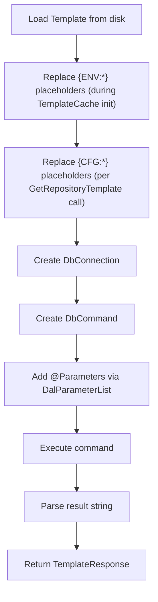

# Template Executor

The `TemplateExecutor` loads and executes SQL templates with placeholder substitution.

## Overview

**Location**: `Raycoon.RayMigrator.Infrastructure/TemplateExecutor.cs`

> **Note**: The file lives in the Infrastructure project but uses the `Raycoon.RayMigrator.Core` namespace.

The TemplateExecutor handles:
- Loading SQL templates from disk
- Replacing `{CFG:*}` and `{ENV:*}` placeholders
- Building parameterized SQL commands
- Executing and parsing results

## Dependencies

```csharp
public class TemplateExecutor
{
    private readonly TemplateCache _templateCache;
    private readonly ILogger<TemplateExecutor> _logger;
    private readonly IMigrationContextAccessor _ctxAccessor;
    private RepositoryOptions? _repositoryBacking;
    private IDal? _repositoryDalBacking;

    /// Lazily-initialized repository options. Defers context access to support API endpoints
    /// where MigrationContext is set after DI resolution.
    private RepositoryOptions _repository
    {
        get
        {
            if (_repositoryBacking == null) InitializeFromContext();
            return _repositoryBacking!;
        }
    }

    private IDal _repositoryDal
    {
        get
        {
            if (_repositoryBacking == null) InitializeFromContext();
            return _repositoryDalBacking!;
        }
    }

    public TemplateExecutor(
        TemplateCache templateCache,
        ILogger<TemplateExecutor> logger,
        IMigrationContextAccessor ctxAccessor)
    {
        _templateCache = templateCache;
        _logger = logger;
        _ctxAccessor = ctxAccessor;
        // Context access is deferred to first use (not constructor time)
        // to support API endpoints where MigrationContext is set after DI resolution.
    }

    private void InitializeFromContext()
    {
        _repositoryBacking = _ctxAccessor.Current.RayMigratorOptions.Repository!;
        if (DalFactory.TryGetDal(_repositoryBacking.DatabaseType!, _repositoryBacking.ConnectionString!, out var dal))
            _repositoryDalBacking = dal!;
    }
}
```

## Key Methods

All methods are **synchronous** (they internally call async DAL methods with `.GetAwaiter().GetResult()`).

### Repository Setup

```csharp
public void RepositoryCheckCreate();
public void RepositoryProductCheckInsert();
public void RepositoryEnvironmentCheckInsert();
```

- `RepositoryCheckCreate` passes `@RepositoryDatabaseType` and `@RayMigratorVersion`, stores the returned `ResultCode` as `MigrationState.MigratorMetaId` (EventId `100`).
- `RepositoryProductCheckInsert` passes `@Name` (the product alias from `RayMigratorConsoleOptions.Product`) and `@NameLower` (the lowercase invariant of that name), stores the returned `ResultCode` as `MigrationState.ProductId` (EventId `120`).
- `RepositoryEnvironmentCheckInsert` passes `@Name` (the environment name from `RayMigratorConsoleOptions.Environment`) and `@NameLower` (the lowercase invariant of that name), stores the returned `ResultCode` as `MigrationState.EnvironmentId` (EventId `121`).

### Migration Run Operations

```csharp
public void RepositoryMigrationRunInsert(string migrationRunSettingsJson);
public void RepositoryMigrationRunUpdate(MigrationRunResult runResult);
public List<Dictionary<string, object?>> RepositoryMigrationRunSelectOrphaned(int productId, int environmentId);
public void RepositoryMigrationRunFixOrphaned(int migrationRunId);
public List<Dictionary<string, object?>> RepositoryMigrationRunSelect(int limit);
```

### Fix Operations

```csharp
public int RepositoryMigrationRecordFixOrphaned(int migrationRunId, MigrationStatus status);
```

### Migration Record Operations

```csharp
public int RepositoryMigrationInsert(int existingMigrationRecordId, string filename,
    string releaseVersion, string targetGroupAlias, string targetAlias,
    int fileOrderId, string fileUpHash, string? fileUpConfigHash,
    string fileUpBlocksHash, int fileUpBlocksTotal, string? fileUpConfigJson,
    bool migrateDownFileExists);

// Standard overload (uses the internally-managed repository connection)
public void RepositoryMigrationUpdate(int migrationRecordId,
    MigrationStatus migrationStatus, int fileUpBlocksMigrated);

// Atomic overload (uses caller-provided shared connection+transaction)
public void RepositoryMigrationUpdate(int migrationRecordId,
    MigrationStatus migrationStatus, int fileUpBlocksMigrated,
    DbConnection connection, DbTransaction transaction,
    int repoCommandTimeoutInSeconds);

// Standard overload (uses the internally-managed repository connection)
public void RepositoryMigrationUpdateRollback(int migrationRecordId,
    MigrationStatus migrationStatus, string fileDownHash, string? fileDownConfigHash,
    string fileDownBlocksHash, int fileDownBlocksMigrated, int fileDownBlocksTotal, string? fileDownConfigJson);

// Atomic overload (uses caller-provided shared connection+transaction)
public void RepositoryMigrationUpdateRollback(int migrationRecordId,
    MigrationStatus migrationStatus, string fileDownHash, string? fileDownConfigHash,
    string fileDownBlocksHash, int fileDownBlocksMigrated, int fileDownBlocksTotal, string? fileDownConfigJson,
    DbConnection connection, DbTransaction transaction,
    int repoCommandTimeoutInSeconds);

public void RepositoryMigrationUpdateHash(int migrationRecordId, string fileUpHash,
    string? fileUpConfigHash, string fileUpBlocksHash);
public List<MigrationRecord> RepositoryMigrationSelect(MigrationRunMode? overrideRunMode = null);
public InterruptedMigrationInfo? RepositoryMigrationGetInterrupted();
```

The atomic overloads of `RepositoryMigrationUpdate` and `RepositoryMigrationUpdateRollback` accept a `DbConnection`, `DbTransaction`, and `repoCommandTimeoutInSeconds`. They execute the repository update on the caller-supplied connection within the caller's active transaction. This is used exclusively by `ExecuteSqlBlocksAtomic` and `ExecuteRollbackBlocksAtomic` in `MigrationService` to guarantee that SQL blocks and repository status writes either all commit or all roll back together. See [Atomic Shared Connection](migration-service.md#atomic-shared-connection-execution) for the full pattern.

The `overrideRunMode` parameter on `RepositoryMigrationSelect` allows the caller to override the `MigrationRunModeId` query parameter independently of the current `MigrationContext`. This is used by Simulate mode to query records written by Migrate mode (since Simulate mode no longer writes its own records).

### Core Execution

```csharp
// Standard overload — creates its own connection using DalSettings
public TemplateResponse ExecuteScalarWithNegativeResultCodeException(
    Template template, IDal dal, DalSettings dalSettings,
    DalParameterList? dalParameterList, ILogger? logger = null, EventId? eventId = null);

// Atomic overload — executes on caller-provided connection+transaction
public TemplateResponse ExecuteScalarWithNegativeResultCodeException(
    Template template, IDal dal, DbConnection connection, DbTransaction transaction,
    int commandTimeoutInSeconds, DalParameterList? dalParameterList,
    ILogger? logger = null, EventId? eventId = null);
```

The atomic overload is used internally by the shared-connection atomic methods (`RepositoryMigrationUpdate` and `RepositoryMigrationUpdateRollback` with connection/transaction parameters) to execute the repository update within the caller's active transaction.

## TemplateResponse

```csharp
public class TemplateResponse
{
    public int ResultCode { get; set; }
    public string? ResultMessage { get; set; }

    public override string ToString()
    {
        return $"ResultCode: {ResultCode}, ResultMessage: {(string.IsNullOrWhiteSpace(ResultMessage) ? "{NullOrEmpty}" : ResultMessage)}";
    }
}
```

## Execution Flow



## Placeholder Resolution

Placeholder resolution happens in two stages: during `TemplateCache` initialization and during method execution.

### Configuration Placeholders (`{CFG:*}`)

Resolved by `TemplateCache.GetRepositoryTemplate()` using reflection-based property matching:

```csharp
// TemplateCache returns a Template with {CFG:*} already replaced
var template = _templateCache.GetRepositoryTemplate(templateType, _repository);
// e.g., {CFG:SchemaName} → "migrations", {CFG:TableBaseName} → "RayMigrator_"
```

The `GetRepositoryTemplate<T>()` method calls `ReplacePlaceholdersFromPropertyClass()` which uses regex to find `{CFG:PropertyName}` patterns and replaces them with matching property values from the passed options object (e.g., `RepositoryOptions`). After replacement, `GetRepositoryTemplate<T>()` and `GetTemplate<T>()` validate that no `{CFG:*}` placeholders remain — if any are found, a `ConfigurationValidationException` is thrown.

### Environment Placeholders (`{ENV:*}`)

Resolved during `TemplateCache` initialization via `EnvironmentVariableReplacer`:

```csharp
// During TemplateCache.Initialize():
EnvironmentVariableReplacer.TryReplaceStringContainingEnvironmentVariableReferences(
    content, out var replacedContent, out var variableReplacements);
```

All `{ENV:*}` placeholders in templates are replaced when the cache loads — before any template is used by `TemplateExecutor`.

### SQL Parameters (`@ParameterName`)

Passed via `DalParameterList` objects to the DAL:

```csharp
DalParameterList dalParameterList = new DalParameterList();
dalParameterList.AddParameter(new DalParameter("ProductId", _ctxAccessor.Current.MigrationState.ProductId, typeof(int)));
dalParameterList.AddParameter(new DalParameter("EnvironmentId", _ctxAccessor.Current.MigrationState.EnvironmentId, typeof(int)));

// DAL handles parameter binding internally
var response = ExecuteScalarWithNegativeResultCodeException(template, _repositoryDal, dalSettings, dalParameterList);
```

## Usage Example

### Executing a Template

```csharp
public void RepositoryCheckCreate()
{
    var templateType = TemplateType.Repository_CheckCreate;
    var eventId = MigrationEvent.TemplateExecutionRepositoryCheckCreate;

    // Build parameter list
    DalParameterList dalParameterList = new DalParameterList();
    dalParameterList.AddParameter(new DalParameter("RepositoryDatabaseType", _repositoryDal.DatabaseType, typeof(string)));
    dalParameterList.AddParameter(new DalParameter("RayMigratorVersion", _ctxAccessor.Current.RayMigratorVersion, typeof(string)));

    // Load template from cache (CFG placeholders replaced during load)
    var template = _templateCache.GetRepositoryTemplate(templateType, _repository);

    // Execute via DAL (synchronous wrapper around async)
    var templateResponse = ExecuteScalarWithNegativeResultCodeException(
        template, _repositoryDal, _repository.GetDalSettings(),
        dalParameterList, _logger, eventId);

    // ResultCode is used as the output value (e.g., MigratorMetaId)
    _ctxAccessor.Current.MigrationState.MigratorMetaId = templateResponse.ResultCode;
}
```

### Parsing Results

Templates return a comma-separated string: `"ResultCode,ResultMessage"`. The `GetValidatedTemplateResponseFromExecuteScalar()` method (internal static) parses this into a `TemplateResponse` with `ResultCode` (int) and `ResultMessage` (string). The method splits on the first comma only (using `IndexOf(',')`) so that the message part can itself contain commas. If the result is null or empty, a `TemplateResultException` is thrown. A negative `ResultCode` throws either a `TemplateResultException` (if the code is registered in `TemplateResultCode.IsKnown()`) or an `UndefinedTemplateResultException` (for unrecognized negative codes from custom templates). A non-negative `ResultCode` indicates success and is often used as an output ID value.

Additionally, `RepositoryMigrationRunInsert` catches `TemplateResultException` with `ResultCode == -2` specifically and wraps it in a `MigrationAlreadyRunningException` to signal parallel run prevention.

## Template Cache

**Location**: `Raycoon.RayMigrator.Infrastructure/TemplateCache.cs`

> **Note**: The file lives in the Infrastructure project but uses the `Raycoon.RayMigrator.Core.Templates` namespace.

The `TemplateCache` is eagerly initialized at construction time (not lazy-loaded). It loads all SQL templates from the `DataAccessLayers/{Type}/` filesystem directories, replaces `{ENV:*}` placeholders, and validates that all required templates exist for each configured database type.

**Constructor**:

```csharp
public TemplateCache(
    IOptions<RayMigratorOptions>? options,
    bool revealSensitiveData,
    ILogger<TemplateCache> logger,
    bool validateConfiguration = true)
```

- `options` is nullable. When null (or when `validateConfiguration` is false), configuration validation is deferred. This supports ManagedLocal mode where Products/Repository config is not yet known at startup.
- When `validateConfiguration` is true and `options` is non-null, the constructor calls `ValidateConfigurationAgainstTemplateCache(options)` to ensure all configured `DatabaseType` values have matching DAL templates.

**Key public methods**:

- `ValidateConfigurationAgainstTemplateCache(RayMigratorOptions options)` -- Validates that the Repository and all TargetGroup `DatabaseType` values have matching templates in the cache. Can be called on-demand when configuration becomes available (e.g., loaded from Admin-DB).
- `GetAvailableDatabaseTypes()` -- Returns the list of all discovered DAL database type names (loaded from `DataAccessLayers/` subdirectories).
- `GetRepositoryTemplate<T>(TemplateType, T) where T : RepositoryOptions` -- Returns a template with `{CFG:*}` placeholders replaced using the passed `RepositoryOptions` property class. The database type is inferred from `T.DatabaseType`. Throws `ConfigurationValidationException` if unreplaced `{CFG:*}` placeholders remain.
- `GetTemplate<T>(string databaseType, TemplateType, T)` -- Same as above but for non-repository templates, requiring an explicit `databaseType` parameter.
- `GetTemplateContent<T>(string databaseType, TemplateType, T)` -- Returns only the replaced content string (not a `Template` object). Unlike `GetTemplate` and `GetRepositoryTemplate`, this method does not validate that all `{CFG:*}` placeholders were replaced.

For details on template file format, directory layout, and the full list of template types, see [Template System](../03-database-layer/template-system.md).

## Error Handling

All template methods are synchronous (they internally call async DAL methods with `.GetAwaiter().GetResult()`) and propagate exceptions to the caller. There are three exception categories:

1. **`TemplateExecutionException`** -- Wraps any exception thrown by the DAL during `ExecuteScalarAsync` or `ExecuteReaderAsync` calls. Indicates a connection, timeout, or SQL syntax error at the database level.

2. **`TemplateResultException`** -- Thrown when the template returns a negative `ResultCode` that is registered in `TemplateResultCode.IsKnown()`. Includes the `ResultCode` property for programmatic handling. Also thrown when the template returns null or an empty result.

3. **`UndefinedTemplateResultException`** (subclass of `TemplateResultException`) -- Thrown when the template returns a negative `ResultCode` that is not in the known catalog (e.g., from user-customized templates).

```csharp
public TemplateResponse ExecuteScalarWithNegativeResultCodeException(
    Template template, IDal dal, DalSettings dalSettings,
    DalParameterList? dalParameterList, ILogger? logger = null, EventId? eventId = null)
{
    // 1. Executes template via DAL (ExecuteScalarAsync)
    //    -> throws TemplateExecutionException on DAL failure
    // 2. Parses result via GetValidatedTemplateResponseFromExecuteScalar
    //    -> throws TemplateResultException on null/empty result
    //    -> throws TemplateResultException on known negative ResultCode
    //    -> throws UndefinedTemplateResultException on unknown negative ResultCode
    // 3. Returns TemplateResponse with ResultCode and ResultMessage
}
```

Some methods use `ExecuteReaderAsync` directly (e.g., `RepositoryMigrationSelect`, `RepositoryMigrationRunSelectOrphaned`, `RepositoryMigrationRunSelect`) and wrap DAL exceptions in `TemplateExecutionException` themselves.

## Related Documentation

- [Template System](../03-database-layer/template-system.md) - Template format
- [DAL Architecture](../03-database-layer/dal-architecture.md) - Connection creators
- [Migration Service](migration-service.md) - Service usage
- [Template Customization](../09-extending/template-customization.md) - TemplateResultCode catalog, template list
