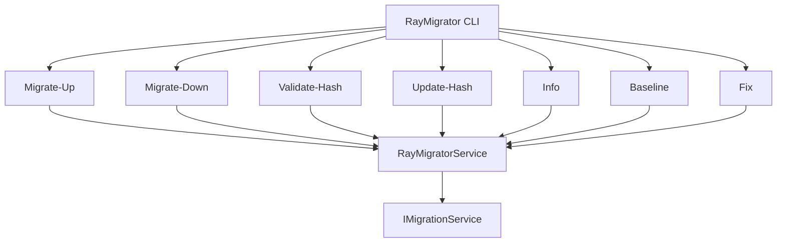
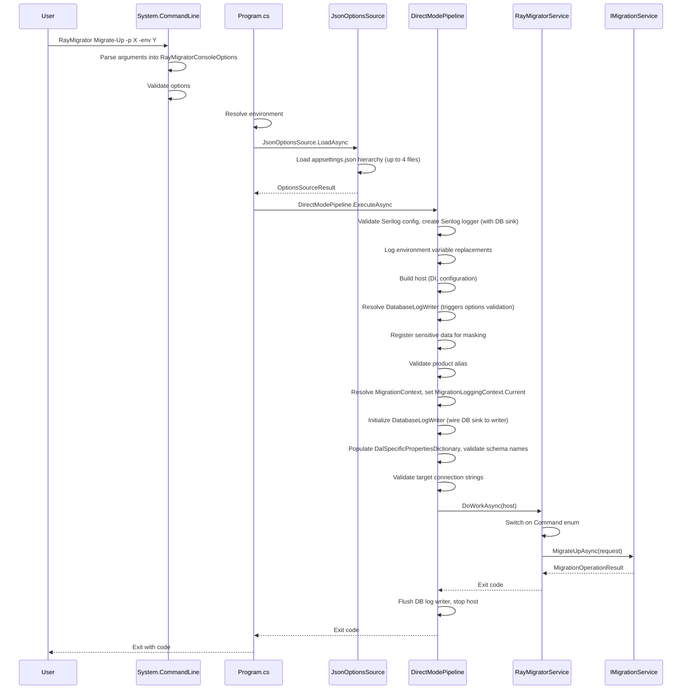

# Command Structure

RayMigrator uses System.CommandLine for its CLI interface.

## Overview



## Commands

| Command | Purpose |
|---------|---------|
| `Migrate-Up` | Apply pending migrations forward |
| `Migrate-Down` | Rollback to previous version |
| `Validate-Hash` | Verify migration file integrity |
| `Update-Hash` | Update repository hashes after approved changes |
| `Info` | Display migration status information |
| `Baseline` | Mark existing database as migrated (all releases, or up to a specific release) |
| `Fix` | Fix repository inconsistencies (orphaned runs) |

## Command Definition

Commands are defined in `CommandLineConfiguration.cs` (in the Core project). The constructor creates the root command, adds global options, then creates and registers each command via dedicated factory/handler methods:

```csharp
public CommandLineConfiguration(string assemblyInfo)
{
    RootCommand = new RootCommand();

    // Global options are created with Recursive = true so they apply to all subcommands
    var showInfoOption = new Option<bool>("--startup-info", "-si")
    {
        Description = "Show startup information",
        DefaultValueFactory = _ => true,
        Recursive = true
    };

    var revealSensitiveDataOption = new Option<bool>("--reveal-sensitive-data", "-rsd")
    {
        Description = "Include sensitive data in logs (WARNING: includes passwords)",
        DefaultValueFactory = _ => false,
        Recursive = true
    };

    var configDirOption = new Option<string?>("--config-dir", "-cd")
    {
        Description = "Override directory where RayMigrator searches for appsettings.json files (default: current directory)",
        Recursive = true
    };

    RootCommand.Options.Add(showInfoOption);
    RootCommand.Options.Add(revealSensitiveDataOption);
    RootCommand.Options.Add(configDirOption);

    // Create and add commands via factory methods
    var migrateUpCommand = CreateMigrateUpCommand();
    // ... (one factory per command)
    RootCommand.Subcommands.Add(migrateUpCommand);

    // Set up handlers (separate methods map parsed values to RayMigratorConsoleOptions)
    SetupMigrateUpHandler(migrateUpCommand, showInfoOption, revealSensitiveDataOption, configDirOption);
    // ... (one Setup call per command)

    ConfigureHelpLayout(assemblyInfo);
}
```

Each command is built by a `Create*Command()` method that defines its options, and a `Setup*Handler()` method that maps parsed values into `RayMigratorConsoleOptions`:

```csharp
private Command CreateMigrateUpCommand()
{
    var command = new Command("Migrate-Up", "Apply pending migrations forward");

    var productOption = new Option<string>("--product", "-p")
    {
        Description = "Product alias from configuration",
        Required = true
    };

    var environmentOption = new Option<string>("--environment", "-env")
    {
        Description = "Target environment",
        Required = true
    };

    var runModeOption = new Option<string>("--run-mode", "-rm")
    {
        Description = "Execution mode (Migrate, Simulate, or Validate)",
        DefaultValueFactory = _ => "Migrate"
    };

    // Validators are added for enum-like options
    runModeOption.Validators.Add(result =>
    {
        var value = result.GetValueOrDefault<string>();
        if (value != null)
        {
            var normalizedValue = ResolveEnvironmentVariable(value).ToLowerInvariant();
            if (normalizedValue != "migrate" && normalizedValue != "simulate" && normalizedValue != "validate")
                result.AddError($"Invalid value for --run-mode: {value}. Valid values are: Migrate, Simulate, Validate.");
        }
    });

    var toReleaseOption = new Option<string?>("--to-release", "-tr")
    {
        Description = "Target release version",
        Required = false
    };

    var allowOutOfOrderOption = new Option<bool>("--allow-out-of-order", "-ooo")
    {
        Description = "Allow out-of-order migration execution",
        DefaultValueFactory = _ => false
    };

    var targetGroupOption = new Option<string[]>("--target-group", "-tg")
    {
        Description = "Filter execution to specific target groups (can be specified multiple times)",
        Arity = ArgumentArity.ZeroOrMore
    };

    var targetGroupMigrationOrderOption = new Option<string?>("--TargetGroup-MigrationOrder", "-tgmo")
    {
        Description = "Explicit TargetGroup migration order (comma-separated aliases, e.g. \"Frontend,Backend\")",
        Arity = ArgumentArity.ZeroOrOne
    };

    var stopRollbackOnMissingRollbackFileOption = new Option<bool?>("--stop-rollback-on-missing-rollback-file", "-sromrf")
    {
        Description = "Stop error-recovery rollback chain when rollback file is missing (default: true)",
        Arity = ArgumentArity.ZeroOrOne
    };

    command.Options.Add(productOption);
    command.Options.Add(environmentOption);
    command.Options.Add(runModeOption);
    command.Options.Add(toReleaseOption);
    command.Options.Add(allowOutOfOrderOption);
    command.Options.Add(targetGroupOption);
    command.Options.Add(targetGroupMigrationOrderOption);
    command.Options.Add(stopRollbackOnMissingRollbackFileOption);

    return command;
}

private void SetupMigrateUpHandler(Command command, Option<bool> showInfoOption, Option<bool> revealSensitiveDataOption, Option<string?> configDirOption)
{
    command.SetAction(parseResult =>
    {
        // Options are resolved by name via LINQ on command.Options
        var runModeString = parseResult.GetValue(command.Options.OfType<Option<string>>().First(o => o.Name == "--run-mode")) ?? "Migrate";
        var runMode = ParseRunMode(runModeString);
        var allowOutOfOrder = parseResult.GetValue(command.Options.OfType<Option<bool>>().First(o => o.Name == "--allow-out-of-order"));

        var tgeoRaw = parseResult.GetValue(command.Options.OfType<Option<string?>>().First(o => o.Name == "--TargetGroup-MigrationOrder"));
        var tgeoArray = ParseCommaSeparatedToArray(tgeoRaw);

        var stopRollbackOnMissingRollbackFile = parseResult.GetValue(
            command.Options.OfType<Option<bool?>>().First(o => o.Name == "--stop-rollback-on-missing-rollback-file"));

        ParsedOptions = new RayMigratorConsoleOptions
        {
            Command = MigrationCommand.MigrateUp,
            Product = ResolveEnvironmentVariable(parseResult.GetValue(command.Options.OfType<Option<string>>().First(o => o.Name == "--product"))!),
            Environment = ResolveEnvironmentVariable(parseResult.GetValue(command.Options.OfType<Option<string>>().First(o => o.Name == "--environment"))!),
            RunMode = runMode,
            TargetReleaseVersion = ResolveEnvironmentVariable(parseResult.GetValue(command.Options.OfType<Option<string?>>().First(o => o.Name == "--to-release")) ?? ""),
            ShowStartupInfo = parseResult.GetValue(showInfoOption),
            RevealSensitiveData = parseResult.GetValue(revealSensitiveDataOption),
            HashValidationScope = null,
            AllowOutOfOrder = allowOutOfOrder,
            StopRollbackOnMissingRollbackFile = stopRollbackOnMissingRollbackFile,
            TargetGroupAliases = parseResult.GetValue(command.Options.OfType<Option<string[]>>().First(o => o.Name == "--target-group"))
                ?.Select(a => ResolveEnvironmentVariable(a)).Where(a => !string.IsNullOrWhiteSpace(a)).ToArray(),
            TargetGroupMigrationOrder = tgeoArray,
            ConfigDir = ResolveConfigDir(parseResult.GetValue(configDirOption)),
        };
    });
}
```

All string option values support `{ENV:VAR}` environment variable substitution via the static `ResolveEnvironmentVariable()` helper. If the referenced environment variable is not set, the helper throws an `ArgumentException` and the command exits with code 5.

## Options

### Required Options (Migration Commands)

These options are required for all migration commands (Migrate-Up, Migrate-Down, Validate-Hash, Update-Hash, Info, Baseline, Fix).

| Option | Short | Type | Description |
|--------|-------|------|-------------|
| `--product` | `-p` | string | Product alias |
| `--environment` | `-env` | string | Target environment |

### Global Options (Recursive)

These options are defined on the `RootCommand` with `Recursive = true`, so they are available to all commands.

| Option | Short | Type | Default | Description |
|--------|-------|------|---------|-------------|
| `--startup-info` | `-si` | bool | true | Show startup information (maps to `ShowStartupInfo` property) |
| `--reveal-sensitive-data` | `-rsd` | bool | false | Include sensitive data in logs (WARNING: includes passwords) |
| `--config-dir` | `-cd` | string | (current directory) | Override directory where RayMigrator searches for configuration files (`appsettings.json` hierarchy) (maps to `ConfigDir` property) |

### Command-Level Optional Options

These options are defined on specific commands (not global).

| Option | Short | Type | Default | Used By | Description |
|--------|-------|------|---------|---------|-------------|
| `--run-mode` | `-rm` | string | Migrate | Migrate-Up, Migrate-Down | Migrate, Simulate, or Validate |
| `--to-release` | `-tr` | string | (latest) | Migrate-Up, Migrate-Down, Baseline | Target release version (optional for Migrate-Up and Baseline; **required** for Migrate-Down) |
| `--target-group` | `-tg` | string[] | (all) | Migrate-Up, Migrate-Down, Validate-Hash, Update-Hash, Baseline | Filter to specific target groups (repeatable) |
| `--allow-out-of-order` | `-ooo` | bool | false | Migrate-Up | Allow out-of-order migration execution |
| `--TargetGroup-MigrationOrder` | `-tgmo` | string | (config order) | Migrate-Up, Baseline | Explicit TargetGroup migration order (comma-separated aliases, e.g. `"Frontend,Backend"`) |
| `--stop-rollback-on-missing-rollback-file` | `-sromrf` | bool? | (config default: true) | Migrate-Up | CLI override: stop error-recovery rollback chain when a rollback file is missing |
| `--scope` | `-s` | string | (varies) | Validate-Hash, Fix | Validation or fix scope (Validate-Hash: `File`/`SqlBlock`/`Disabled`; Fix: `OrphanedRuns`/`All`) |
| `--older-than` | `-ot` | int | 60 | Fix | Only fix runs older than N minutes (0 = immediate) |
| `--dry-run` | (none) | bool | false | Fix | Preview what would be fixed without applying changes |
| `--last-migration-status` | `-lms` | string | not-migrated | Fix | Status for orphaned migrations (`migrated` or `not-migrated`) |

### Command-Specific Options

**Migrate-Up**:
- `--run-mode` (`-rm`): string, default `"Migrate"` — Migrate, Simulate, or Validate
- `--to-release` (`-tr`): string, optional — Target release version
- `--allow-out-of-order` (`-ooo`): bool, default `false` — Allow out-of-order migration execution
- `--target-group` (`-tg`): string[], repeatable — Filter to specific target groups
- `--TargetGroup-MigrationOrder` (`-tgmo`): string, optional — Comma-separated list of TargetGroup aliases that overrides the default migration order (e.g. `"Frontend,Backend"`)
- `--stop-rollback-on-missing-rollback-file` (`-sromrf`): bool?, optional — CLI override for `StopRollbackOnMissingRollbackFile` configuration; when `true`, the error-recovery rollback chain stops if a rollback file is missing

**Migrate-Down**:
- `--to-release` (`-tr`): string, **required** — Must specify rollback target
- `--run-mode` (`-rm`): string, default `"Migrate"` — Migrate, Simulate, or Validate
- `--target-group` (`-tg`): string[], repeatable — Filter to specific target groups

**Validate-Hash**:
- `--scope` (`-s`): string, optional (no default) — Maps to `HashValidationScope` enum (values: `File`, `SqlBlock`/`SqlBlocks`, `Disabled`). If omitted, uses per-TargetGroup config.
- `--target-group` (`-tg`): string[], repeatable — Filter to specific target groups

**Update-Hash**:
- `--target-group` (`-tg`): string[], repeatable — Filter to specific target groups

**Baseline**:
- `--to-release` (`-tr`): string, optional — Omit to baseline all releases; specify to baseline up to a specific release
- `--target-group` (`-tg`): string[], repeatable — Filter to specific target groups
- `--TargetGroup-MigrationOrder` (`-tgmo`): string, optional — Comma-separated list of TargetGroup aliases that overrides the default migration order (e.g. `"Frontend,Backend"`)

**Info**:
- No command-specific options (only `--product` and `--environment`)

**Fix**:
- `--scope` (`-s`): string, default `"OrphanedRuns"` — Maps to `FixIssues` enum (values: `OrphanedRuns`, `All`)
- `--older-than` (`-ot`): int, default `60` — Only fix runs older than N minutes (0 = immediate)
- `--dry-run`: bool, default `false` — Only show what would be fixed without applying changes
- `--last-migration-status` (`-lms`): string, default `"not-migrated"` — Status for orphaned migrations (`migrated` or `not-migrated`)

## Argument Parsing

System.CommandLine handles:
- Argument validation (including custom `Validators` for enum-like options)
- Type conversion
- Help text generation (with custom `LogoHelpAction` for branded root help output)
- Error messages
- Environment variable substitution (`{ENV:VAR}` syntax in any string option value)

### Usage Examples

```bash
# Basic usage
RayMigrator Migrate-Up --product MyProduct --environment Production

# Short form
RayMigrator Migrate-Up -p MyProduct -env Production

# With optional parameters
RayMigrator Migrate-Up -p MyProduct -env Production -rm Simulate -tr "Release 1.0"

# With environment variable substitution
RayMigrator Migrate-Up -p "{ENV:PRODUCT_NAME}" -env "{ENV:TARGET_ENV}"

# Show help
RayMigrator --help
RayMigrator Migrate-Up --help
```

## Help Output

When the user runs `RayMigrator --help`, the custom `LogoHelpAction` (set on the root command's `HelpOption.Action`) prepends the ASCII assembly-info banner, strips the empty `Description:` section from the default help text, and writes the result to standard output:

```
[ASCII logo banner from AssemblyInfoHelper.GetAssemblyInfo()]

Usage:
  RayMigrator [command] [options]

Options:
  -si, --startup-info             Show startup information [default: True]
  -rsd, --reveal-sensitive-data   Include sensitive data in logs (WARNING: includes passwords) [default: False]
  -cd, --config-dir <config-dir>  Override directory where RayMigrator searches for appsettings.json files (default: current directory)
  --version                       Show version information
  -?, -h, --help                  Show help and usage information

Commands:
  Migrate-Up     Apply pending migrations forward
  Migrate-Down   Rollback to previous version
  Validate-Hash  Verify migration file integrity
  Update-Hash    Update repository hashes after approved changes
  Info           Display migration status information
  Baseline       Mark existing database as migrated (all releases, or up to a specific release)
  Fix            Fix repository inconsistencies (orphaned runs)
```

For subcommands (`RayMigrator Migrate-Up --help`), the default help renderer is used without the logo banner.

## Exit Codes

See [Global Options — Exit Codes](../08-cli-reference/global-options.md#exit-codes) for the complete exit code table.

## Application Flow



## Related Documentation

- [RayMigratorService](raymigrator-service.md) - Command handler
- [Launch Profiles](launch-profiles.md) - IDE configuration
- [Adding New Command](adding-new-command.md) - Extension guide
