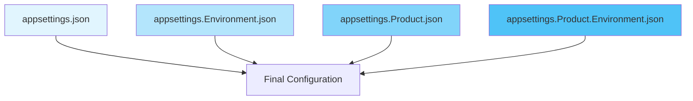

# Configuration Hierarchy

RayMigrator loads all configuration files in a single pass and then initializes Serilog logging, followed by the full DI container with the validated migration configuration.

## Configuration Loading

All configuration is loaded from up to four files in a single pass before Serilog is initialized. Later files override earlier ones:



| Priority | File | Example |
|----------|------|---------|
| 1 (lowest) | `appsettings.json` | Base configuration |
| 2 | `appsettings.{Environment}.json` | `appsettings.Docker.json` |
| 3 | `appsettings.{Product}.json` | `appsettings.RayMigratorTests.json` |
| 4 (highest) | `appsettings.{Product}.{Environment}.json` | `appsettings.RayMigratorTests.Docker.json` |

**Note**: Command-line arguments (`--product`, `--environment`, `--run-mode`, etc.) control which command is executed and which configuration files are loaded, but they do not override individual configuration values like connection strings or timeouts.

## Merge Behavior

### Objects (Nested Properties)

Objects are merged recursively. Properties from later files override earlier ones:

**appsettings.json**:
```json
{
  "RayMigrator": {
    "Repository": {
      "DatabaseType": "SqlServer",
      "SchemaName": "migrations",
      "DbCommandTimeoutInSeconds": 30
    }
  }
}
```

**appsettings.Production.json**:
```json
{
  "RayMigrator": {
    "Repository": {
      "DbCommandTimeoutInSeconds": 120,
      "DbCommandMaxRetries": 3
    }
  }
}
```

**Merged Result**:
```json
{
  "RayMigrator": {
    "Repository": {
      "DatabaseType": "SqlServer",      // from base
      "SchemaName": "migrations",       // from base
      "DbCommandTimeoutInSeconds": 120, // overridden
      "DbCommandMaxRetries": 3          // added
    }
  }
}
```

### Arrays

Arrays are **completely replaced**, not merged:

**appsettings.json**:
```json
{
  "Products": [
    { "Alias": "Product1" },
    { "Alias": "Product2" }
  ]
}
```

**appsettings.Production.json**:
```json
{
  "Products": [
    { "Alias": "Product1" }
  ]
}
```

**Merged Result**:
```json
{
  "Products": [
    { "Alias": "Product1" }  // Only Product1, Product2 removed
  ]
}
```

## Environment Detection

The environment is determined by (in order of priority):

1. **Command-line argument** `--environment` / `-env` (highest priority)
2. **Environment variable** `DOTNET_ENVIRONMENT`

If both are set to **different** values, RayMigrator exits with an error (exit code 2) and asks the user to resolve the conflict.

If **neither** is set, RayMigrator exits with an error (exit code 3). There is no default environment.

### Setting the Environment

**Command line** (recommended):
```bash
RayMigrator Migrate-Up --product MyProduct --environment Docker --run-mode Migrate
```

**Windows**:
```batch
set DOTNET_ENVIRONMENT=Docker
```

**Linux/macOS**:
```bash
export DOTNET_ENVIRONMENT=Docker
```

**launchSettings.json**:
```json
{
  "environmentVariables": {
    "DOTNET_ENVIRONMENT": "Docker"
  }
}
```

## File Location

By default, all configuration files are resolved relative to the **current working directory** when RayMigrator is invoked. In typical deployments, the current working directory is the same as the executable's directory:

```
RayMigrator/
├── RayMigrator.dll
├── appsettings.json
├── appsettings.Docker.json
├── appsettings.Production.json
└── appsettings.RayMigratorTests.json
```

If you run RayMigrator from a different directory (e.g., `dotnet /path/to/RayMigrator.dll Migrate-Up ...`), the configuration files must be present in the directory where the command is run, not in the executable's directory.

### Overriding the Configuration Directory

The `--config-dir` (`-cd`) global option overrides the directory used to search for configuration files:

```bash
RayMigrator Migrate-Up -p MyProduct -env Prod --config-dir /etc/raymigrator
```

Both absolute and relative paths are accepted. Relative paths are resolved against the current working directory at parse time. The `{ENV:VAR_NAME}` placeholder syntax is supported:

```bash
RayMigrator Migrate-Up -p MyProduct -env Prod --config-dir {ENV:CONFIG_DIR}
```

If the specified directory does not exist, RayMigrator terminates with a `ConfigurationValidationException` before loading any configuration.

See [Global Options — --config-dir](../08-cli-reference/global-options.md#--config-dir--cd) for the full option reference.

## Common Patterns

### Environment-Specific Connection Strings

**appsettings.json** (base, with placeholder):
```json
{
  "RayMigrator": {
    "Repository": {
      "ConnectionString": "{ENV:REPO_CONNECTION}"
    }
  }
}
```

**appsettings.Development.json** (development override):
```json
{
  "RayMigrator": {
    "Repository": {
      "ConnectionString": "Server=localhost;Database=Dev_Migrations;Integrated Security=true"
    }
  }
}
```

### Product-Specific Settings

**appsettings.json** (shared defaults):
```json
{
  "RayMigrator": {
    "ProductDefaults": {
      "MigrationErrorAction": "Terminate",
      "RollbackErrorAction": "Terminate"
    }
  }
}
```

**appsettings.RayMigratorTests.json** (product-specific):
```json
{
  "RayMigrator": {
    "Products": [{
      "Alias": "RayMigratorTests",
      "MigrationErrorAction": "Rollback"
    }]
  }
}
```

### Environment + Product

**appsettings.RayMigratorTests.Production.json**:
```json
{
  "RayMigrator": {
    "Products": [{
      "Alias": "RayMigratorTests",
      "MigrationErrorAction": "Terminate",
      "TargetGroups": [{
        "Alias": "Backend",
        "Targets": [{
          "Alias": "MainDB",
          "DbCommandTimeoutInSeconds": 300
        }]
      }]
    }]
  }
}
```

### Multi-Database Types

A single product can target multiple database types via separate TargetGroups. Supported `DatabaseType` values: `SqlServer`, `PostgreSQL`, `MariaDb`, `MySql`, `Sqlite`.

```json
{
  "RayMigrator": {
    "Products": [{
      "Alias": "HybridApp",
      "TargetGroups": [
        {
          "Alias": "SqlServerBackend",
          "DatabaseType": "SqlServer",
          "Targets": [{ "Alias": "Primary", "ConnectionString": "..." }]
        },
        {
          "Alias": "PostgreSQLAnalytics",
          "DatabaseType": "PostgreSQL",
          "Targets": [{ "Alias": "Analytics", "ConnectionString": "..." }]
        }
      ]
    }]
  }
}
```

## Validation

Configuration is validated at startup:
- Required properties must be set
- Connection strings must be valid
- Database types must be recognized: `SqlServer`, `PostgreSQL`, `MariaDb`, `MySql`, `Sqlite` (applies to Repository, DatabaseLogging, and TargetGroup database types)
- Aliases must match the pattern `^(?=.{1,50}$)[\p{L}\p{N}_]+$`: Unicode letters (`\p{L}`), Unicode numeric characters (`\p{N}`), and underscores only (max 50 characters). Non-ASCII letters and digits are accepted. CLI tool aliases additionally allow hyphens: `^(?=.{1,50}$)[\p{L}\p{N}_\-]+$`.
- Alias uniqueness is enforced case-insensitively: `MyProduct` and `myproduct` are considered duplicates. This applies to Product aliases (across all products), TargetGroup aliases (within each product), and Target aliases (within each target group).
- `CliTools[]` aliases must be unique (case-insensitive). `UseCliToolAlias` values across Products, TargetGroups, and Targets must reference an existing `CliTools[].Alias` (matching is also case-insensitive).

## Related Documentation

- [Bootstrap Options](bootstrap-options.md) - Bootstrap options and Serilog initialization
- [Configuration System](../02-core-concepts/configuration-system.md) - Options classes hierarchy and loading sequence diagram
- [Repository Options](repository-options.md)
- [Product Options](product-options.md)
- [Environment Variables](environment-variables.md)
