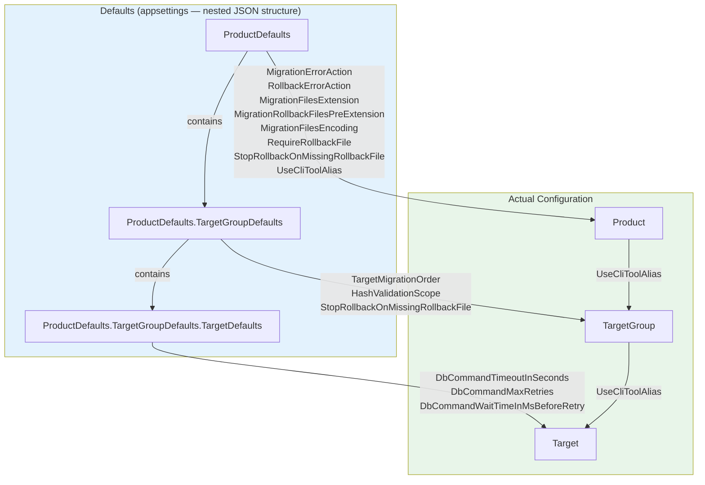

# Settings and Inheritance Overview

This document is the single reference that maps every RayMigrator setting across all four configuration layers, shows the complete inheritance and override chains, and answers the question: *"Where should I configure X?"*

For detailed documentation on each layer individually, see the links in each section below.

---

## The Four Configuration Layers

RayMigrator settings are spread across four distinct layers. Each layer has a different scope and purpose:

| # | Layer | Scope | Purpose |
|---|-------|-------|---------|
| 1 | **CLI Arguments** | Per-invocation | Select command, product, environment, run mode. CLI arguments control *what* runs, not *how* settings are configured. |
| 2 | **appsettings.json** | Application-wide | Define products, targets, connection strings, error handling, timeouts. Supports a [4-level file merge](appsettings-hierarchy.md) and Defaults inheritance. |
| 3 | **migsettings.txt** | Directory-wide | Set file-level defaults for migration directories. A [6-level directory hierarchy](../07-migration-files/migsettings-files.md) with environment-specific overrides at each level. |
| 4 | **TOML Metadata** | Per-file | Embedded in each `.sql` migration file. Highest priority for file-level settings. See [TOML Metadata](../07-migration-files/toml-metadata.md). |

---

## Full Inheritance Flow

The following diagram shows how all four layers interact. Settings flow from left (lowest priority) to right (highest priority):

```mermaid
flowchart LR
    subgraph CLI ["CLI Layer"]
        CLI_ARGS["--product, --environment,\n--run-mode, etc."]
    end

    subgraph APPSETTINGS ["appsettings.json Layer"]
        direction TB
        AS1["appsettings.json"]
        AS2["appsettings.{Env}.json"]
        AS3["appsettings.{Product}.json"]
        AS4["appsettings.{Product}.{Env}.json"]
        AS1 --> AS2 --> AS3 --> AS4
        DEFAULTS["ProductDefaults\nTargetGroupDefaults\nTargetDefaults"]
        AS4 --> DEFAULTS
    end

    subgraph MIGSETTINGS ["migsettings.txt Layer"]
        direction TB
        RS1["Product/migsettings.txt"]
        RS2["Product/migsettings.{Env}.txt"]
        RS3["Release/migsettings.txt"]
        RS4["Release/migsettings.{Env}.txt"]
        RS5["TargetGroup/migsettings.txt"]
        RS6["TargetGroup/migsettings.{Env}.txt"]
        RS1 --> RS2 --> RS3 --> RS4 --> RS5 --> RS6
    end

    subgraph TOML ["TOML Metadata"]
        TOML_BLOCK["/* [RayMigrator]\nUseTransaction = true\n... */"]
    end

    CLI_ARGS -->|selects product,\nenvironment| APPSETTINGS
    DEFAULTS -->|"RequireRollbackFile\nStopRollbackOnMissingRollbackFile\nMigrationErrorAction\nUseCliToolAlias\n(Product level)"| MIGSETTINGS
    RS6 -->|"8 cross-layer\nsettings"| TOML

    style CLI fill:#e8f5e9
    style APPSETTINGS fill:#e3f2fd
    style MIGSETTINGS fill:#fff3e0
    style TOML fill:#fce4ec
```



**Key insight**: The CLI selects *which* configuration to load but does not override individual setting values. Cross-layer settings (like `UseTransaction`) flow through migsettings and TOML, while structural settings (like `ConnectionString`) exist only in appsettings.

---

## Master Settings Table

Every RayMigrator setting, grouped by which layers it appears in.

### CLI-Only Settings

These settings exist only as command-line arguments and control execution behavior.

| Setting | Short | Type | Default | Commands | Description |
|---------|-------|------|---------|----------|-------------|
| `--product` | `-p` | string | *(required)* | Migrate-Up, Migrate-Down, Validate-Hash, Update-Hash, Info, Baseline, Fix | Product alias to operate on |
| `--environment` | `-env` | string | *(required)* | Migrate-Up, Migrate-Down, Validate-Hash, Update-Hash, Info, Baseline, Fix | Target environment name |
| `--run-mode` | `-rm` | string | `Migrate` | Migrate-Up, Migrate-Down | `Migrate`, `Simulate`, or `Validate` |
| `--to-release` | `-tr` | string | `null` | Migrate-Up (opt), Migrate-Down (req), Baseline (opt) | Target release version |
| `--allow-out-of-order` | `-ooo` | bool | `false` | Migrate-Up | Allow out-of-order execution |
| `--stop-rollback-on-missing-rollback-file` | `-sromrf` | bool? | `null` (uses config) | Migrate-Up | Override `StopRollbackOnMissingRollbackFile` for this run. Only applies to error-recovery rollback when `RequireRollbackFile=false`. |
| `--target-group` | `-tg` | string[] | `null` | Migrate-Up, Migrate-Down, Validate-Hash, Update-Hash, Baseline | Filter execution to specific target groups |
| `--TargetGroup-MigrationOrder` | `-tgmo` | string | `null` | Migrate-Up, Baseline | Comma-separated TargetGroup aliases defining execution order (e.g. `"Frontend,Backend"`). Overrides product config and migsettings. |
| `--scope` | `-s` | string | *(none)* | Validate-Hash | Hash scope override: `File`, `SqlBlocks` (also accepts `SqlBlock`), or `Disabled`. If omitted, uses per-TargetGroup config. |
| `--scope` | `-s` | string | `OrphanedRuns` | Fix | Fix scope: `OrphanedRuns` or `All` |
| `--older-than` | `-ot` | int | `60` | Fix | Only fix runs older than N minutes (0 = immediate) |
| `--dry-run` | - | bool | `false` | Fix | Show what would be fixed without applying changes |
| `--last-migration-status` | `-lms` | string | `not-migrated` | Fix | Status for orphaned migrations: `migrated` or `not-migrated` |
| `--startup-info` | `-si` | bool | `true` | Global | Show startup information |
| `--reveal-sensitive-data` | `-rsd` | bool | `false` | Global | Include passwords in logs |
| `--config-dir` | `-cd` | string | `null` (cwd) | Global | Override directory where RayMigrator searches for configuration files (`appsettings.json` hierarchy). Supports `{ENV:VAR_NAME}` syntax. |

See [CLI Reference](../08-cli-reference/command-reference.md) for complete command documentation.

### appsettings-Only Settings

These settings are configured exclusively in `appsettings.json` files.

#### Repository Settings

| Setting | Type | Default | Description |
|---------|------|---------|-------------|
| `Repository.DatabaseType` | string | *(required)* | `SqlServer`, `PostgreSQL`, `MariaDb`, `MySql`, or `Sqlite` |
| `Repository.ConnectionString` | string | *(required)* | Repository database connection |
| `Repository.SchemaName` | string | Conditional (`"ray"` by convention) | Schema for repository tables (required for SqlServer, PostgreSQL; ignored for MariaDb, MySql, SQLite). Defaults to `"ray"` when scaffolded by the ConfigWizard. |
| `Repository.TableBaseName` | string | `null` | Base name for repository tables |
| `Repository.DbCommandTimeoutInSeconds` | int | `60` | Command timeout |
| `Repository.DbCommandMaxRetries` | int | `100` | Maximum retry attempts |
| `Repository.DbCommandWaitTimeInMsBeforeRetry` | int | `250` | Wait before retry (ms) |

See [Repository Options](repository-options.md).

#### CLI Tools Settings

| Setting | Type | Default | Description |
|---------|------|---------|-------------|
| `CliTools[].Alias` | string | *(required)* | Unique tool identifier (letters, numbers, underscores, hyphens; max 50 chars) |
| `CliTools[].ExecutablePath` | string | *(required)* | Path to the CLI tool executable |
| `CliTools[].ArgumentTemplate` | string | *(required)* | Command-line argument template with placeholders |
| `CliTools[].InputMode` | string | `File` | `File` (argument) or `Stdin` (piped via stdin) |
| `CliTools[].SuccessExitCodes` | string[] | `["0"]` | Exit code whitelist (single values and ranges). Any exit code not matched is treated as failure. |
| `CliTools[].CliToolTimeoutInSeconds` | int | `120` | Maximum execution time in seconds (min: 1) |

See [CLI Tools Options](cli-tools-options.md).

#### Database Logging Settings

| Setting | Type | Default | Description |
|---------|------|---------|-------------|
| `DatabaseLogging.DatabaseType` | string | `null` | Database type for log storage |
| `DatabaseLogging.ConnectionString` | string | `null` | Logging database connection |
| `DatabaseLogging.SchemaName` | string | `null` | Schema for logging tables |
| `DatabaseLogging.TableBaseName` | string | `null` | Base name for logging tables |
| `DatabaseLogging.MinimumLevel` | string | `Information` | Minimum log level |
| `DatabaseLogging.DbCommandTimeoutInSeconds` | int | `20` | Command timeout |

See [Logging Options](logging-options.md).

#### Product Settings

| Setting | Type | Default | Inherits From |
|---------|------|---------|---------------|
| `Product.Alias` | string | *(required)* | - |
| `Product.MigrationFilesRootDirectory` | string | *(required)* | - |
| `Product.MigrationErrorAction` | string | *(required after inheritance)* | `ProductDefaults` |
| `Product.RollbackErrorAction` | string | inherited (optional) | `ProductDefaults` |
| `Product.MigrationFilesExtension` | string | inherited | `ProductDefaults` |
| `Product.MigrationRollbackFilesPreExtension` | string | inherited | `ProductDefaults` |
| `Product.MigrationFilesEncoding` | string | inherited | `ProductDefaults` |
| `Product.RequireRollbackFile` | bool? | inherited | `ProductDefaults` |
| `Product.StopRollbackOnMissingRollbackFile` | bool? | inherited | `ProductDefaults` |
| `Product.UseCliToolAlias` | string | inherited | `ProductDefaults` |
| `Product.TargetGroupMigrationOrder` | string | `null` | - |

See [Product Options](product-options.md).

#### TargetGroup Settings

| Setting | Type | Default | Inherits From |
|---------|------|---------|---------------|
| `TargetGroup.Alias` | string | *(required)* | - |
| `TargetGroup.DatabaseType` | string | *(required)* | - |
| `TargetGroup.TargetMigrationOrder` | string | inherited | `TargetGroupDefaults` |
| `TargetGroup.HashValidationScope` | string | inherited | `TargetGroupDefaults` |
| `TargetGroup.StopRollbackOnMissingRollbackFile` | bool? | inherited | `TargetGroupDefaults` |
| `TargetGroup.UseCliToolAlias` | string | inherited | `Product` |

See [Target Group Options](target-group-options.md).

#### Target Settings

| Setting | Type | Default | Inherits From |
|---------|------|---------|---------------|
| `Target.Alias` | string | *(required)* | - |
| `Target.ConnectionString` | string | *(required)* | - |
| `Target.DbCommandTimeoutInSeconds` | int | `20` | `TargetDefaults` |
| `Target.DbCommandMaxRetries` | int | `0` | `TargetDefaults` |
| `Target.DbCommandWaitTimeInMsBeforeRetry` | int | `250` | `TargetDefaults` |
| `Target.UseCliToolAlias` | string | inherited | `TargetGroup` |
| `Target.CliToolParameters` | Dictionary&lt;string, string&gt; | `null` | - |

See [Target Options](target-options.md).

### Cross-Layer Settings

These settings can be configured in multiple layers. Each deeper layer overrides the previous.

| Setting | appsettings | migsettings | TOML | Hardcoded Default |
|---------|-------------|-------------|------|-------------------|
| `RequireRollbackFile` | `ProductDefaults` / `Product` | All 6 levels | Yes | `true` |
| `StopRollbackOnMissingRollbackFile` | `ProductDefaults` / `ProductDefaults.TargetGroupDefaults` / `Product` / `TargetGroup` | All 6 levels² | Yes² | `true` |
| `MigrationErrorAction` | `ProductDefaults` / `Product` | All 6 levels | Yes | `null` (uses Product default) |
| `RollbackErrorAction` | `ProductDefaults` / `Product` | All 6 levels | Yes | `Terminate` |
| `UseTransaction` | - | All 6 levels | Yes | `true` |
| `RunAlways` | - | All 6 levels | Yes | `false` |
| `Environments` | - | All 6 levels | Yes | `null` (all environments) |
| `Targets` | - | All 6 levels | Yes | `null` (all targets) |
| `UseCliToolAlias` | `ProductDefaults` / `Product` / `TargetGroup` / `Target` | All 6 levels | Yes | `null` (use built-in DAL) |
| `TargetGroupMigrationOrder` | `Product` | Release-level migsettings only (levels 3–4) | No¹ | `null` (config array order) |

¹ `TargetGroupMigrationOrder` is accepted as a valid key in per-file migration TOML (to avoid a parsing error) but the value is discarded and has no effect on execution order. It is only effective when placed in a release-level migsettings file.

² `StopRollbackOnMissingRollbackFile` is accepted as a valid key in migsettings files and per-file TOML (to avoid parse errors), but the value is discarded and has no effect on the rollback chain execution. The rollback chain runtime resolution only reads the appsettings levels (`Product`, `TargetGroup`) and the CLI option. Unlike other cross-layer settings, this one does NOT accumulate through migsettings/TOML into per-file metadata.

### TOML-Only Settings

| Setting | Type | Default | Description |
|---------|------|---------|-------------|
| `Description` | string | `""` | Human-readable description of the migration file |

---

## Cross-Layer Override Chains

For each cross-layer setting, here is the complete resolution order (last non-null value wins):

### RequireRollbackFile

```
Hardcoded default (true)
  ← ProductDefaults.RequireRollbackFile          (appsettings)
    ← Product.RequireRollbackFile                (appsettings)
      ← Product/migsettings.txt                  (migsettings)
        ← Product/migsettings.{Env}.txt          (migsettings)
          ← Release/migsettings.txt              (migsettings)
            ← Release/migsettings.{Env}.txt      (migsettings)
              ← TargetGroup/migsettings.txt      (migsettings)
                ← TargetGroup/migsettings.{Env}.txt (migsettings)
                  ← Migration file TOML           (TOML — highest priority)
```

### StopRollbackOnMissingRollbackFile

**Runtime resolution chain (highest priority wins):**

```
CLI --stop-rollback-on-missing-rollback-file (highest priority)
  ← TargetGroup.StopRollbackOnMissingRollbackFile            (appsettings)
    ← Product.StopRollbackOnMissingRollbackFile              (appsettings)
      ← Hardcoded default (true)
```

At startup, `ProductDefaultsPostConfigureOptions` pre-populates `Product` from `ProductDefaults` and `TargetGroup` from `ProductDefaults.TargetGroupDefaults`.

**Parsing chain (parsed but migsettings/TOML values not used at rollback runtime):**

```
ProductDefaults.StopRollbackOnMissingRollbackFile              (appsettings)
  ← ProductDefaults.TargetGroupDefaults.StopRollbackOnMissingRollbackFile (appsettings)
    ← Product.StopRollbackOnMissingRollbackFile               (appsettings)
      ← TargetGroup.StopRollbackOnMissingRollbackFile         (appsettings)
        ← Product/migsettings.txt                             (parsed only)
          ← Product/migsettings.{Env}.txt                    (parsed only)
            ← Release/migsettings.txt                        (parsed only)
              ← Release/migsettings.{Env}.txt                (parsed only)
                ← TargetGroup/migsettings.txt                (parsed only)
                  ← TargetGroup/migsettings.{Env}.txt        (parsed only)
                    ← Migration file TOML                     (parsed only)
```

Controls whether an error-recovery rollback chain stops when a rollback file is missing. Only applies when `RequireRollbackFile=false`; has no effect on Migrate-Down. When `true` (default), the chain stops with a warning and the record status is left unchanged. When `false`, the chain continues past missing rollback files.

The setting can be declared in migsettings files and per-file TOML — the parser accepts the key (avoiding an "unknown key" error) — but the value is not propagated to file metadata and has no effect on the rollback chain. The rollback execution code resolves the effective value from the appsettings levels and CLI only. Can be set at run time via the `--stop-rollback-on-missing-rollback-file` / `-sromrf` CLI option on the `Migrate-Up` command.

### MigrationErrorAction

```
Product default (from appsettings)
  ← ProductDefaults.MigrationErrorAction          (appsettings)
    ← Product.MigrationErrorAction                (appsettings)
      ← Product/migsettings.txt                   (migsettings)
        ← Product/migsettings.{Env}.txt           (migsettings)
          ← Release/migsettings.txt               (migsettings)
            ← Release/migsettings.{Env}.txt       (migsettings)
              ← TargetGroup/migsettings.txt       (migsettings)
                ← TargetGroup/migsettings.{Env}.txt (migsettings)
                  ← Migration file TOML            (TOML — highest priority)
```

Like RequireRollbackFile, this cross-layer setting also participates in appsettings Defaults inheritance. When set at the file level (via TOML or migsettings), it overrides the Product-level default for that specific file.

### RollbackErrorAction

```
Hardcoded default (Terminate)
  ← ProductDefaults.RollbackErrorAction          (appsettings)
    ← Product.RollbackErrorAction                (appsettings)
      ← Product/migsettings.txt                   (migsettings)
        ← Product/migsettings.{Env}.txt           (migsettings)
          ← Release/migsettings.txt               (migsettings)
            ← Release/migsettings.{Env}.txt       (migsettings)
              ← TargetGroup/migsettings.txt       (migsettings)
                ← TargetGroup/migsettings.{Env}.txt (migsettings)
                  ← Rollback file TOML             (TOML — highest priority)
```

Controls behavior when a rollback SQL block fails. Values: `Terminate` (stop chain, default), `Ignore` (skip block, continue). Same inheritance pattern as MigrationErrorAction. See [Error Handling](../02-core-concepts/error-handling.md#rollback-error-handling) for details.

### UseTransaction

```
Hardcoded default (true)
  ← Product/migsettings.txt
    ← Product/migsettings.{Env}.txt
      ← Release/migsettings.txt
        ← Release/migsettings.{Env}.txt
          ← TargetGroup/migsettings.txt
            ← TargetGroup/migsettings.{Env}.txt
              ← Migration file TOML
```

### RunAlways

```
Hardcoded default (false)
  ← Product/migsettings.txt
    ← Product/migsettings.{Env}.txt
      ← Release/migsettings.txt
        ← Release/migsettings.{Env}.txt
          ← TargetGroup/migsettings.txt
            ← TargetGroup/migsettings.{Env}.txt
              ← Migration file TOML
```

### Environments

```
Default: null (all environments match)
  ← Product/migsettings.txt
    ← Product/migsettings.{Env}.txt
      ← Release/migsettings.txt
        ← Release/migsettings.{Env}.txt
          ← TargetGroup/migsettings.txt
            ← TargetGroup/migsettings.{Env}.txt
              ← Migration file TOML
```

When set, the file is **skipped** unless the current environment is in the list or the list contains `"*"`.

### Targets

```
Default: null (all targets match)
  ← Product/migsettings.txt
    ← Product/migsettings.{Env}.txt
      ← Release/migsettings.txt
        ← Release/migsettings.{Env}.txt
          ← TargetGroup/migsettings.txt
            ← TargetGroup/migsettings.{Env}.txt
              ← Migration file TOML
```

The `Targets` value is stored in the repository as metadata but is **not currently used for runtime target filtering**. Every migration file runs on all targets in the target group regardless of this value. The filtering behavior is reserved for a future release. See [Target Options — Target Alias in TOML](target-options.md#target-alias-in-toml) for details.

### UseCliToolAlias

```
Default: null (use built-in DAL)
  ← ProductDefaults.UseCliToolAlias              (appsettings)
    ← Product.UseCliToolAlias                    (appsettings)
      ← TargetGroup.UseCliToolAlias              (appsettings)
        ← Target.UseCliToolAlias                 (appsettings)
          ← Product/migsettings.txt          (migsettings)
            ← Product/migsettings.{Env}.txt  (migsettings)
              ← Release/migsettings.txt      (migsettings)
                ← Release/migsettings.{Env}.txt (migsettings)
                  ← TargetGroup/migsettings.txt (migsettings)
                    ← TargetGroup/migsettings.{Env}.txt (migsettings)
                      ← Migration file TOML   (TOML -- highest priority)
```

Unlike other cross-layer settings, `UseCliToolAlias` also participates in the appsettings 4-level inheritance chain (`ProductDefaults` -> `Product` -> `TargetGroup` -> `Target`), processed by `ProductDefaultsPostConfigureOptions`. At runtime, the file-level alias (from TOML/migsettings) takes priority over the Target-level alias. The alias must reference a valid `CliTools[].Alias` defined at the `RayMigrator` root level; this is validated at startup by `RayMigratorOptionsValidator`. See [CLI Tools Options](cli-tools-options.md) for details.

### TargetGroupMigrationOrder

```
Default: null (config array order)
  ← Product.TargetGroupMigrationOrder           (appsettings — comma-separated string)
    ← Release/migsettings.txt                   (migsettings — TOML array, release-level only)
      ← Release/migsettings.{Env}.txt           (migsettings — TOML array, release-level only)
        ← CLI --TargetGroup-MigrationOrder (-tgmo) (highest priority)
```

`TargetGroupMigrationOrder` defines the execution order of target groups within each release for `Migrate-Up` and `Baseline`. The CLI option takes precedence over all other sources. The migsettings setting is only effective at the release directory level (levels 3–4); setting it at product or target group level has no effect. See [Product Options — TargetGroupMigrationOrder](product-options.md#targetgroupmigrationorder) for validation rules.

---

## appsettings Defaults Inheritance

Within appsettings, the `ProductDefaults`, `TargetGroupDefaults`, and `TargetDefaults` sections provide default values that are inherited by their child levels. These three sections are nested in the JSON configuration: `ProductDefaults` contains `TargetGroupDefaults`, which in turn contains `TargetDefaults`.

This inheritance is processed by `ProductDefaultsPostConfigureOptions` (implements `IPostConfigureOptions<RayMigratorOptions>`). Its `PostConfigure` method delegates to the public static method `MergeDefaults(RayMigratorOptions)`, which performs the actual merging.



**Inheritance rule**: If the actual property has no value, the value from the corresponding Defaults section is used. For string properties, this means `null` or whitespace; for nullable value types (`bool?`, `int?`), this means `null`. Explicitly set values are never overwritten.

| Defaults Level (JSON Path) | Inherited Settings | Target Level |
|----------------------------|-------------------|--------------|
| `ProductDefaults` | `MigrationErrorAction`, `RollbackErrorAction`, `MigrationFilesExtension`, `MigrationRollbackFilesPreExtension`, `MigrationFilesEncoding`, `RequireRollbackFile`, `StopRollbackOnMissingRollbackFile`, `UseCliToolAlias` | `Product` |
| `Product` (via PostConfigure cascade) | `UseCliToolAlias` | `TargetGroup` |
| `TargetGroup` (via PostConfigure cascade) | `UseCliToolAlias` | `Target` |
| `ProductDefaults.TargetGroupDefaults` | `TargetMigrationOrder`, `HashValidationScope`, `StopRollbackOnMissingRollbackFile` | `TargetGroup` |
| `ProductDefaults.TargetGroupDefaults.TargetDefaults` | `DbCommandTimeoutInSeconds`, `DbCommandMaxRetries`, `DbCommandWaitTimeInMsBeforeRetry` | `Target` |

---

## migsettings Hierarchy

migsettings.txt files form a directory-based hierarchy. More specific (deeper) directories override less specific ones. Within the same directory, environment-specific files override the base file.

**Priority (lowest to highest):**

1. `Product/migsettings.txt` — Product-wide defaults
2. `Product/migsettings.{Environment}.txt` — Product-wide, environment-specific
3. `Release X.Y/migsettings.txt` — Release-specific defaults
4. `Release X.Y/migsettings.{Environment}.txt` — Release-specific, environment-specific
5. `Release X.Y/TargetGroup/migsettings.txt` — TargetGroup-specific defaults
6. `Release X.Y/TargetGroup/migsettings.{Environment}.txt` — TargetGroup, environment-specific
7. **Migration file TOML** — Per-file override (highest priority)

**Available settings in migsettings.txt:**

```toml
[RayMigrator]
UseTransaction = true
RunAlways = false
RequireRollbackFile = true
StopRollbackOnMissingRollbackFile = true
MigrationErrorAction = Rollback
RollbackErrorAction = Terminate
Environments = ["Docker", "Production"]
Targets = ["*"]
UseCliToolAlias = "sqlcmd"
TargetGroupMigrationOrder = ["Frontend", "Backend"]
```

`TargetGroupMigrationOrder` in migsettings is only meaningful at the release-level (levels 3–4). When set at other levels, it has no effect. It accepts an array of TargetGroup aliases that defines the execution order for that release.

See [migsettings Files](../07-migration-files/migsettings-files.md) for full documentation.

---

## Decision Guide — "Where Should I Configure X?"

| I want to... | Configure in... | Why |
|--------------|-----------------|-----|
| Set the error handling strategy for a product | `appsettings.json` → `Product.MigrationErrorAction` | Product-level default |
| Set default error handling for all products | `appsettings.json` → `ProductDefaults.MigrationErrorAction` | Inherited by all products |
| Override error handling for a directory | `migsettings.txt`: `MigrationErrorAction = Rollback` | Directory-wide override |
| Override error handling for a single file | TOML metadata: `MigrationErrorAction = Terminate` | File-level override |
| Change command timeout for a specific target | `appsettings.json` → `Target.DbCommandTimeoutInSeconds` | Per-target infrastructure setting |
| Set default timeouts for all targets | `appsettings.json` → `ProductDefaults.TargetGroupDefaults.TargetDefaults.DbCommandTimeoutInSeconds` | Inherited by all targets |
| Disable transactions for a target group | `migsettings.txt` in the TargetGroup directory | Affects all files in that directory |
| Disable transactions for a single file | TOML metadata in the `.sql` file | File-level override |
| Re-run a migration on every deploy | TOML metadata: `RunAlways = true` | File-specific behavior |
| Skip a file in production | TOML metadata: `Environments = ["Docker", "Development"]` | File-level filtering |
| Skip all files in a directory for production | `migsettings.txt`: `Environments = ["Docker", "Development"]` | Directory-wide filtering |
| Tag all files in a directory with target metadata | `migsettings.txt`: `Targets = ["Primary"]` | Directory-wide metadata (stored in repository; not used for runtime filtering in current release) |
| Set the execution order for a target group | `appsettings.json` → `TargetGroup.TargetMigrationOrder` | Structural setting |
| Set default TargetGroup execution order for a product | `appsettings.json` → `Product.TargetGroupMigrationOrder` | Product-level default (comma-separated) |
| Override TargetGroup execution order for a specific release | Release-level `migsettings.txt`: `TargetGroupMigrationOrder = ["Frontend", "Backend"]` | Release-specific override |
| Override TargetGroup execution order at run time | CLI `--TargetGroup-MigrationOrder` / `-tgmo` | Highest-priority override |
| Document what a migration does | TOML metadata: `Description = "..."` | TOML-only setting |
| Use an external CLI tool for all targets | `appsettings.json` -> `ProductDefaults.UseCliToolAlias` | Inherited by all levels |
| Use an external CLI tool for one target group | `appsettings.json` -> `TargetGroup.UseCliToolAlias` | Overrides product-level default |
| Use an external CLI tool for a single file | TOML metadata: `UseCliToolAlias = "sqlcmd"` | File-level override |
| Provide CLI tool connection parameters | `appsettings.json` -> `Target.CliToolParameters` | Per-target infrastructure setting |

---

## Practical Examples

### Example 1: RequireRollbackFile Across Three Layers

**Scenario**: Default is `true`, but a specific release directory allows files without rollback, and one file in that directory still requires it.

**appsettings.json**:
```json
{
  "RayMigrator": {
    "ProductDefaults": {
      "RequireRollbackFile": true
    }
  }
}
```

**`Release 2.0/Backend/migsettings.txt`**:
```toml
[RayMigrator]
# Seed data scripts don't need rollback
RequireRollbackFile = false
```

**`Release 2.0/Backend/01_CreateLookupTable.sql`**:
```sql
/*
[RayMigrator]
Description = "Create lookup table — needs rollback"
RequireRollbackFile = true
*/
CREATE TABLE LookupTable (...);
```

**Result**: All files in `Release 2.0/Backend/` skip rollback file validation **except** `01_CreateLookupTable.sql`, which still requires one.

### Example 2: UseTransaction with Environment-Specific Override

**Scenario**: Transactions enabled globally, but disabled for MariaDB DDL in Docker (where DDL doesn't support transactions).

**`Product/migsettings.txt`**:
```toml
[RayMigrator]
UseTransaction = true
```

**`Release 1.0/Backend/migsettings.Docker.txt`**:
```toml
[RayMigrator]
# MariaDB Docker: DDL cannot be wrapped in transactions
UseTransaction = false
```

**Result**: In the `Docker` environment, all backend migrations in Release 1.0 run without transactions. In all other environments, transactions are used.

### Example 3: Environment Filtering via migsettings

**Scenario**: A release directory should only run in Docker and Development, never in Production.

**`Release 3.0/migsettings.txt`**:
```toml
[RayMigrator]
Environments = ["Docker", "Development"]
```

**Result**: When running with `--environment Production`, all migration files under `Release 3.0/` are skipped entirely — across all target groups.

---

## Important Notes and Edge Cases

1. **CLI does not override config values**: `--product` and `--environment` select which configuration files to load and which product to operate on, but they do not override settings like connection strings or timeouts.

2. **Arrays are replaced, not merged**: In both appsettings file merging and migsettings hierarchy, arrays (like `Environments` and `Targets`) are completely replaced by the overriding layer, not merged with the parent.

3. **`{ENV:}` placeholders are resolved after merge**: Environment variable replacement (`{ENV:VARIABLE_NAME}`) happens after all appsettings files are merged but before binding to option classes. Non-existent or empty environment variables cause the application to terminate with an `ApplicationStartupException`.

4. **Description is TOML-only**: The `Description` field is only meaningful in migration file TOML metadata. It is accepted without error in migsettings files (since they share the same parser) but has no effect there. It cannot be set via appsettings.

5. **Hardcoded defaults are the ultimate fallback**: If no layer sets a value, hardcoded defaults apply: `UseTransaction = true`, `RunAlways = false`, `RequireRollbackFile = true`, `StopRollbackOnMissingRollbackFile = true`, `MigrationErrorAction = null` (uses Product default), `Environments = null` (all), `Targets = null` (all), `UseCliToolAlias = null` (use built-in DAL), `TargetGroupMigrationOrder = null` (config array order).

6. **`null` vs `["*"]` for Environments**: Both `null` (unset) and `["*"]` mean "match all environments". However, once any layer sets a specific list like `["Docker"]`, deeper layers must explicitly use `["*"]` to revert to "match all" — leaving it unset will inherit the parent's filter. For `Targets`, the value is stored as metadata only and is not used for runtime filtering in the current release.

7. **MigrationErrorAction**: See [Error Handling](../02-core-concepts/error-handling.md) for all values and their behavior.

8. **RollbackErrorAction**: See [Error Handling — Rollback Error Handling](../02-core-concepts/error-handling.md#rollback-error-handling) for values and behavior.

9. **TargetMigrationOrder**: See [Execution Modes](../02-core-concepts/execution-modes.md#target-migration-order) for values and behavior.

10. **TargetGroupMigrationOrder**: Only applies to products with more than one target group, and only to `Migrate-Up` and `Baseline` commands. The CLI option (`--TargetGroup-MigrationOrder` / `-tgmo`) applies to all releases in the run. The migsettings override applies per release. All target group aliases must be listed exactly once. See [Product Options — TargetGroupMigrationOrder](product-options.md#targetgroupmigrationorder).

---

## Related Documentation

- **appsettings file merge**: [appsettings-hierarchy.md](appsettings-hierarchy.md)
- **Repository settings**: [repository-options.md](repository-options.md)
- **Product settings**: [product-options.md](product-options.md)
- **TargetGroup settings**: [target-group-options.md](target-group-options.md)
- **Target settings**: [target-options.md](target-options.md)
- **CLI tools settings**: [cli-tools-options.md](cli-tools-options.md)
- **Logging settings**: [logging-options.md](logging-options.md)
- **Environment variables**: [environment-variables.md](environment-variables.md)
- **migsettings files**: [migsettings-files.md](../07-migration-files/migsettings-files.md)
- **TOML metadata**: [toml-metadata.md](../07-migration-files/toml-metadata.md)
- **CLI commands**: [command-reference.md](../08-cli-reference/command-reference.md)
- **Configuration system concepts**: [configuration-system.md](../02-core-concepts/configuration-system.md)
- **Error handling**: [error-handling.md](../02-core-concepts/error-handling.md)
- **Execution modes**: [execution-modes.md](../02-core-concepts/execution-modes.md)
- **Bootstrap options**: [bootstrap-options.md](bootstrap-options.md)
