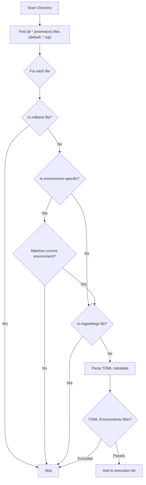

# Environment-Specific Files

Migration files can target specific environments using filename suffixes.

## Naming Pattern

```
{Sequence}_{Description}.{Environment}.{Extension}
```

### Examples

```
001_CreateTable.sql                 # All environments
001_CreateTable.Development.sql     # Development only
001_CreateTable.Production.sql      # Production only
001_CreateTable.Docker.sql          # Docker only
```

## Resolution Behavior

Environment-specific files that do not match the current environment are **excluded** from discovery. Generic files (without environment suffix) are always included. If both a generic file and a matching environment-specific file exist, **both are included** in the execution list.

> **Important**: There is no automatic precedence or exclusion logic. If `001_CreateTable.sql` and `001_CreateTable.Docker.sql` both exist and the environment is Docker, both files will be discovered and executed. To use environment-specific variants exclusively, **do not create a generic version** of the same file.

### Example Resolution

**Files in directory:**
```
001_CreateTable.sql
001_CreateTable.Production.sql
001_CreateTable.Docker.sql
```

| Environment | Files Discovered |
|-------------|-----------------|
| Development | `001_CreateTable.sql` |
| Staging | `001_CreateTable.sql` |
| Production | `001_CreateTable.sql`, `001_CreateTable.Production.sql` |
| Docker | `001_CreateTable.sql`, `001_CreateTable.Docker.sql` |

### Recommended Pattern

To avoid executing both generic and environment-specific files, use **only** environment-specific variants without a generic version:

```
01_ooc_login.Docker.sql          # Docker only
01_ooc_login.Production.sql      # Production only
```

Or use TOML `Environments` filtering in a single file instead (see [TOML Alternative](#toml-alternative) below).

## Common Use Cases

### 1. Different Connection Credentials

**Development**: `01_ooc_login.Development.sql`
```sql
/*
[RayMigrator]
Description = "Create development login"
*/

CREATE LOGIN devuser WITH PASSWORD = 'DevPassword123';
```

**Production**: `01_ooc_login.Production.sql`
```sql
/*
[RayMigrator]
Description = "Create production login"
*/

-- Production uses environment variables
CREATE LOGIN {ENV:DB_LOGIN} WITH PASSWORD = '{ENV:DB_PASSWORD}';
```

### 2. Environment-Specific Data

**Development**: `002_InsertTestData.Development.sql`
```sql
/*
[RayMigrator]
Description = "Insert test data for development"
*/

INSERT INTO Users (Username, Email) VALUES
    ('testuser1', 'test1@example.com'),
    ('testuser2', 'test2@example.com'),
    ('admin', 'admin@example.com');
```

**Production**: `002_InsertTestData.Production.sql`
```sql
/*
[RayMigrator]
Description = "Insert production defaults only"
*/

-- Only system account for production
INSERT INTO Users (Username, Email) VALUES
    ('system', 'system@company.com');
```

### 3. Performance Tuning

**Development**: Uses default settings (no environment-specific file)

**Production**: `003_CreateIndexes.Production.sql`
```sql
/*
[RayMigrator]
Description = "Production-optimized indexes"
*/

-- More aggressive indexing for production load
CREATE INDEX IX_Orders_CustomerId ON Orders(CustomerId) WITH (FILLFACTOR = 90);
CREATE INDEX IX_Orders_OrderDate ON Orders(OrderDate) WITH (FILLFACTOR = 95);
CREATE INDEX IX_Orders_Status ON Orders(Status) INCLUDE (TotalAmount);
```

### 4. Database Engine Differences

**Docker (MariaDB)**: `001_CreateTable.Docker.sql`
```sql
/*
[RayMigrator]
Description = "Create users table - MariaDB syntax"
*/

CREATE TABLE Users (
    Id INT AUTO_INCREMENT PRIMARY KEY,
    Username VARCHAR(100) NOT NULL,
    CreatedAt TIMESTAMP DEFAULT CURRENT_TIMESTAMP
) ENGINE=InnoDB;
```

**Production (SQL Server)**: `001_CreateTable.Production.sql`
```sql
/*
[RayMigrator]
Description = "Create users table - SQL Server syntax"
*/

CREATE TABLE Users (
    Id INT IDENTITY(1,1) PRIMARY KEY,
    Username NVARCHAR(100) NOT NULL,
    CreatedAt DATETIME2 DEFAULT SYSUTCDATETIME()
);
```

## Combined with Rollback

Environment-specific files can have rollbacks:

```
001_CreateTable.Production.sql
001_CreateTable.Production.rollback.sql
```

### Pattern

```
{Sequence}_{Description}.{Environment}.rollback.{Extension}
```

## Combined with migsettings

Environment-specific `migsettings` files apply settings:

```
Backend/
├── migsettings.txt              # Base settings
├── migsettings.Development.txt  # Development overrides
├── migsettings.Production.txt   # Production overrides
├── 001_CreateTable.sql
└── 001_CreateTable.Production.sql
```

**Processing order:**
1. `migsettings.txt` → base settings
2. `migsettings.{Environment}.txt` → environment overrides
3. Migration file TOML → file-specific settings

## TOML Alternative

Instead of separate files, use TOML filtering:

```sql
/*
[RayMigrator]
Description = "Development test data"
Environments = ["Development", "Docker"]
*/

INSERT INTO Users (...);
```

### When to Use Each Approach

| Approach | Best For |
|----------|----------|
| **Separate files** | Completely different SQL syntax, large differences |
| **TOML filtering** | Same SQL, just environment restriction |

## File Discovery



Files are processed independently — there is no grouping by base name or precedence logic between generic and environment-specific files.

## Best Practices

### 1. Avoid Mixing Generic and Environment-Specific Files

Do not create a generic file alongside an environment-specific variant with the same base name — both would be discovered and executed for the matching environment:

```
001_CreateTable.sql              # Runs in ALL environments (including Production)
001_CreateTable.Production.sql   # ALSO runs in Production → duplicate execution!
```

Instead, use one of these patterns:

**Option A**: Only environment-specific variants (no generic version):
```
001_CreateTable.Docker.sql       # Docker only
001_CreateTable.Production.sql   # Production only
```

**Option B**: A single generic file with a TOML `Environments` filter:
```sql
/*
[RayMigrator]
Environments = ["Docker", "Staging"]
*/
```

### 2. Document Environment Differences

Add comments explaining why the file differs:

```sql
/*
[RayMigrator]
Description = "Create table - Production version with partitioning"
*/

-- Production uses table partitioning for performance
-- Development/Docker use simpler non-partitioned tables
CREATE TABLE Orders (
    ...
) ON [PartitionScheme](OrderDate);
```

### 3. Use Consistent Naming

The environment suffix in the filename is compared **case-insensitively** against the `--environment` CLI argument (or `DOTNET_ENVIRONMENT`). Use consistent naming across all files:

```
001_CreateTable.Docker.sql        # Matches --environment Docker
001_CreateTable.Production.sql    # Matches --environment Production
001_CreateTable.Development.sql   # Matches --environment Development
```

### 4. Test All Environments

Ensure migrations work in all target environments before release.

## Related Documentation

- [File Naming](file-naming.md)
- [TOML Metadata](toml-metadata.md)
- [migsettings Files](migsettings-files.md)
- [Directory Structure](directory-structure.md)
