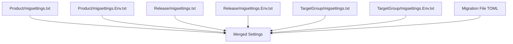

# migsettings Files

Control files provide directory-wide TOML settings for migration files.

## Purpose

- Set defaults for all migrations in a directory
- Override parent directory settings
- Provide environment-specific overrides

## File Names

| File | Scope |
|------|-------|
| `migsettings.txt` | Base settings for directory |
| `migsettings.{Environment}.txt` | Environment-specific overrides |

## Inheritance Hierarchy



Priority (lowest to highest):
1. Product-level `migsettings.txt`
2. Product-level `migsettings.{Environment}.txt`
3. Release-level `migsettings.txt`
4. Release-level `migsettings.{Environment}.txt`
5. Target group `migsettings.txt`
6. Target group `migsettings.{Environment}.txt`
7. Migration file TOML (highest)

### Flat Layout

When a single-target-group product uses the flat layout (migration files directly under the release directory, no target group subdirectory), levels 5 and 6 are absent. The release-level `migsettings.txt` is the deepest directory-level override before the per-file TOML header.

## Syntax

Migsettings files (`.txt`) use the `[RayMigrator]` section header directly as plain TOML. Migration files (`.sql`) wrap the TOML block in a SQL comment (`/* ... */`).

Migsettings files support ten of the eleven TOML parameters available in migration files: all parameters except `Description`, which is accepted without error (since both migsettings and migration files share the same TOML parser) but has no effect in migsettings files — it is only meaningful in individual migration file TOML headers. The `TargetGroupMigrationOrder` parameter is also supported and is meaningful at the release level.

**migsettings.txt** (plain TOML, no SQL comment wrapper):

```toml
[RayMigrator]
Environments = ["*"]
Targets = ["*"]
UseTransaction = true
RunAlways = false
RequireRollbackFile = true
StopRollbackOnMissingRollbackFile = true  # Accepted by parser but has no effect; set in appsettings.json instead
MigrationErrorAction = Rollback  # Terminate | Rollback | RollbackErrorOnly | RollbackRelease | Ignore
RollbackErrorAction = Terminate  # Terminate | Ignore
UseCliToolAlias = "sqlcmd-tool"      # References CliTools[].Alias in appsettings.json
TargetGroupMigrationOrder = ["Frontend", "Backend"]  # Release-level override; omit to use product config or CLI value
```

**Migration .sql file** (TOML wrapped in SQL block comment):

```sql
/*
[RayMigrator]
Description = "Create tables"
UseTransaction = true
*/

CREATE TABLE ...;
```

Key parsing is **case-insensitive**. Enum values (`MigrationErrorAction`, `RollbackErrorAction`) are also case-insensitive and may optionally be quoted (`Rollback` or `"Rollback"`). Lines starting with `#` are treated as comments and skipped. Unknown keys cause a `MigrationFileParsingException`.

### Supported Parameters

| Parameter | Type | Default | Description |
|-----------|------|---------|-------------|
| `UseTransaction` | bool | `true` | Wrap migration in a database transaction |
| `RunAlways` | bool | `false` | Re-execute every migration run |
| `RequireRollbackFile` | bool? | inherits | Require a rollback file. When omitted, inherits from parent migsettings or product config (default: `true`) |
| `StopRollbackOnMissingRollbackFile` | bool? | inherits | Accepted by the parser (to avoid an "unknown key" error) but has no effect. The effective value at runtime is resolved from appsettings only: CLI option → TargetGroup → Product → ProductDefaults → default (`true`). Unlike other migsettings parameters, this value is not applied to individual file metadata or consulted during rollback chain execution. |
| `Environments` | array | not specified (= all) | Allowed environments. Use `["*"]` or omit for all |
| `Targets` | array | not specified (= all) | Target databases (metadata only, not used for runtime filtering). Use `["*"]` or omit for all |
| `MigrationErrorAction` | string? | inherits | Error handling strategy. Values: `Terminate`, `Rollback`, `RollbackErrorOnly`, `RollbackRelease`, `Ignore` |
| `RollbackErrorAction` | string? | inherits | Rollback error handling strategy. Values: `Terminate`, `Ignore`. **Note**: migsettings only affect forward migration file metadata. Rollback files are parsed independently without migsettings inheritance; use TOML in the rollback file itself or the product-level config instead. |
| `UseCliToolAlias` | string? | inherits | CLI tool alias for executing migrations instead of the built-in DAL. References a `CliTools[].Alias` in `appsettings.json`. When omitted, inherits from parent migsettings or the Target/TargetGroup/Product/ProductDefaults configuration cascade. **Note**: like `RollbackErrorAction`, migsettings only affect forward migration file metadata. Rollback files are parsed independently without migsettings inheritance. |
| `TargetGroupMigrationOrder` | string[]? | not set | **Release-level only.** Array of target group aliases defining execution order for this release. Overrides the product-level `TargetGroupMigrationOrder` appsettings value and is itself overridden by the CLI `--TargetGroup-MigrationOrder` option. All aliases must be listed; duplicates and unknown aliases are rejected. Case-sensitive. Only meaningful at release-level (not target-group-level) migsettings. Applies to `Migrate-Up` and `Baseline` only. |

## Examples

### Product-Level Base Settings

**`RayMigratorTests/migsettings.txt`**:
```toml
[RayMigrator]
# Default settings for all migrations in this product
UseTransaction = true
RunAlways = false
```

### Environment Overrides

**`RayMigratorTests/migsettings.Development.txt`**:
```toml
[RayMigrator]
# Development allows re-running migrations
RunAlways = false
```

**`RayMigratorTests/migsettings.Production.txt`**:
```toml
[RayMigrator]
# Production is stricter
UseTransaction = true
RunAlways = false
```

### Target Group Settings

**`Release 1.0/Backend/migsettings.txt`**:
```toml
[RayMigrator]
# Backend migrations default to all targets
Targets = ["*"]
UseTransaction = true
```

**`Release 1.0/Backend/migsettings.Docker.txt`**:
```toml
[RayMigrator]
# Docker environment specific
Environments = ["Docker"]
```

## Merge Behavior

Settings merge at each level. More specific (deeper) directories override less specific ones. Within the same directory, environment-specific files override the base file. Only properties that are **explicitly set** in a migsettings file override parent values; omitted properties are inherited from the parent.

**Arrays are replaced, not merged**: When a child migsettings file sets `Targets` or `Environments`, the parent's list is completely replaced, not merged with the child's list.

### Example

**Product `migsettings.txt`**:
```toml
[RayMigrator]
UseTransaction = true
RunAlways = false
Targets = ["*"]
```

**Target group `migsettings.txt`**:
```toml
[RayMigrator]
Targets = ["Primary", "Secondary"]
```

**Migration file**:
```sql
/*
[RayMigrator]
RunAlways = true
*/
```

**Final merged settings**:
```toml
UseTransaction = true    # from product
RunAlways = true         # from migration file (overridden)
Targets = ["Primary", "Secondary"]  # from target group (overridden)
```

## Directory Structure with migsettings

```
RayMigratorTests/
├── migsettings.txt                    # Product defaults
├── migsettings.Development.txt        # Dev overrides
├── migsettings.Production.txt         # Prod overrides
├── Release 1.0/
│   ├── migsettings.txt                # Release defaults (optional)
│   ├── migsettings.Docker.txt         # Release env overrides (optional)
│   ├── Backend/
│   │   ├── migsettings.txt            # Backend defaults
│   │   ├── migsettings.Docker.txt     # Docker overrides
│   │   └── 001_CreateTable.sql
│   └── Frontend/
│       ├── migsettings.txt            # Frontend defaults
│       └── 001_CreateTable.sql
└── Release 1.1/
    └── Backend/
        └── 001_AddColumn.sql
```

## Common Patterns

### Disable Transactions for Target Group

**`Backend/migsettings.txt`**:
```toml
[RayMigrator]
# MariaDB backend doesn't support DDL in transactions
UseTransaction = false
```

### Filter by Environment

**`Backend/migsettings.Production.txt`**:
```toml
[RayMigrator]
# Only run in Production
Environments = ["Production"]
```

### Target-Specific Directory

**`PrimaryOnly/migsettings.txt`**:
```toml
[RayMigrator]
# All files here only target Primary
Targets = ["Primary"]
```

## Best Practices

1. **Use product-level for defaults**: Set sensible defaults at product root
2. **Override only what's needed**: Don't repeat parent settings
3. **Document purpose**: Add comments explaining settings
4. **Keep it simple**: Prefer file-level TOML for specific needs
5. **Test inheritance**: Verify merged settings work as expected

## Related Documentation

- [TOML Metadata](toml-metadata.md)
- [Directory Structure](directory-structure.md)
- [Environment-Specific](environment-specific.md)
- [Settings Inheritance Overview](../06-configuration-reference/settings-inheritance-overview.md)
- [CLI Tools Options](../06-configuration-reference/cli-tools-options.md) - `UseCliToolAlias` and CLI tool configuration
