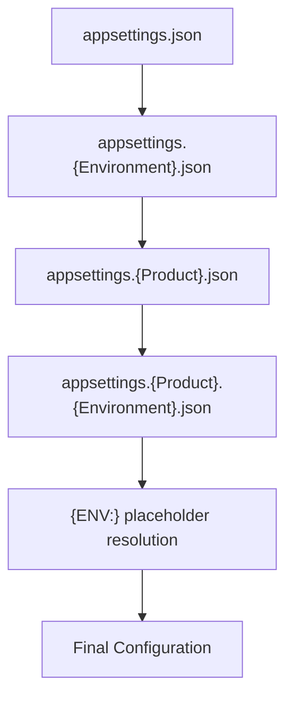

# Global Options

Options available across all RayMigrator commands.

## Syntax

```bash
raymigrator <command> [command-options] [global-options]
```

## Global Options

### --startup-info (-si)

Controls display of application information at startup.

| Value | Description |
|-------|-------------|
| `true` | Show version, copyright, system info (default) |
| `false` | Suppress startup information |

**Example:**
```bash
# Quiet mode for scripts
raymigrator migrate-up -p MyProduct -env Prod -rm migrate --startup-info false
```

**Startup Info Includes:**
- ASCII logo with embedded version number
- Website URL
- Product tagline
- Copyright

### --reveal-sensitive-data (-rsd)

Controls logging of sensitive information.

| Value | Description |
|-------|-------------|
| `true` | Log connection strings, passwords in output |
| `false` | Mask sensitive data (default) |

**Example:**
```bash
# Debug connection issues
raymigrator migrate-up -p MyProduct -env Dev -rm simulate --reveal-sensitive-data true
```

**Logged When Enabled:**
- Full connection strings
- Repository schema names and table base names
- Migration file root directories
- Environment variable values

### --config-dir (-cd)

Overrides the directory where RayMigrator searches for `appsettings.json` configuration files.

| Value | Description |
|-------|-------------|
| `<path>` | Absolute or relative path to the configuration directory |
| (omitted) | Use the current working directory (default) |

When a relative path is provided, it is resolved to an absolute path via `Path.GetFullPath` at parse time. The `{ENV:VAR_NAME}` placeholder syntax is supported.

If the specified directory does not exist, RayMigrator exits with a `ConfigurationValidationException` before any migration is attempted.

**Examples:**
```bash
# Use configuration files from a specific directory
raymigrator migrate-up -p MyProduct -env Prod -rm migrate --config-dir /etc/raymigrator

# Use a relative path (resolved against the current working directory)
raymigrator migrate-up -p MyProduct -env Prod -rm migrate -cd ../config

# Use an environment variable for the path
raymigrator migrate-up -p MyProduct -env Prod -rm migrate -cd {ENV:CONFIG_DIR}
```

## Common Command Options

The following options are shared across most migration commands. They are **not** global options (not on the root command), but are defined identically on each command that uses them.

### --product (-p)

Product alias from configuration. Required for: migrate-up, migrate-down, validate-hash, update-hash, info, baseline, fix.

The value is matched case-sensitively against product aliases in the configuration. If the provided alias does not match but a case-insensitive match exists, RayMigrator will suggest the correct casing before exiting.

### --environment (-env)

Target environment. Required for: migrate-up, migrate-down, validate-hash, update-hash, info, baseline, fix.

The value is matched case-sensitively. It is used to load `appsettings.{Environment}.json` and `appsettings.{Product}.{Environment}.json` configuration files, and must therefore match the file-system casing of those files exactly.

### --run-mode (-rm)

Execution mode. Available on migrate-up and migrate-down. Default: `migrate`.

| Value | Description |
|-------|-------------|
| `migrate` | Execute migrations against target databases (default) |
| `simulate` | Validate, check DB connectivity, read repository records. Does NOT write repository records or execute SQL against target databases |
| `validate` | Validate configuration and migration files. Does NOT connect to any databases |

**Example:**
```bash
raymigrator migrate-up -p MyProduct -env Dev -rm simulate
```

### --to-release (-tr)

Target release version. Required for migrate-down. Optional for migrate-up and baseline (omit to process all releases).

**Example:**
```bash
raymigrator migrate-down -p MyProduct -env Prod -rm migrate --to-release "Release 1.0"
raymigrator baseline -p MyProduct -env Prod --to-release "Release 2.0"
```

### --target-group (-tg)

Filter execution to specific target groups. Can be specified multiple times. Available on: migrate-up, migrate-down, validate-hash, update-hash, baseline.

**Example:**
```bash
raymigrator migrate-up -p MyProduct -env Prod -rm migrate --target-group Backend --target-group Frontend
```

### --allow-out-of-order (-ooo)

Allow out-of-order migration execution. Available on migrate-up only. Default: `false`.

**Example:**
```bash
raymigrator migrate-up -p MyProduct -env Dev -rm migrate --allow-out-of-order
```

### --scope (-s)

Context-dependent scope option, used by two commands:

**validate-hash:** Hash validation scope override. If omitted, uses the per-TargetGroup `HashValidationScope` configuration.

| Value | Description |
|-------|-------------|
| `file` | Validate hash of the entire migration file |
| `sqlblock` / `sqlblocks` | Validate hash of SQL content only (ignoring TOML metadata changes). Both forms are accepted. |
| `disabled` | Skip hash validation entirely (all files counted as valid) |

**Fix:** Fix scope. Default: `orphanedruns`.

| Value | Description |
|-------|-------------|
| `orphanedruns` | Fix only orphaned migration runs (default) |
| `all` | Fix all known issue types |

## Environment Variable Support

String-valued command parameters support environment variable resolution using the `{ENV:VariableName}` placeholder syntax. This applies to options such as `--product`, `--environment`, `--run-mode`, `--to-release`, `--target-group` (per individual alias value), `--scope`, `--last-migration-status`, and `--config-dir`. Options that do NOT support this syntax: non-string options (`--older-than`, `--dry-run`, `--allow-out-of-order`, `--startup-info`, `--reveal-sensitive-data`, `--stop-rollback-on-missing-rollback-file`) are parsed directly by System.CommandLine, and `--target-group-migration-order` is not resolved (use literal alias names).

If the referenced environment variable is not set or is empty, RayMigrator exits with exit code 5 (command-line parsing error).

```bash
raymigrator migrate-up --product {ENV:PRODUCT_NAME} --environment {ENV:TARGET_ENV}
```

### Syntax

```
{ENV:VariableName}
```

### Examples

```bash
# Using environment variables
export PRODUCT_NAME="MyProduct"
export TARGET_ENV="Production"

raymigrator migrate-up -p {ENV:PRODUCT_NAME} -env {ENV:TARGET_ENV} -rm migrate
```

### Mixed Usage

```bash
# Combine literal and environment values
raymigrator migrate-up -p MyProduct -env {ENV:DEPLOY_ENV} -rm migrate
```

## Help

### Command Help

```bash
# General help
raymigrator --help
RayMigrator -h

# Command-specific help
raymigrator migrate-up --help
raymigrator migrate-down -h
```

### Version

```bash
raymigrator --version
```

## Exit Codes

Standard exit codes across all commands:

| Code | Meaning |
|------|---------|
| 0 | Success |
| 1 | Execution error (migration failed, validation found issues, service exception) |
| 2 | Environment conflict (`--environment` and `DOTNET_ENVIRONMENT` differ) |
| 3 | Missing required environment (no `--environment` or `DOTNET_ENVIRONMENT`) |
| 4 | Missing or invalid configuration (no Serilog section found, config files not found) |
| 5 | Command-line parsing error (invalid arguments, missing required options) |
| 100 | Unhandled exception |

### Using Exit Codes

```bash
# Shell script
raymigrator migrate-up -p MyProduct -env Prod -rm migrate
if [ $? -ne 0 ]; then
    echo "Migration failed!"
    exit 1
fi

# PowerShell
raymigrator migrate-up -p MyProduct -env Prod -rm migrate
if ($LASTEXITCODE -ne 0) {
    Write-Error "Migration failed!"
    exit 1
}
```

## Configuration File Loading

RayMigrator loads configuration in this order:



All files are optional — a file is only loaded if it exists on disk. After loading, `{ENV:VARIABLE_NAME}` placeholders in configuration values are resolved from OS environment variables. CLI arguments are **not** part of the configuration file hierarchy — they are parsed separately by System.CommandLine.

## Logging Configuration

RayMigrator supports console/file logging via Serilog and optional structured logging to a database. See [Logging Options](../06-configuration-reference/logging-options.md) for full configuration details including Serilog JSON configuration, database logging setup, and per-sink log level control.

## Best Practices

### CI/CD Pipelines

```bash
# Suppress startup info, use environment variables
raymigrator migrate-up \
  -p {ENV:PRODUCT} \
  -env {ENV:ENVIRONMENT} \
  -rm migrate \
  --startup-info false

# Configuration files stored outside the working directory
raymigrator migrate-up \
  -p {ENV:PRODUCT} \
  -env {ENV:ENVIRONMENT} \
  -rm migrate \
  --startup-info false \
  --config-dir {ENV:CONFIG_DIR}
```

### Debugging

```bash
# Enable sensitive data for troubleshooting
raymigrator migrate-up -p MyProduct -env Dev -rm simulate --reveal-sensitive-data true

# Clean up logs after debugging!
```

### Scripts

```bash
#!/bin/bash
set -e  # Exit on error

# Validate before migrate
raymigrator validate-hash -p "$PRODUCT" -env "$ENV" --startup-info false

# Execute migration
raymigrator migrate-up -p "$PRODUCT" -env "$ENV" -rm migrate --startup-info false

echo "Migration completed successfully"
```

## Command Reference

| Command | Description | Status |
|---------|-------------|--------|
| [migrate-up](migrate-up.md) | Execute forward migrations | Implemented |
| [migrate-down](migrate-down.md) | Rollback migrations | Implemented |
| [validate-hash](validate-hash.md) | Check file integrity | Implemented |
| [update-hash](update-hash.md) | Update stored hashes | Implemented |
| [Info](command-reference.md#info) | Display migration status information | Implemented |
| [Baseline](command-reference.md#baseline) | Mark existing database as migrated | Implemented |
| [Fix](command-reference.md#fix) | Fix repository inconsistencies | Implemented |
| [Command Reference](command-reference.md) | Complete command and option matrix | Reference |

## Related Documentation

- [Configuration System](../02-core-concepts/configuration-system.md)
- [Logging Options](../06-configuration-reference/logging-options.md)
- [Environment Variables](../06-configuration-reference/environment-variables.md)
