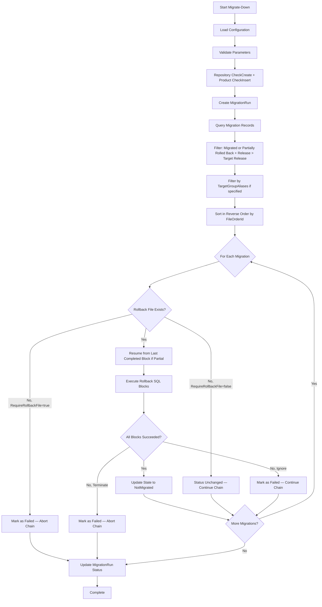

# Migrate-Down Command

Executes database migrations in reverse (down) direction using rollback files.

## Synopsis

```bash
raymigrator Migrate-Down --product <ProductAlias> --environment <Environment> --to-release <ReleaseVersion> [options]
```

## Description

The `Migrate-Down` command reverses previously applied migrations by executing their corresponding rollback files. Migrations are rolled back in reverse order from the current state to the specified target release version.

## Required Parameters

| Parameter | Short | Description |
|-----------|-------|-------------|
| `--product` | `-p` | Product alias as defined in configuration |
| `--environment` | `-env` | Target environment (e.g., Development, Production) |
| `--to-release` | `-tr` | Target release version to rollback to |

## Optional Parameters

| Parameter | Short | Default | Description |
|-----------|-------|---------|-------------|
| `--run-mode` | `-rm` | `Migrate` | Execution mode: `Migrate`, `Simulate`, or `Validate` |
| `--target-group` | `-tg` | (all) | Filter rollback to specific target groups (can be specified multiple times) |
| `--startup-info` | `-si` | `true` | Show application info at startup |
| `--reveal-sensitive-data` | `-rsd` | `false` | Log sensitive data (passwords) |
| `--config-dir` | `-cd` | (current directory) | Override directory where RayMigrator searches for configuration files |

### Run Modes

| Mode | Description |
|------|-------------|
| `Validate` | Validates rollback file existence and parseability without any database connections |
| `Simulate` | Validates and processes everything, reads repository records, but does not write repository records or execute rollback SQL on targets |
| `Migrate` | Validates, then performs actual rollback against target databases |

See [Execution Modes — Run Mode](../02-core-concepts/execution-modes.md#run-mode) for detailed behavior.

## Examples

### Rollback to Specific Release

```bash
# Rollback to Release 1.0
raymigrator Migrate-Down --product MyProduct --environment Production --to-release "Release 1.0"
```

### Simulate Rollback

```bash
# Test what would be rolled back
raymigrator Migrate-Down -p MyProduct -env Staging -rm Simulate -tr "Release 1.0"
```

### Development Rollback

```bash
# Rollback in development environment
raymigrator Migrate-Down -p MyProduct -env Development -rm Migrate -tr "Release 2.0"
```

### Rollback Specific Target Groups

```bash
# Rollback only Backend target group
raymigrator Migrate-Down -p MyProduct -env Production -tr "Release 1.0" -tg Backend

# Rollback Backend and Frontend, leave Analytics untouched
raymigrator Migrate-Down -p MyProduct -env Production -tr "Release 1.0" -tg Backend -tg Frontend
```

## Execution Flow



## Rollback Order

The query filters for migration records that are either in `Migrated` status or in `Failed` status with partial rollback progress (i.e., a previous rollback was interrupted partway through). This enables **rollback resumption** -- if a rollback was partially completed and then aborted, a subsequent Migrate-Down will resume from where it left off rather than re-executing already-completed rollback blocks.

Migrations are rolled back in **reverse** order of their original execution:

**Original Migration Order:**
```
1. Release 1.0/Backend/001_CreateTable.sql
2. Release 1.0/Backend/002_InsertData.sql
3. Release 2.0/Backend/001_AddColumn.sql
```

**Rollback Order (to Release 1.0):**
```
1. Release 2.0/Backend/001_AddColumn.rollback.sql
```

**Rollback Order (to start):**
```
1. Release 2.0/Backend/001_AddColumn.rollback.sql
2. Release 1.0/Backend/002_InsertData.rollback.sql
3. Release 1.0/Backend/001_CreateTable.rollback.sql
```

## Rollback File Discovery

RayMigrator looks for rollback files using the configured naming convention:

```
{MigrationFilename}.{RollbackExtension}.{Extension}
```

Default: `Migration.rollback.sql`

### Custom Rollback Extension

Configure via product settings:
```json
{
  "Products": [{
    "MigrationRollbackFilesPreExtension": "down"
  }]
}
```

Result: `Migration.down.sql`

## Missing Rollback Files

Behavior depends on the `RequireRollbackFile` product setting:

### RequireRollbackFile = true (default)

| Behavior | Description |
|----------|-------------|
| Error Logged | The missing file is treated as a structural error |
| State Updated | Migration status becomes "Failed" |
| Chain Aborted | The entire rollback chain is aborted immediately |

### RequireRollbackFile = false

| Behavior | Description |
|----------|-------------|
| Info Logged | The missing file is logged at Information level |
| State Unchanged | Migration status is not updated (retains its current status, e.g., `Migrated`) |
| Continue | Next rollback proceeds |

## Non-Reversible Operations

Some operations cannot be rolled back:

| Operation | Reversible | Notes |
|-----------|------------|-------|
| CREATE TABLE | Yes | DROP TABLE |
| DROP TABLE | No | Data lost |
| ADD COLUMN | Yes | DROP COLUMN |
| DROP COLUMN | No | Data lost |
| INSERT DATA | Yes | DELETE |
| DELETE DATA | Conditional | Need backup |
| TRUNCATE | No | Data lost |

### Handling Non-Reversible Operations

Create a rollback file that documents the limitation:

```sql
/*
[RayMigrator]
Description = "WARNING: Data deleted, cannot restore automatically"
*/

-- Manual restoration required
-- See backup: backup_20250129.bak
SELECT 1;  -- No-op placeholder
```

## RollbackErrorAction

Controls behavior when a rollback SQL block fails during execution. Configured at product level or overridden per rollback file via TOML metadata.

| Value | Numeric | Description |
|-------|---------|-------------|
| Undefined | 0 | Invalid value (resolves to Terminate at runtime) |
| Terminate | 10 | Abort the entire rollback chain immediately (default) |
| Ignore | 30 | Skip the failed block, continue with remaining blocks in the same file, mark the file as Failed, then continue with the next file |

See [Error Handling](../02-core-concepts/error-handling.md) for details.

## State Changes

After successful rollback (all SQL blocks pass), migration states change:

| Before | After |
|--------|-------|
| Migrated | NotMigrated |

If rollback SQL fails with `RollbackErrorAction=Terminate`, or rollback file is missing with `RequireRollbackFile=true`:

| Before | After | Chain |
|--------|-------|-------|
| Migrated | Failed | Aborted |

If rollback SQL fails with `RollbackErrorAction=Ignore`:

| Before | After | Chain |
|--------|-------|-------|
| Migrated | Failed | Continues |

If rollback file is missing with `RequireRollbackFile=false`:

| Before | After | Chain |
|--------|-------|-------|
| Migrated | Unchanged (Migrated) | Continues |

## Exit Codes

→ See [Global Options — Exit Codes](global-options.md#exit-codes) for the complete exit code table.

## Best Practices

1. **Always test in non-production first**
   ```bash
   raymigrator Migrate-Down -p MyProduct -env Development -rm Simulate -tr "Release 1.0"
   ```

2. **Backup before rollback in production**

3. **Create rollback files for all production migrations**

4. **Test rollback files before deployment**

5. **Document non-reversible operations clearly**

## Related Commands

- [Migrate-Up](migrate-up.md) - Forward migrations
- [Global Options](global-options.md) - Common options

## Related Documentation

- [Rollback Files](../07-migration-files/rollback-files.md)
- [Migration State Machine](../02-core-concepts/migration-state-machine.md)
- [Error Handling](../02-core-concepts/error-handling.md)
