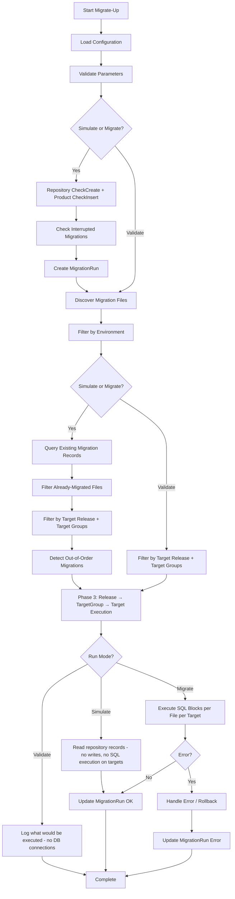

# Migrate-Up Command

Executes database migrations in forward (up) direction.

## Synopsis

```bash
raymigrator Migrate-Up --product <ProductAlias> --environment <Environment> [--run-mode <mode>] [--stop-rollback-on-missing-rollback-file <bool>] [options]
```

## Description

The `Migrate-Up` command executes all pending migration files against configured target databases. It processes migrations in order from the current state to the target release version.

## Required Parameters

| Parameter | Short | Description |
|-----------|-------|-------------|
| `--product` | `-p` | Product alias as defined in configuration |
| `--environment` | `-env` | Target environment (e.g., Development, Production) |

## Optional Parameters

| Parameter | Short | Default | Description |
|-----------|-------|---------|-------------|
| `--run-mode` | `-rm` | `Migrate` | Execution mode: `Migrate`, `Simulate`, or `Validate` |
| `--to-release` | `-tr` | (latest) | Migrate to specific release version |
| `--target-group` | `-tg` | (all) | Filter to specific target groups (can be specified multiple times) |
| `--allow-out-of-order` | `-ooo` | `false` | Allow execution of migrations that precede already-executed files |
| `--stop-rollback-on-missing-rollback-file` | `-sromrf` | `null` (uses configuration value) | Override whether the error-recovery rollback chain stops when a rollback file is missing. Only applies when `RequireRollbackFile=false`. |
| `--TargetGroup-MigrationOrder` | `-tgmo` | (config/migsettings order) | Comma-separated list of TargetGroup aliases defining execution order for this run |
| `--startup-info` | `-si` | `true` | Show application info at startup |
| `--reveal-sensitive-data` | `-rsd` | `false` | Log sensitive data (passwords) |
| `--config-dir` | `-cd` | (current directory) | Override directory where RayMigrator searches for configuration files |

### Run Modes

| Mode | Description |
|------|-------------|
| `Validate` | Validates configuration and all migration files without any database connections |
| `Simulate` | Validates and processes everything, reads repository records, but does not write repository records or execute SQL on targets |
| `Migrate` | Validates, then performs actual migrations against target databases |

See [Execution Modes — Run Mode](../02-core-concepts/execution-modes.md#run-mode) for detailed behavior.

### Out-of-Order Parameter

| Parameter | Short | Default | Description |
|-----------|-------|---------|-------------|
| `--allow-out-of-order` | `-ooo` | `false` | Allow execution of migrations that precede already-executed files |

### StopRollbackOnMissingRollbackFile Parameter

| Parameter | Short | Default | Description |
|-----------|-------|---------|-------------|
| `--stop-rollback-on-missing-rollback-file` | `-sromrf` | `null` (uses configuration value) | Override whether the error-recovery rollback chain stops when a rollback file is missing. Only applies when `RequireRollbackFile=false`. |

When omitted, the value from configuration is used. When `true`, the error-recovery rollback chain stops at the first missing rollback file. A warning is logged and the record status is left unchanged. When `false`, the chain continues past missing rollback files with a warning per skipped file. This option has no effect on Migrate-Down.

```bash
# Allow error-recovery rollback to continue past missing rollback files
raymigrator Migrate-Up -p MyProduct -env Production -rm Migrate -sromrf false
```

### TargetGroup-MigrationOrder Parameter

| Parameter | Short | Default | Description |
|-----------|-------|---------|-------------|
| `--TargetGroup-MigrationOrder` | `-tgmo` | (config/migsettings order) | Comma-separated list of all TargetGroup aliases. Sets the execution order for this run; overrides product-level appsettings and release-level migsettings values. |

The value is a single string with alias names separated by commas. Whitespace around each alias is trimmed. All TargetGroup aliases of the product must be listed. The option is only meaningful when the product has more than one TargetGroup, and matching is case-sensitive.

```bash
# Execute Frontend before Backend for this run
raymigrator Migrate-Up -p MyProduct -env Production -rm Migrate -tgmo "Frontend, Backend"
```

## Environment Variable Support

All parameter values can be loaded from environment variables:

```bash
raymigrator Migrate-Up --product {ENV:PRODUCT_NAME} --environment {ENV:TARGET_ENV} --run-mode Migrate
```

## Examples

### Basic Migration

```bash
# Migrate to latest version in Development
raymigrator Migrate-Up --product MyProduct --environment Development --run-mode Migrate
```

### Simulate Migration

```bash
# Test what would be migrated without executing
raymigrator Migrate-Up -p MyProduct -env Staging -rm Simulate
```

### Migrate to Specific Release

```bash
# Migrate only up to Release 2.0
raymigrator Migrate-Up --product MyProduct --environment Production --run-mode Migrate --to-release "Release 2.0"
```

### Migrate Specific Target Groups

```bash
# Migrate only Backend target group
raymigrator Migrate-Up -p MyProduct -env Production -rm Migrate -tg Backend

# Migrate Backend and Analytics target groups
raymigrator Migrate-Up -p MyProduct -env Production -rm Migrate -tg Backend -tg Analytics
```

### Control TargetGroup Execution Order

```bash
# Execute Frontend before Backend (overrides config array order)
raymigrator Migrate-Up -p MyProduct -env Production -rm Migrate -tgmo "Frontend, Backend"
```

### Debug Mode

```bash
# Show sensitive data in logs for debugging
raymigrator Migrate-Up -p MyProduct -env Development -rm Migrate --reveal-sensitive-data true
```

## Execution Flow



## Migration Processing

### Order of Operations

1. **Release Versions**: Processed in alphabetical order by directory name
2. **Target Groups**: Processed in configuration order
3. **Within each Target Group**: Execution depends on the `TargetMigrationOrder` configuration setting:
   - **Simultaneously**: Each migration file is applied to all targets before the next file (file-first loop)
   - **Successively**: Each target receives all migration files before the next target (target-first loop)
4. **Migration Files**: Processed in alphabetical order by relative path (case-insensitive)

### Per-File Execution (Phase 3)

For each migration file and target combination during Phase 3:

1. Insert Migration record in repository (Simulate/Migrate only)
2. Check for resumable partial execution from a previous interrupted run
3. Execute SQL blocks against the target database (Migrate only) or log what would be executed (Simulate/Validate)
4. Update Migration record status to `Migrated` (Simulate/Migrate only)

> **Note:** File discovery, TOML parsing, environment filtering, already-migrated filtering, and hash computation all happen earlier in Phase 2 before execution begins.

## Error Handling

Error behavior depends on the `MigrationErrorAction` configuration (set at product level, can be overridden per-file via TOML metadata or migsettings):

| Action | Behavior |
|--------|----------|
| `Terminate` | Stop immediately on error, no rollback performed |
| `Rollback` | Rollback all migrations in current run (failed + all previously successful) |
| `RollbackErrorOnly` | Rollback only the failed migration file |
| `RollbackRelease` | Rollback all migrations from the failed release only (earlier releases remain intact) |
| `Ignore` | Mark failed file as `Failed`, skip remaining targets for this file, continue with next file |

For all actions except `Ignore`, an error aborts the entire migration run. The `Ignore` action allows the run to continue with subsequent files.

## Exit Codes

→ See [Global Options — Exit Codes](global-options.md#exit-codes) for the complete exit code table.

## Concurrent Execution Protection

RayMigrator prevents concurrent migrations for the same Product, Environment, and RunMode combination. If a migration is already running for the given combination (identified by ProductId + Environment + MigrationRunModeId):

- New migration attempts are blocked with a `MigrationAlreadyRunningException`
- Use the `Fix` command to recover from stuck runs

## Related Commands

- [Migrate-Down](migrate-down.md) - Rollback migrations
- [Validate-Hash](validate-hash.md) - Check file integrity
- [Global Options](global-options.md) - Common options

## Related Documentation

- [Execution Modes](../02-core-concepts/execution-modes.md) - Out-of-Order Migration
- [Error Handling](../02-core-concepts/error-handling.md)
- [Migration State Machine](../02-core-concepts/migration-state-machine.md)
- [Product Options](../06-configuration-reference/product-options.md)
