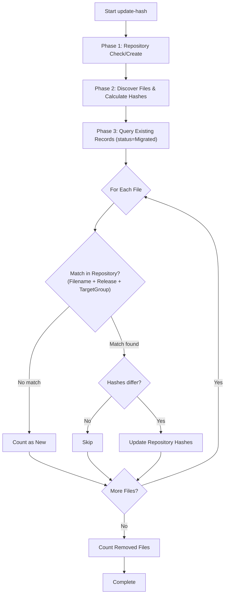

# update-hash Command

Updates stored hash values to match current migration file content.

## Synopsis

```bash
raymigrator update-hash --product <ProductAlias> --environment <Environment> [options]
```

## Description

The `update-hash` command recalculates and stores new hash values for all previously migrated files (status `Migrated`). Use this after intentionally modifying migration files (e.g., fixing comments, updating metadata) to prevent hash validation failures.

## Required Parameters

| Parameter | Short | Description |
|-----------|-------|-------------|
| `--product` | `-p` | Product alias as defined in configuration |
| `--environment` | `-env` | Target environment |

## Optional Parameters

| Parameter | Short | Default | Description |
|-----------|-------|---------|-------------|
| `--target-group` | `-tg` | (all) | Filter to specific target groups (can be specified multiple times) |
| `--startup-info` | `-si` | `true` | Show application info at startup |
| `--reveal-sensitive-data` | `-rsd` | `false` | Log sensitive data |
| `--config-dir` | `-cd` | (current directory) | Override directory where RayMigrator searches for configuration files |

## Examples

### Update All Hashes

```bash
# Update hashes for all migrated files
raymigrator update-hash --product MyProduct --environment Production
```

### After TOML Metadata Fix

```bash
# After fixing a typo in a description
raymigrator update-hash -p MyProduct -env Development
```

### Update Hashes for Specific Target Groups

```bash
# Update only Backend target group hashes
raymigrator update-hash -p MyProduct -env Production -tg Backend
```

## Execution Flow



## What Gets Updated

All three hash fields are always updated together, regardless of the `HashValidationScope` setting:

| Hash Type | Column | Description |
|-----------|--------|-------------|
| File Hash | `FileUpHash` | SHA-256 of entire file content |
| Config Hash | `FileUpConfigHash` | SHA-256 of TOML metadata section (optional, may be empty) |
| Block Hashes | `FileUpBlocksHash` | SHA-256 of SQL content (after TOML metadata extraction) |

## Output Format

Per-file progress lines are emitted for each file whose hashes changed:

```
Updating hashes for migration 001_CreateTable.sql (Release: Release 1.0, TargetGroup: Backend)
Updating hashes for migration 002_InsertData.sql (Release: Release 1.0, TargetGroup: Backend)
```

The summary line:

```
Update-Hash completed. Updated: 2, New: 0, Removed: 0
```

The summary reports three categories:

| Category | Meaning |
|----------|---------|
| Updated | Files whose hashes were recalculated and stored |
| New | Files on disk that are not yet migrated in the repository |
| Removed | Files recorded in the repository (status `Migrated`) but no longer on disk |

Files whose hashes have not changed are silently skipped.

## Use Cases

### 1. Fix Documentation

After fixing typos or improving descriptions:

```sql
/*
[RayMigrator]
Description = "Fixed typo in description"  -- Was: "Cretae users table"
*/
```

```bash
raymigrator update-hash -p MyProduct -env Production
```

### 2. Update Metadata

After changing TOML settings that don't affect SQL:

```sql
/*
[RayMigrator]
Description = "Create users"
Environments = ["*"]  -- Added for clarity
*/
```

### 3. Normalize Line Endings

After converting line endings (CRLF -> LF):

```bash
# Convert files
dos2unix *.sql

# Update hashes
raymigrator update-hash -p MyProduct -env Production
```

### 4. Bulk Comment Updates

After adding/updating comments across many files:

```bash
raymigrator update-hash -p MyProduct -env Production
```

## When NOT to Use

Do **NOT** use update-hash if:

| Scenario | Why Not |
|----------|---------|
| SQL logic changed | May cause inconsistencies |
| Unauthorized modification | Should investigate first |
| Before understanding change | Could hide problems |

### Instead, Do This

1. **Investigate the change first**
   ```bash
   raymigrator validate-hash -p MyProduct -env Production
   ```

2. **Review version control**
   ```bash
   git diff path/to/migration.sql
   ```

3. **Only update if change is intentional and safe**

## Repository Changes

The command updates these repository fields for each matching `Migration` record (matched by `Id`):

| Table | Column | Description |
|-------|--------|-------------|
| Migration | FileUpHash | SHA-256 of entire file |
| Migration | FileUpConfigHash | SHA-256 of TOML config section |
| Migration | FileUpBlocksHash | SHA-256 of SQL content (after TOML metadata extraction) |

Only records with `MigrationStatusId = Migrated` are considered. Other statuses (e.g., `NotMigrated`, `Failed`, `Pending`) are ignored.

## Exit Codes

→ See [Global Options — Exit Codes](global-options.md#exit-codes) for the complete exit code table.

## Best Practices

1. **Always validate first**
   ```bash
   raymigrator validate-hash -p MyProduct -env Production
   # Review what changed
   raymigrator update-hash -p MyProduct -env Production
   ```

2. **Document the reason for update**
   - Add git commit message explaining why hashes updated
   - Update change log if applicable

3. **Update in all environments**
   ```bash
   raymigrator update-hash -p MyProduct -env Development
   raymigrator update-hash -p MyProduct -env Staging
   raymigrator update-hash -p MyProduct -env Production
   ```

4. **Version control first**
   ```bash
   git add *.sql
   git commit -m "Fix documentation typos"
   raymigrator update-hash -p MyProduct -env Production
   ```

5. **Review changes in pull request**
   - Include update-hash step in deployment docs

## Alternative: HashValidationScope Configuration

Instead of updating hashes after TOML metadata changes, you can configure validation scope to only check SQL content:

```json
{
  "TargetGroups": [{
    "HashValidationScope": "SqlBlocks"
  }]
}
```

With `SqlBlocks`, validate-hash and migrate-up only compare `FileUpBlocksHash`, so TOML metadata changes do not trigger hash mismatches. The update-hash command itself always updates all three hash fields regardless of this setting.

## Related Commands

- [validate-hash](validate-hash.md) - Check file integrity
- [migrate-up](migrate-up.md) - Execute migrations

## Related Documentation

- [Hash Validation](../02-core-concepts/hash-validation.md)
- [Target Group Options](../06-configuration-reference/target-group-options.md)
