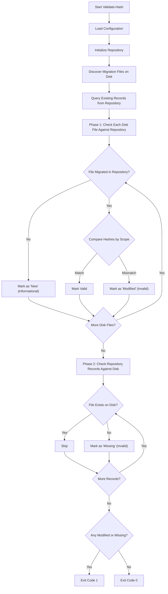

# Validate-Hash Command

Validates migration file integrity against stored hash values.

## Synopsis

```bash
RayMigrator Validate-Hash --product <ProductAlias> --environment <Environment> [options]
```

## Description

The `Validate-Hash` command checks that previously migrated files have not been modified since their execution. It compares SHA-256 hash values of current files against values stored in the repository.

This command is useful for:
- Pre-deployment verification
- Compliance auditing
- Detecting unauthorized changes
- CI/CD pipeline validation

## Required Parameters

| Parameter | Short | Description |
|-----------|-------|-------------|
| `--product` | `-p` | Product alias as defined in configuration |
| `--environment` | `-env` | Target environment |

## Optional Parameters

| Parameter | Short | Default | Description |
|-----------|-------|---------|-------------|
| `--scope` | `-s` | (per-TargetGroup config) | Validation scope override (File, SqlBlocks, Disabled). If omitted, uses the per-TargetGroup `HashValidationScope` config. |
| `--target-group` | `-tg` | (all) | Filter validation to specific target groups (can be specified multiple times) |
| `--startup-info` | `-si` | `true` | Show application info at startup |
| `--reveal-sensitive-data` | `-rsd` | `false` | Log sensitive data |
| `--config-dir` | `-cd` | (current directory) | Override directory where RayMigrator searches for configuration files |

### Scope Options

| Value | Description |
|-------|-------------|
| `File` | Validate entire file content including TOML config |
| `SqlBlocks` | Validate only SQL blocks (ignoring TOML config changes) |
| `SqlBlock` | Alias for `SqlBlocks` (both forms are accepted) |
| `Disabled` | Skip hash validation entirely (all files counted as valid) |

## Examples

### Basic Validation

```bash
# Validate all migrated files for a product
RayMigrator Validate-Hash --product MyProduct --environment Production
```

### Validate SQL Blocks Only

```bash
# Allow TOML metadata changes but validate SQL
RayMigrator Validate-Hash -p MyProduct -env Production --scope SqlBlocks
```

### Validate Specific Target Groups

```bash
# Validate only Backend target group
RayMigrator Validate-Hash -p MyProduct -env Production -tg Backend

# Validate Backend and Analytics
RayMigrator Validate-Hash -p MyProduct -env Production -tg Backend -tg Analytics
```

### CI/CD Pipeline

```bash
# Exit with error code if validation fails
RayMigrator Validate-Hash -p MyProduct -env Production || exit 1
```

## Validation Process



## Hash Calculation

### File Scope

Calculates hash of the entire file content (including TOML metadata):

```
SHA256(EntireFileContent) = StoredFileHash
```

Any change to the file -- whether SQL content or TOML metadata -- will cause a mismatch.

### SqlBlocks Scope

Calculates a hash of the SQL content only (everything after the TOML metadata block):

```
SHA256(SqlContentAfterTomlBlock) = StoredBlocksHash
```

This allows TOML metadata changes (e.g., updating `Description` or `Environments`) without affecting the hash, while still detecting any SQL content modifications.

## Output Format

Output is via structured Serilog logging. The exact format depends on the configured Serilog sink and output template.

### Successful Validation

```
[DBG] Executing Validate-Hash command for product MyProduct with scope File
[INF] Validate-Hash completed. Total: 3, Valid: 3, Invalid: 0, Missing: 0
```

### Failed Validation (Modified Files)

```
[DBG] Executing Validate-Hash command for product MyProduct with scope File
[INF] Validate-Hash completed. Total: 3, Valid: 2, Invalid: 1, Missing: 0
[WRN] Hash issue: 002_InsertData.sql - Modified: Hash mismatch detected for file in Release: Release 1.0, TargetGroup: Backend (Scope: File)
```

### Issue Types

| Issue Type | Meaning | Affects Exit Code |
|------------|---------|-------------------|
| `Modified` | File hash differs from stored hash | Yes (exit code 1) |
| `Missing` | File was migrated but no longer exists on disk | Yes (exit code 1) |
| `New` | File exists on disk but has not been migrated yet | No (informational only) |

## Exit Codes

| Code | Meaning |
|------|---------|
| 0 | All migrated files are valid (no modified or missing files). "New" (not yet migrated) files do not affect the exit code. |
| 1 | One or more files have a hash mismatch (`Modified`) or are missing from disk (`Missing`), or an unexpected error occurred. |

For the complete exit code table across all commands, see [Global Options -- Exit Codes](global-options.md#exit-codes).

## When Hash Validation Fails

If validation fails, you have several options:

### 1. Investigate the Change

Determine if the change was intentional or unauthorized:
- Check version control history
- Review change logs
- Contact file owner

### 2. Update Hash (if change is valid)

Use [Update-Hash](update-hash.md) to accept the changes:

```bash
RayMigrator Update-Hash -p MyProduct -env Production
```

### 3. Restore Original File

If change was unauthorized, restore from version control.

### 4. Re-migrate

In development environments, you may choose to re-run the migration.

## Configuration Integration

Hash validation scope can also be configured per TargetGroup in `appsettings.json`:

```json
{
  "Products": [{
    "TargetGroups": [{
      "HashValidationScope": "File"
    }]
  }]
}
```

The per-TargetGroup `HashValidationScope` setting governs hash comparison in all commands: `Migrate-Up`, `Baseline`, and `Validate-Hash`. When `--scope` is omitted from the `Validate-Hash` CLI command, each file is validated using its TargetGroup's configured scope. When `--scope` is explicitly provided, it overrides the configuration for all TargetGroups.

## Best Practices

1. **Run in CI/CD pipeline before deployment**
   ```yaml
   - name: Validate Migrations
     run: RayMigrator Validate-Hash -p $PRODUCT -env $ENV
   ```

2. **Use File scope for production**
   - Catches any changes including metadata

3. **Use SqlBlocks for development**
   - Allows TOML tweaks without failing validation

4. **Investigate all failures**
   - Don't blindly update hashes

5. **Version control migration files**
   - Enables audit trail of changes

## Related Commands

- [Update-Hash](update-hash.md) - Update stored hash values
- [Migrate-Up](migrate-up.md) - Execute migrations

## Related Documentation

- [Hash Validation](../02-core-concepts/hash-validation.md)
- [Target Group Options](../06-configuration-reference/target-group-options.md)
