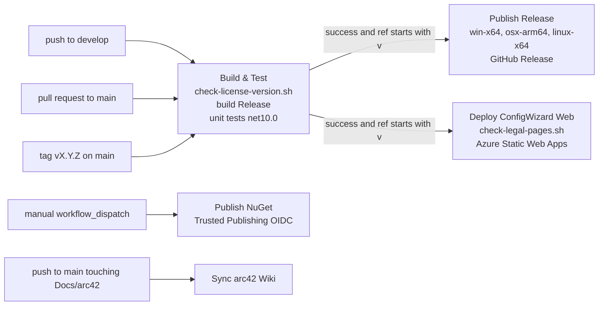

# 2. Architecture Constraints

This chapter answers which requirements limit the freedom of the architects
and developers of RayMigrator: the technical constraints imposed by the
platform, the supported database engines and the chosen libraries; the
organizational constraints set by the small team, the Git and CI process and
the licensing model; and the conventions that every contribution has to
follow. Everything listed here was verified against the source tree; the
reasons behind the deliberate decisions are elaborated in
[Architecture Decisions](09-Architecture-Decisions.md).

## 2.1 Technical Constraints

### Platform and toolchain

| Constraint | Background / Motivation |
|------------|-------------------------|
| Target frameworks `net10.0;net9.0;net8.0` for every library, DAL plugin and the console (`TargetFrameworks` in each `*.csproj`). Test projects and `Raycoon.RayMigrator.ConfigWizard.Web` target `net10.0` only. | .NET 8 is the LTS baseline for enterprise environments, .NET 9 the current standard term release, .NET 10 the latest. Multi targeting gives adopters the broadest deployment options at the cost of building every package three times. See [Multi-Framework Targeting](https://github.com/RAYCOON/RayMigrator/blob/main/Docs/01-architecture/design-decisions.md#multi-framework-targeting). |
| SDK policy in `global.json`: version `8.0.0`, `rollForward: latestMajor`, `allowPrerelease: false`. | Any released SDK from 8.0 upwards builds the solution; prerelease SDKs are excluded. CI installs `8.0.x`, `9.0.x` and `10.0.x` side by side (`build-test.yml`). |
| C#: `Nullable` `enable` and `ImplicitUsings` `enable` in all projects, `LangVersion` `default` in the shipped projects (the five test projects leave it unset). | The language level follows the newest targeted SDK; nullable reference types are mandatory so that the public API of the NuGet packages carries nullability annotations. |
| Operating systems: Windows 10+, Ubuntu 24.04+, macOS 10.15+ (`README.md`). Release binaries are built for the RIDs `win-x64`, `osx-arm64` and `linux-x64`. | RayMigrator runs in CI pipelines and on developer machines of all three platforms; the engine must never rely on OS specific paths, line endings or console encodings. |
| Single file, framework dependent publish per RID: `dotnet publish -f net10.0 --no-self-contained -p:PublishSingleFile=true -p:IncludeNativeLibrariesForSelfExtract=true -p:IncludeAllContentForSelfExtract=true` (`publish-release.yml`). | Pre-built releases therefore require the .NET 10 runtime on the host. The built-in DAL assemblies are part of the single file (`DalFactory` finds them through `DependencyContext`); the SQL templates are shipped next to the binary under `DataAccessLayers/{Engine}/` because `TemplateCache` loads them from disk, and external DAL plugins are discovered in the same directory tree. The workflow fails if any of the five directories has no `*.sql` file. Details in [Deployment View](07-Deployment-View.md). |
| Central package management: `ManagePackageVersionsCentrally` is `true` in `Directory.Packages.props`; `NuGet.config` clears all sources and allows only `https://api.nuget.org/v3/index.json`. | One version per package for all 24 projects, reproducible restores, no private feeds. Every dependency must be listed in `THIRD-PARTY-NOTICES.md`. |
| CLI parsing with `System.CommandLine` 2.0.11 (`Raycoon.RayMigrator.Core/Configuration/Options/CommandLineConfiguration.cs`). Configuration via `Microsoft.Extensions.*` 10.0.11 (Configuration, DependencyInjection, Hosting, Options, Logging). Logging via Serilog 4.4.0 with `Raycoon.Serilog.Sinks.SQLite` 1.2.2. | The console layer is a thin System.CommandLine front end over the pipeline; all services are resolved through the standard .NET DI container. The Serilog pin is a floor: the SQLite sink requires 4.4.0 or newer (comment in `Directory.Packages.props`). |
| Test stack: `xunit.v3` 3.2.2, `xunit.runner.visualstudio` 3.1.5, `Microsoft.NET.Test.Sdk` 18.9.0, `AwesomeAssertions` 9.5.0, `NSubstitute` 6.2.0, `coverlet.collector` 10.0.1. | `AwesomeAssertions` is used instead of FluentAssertions 8.x because the latter moved to the Xceed Community License (non-commercial only). xUnit v3 is required for the native `Assert.SkipUnless` used by engine tests. |

### Database engines and ADO.NET providers

| Constraint | Background / Motivation |
|------------|-------------------------|
| Exactly five engines ship in the repository, each as its own DAL plugin: SQL Server, PostgreSQL, MariaDB, MySQL, SQLite. All five can host the migration repository (the RayMigrator bookkeeping database) and targets. | The repository schema, the SQL templates and the engine test matrix must be maintained five times; any new repository feature is blocked until all five templates exist. Further engines are external DAL plugins, see [Crosscutting Concepts](08-Crosscutting-Concepts.md). |
| Provider packages pinned in `Directory.Packages.props`: `Microsoft.Data.SqlClient` 7.0.2, `Npgsql` 10.0.3, `MySqlConnector` 2.6.2 (shared by MariaDB and MySQL), `Microsoft.Data.Sqlite` 10.0.11. | `Microsoft.Data.Sqlite` must stay at 10.0.11 or newer: earlier 10.0.x versions pull `SQLitePCLRaw` 2.1.11, which carries CVE-2025-6965. `Npgsql` is under the PostgreSQL License, the other three are MIT; `Microsoft.Data.SqlClient.SNI.runtime` is under Microsoft Software License Terms. |
| Minimum engine versions: SQL Server 2016+, PostgreSQL 11+, MariaDB 10.5+, MySQL 8.0+, SQLite 3.35+ ([SQL dialects](https://github.com/RAYCOON/RayMigrator/blob/main/Docs/03-database-layer/sql-dialects.md)). | Templates use `utf8mb4_unicode_ci` (MariaDB 10.5), `utf8mb4_0900_ai_ci` (MySQL 8.0) and `CREATE TABLE IF NOT EXISTS` patterns that older engines lack. |
| DDL is not transactional on MariaDB and MySQL (implicit commit on `CREATE TABLE` and similar); SQL Server, PostgreSQL and SQLite support DDL inside transactions. | `UseTransaction` cannot guarantee atomic rollback of a DDL block on MariaDB and MySQL; rollback files remain the only recovery path there. Block level persistence exists so that a partially applied file can be resumed. |
| MariaDB, MySQL and SQLite have no schema support; SQLite additionally has no session variables and is a file based, single writer database. | The `SchemaName` setting only applies to SQL Server and PostgreSQL. SQLite templates keep intermediate state in a temporary `_rc_state` table, the DAL enables `Foreign Keys=true` unless the connection string sets it, and switches to `PRAGMA journal_mode=WAL`, and SQLite repositories cannot be shared between hosts. |
| Block separators differ per engine: `GO` on SQL Server, `;` elsewhere, always alone on a line. | Each DAL declares its `SqlBlockDelimiter`; `SplitSqlIntoBlocks` in `MigrationService` splits only on lines that hold nothing but that delimiter, so a `;` inside a stored routine body is not a block boundary and no `DELIMITER` emulation exists. Migration authors have to write engine specific files per target group. |
| Plain SQL files are the only migration format. Metadata is an optional TOML header inside the file plus `migsettings.txt` per directory. | No DSL, no code generation, no schema diffing. RayMigrator stays a transport for SQL the author controls, and the SHA-256 hash of the file is the unit of tamper detection. |
| No parallel execution: targets and target groups are processed sequentially; a second run for the same product and environment is rejected by the repository (`-2` result of `Repository_MigrationRun_Insert`). | Deterministic ordering, simpler rollback and no risk of overloading a database server. See [No Parallel Database Execution](https://github.com/RAYCOON/RayMigrator/blob/main/Docs/01-architecture/design-decisions.md#no-parallel-database-execution). |
| Optional external CLI tools: `sqlcmd`, `psql`, `mysql`, `mariadb`, `sqlite3` (or `docker exec` wrappers) configured under `CliTools` and selected by `UseCliToolAlias`. | Some scripts use tool specific syntax (`:r` includes in `sqlcmd`) or must run through the vendor client for compliance. When a CLI tool is used, transaction control and block splitting are delegated to the tool, only the exit code is evaluated, and the tool must be installed on the host. See [CLI tools options](https://github.com/RAYCOON/RayMigrator/blob/main/Docs/06-configuration-reference/cli-tools-options.md). |
| Docker is required for engine tests against SQL Server, PostgreSQL, MariaDB and MySQL (`Testing/Docker/docker-compose.yml`); SQLite tests use a temporary file. | Tests skip with `Assert.SkipUnless(Fixture.IsDatabaseAvailable, ...)` when a container is missing. CI runs only the unit tests; the engine suite is a local duty before a release. See [Engine tests](https://github.com/RAYCOON/RayMigrator/blob/main/Docs/10-testing/engine-tests.md). |

## 2.2 Organizational Constraints

The release chain that every constraint below refers to:

| Constraint | Background / Motivation |
|------------|-------------------------|
| Small team at RAYCOON.com GmbH (Weiterstadt, Germany) maintains the product; external contributions are voluntary and uncompensated (`CONTRIBUTING.md`). | Architecture has to favor simplicity and automation over breadth: five engines, one execution model, no managed service, review capacity for pull requests is limited. |
| Git flow: `develop` is the working branch, `main` only receives a fast forward of a release commit, and the tag `v<version>` on that commit triggers publishing (comment in `build-test.yml`). Pull requests target `main`. | Branch protection on `main` requires the `build-test` check of the fast forwarded commit. Contributors fork, create a feature branch and open a pull request. |
| CI on GitHub Actions. Workflows: `Build & Test` (`build-test.yml`), `Publish Release` (`publish-release.yml`), `Publish NuGet` (`publish-nuget.yml`), `Deploy ConfigWizard Web` (`deploy-configwizard.yml`), `Sync arc42 Wiki` (`sync-arc42-wiki.yml`), `Claude Code Review` (`claude-code-review.yml`), `Claude Code` (`claude.yml`). | All runners are `ubuntu-latest`; there is no Windows or macOS build in CI, so platform specific behavior is only covered by local test duty. |
| Release gate: `Publish Release` and `Deploy ConfigWizard Web` run on `workflow_run` of `Build & Test` and only if its conclusion is `success` and the ref starts with `v`. `Build & Test` verifies the license version binding, restores, builds `Release` and runs `Raycoon.RayMigrator.Tests.Unit` on `net10.0`. | A release cannot ship without a green build and unit test run on the tagged commit. The engine test suite is not part of the gate. |
| NuGet publishing is a manual `workflow_dispatch` of `Publish NuGet`, authenticated through NuGet Trusted Publishing (OIDC via `NuGet/login@v1`), no stored API key. The version is read from `RayMigratorVersion` in `Directory.Build.props`. | Packages are pushed after the GitHub release has been checked; `--skip-duplicate` makes the job idempotent. The repository variable `NUGET_USER` must exist. |
| Versioning: `RayMigratorVersion` in `Directory.Build.props` is the next version being worked towards (currently `0.15.0`); local builds get `VersionSuffix` `dev` plus commit hash; release workflows pass `-p:Version=<tag>`, which replaces prefix and suffix. `CHANGELOG.md` follows Semantic Versioning where applicable. | `.github/scripts/check-license-version.sh` fails the build if the `Licensed Work` row in `LICENSE.md` and `RayMigratorVersion` differ, and fails the release if either differs from the tag. |
| Contributor License Agreement (`CLA.md`), confirmed by a checkbox in `.github/PULL_REQUEST_TEMPLATE.md`. | Contributors grant RAYCOON.com GmbH the right to relicense under BUSL-1.1 and under the future Change License (Apache License 2.0). Without it a contribution could not take part in the Change Date conversion. |
| Pre-1.0 maturity: the current release line is 0.14.x (`NOTICE.md`, `README.md`); security fixes are provided for the latest released 0.14.x version only (`SECURITY.md`). | Breaking changes in CLI, enums and repository schema are still allowed between minor versions and are marked as such in `CHANGELOG.md`. Users are told to keep a verified backup before every run. |
| Vulnerability reporting through GitHub private vulnerability reporting or `raymigrator@raycoon.com` with subject prefix `[SECURITY]`; acknowledgement within 5 business days; no bug bounty. | In scope: engine, CLI, the DAL plugins in this repository, release artifacts and the Config Wizard at `config.raymigrator.com`. |
| Documentation lives in the repository under `Docs/` (implementation reference, `user-manual/`, `appendix/`) and this arc42 set under `Docs/arc42/`, which `Sync arc42 Wiki` mirrors to the GitHub wiki on every push to `main` that touches `Docs/arc42/`. | The wiki is never edited directly; `.github/scripts/sync-arc42-wiki.sh` clears and rewrites all top level pages. |
| The Config Wizard is deployed to Azure Static Web Apps; `.github/scripts/check-legal-pages.sh` verifies before deployment that imprint, privacy and terms pages on `raymigrator.com` are live and state the `TermsVersion` recorded by the wizard. | German provider identification duties (section 5 DDG) and click wrap incorporation of the Terms of Use require the linked pages to be reachable at all times. |
| Pull requests are additionally reviewed by the `Claude Code Review` workflow; `@claude` mentions in issues and reviews trigger the `Claude Code` workflow. | Automated first pass review compensates for limited reviewer capacity; the human maintainer decides. |

## 2.3 Conventions

| Convention | Description |
|------------|-------------|
| License: Business Source License 1.1 with an Additional Use Grant (`LICENSE.md`). | The Additional Use Grant permits production use free of charge for anyone, including SaaS and managed services. Each version converts to Apache License 2.0 four years after its first public distribution; `Docs/license-change-dates.md` is the register of those dates (0.11.0 on 2026-08-17 up to 0.14.0 on 2026-09-09). Versions up to 0.10.3 were never publicly distributed. |
| License per version and per package. | BUSL-1.1 applies separately to each version, so `LICENSE.md` names the exact `Licensed Work` version, is packed into every NuGet package (`PackageLicenseFile`, `PackageRequireLicenseAcceptance`) and, together with `NOTICE.md` and `THIRD-PARTY-NOTICES.md`, must be present in every published binary (verified by `publish-release.yml`). `COMMERCIAL-LICENSE.md` is informative only. |
| MIT carve out for `Raycoon.RayMigrator.Database.Example`. | The skeleton DAL plugin has its own `LICENSE.md` (MIT) so external developers can copy it; it is `IsPackable=false`. Running a plugin inside a RayMigrator process is still governed by the root license. |
| Trademarks. | "RayMigrator" and "RAYCOON" are claimed as unregistered trademarks; modified or derivative versions must be distributed under a different name. |
| Solution layout: 24 projects named `Raycoon.RayMigrator.*` in `RayMigrator.sln`. | Layers: `Shared`, `Core`, `Services.Abstractions`, `Services`, `Pipeline`, `Infrastructure`, `Validation`, `Database.Common`, `Database`, the five `Database.{Engine}` plugins, `Database.Example`, `Console`, `Testing`, `ConfigWizard.Core`, `ConfigWizard.Web`, and the test projects `Tests.Unit`, `Tests.Unit.Validation`, `Tests.Unit.ConfigWizard.Core`, `Tests.Unit.ConfigWizard.Web`, `Tests.Engine`. The console assembly is named `raymigrator`. |
| DAL plugin contract. | A plugin class implements `IDal` and is annotated with `[DatabaseType("...")]` from `Raycoon.RayMigrator.Database.Common`; the shipped values are `SqlServer`, `PostgreSQL`, `MariaDb`, `MySql`, `Sqlite` (and `Example`). The value is the folder name under `DataAccessLayers/` and the `DatabaseType` used in configuration. |
| SQL template naming. | Templates live in `Templates/*.sql` of each DAL project and are copied to `DataAccessLayers/{Engine}/` at build and publish time. Names are `Repository_<Table>_<Operation>.sql` (for example `Repository_MigrationRun_Insert.sql`, `Repository_MigrationRecord_FixOrphaned.sql`), `Repository_CheckCreate.sql`, `Repository_Drop.sql`, `DatabaseLogging_CheckCreate.sql` and `DatabaseLogging_Insert.sql`; every engine provides the identical set. |
| Identifier casing per engine. | PostgreSQL, MariaDB and MySQL templates use `snake_case` identifiers, SQL Server and SQLite use `PascalCase`; unit tests guard this discipline. |
| Configuration hierarchy. | JSON node `RayMigrator` loaded from `appsettings.json`, `appsettings.{Environment}.json`, `appsettings.{Product}.json`, `appsettings.{Product}.{Environment}.json` (later files override earlier ones, `JsonOptionsSource`), then `migsettings.txt` per directory, then the TOML header per file. Secrets are referenced by `{ENV:NAME}` placeholders. Command line options select product, environment and run mode; only run specific switches such as `--stop-rollback-on-missing-rollback-file` and `--target-group-migration-order` override the configured value for one run. |
| Test conventions. | Unit tests (`Raycoon.RayMigrator.Tests.Unit`) need no database; files are prefixed by priority `P0_` to `P3_` (one exception, `MigrationCommandExhaustivenessTests`) and end in `Tests.cs`. Engine tests (`Raycoon.RayMigrator.Tests.Engine`) are grouped by `Tests/{MigrateUp,MigrateDown,Compound,Features,CliTool}` with engine prefixed classes such as `MariaDbHappyPathTests` and xUnit traits `Category=MigrateUp`, `MigrateDown`, `Compound`, `Features`, `CliTool`, `CliToolDocker`. |
| Language. | All code, comments, commit messages and documentation are in English (`CONTRIBUTING.md`). |
| Documentation structure. | `Docs/01-architecture` to `Docs/12-config-wizard` hold the implementation reference, `Docs/user-manual` the tutorial, `Docs/appendix` glossary and troubleshooting, `Docs/arc42` this documentation. `CHANGELOG.md` follows Keep a Changelog 1.1.0 with `Added`, `Changed`, `Fixed` sections and marks breaking changes explicitly. |

## Related documentation

- [Directory.Build.props](https://github.com/RAYCOON/RayMigrator/blob/main/Directory.Build.props) - version, NuGet metadata
- [Directory.Packages.props](https://github.com/RAYCOON/RayMigrator/blob/main/Directory.Packages.props) - central package versions
- [global.json](https://github.com/RAYCOON/RayMigrator/blob/main/global.json) - SDK policy
- [LICENSE.md](https://github.com/RAYCOON/RayMigrator/blob/main/LICENSE.md), [NOTICE.md](https://github.com/RAYCOON/RayMigrator/blob/main/NOTICE.md), [COMMERCIAL-LICENSE.md](https://github.com/RAYCOON/RayMigrator/blob/main/COMMERCIAL-LICENSE.md), [THIRD-PARTY-NOTICES.md](https://github.com/RAYCOON/RayMigrator/blob/main/THIRD-PARTY-NOTICES.md)
- [License change date register](https://github.com/RAYCOON/RayMigrator/blob/main/Docs/license-change-dates.md)
- [CLA.md](https://github.com/RAYCOON/RayMigrator/blob/main/CLA.md), [CONTRIBUTING.md](https://github.com/RAYCOON/RayMigrator/blob/main/CONTRIBUTING.md), [SECURITY.md](https://github.com/RAYCOON/RayMigrator/blob/main/SECURITY.md)
- [GitHub workflows](https://github.com/RAYCOON/RayMigrator/tree/main/.github/workflows) and [scripts](https://github.com/RAYCOON/RayMigrator/tree/main/.github/scripts)
- [Design decisions](https://github.com/RAYCOON/RayMigrator/blob/main/Docs/01-architecture/design-decisions.md)
- [SQL dialects](https://github.com/RAYCOON/RayMigrator/blob/main/Docs/03-database-layer/sql-dialects.md)
- [Template system](https://github.com/RAYCOON/RayMigrator/blob/main/Docs/03-database-layer/template-system.md)
- [CLI tools options](https://github.com/RAYCOON/RayMigrator/blob/main/Docs/06-configuration-reference/cli-tools-options.md)
- [Engine tests](https://github.com/RAYCOON/RayMigrator/blob/main/Docs/10-testing/engine-tests.md), [Unit tests](https://github.com/RAYCOON/RayMigrator/blob/main/Docs/10-testing/unit-tests.md)
- [Deployment View](07-Deployment-View.md), [Crosscutting Concepts](08-Crosscutting-Concepts.md), [Architecture Decisions](09-Architecture-Decisions.md)
