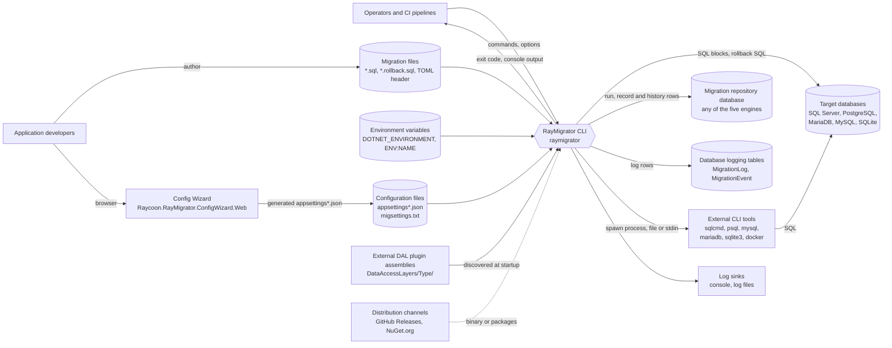
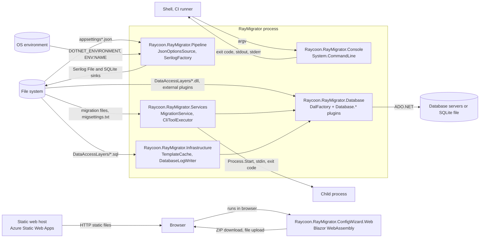

# 3. Context and Scope

This chapter answers where the boundary of RayMigrator lies and who or what is
on the other side of it: which people and systems interact with the tool, what
flows in (commands, configuration, migration files, environment variables) and
what flows out (SQL against databases, repository records, log output, exit
codes). Section 3.1 describes these relationships in domain terms, section 3.2
maps them to the concrete technical channels and protocols. The internal
structure behind the boundary is the subject of the
[Building Block View](05-Building-Block-View.md).

## 3.1 Business Context

RayMigrator is a command line tool. Its "business interface" is the set of CLI
commands; everything else it needs is read from the file system, from
environment variables and from databases, and everything it produces ends up in
databases, in log sinks and in the process exit code. The
[Config Wizard](https://github.com/RAYCOON/RayMigrator/blob/main/Docs/12-config-wizard/overview.md)
is a separate entry point that only produces configuration files; it never
talks to the engine or to a database.

The migration repository is a set of tables that may live in a database of
its own or inside one of the target databases: `Repository.DatabaseType` and
`Repository.ConnectionString` are configured independently of any target, and
`MigrationService.CanUseSharedConnection` even switches to a single atomic
transaction when repository and target share engine and connection string
(see [Atomic Shared Connection](https://github.com/RAYCOON/RayMigrator/blob/main/Docs/01-architecture/design-decisions.md#atomic-shared-connection)).
The same applies to the optional `DatabaseLogging` tables, which may share the
repository connection or use a separate one.

| Communication partner | Inputs to RayMigrator | Outputs from RayMigrator | Notes |
|-----------------------|-----------------------|--------------------------|-------|
| Operators and CI pipelines | One of the seven CLI commands with `--product`, `--environment` and command specific options; the working directory or `--config-dir` | Process exit code (`0` success, `1` execution error, `2` to `5` startup errors, `100` unhandled exception), console output | Unattended use is the primary case: `--startup-info false` suppresses the banner, secrets come from environment variables. See [Global options](https://github.com/RAYCOON/RayMigrator/blob/main/Docs/08-cli-reference/global-options.md). |
| Application developers | Migration files (`*.sql`), rollback files (`*.rollback.sql`), optional TOML header per file, `migsettings.txt` and `migsettings.{Environment}.txt` per directory | Feedback through `Validate` and `Simulate` run modes, `info` output, log output | Files are organized as `{MigrationFilesRootDirectory}/{Release}/{TargetGroup}/`, or flat under the release directory for single target group products. See [Directory structure](https://github.com/RAYCOON/RayMigrator/blob/main/Docs/07-migration-files/directory-structure.md). |
| Configuration files | `appsettings.json`, `appsettings.{Environment}.json`, `appsettings.{Product}.json`, `appsettings.{Product}.{Environment}.json`, node `RayMigrator` (`Repository`, `DatabaseLogging`, `ProductDefaults`, `Products`, `CliTools`, `Serilog`) | None; RayMigrator never writes configuration | Loaded and merged by `JsonOptionsSource`; later files override earlier ones; arrays whose elements carry an `Alias` merge by alias, all other arrays are replaced by the later file (ADR-021, issue #23; the shipped engine still merges by position until the fix lands). See [Configuration hierarchy](https://github.com/RAYCOON/RayMigrator/blob/main/Docs/06-configuration-reference/appsettings-hierarchy.md). |
| Environment variables | `DOTNET_ENVIRONMENT`, cross checked by `EnvironmentResolver` against the mandatory `--environment` value; any variable referenced by `{ENV:NAME}` in configuration values, SQL templates and migration file content | None | Unresolved placeholders in configuration or templates terminate the run; in migration files they become an empty string with a warning. Resolved values are masked in logs. See [Environment variables](https://github.com/RAYCOON/RayMigrator/blob/main/Docs/06-configuration-reference/environment-variables.md). |
| Target databases | Query results and errors per SQL block | Migration SQL blocks, rollback SQL, transactions where `UseTransaction` is set | One target group per engine, one target per connection. All five engines are supported through the built in DAL plugins. |
| Migration repository database | Existing `MigrationRun`, `MigrationRecord` and `MigrationRecordHistory` rows, hashes, interrupted or orphaned runs | Schema creation on first use (`Repository_CheckCreate`), one run row per invocation, one record per file and target, hash updates, fix operations | Hosted on any of the five engines. A second run for the same product and environment is rejected here. See [Repository schema](https://github.com/RAYCOON/RayMigrator/blob/main/Docs/03-database-layer/repository-schema.md). |
| Database logging tables | None | `MigrationLog` rows with event id, run, target and file context; `MigrationEvent` catalog seeded at creation | Optional; active only when the `DatabaseLogging` node exists and only for state changing commands. See [Logging schema](https://github.com/RAYCOON/RayMigrator/blob/main/Docs/03-database-layer/logging-schema.md). |
| External CLI tools | Exit code, standard output and standard error | Process start with `ExecutablePath` and rendered `ArgumentTemplate`; file path (`InputMode` `File`) or file content on stdin (`InputMode` `Stdin`) | `sqlcmd`, `psql`, `mysql`, `mariadb`, `sqlite3`, or `docker exec` wrappers; selected per product, target group, target, directory or file by `UseCliToolAlias`. Only the exit code is evaluated against `SuccessExitCodes`. See [CLI tools options](https://github.com/RAYCOON/RayMigrator/blob/main/Docs/06-configuration-reference/cli-tools-options.md). |
| Log sinks | Serilog configuration under `RayMigrator.Serilog` | Structured log events to console, rolling log files and optionally a local SQLite log file | Enriched with `MigrationRunId`, `TargetGroupAlias`, `TargetAlias`, `MigrationFilename` and block ids. See [Logging options](https://github.com/RAYCOON/RayMigrator/blob/main/Docs/06-configuration-reference/logging-options.md). |
| Config Wizard | Existing `appsettings*.json` uploaded in the browser (optional) | ZIP with the generated `appsettings*.json` hierarchy, `example.env` and a `TERMS-ACCEPTANCE.txt` record | Browser only application at `config.raymigrator.com`; shares validation rules with the engine through `Raycoon.RayMigrator.Validation`. |
| External DAL plugin assemblies | Assemblies implementing `IDal` with `[DatabaseType]` and their SQL templates under `DataAccessLayers/{Type}/` | Connection string passed to the plugin constructor, template execution calls | Discovered by `DalFactory` at startup; the same mechanism loads the five built in plugins. See [External DAL development](https://github.com/RAYCOON/RayMigrator/blob/main/Docs/09-extending/external-dal-development.md). |
| Distribution channels | None at runtime | Release archives per RID on GitHub Releases, library packages on NuGet.org | Mentioned for completeness; how they are built is covered in the [Deployment View](07-Deployment-View.md). |

RayMigrator Studio is not a communication partner of the engine: the
`OperatingMode` values `ManagedLocal` and `ManagedRemote` are a contract only,
and the engine reads neither an admin database nor an API
(see [Introduction and Goals](01-Introduction-and-Goals.md#what-raymigrator-deliberately-is-not)).

### CLI commands as the business interface

`CommandLineConfiguration` in `Raycoon.RayMigrator.Core` registers exactly
seven subcommands on the root command; each maps to a value of the enum
`MigrationCommand`. The full option matrix is in the
[Command reference](https://github.com/RAYCOON/RayMigrator/blob/main/Docs/08-cli-reference/command-reference.md).

| Command | `MigrationCommand` | Purpose |
|---------|--------------------|---------|
| `migrate-up` | `MigrateUp` | Apply pending migration files forward, optionally up to `--to-release`, in run mode `validate`, `simulate` or `migrate`. |
| `migrate-down` | `MigrateDown` | Roll back applied migrations down to `--to-release` using rollback files. |
| `validate-hash` | `ValidateHash` | Verify that stored hashes still match the migration files on disk; exit code `1` if any file is invalid or missing. |
| `update-hash` | `UpdateHash` | Store new hashes after an approved change to already applied files. |
| `info` | `Info` | Display repository state, run history and pending files for a product and environment. |
| `baseline` | `Baseline` | Mark an existing database as migrated without executing SQL, all releases or up to `--to-release`. |
| `fix` | `FixIssues` | Repair repository inconsistencies such as orphaned runs, scoped by `--scope`, `--older-than` and `--last-migration-status`. |

Every command requires `--product` (`-p`) and `--environment` (`-env`); the
global options `--startup-info`, `--reveal-sensitive-data` and `--config-dir`
apply to all of them.

## 3.2 Technical Context

| Channel / Interface | Technology | Protocol / format | Used by | Reference |
|---------------------|------------|-------------------|---------|-----------|
| Process invocation | .NET console application, assembly name `raymigrator`; `System.CommandLine` 2.0.11 | Command line arguments; integer exit code; text on stdout and stderr | `Raycoon.RayMigrator.Console` (`Program.Main`), `Raycoon.RayMigrator.Core` (`CommandLineConfiguration`, `EnvironmentResolver`) | [Command reference](https://github.com/RAYCOON/RayMigrator/blob/main/Docs/08-cli-reference/command-reference.md) |
| SQL Server connections | `Microsoft.Data.SqlClient` (ADO.NET) | TDS; connection string from configuration | `Raycoon.RayMigrator.Database.SqlServer` | [Architecture Constraints](02-Architecture-Constraints.md#database-engines-and-adonet-providers) for versions |
| PostgreSQL connections | `Npgsql` (ADO.NET) | PostgreSQL wire protocol | `Raycoon.RayMigrator.Database.PostgreSQL` | same |
| MariaDB and MySQL connections | `MySqlConnector` (ADO.NET), one package for both plugins | MySQL protocol | `Raycoon.RayMigrator.Database.MariaDb`, `Raycoon.RayMigrator.Database.MySql` | same |
| SQLite connections | `Microsoft.Data.Sqlite` (ADO.NET) | In-process access to a database file (`Foreign Keys=true`, WAL journal) | `Raycoon.RayMigrator.Database.Sqlite` | same |
| Repository and logging templates | `IDal.ExecuteScalarAsync` / `ExecuteNonQueryAsync` with `DalParameterList`; templates `Repository_*.sql`, `DatabaseLogging_*.sql` per engine | SQL text with `@Parameters`; scalar result `ResultCode,ResultMessage` parsed into `TemplateResponse` | `Raycoon.RayMigrator.Infrastructure` (`TemplateCache`, `TemplateExecutor`, `DatabaseLogWriter`) | [Template system](https://github.com/RAYCOON/RayMigrator/blob/main/Docs/03-database-layer/template-system.md) |
| Configuration files | `Microsoft.Extensions.Configuration.Json`, read from the working directory or `--config-dir` | JSON, node `RayMigrator`; up to four files merged | `Raycoon.RayMigrator.Pipeline` (`JsonOptionsSource`) | [Configuration hierarchy](https://github.com/RAYCOON/RayMigrator/blob/main/Docs/06-configuration-reference/appsettings-hierarchy.md) |
| Environment variables | `Environment.GetEnvironmentVariable`; regex `\{ENV:(\w+)\}` | Plain strings; `DOTNET_ENVIRONMENT` must equal `--environment` when both are set | `Raycoon.RayMigrator.Core` (`EnvironmentResolver`, environment variable replacer, `SensitiveDataMasker`) | [Environment variables](https://github.com/RAYCOON/RayMigrator/blob/main/Docs/06-configuration-reference/environment-variables.md) |
| Migration files directory | `System.IO` recursive scan of `MigrationFilesRootDirectory`, decoded with `MigrationFilesEncoding` | `*.sql`, `*.rollback.sql`, `migsettings.txt`, `migsettings.{Environment}.txt`; TOML header inside `/* [RayMigrator] ... */` | `Raycoon.RayMigrator.Services` (`MigrationService` discovery and parsing) | [Directory structure](https://github.com/RAYCOON/RayMigrator/blob/main/Docs/07-migration-files/directory-structure.md), [TOML metadata](https://github.com/RAYCOON/RayMigrator/blob/main/Docs/07-migration-files/toml-metadata.md) |
| DAL plugins and SQL templates | `DependencyContext` scan for built in plugins, `Assembly.LoadFrom` for `DataAccessLayers/{Type}/*.dll`; templates read from the same directories | .NET assemblies with `[DatabaseType]`; `*.sql` template files | `Raycoon.RayMigrator.Database` (`DalFactory`), `Raycoon.RayMigrator.Infrastructure` (`TemplateCache`) | [DAL architecture](https://github.com/RAYCOON/RayMigrator/blob/main/Docs/03-database-layer/dal-architecture.md) |
| External CLI tool execution | `System.Diagnostics.Process` with redirected stdout, stderr and optional stdin (UTF-8 without BOM); timeout via `CliToolTimeoutInSeconds`, then kill | Executable plus rendered `ArgumentTemplate`; exit code matched by `ExitCodeMatcher` against `SuccessExitCodes` | `Raycoon.RayMigrator.Services` (`CliToolExecutor`) | [CLI tools options](https://github.com/RAYCOON/RayMigrator/blob/main/Docs/06-configuration-reference/cli-tools-options.md) |
| Console and file logging | Serilog 4.4.0 with `Serilog.Sinks.Console`, `Serilog.Sinks.File`, `Raycoon.Serilog.Sinks.SQLite`; `Serilog.Settings.Configuration` reads the `RayMigrator.Serilog` node | Output templates; rolling text files; local SQLite log file | `Raycoon.RayMigrator.Pipeline` (`SerilogFactory`), sinks referenced by `Raycoon.RayMigrator.Console` | [Logging options](https://github.com/RAYCOON/RayMigrator/blob/main/Docs/06-configuration-reference/logging-options.md) |
| Database logging | Custom Serilog sink `RayMigratorDatabaseSink` and `MigrationContextEnricher`; asynchronous `DatabaseLoggerQueue`; writes through `IDal` | `DatabaseLogging_Insert` template per engine | `Raycoon.RayMigrator.Infrastructure` (`DatabaseLogWriter`) | [Logging schema](https://github.com/RAYCOON/RayMigrator/blob/main/Docs/03-database-layer/logging-schema.md) |
| Config Wizard | Blazor WebAssembly on `net10.0`, MudBlazor; hosted as static files on Azure Static Web Apps | HTTPS delivery of the app; in the browser: file upload via `InputFile`, ZIP download via JS interop (`downloadFileFromBytes`), `localStorage` for the language only, terms acceptance is kept in memory | `Raycoon.RayMigrator.ConfigWizard.Web`, `Raycoon.RayMigrator.ConfigWizard.Core`, `Raycoon.RayMigrator.Validation` | [Config Wizard overview](https://github.com/RAYCOON/RayMigrator/blob/main/Docs/12-config-wizard/overview.md) |
| Library consumption | 15 packable projects (`Raycoon.RayMigrator.Core`, `.Pipeline`, `.Services`, `.Services.Abstractions`, `.Infrastructure`, `.Database`, `.Database.Common`, the five `.Database.{Engine}` plugins, `.Shared`, `.Validation`, `.Testing`) | NuGet packages with `LICENSE.md` and `NUGET_README.md` | External DAL plugins reference `Raycoon.RayMigrator.Database.Common` and `Raycoon.RayMigrator.Shared` | [NUGET_README.md](https://github.com/RAYCOON/RayMigrator/blob/main/NUGET_README.md), [Deployment View](07-Deployment-View.md) |

The Config Wizard has no server side and opens no database connection: the
Web project references only `Microsoft.AspNetCore.Components.WebAssembly`
(plus its `DevServer` in Debug builds), `MudBlazor` and the
`ConfigWizard.Core` project, and the Core project references nothing but
`Raycoon.RayMigrator.Validation`. Its only outbound links are to
`raymigrator.com` (terms of use, imprint), to `LICENSE.md` on GitHub and to
Google Fonts in `index.html`.

### Mapping of business relationships to technical channels

- Operators and CI pipelines use the process invocation channel exclusively:
  arguments in, exit code and console text out. Everything they configure
  reaches the engine through configuration files and environment variables.
- Application developers use the migration files directory channel; their
  files are read, hashed and split into blocks by `Raycoon.RayMigrator.Services`
  and executed through either the ADO.NET channels or the external CLI tool
  channel, depending on `UseCliToolAlias`.
- Target databases, the migration repository and the database logging tables
  all use the ADO.NET channel of the DAL plugin selected by `DatabaseType`.
  Which of the three roles a connection plays is a configuration decision, not
  a technical one; the repository and the logging tables may share a
  connection string with a target.
- External CLI tools bypass the ADO.NET channel for migration file execution
  only. Repository bookkeeping and database logging still require a DAL, which
  is why a plugin for the repository engine is mandatory even when every
  target is migrated through a vendor client.
- External DAL plugin assemblies are a file system relationship at startup
  (`DataAccessLayers/{Type}/`) and become an ADO.NET relationship at runtime
  through whatever provider the plugin ships.
- The Config Wizard connects to nothing in the engine; its output reaches
  RayMigrator only when a person places the generated files next to the
  binary or in the `--config-dir` directory.

### Exit codes as the automation contract

The exit code is the only machine readable result of a run; there is no JSON
or XML report. Automation therefore treats any non-zero code as failure and
reads the console or log file for details. The codes are produced in three
places and match the table in
[Global options](https://github.com/RAYCOON/RayMigrator/blob/main/Docs/08-cli-reference/global-options.md#exit-codes):

| Code | Meaning | Produced by |
|------|---------|-------------|
| `0` | Success, or help and version requests | `RayMigratorService` (all commands), `Program.Main` |
| `1` | Execution error: migration failed, `validate-hash` found invalid or missing files, `ApplicationStartupException`, service exception | `RayMigratorService`, `DirectModePipeline`, `Program.Main` |
| `2` | `--environment` and `DOTNET_ENVIRONMENT` are both set with different values | `EnvironmentResolver` |
| `3` | `--environment` is blank and `DOTNET_ENVIRONMENT` is not set (`--environment` is a required option, so leaving it out is a parse error) | `EnvironmentResolver` |
| `4` | The loaded `RayMigrator` node has no `Serilog` section, typically because the product or environment file was not found (if no file carries a `RayMigrator` node at all, `JsonOptionsSource` throws and the run ends with `100`) | `DirectModePipeline` |
| `5` | `System.CommandLine` threw while parsing or invoking; ordinary parse errors such as a missing required option return `System.CommandLine`'s own code | `Program.Main` |
| `100` | Unhandled exception | `Program.Main`, `DirectModePipeline` |

A `migrate-up` that fails and is then rolled back by the configured
`MigrationErrorAction` still returns `1`; the repository records the run with
`MigrationRunResult` `Recovered` so that the outcome is distinguishable
afterwards. Optional `DatabaseLogging` and the `MigrationRun` table are the
channels for central monitoring across many pipeline runs.

## Related documentation

- [Architecture overview](https://github.com/RAYCOON/RayMigrator/blob/main/Docs/01-architecture/overview.md)
- [Data flow](https://github.com/RAYCOON/RayMigrator/blob/main/Docs/01-architecture/data-flow.md)
- [Command reference](https://github.com/RAYCOON/RayMigrator/blob/main/Docs/08-cli-reference/command-reference.md) and [Global options](https://github.com/RAYCOON/RayMigrator/blob/main/Docs/08-cli-reference/global-options.md)
- [Configuration hierarchy](https://github.com/RAYCOON/RayMigrator/blob/main/Docs/06-configuration-reference/appsettings-hierarchy.md) and [Environment variables](https://github.com/RAYCOON/RayMigrator/blob/main/Docs/06-configuration-reference/environment-variables.md)
- [CLI tools options](https://github.com/RAYCOON/RayMigrator/blob/main/Docs/06-configuration-reference/cli-tools-options.md) and [External CLI Tool Execution](https://github.com/RAYCOON/RayMigrator/blob/main/Docs/01-architecture/design-decisions.md#external-cli-tool-execution)
- [Logging options](https://github.com/RAYCOON/RayMigrator/blob/main/Docs/06-configuration-reference/logging-options.md) and [Logging schema](https://github.com/RAYCOON/RayMigrator/blob/main/Docs/03-database-layer/logging-schema.md)
- [Directory structure](https://github.com/RAYCOON/RayMigrator/blob/main/Docs/07-migration-files/directory-structure.md)
- [Config Wizard overview](https://github.com/RAYCOON/RayMigrator/blob/main/Docs/12-config-wizard/overview.md)
- [External DAL development](https://github.com/RAYCOON/RayMigrator/blob/main/Docs/09-extending/external-dal-development.md)
- [NUGET_README.md](https://github.com/RAYCOON/RayMigrator/blob/main/NUGET_README.md)
- [Building Block View](05-Building-Block-View.md), [Runtime View](06-Runtime-View.md), [Deployment View](07-Deployment-View.md)
