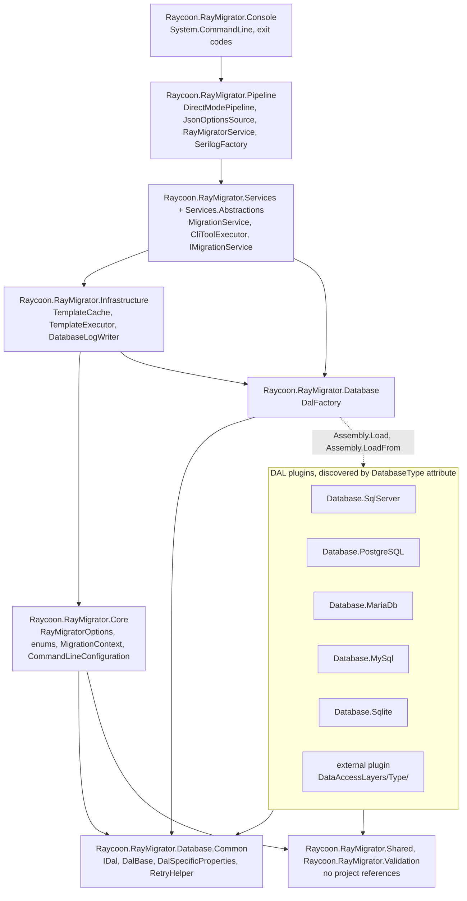

# 4. Solution Strategy

This chapter answers which fundamental decisions shape the architecture of
RayMigrator: the technologies it is built on, how the system is decomposed
into layers and plugins, which architectural approaches serve the quality
goals from [Introduction and Goals](01-Introduction-and-Goals.md#12-quality-goals),
which organizational rules the team follows, and which trade-offs were
accepted knowingly. It is a compact summary; the structure is detailed in the
[Building Block View](05-Building-Block-View.md), the recurring mechanisms in
[Crosscutting Concepts](08-Crosscutting-Concepts.md) and the reasoning behind
each decision in [Architecture Decisions](09-Architecture-Decisions.md).

## 4.1 Technology Decisions

| Decision | Rationale | Where elaborated |
|----------|-----------|------------------|
| Multi-Framework Targeting (.NET 8, 9, 10): every library, DAL plugin and the console target `net10.0;net9.0;net8.0`; C# with nullable reference types enabled. | .NET 8 is the LTS baseline in enterprise environments, .NET 10 the current release; adopters pick their runtime and the NuGet packages carry nullability annotations. Cost: every package is built three times. | [Architecture Constraints](02-Architecture-Constraints.md#platform-and-toolchain), [Multi-Framework Targeting](https://github.com/RAYCOON/RayMigrator/blob/main/Docs/01-architecture/design-decisions.md#multi-framework-targeting) |
| Plain SQL Files with TOML Header: migrations are `*.sql` files with an optional `/* [RayMigrator] ... */` header and `migsettings.txt` per directory; no DSL, no code-first model, no schema diffing. | The DBA reviews exactly the SQL that runs; the SHA-256 hash of the file is the unit of tamper detection; engine specific features stay available. The header is parsed by `MigrationService.ExtractTomlAndSql` and `ParseTomlConfig` without a TOML library. | [TOML metadata](https://github.com/RAYCOON/RayMigrator/blob/main/Docs/07-migration-files/toml-metadata.md), [TOML for Migration Metadata](https://github.com/RAYCOON/RayMigrator/blob/main/Docs/01-architecture/design-decisions.md#toml-for-migration-metadata) |
| One ADO.NET Provider per Engine: `Microsoft.Data.SqlClient`, `Npgsql`, `MySqlConnector` (MariaDB and MySQL), `Microsoft.Data.Sqlite`, each isolated in its own `Raycoon.RayMigrator.Database.{Engine}` assembly. | No ORM layer between RayMigrator and the database; provider versions and licenses are managed centrally in `Directory.Packages.props`; a provider update never touches another engine. | [DAL architecture](https://github.com/RAYCOON/RayMigrator/blob/main/Docs/03-database-layer/dal-architecture.md), [Architecture Constraints](02-Architecture-Constraints.md#database-engines-and-adonet-providers) |
| System.CommandLine for the CLI: `CommandLineConfiguration` in `Raycoon.RayMigrator.Core` registers the seven subcommands; `Program.Main` in `Raycoon.RayMigrator.Console` only parses, resolves the environment and dispatches. | Standard parsing, help and exit code handling for a tool that mostly runs unattended; the console stays a thin front end over `Raycoon.RayMigrator.Pipeline`. | [Context and Scope](03-Context-and-Scope.md#cli-commands-as-the-business-interface), [Command reference](https://github.com/RAYCOON/RayMigrator/blob/main/Docs/08-cli-reference/command-reference.md) |
| Microsoft.Extensions Options, DI and Configuration: `RayMigratorOptions` bound from the JSON hierarchy by `JsonOptionsSource`, validated by data annotations plus `RayMigratorOptionsValidator`, merged by `ProductDefaultsPostConfigureOptions`; services resolved through the standard container. | Strongly typed, validated configuration with the idioms every .NET developer knows. `Host.CreateDefaultBuilder(args)` still adds `AddCommandLine` and `AddEnvironmentVariables` to the host configuration, but `RayMigratorOptions` is bound from the JSON section only; secrets come in through `{ENV:NAME}` placeholders resolved by `EnvironmentVariableReplacer`. | [Options Pattern](https://github.com/RAYCOON/RayMigrator/blob/main/Docs/01-architecture/patterns.md#options-pattern), [Configuration System](https://github.com/RAYCOON/RayMigrator/blob/main/Docs/01-architecture/design-decisions.md#configuration-system) |
| Serilog for Structured Logging: `SerilogFactory` builds the logger from the `RayMigrator.Serilog` node; console and file sinks, `Raycoon.Serilog.Sinks.SQLite`, and the custom `RayMigratorDatabaseSink` with `MigrationContextEnricher`. | One logging pipeline serves operators (console), audits (files) and central monitoring (`MigrationLog` tables) with the same enriched events. | [Logging options](https://github.com/RAYCOON/RayMigrator/blob/main/Docs/06-configuration-reference/logging-options.md), [Logging schema](https://github.com/RAYCOON/RayMigrator/blob/main/Docs/03-database-layer/logging-schema.md) |
| xUnit v3 with Docker Engines: `xunit.v3`, `AwesomeAssertions`, `NSubstitute`; `Raycoon.RayMigrator.Tests.Engine` runs against containers from `Testing/Docker/docker-compose.yml` and skips with `Assert.SkipUnless(Fixture.IsDatabaseAvailable, ...)`. | Real engines are the only way to prove that five SQL dialects behave identically; xUnit v3 provides native dynamic skips; `Raycoon.RayMigrator.Testing` is shared by unit and engine suites. | [Test infrastructure](https://github.com/RAYCOON/RayMigrator/blob/main/Docs/10-testing/test-infrastructure.md), [Engine tests](https://github.com/RAYCOON/RayMigrator/blob/main/Docs/10-testing/engine-tests.md) |
| Blazor WebAssembly for the Config Wizard: `Raycoon.RayMigrator.ConfigWizard.Web` (`Microsoft.NET.Sdk.BlazorWebAssembly`, MudBlazor) on top of the IO-free `Raycoon.RayMigrator.ConfigWizard.Core`, which references only `Raycoon.RayMigrator.Validation`. | Runs entirely in the browser as static files, so no server ever sees a connection string; the wizard and the engine share one rule catalog (`RuleCatalog`) and therefore reject the same configurations. | [Config Wizard architecture](https://github.com/RAYCOON/RayMigrator/blob/main/Docs/12-config-wizard/architecture.md), [Validation rules](https://github.com/RAYCOON/RayMigrator/blob/main/Docs/appendix/validation-rules.md) |

## 4.2 Top-level Decomposition

RayMigrator is a layered set of class libraries with one executable on top.
`Raycoon.RayMigrator.Console` parses the command line and hands over to
`Raycoon.RayMigrator.Pipeline`, which builds the DI host (`DirectModePipeline`),
loads configuration (`JsonOptionsSource`), creates the logger (`SerilogFactory`)
and maps commands to service calls (`RayMigratorService`).
`Raycoon.RayMigrator.Services` (`MigrationService`, `CliToolExecutor`) contains
the migration logic behind the `IMigrationService` contract of
`Raycoon.RayMigrator.Services.Abstractions`. `Raycoon.RayMigrator.Infrastructure`
executes the migration repository SQL templates (`TemplateCache`, `TemplateExecutor`) and
hosts the database logging sink; `Raycoon.RayMigrator.Core` owns the domain
model: options, enums, `MigrationContext` with `IMigrationContextAccessor`, and
the environment resolver. Below that, `Raycoon.RayMigrator.Database` provides
the static `DalFactory`, and the five DAL plugins implement the engine specific
access. `Raycoon.RayMigrator.Shared` (exceptions, constants, version helper),
`Raycoon.RayMigrator.Database.Common` and `Raycoon.RayMigrator.Validation` are
leaf packages without project references.

The layering rule is that project references only point downward: nothing
references `Console`, `Core` never references `Services` or `Infrastructure`,
and the leaf packages reference nothing. The one irregularity is documented:
`TemplateCache` and `TemplateExecutor` live physically in the Infrastructure
project but declare `Raycoon.RayMigrator.Core` namespaces.

The plugin boundary is `Raycoon.RayMigrator.Database.Common`. A DAL is a
non-abstract class that derives from `DalBase` (or implements `IDal`), carries
`[DatabaseType("...")]` and has a public constructor taking the connection
string.
`DalFactory` discovers built in plugins from `DependencyContext.Default` (all
runtime libraries named `Raycoon.RayMigrator.*`, which works in single file
publish) and external plugins from `DataAccessLayers/{Type}/*.dll` next to the
binary, then caches one instance per `DatabaseType` and connection string. A
plugin references only `Database.Common` and `Shared`, so it compiles without
the engine; `Raycoon.RayMigrator.Database.Example` is the MIT licensed
skeleton. The DAL is selected by the `DatabaseType` string in configuration,
never by DI registration. The full component view is in the
[Building Block View](05-Building-Block-View.md).

## 4.3 Approaches to Achieve the Quality Goals

| Quality goal | Architectural approach(es) | Reference |
|--------------|----------------------------|-----------|
| Reliability (fault tolerance, recoverability) | Block-Level Execution and Transactions: files are split by the DAL's `SqlBlockDelimiter` (`SplitSqlIntoBlocks`), each block's success is persisted (`FileUpBlocksMigrated`) and `FindResumableBlock` resumes an interrupted file; `UseTransaction` per file, and `DalSpecificProperties.SupportsTransactionalDdl` triggers a warning (rule 2.8) where DDL commits implicitly (MariaDB, MySQL). When repository and target share engine and connection string, `CanUseSharedConnection` switches to one atomic transaction (`ExecuteSqlBlocksAtomic`). | [Block execution](https://github.com/RAYCOON/RayMigrator/blob/main/Docs/04-service-layer/block-execution.md), [Atomic Shared Connection](https://github.com/RAYCOON/RayMigrator/blob/main/Docs/01-architecture/design-decisions.md#atomic-shared-connection) |
| Reliability (fault tolerance, recoverability) | Rollback Strategies: `MigrationErrorAction` (`Terminate`, `Rollback`, `RollbackErrorOnly`, `RollbackRelease`, `Ignore`) with rollback files, `RollbackErrorAction` for failures during rollback, `StopRollbackOnMissingRollbackFile`; a recovered run ends as `MigrationRunResult.Recovered`. | [Error handling](https://github.com/RAYCOON/RayMigrator/blob/main/Docs/02-core-concepts/error-handling.md), [Rollback files](https://github.com/RAYCOON/RayMigrator/blob/main/Docs/07-migration-files/rollback-files.md) |
| Reliability (fault tolerance, recoverability) | Retry on Transient Errors: `RetryHelper` with linear backoff; each DAL overrides `DalBase.IsTransient` with its provider's error codes; `DbCommandMaxRetries` and `DbCommandWaitTimeInMsBeforeRetry` per target and for the repository. | [Resilience](https://github.com/RAYCOON/RayMigrator/blob/main/Docs/02-core-concepts/resilience.md) |
| Functional correctness and integrity | Hash Validation: SHA-256 of the whole file, of the TOML section and of the SQL blocks stored per `MigrationRecord`; `HashValidationScope` (`File`, `SqlBlocks`, `Disabled`) decides what a pending check compares; `validate-hash` reports `Modified` and `Missing` files, `update-hash` accepts approved changes. | [Hash validation](https://github.com/RAYCOON/RayMigrator/blob/main/Docs/02-core-concepts/hash-validation.md) |
| Functional correctness and integrity | Exclusive Run Lock and Orphaned Run Detection: `Repository_MigrationRun_Insert` refuses a second unfinished run per product and environment inside the database (`UPDLOCK, HOLDLOCK`, `pg_advisory_xact_lock`, `GET_LOCK`, SQLite transaction) and returns `-2`, surfaced as `MigrationAlreadyRunningException`; `RepositoryMigrationRunInsertWithAutoFix` repairs runs older than 10 minutes, the `fix` command handles the rest. | [Concurrency control](https://github.com/RAYCOON/RayMigrator/blob/main/Docs/02-core-concepts/concurrency-control.md) |
| Functional correctness and integrity | Deterministic File Ordering: releases and files are ordered by their relative path with `StringComparer.OrdinalIgnoreCase`; the loop order release, then target group, then `TargetMigrationOrder` is fixed; out of order files are rejected unless `--allow-out-of-order` is given for that run. | [Execution modes](https://github.com/RAYCOON/RayMigrator/blob/main/Docs/02-core-concepts/execution-modes.md), [File naming](https://github.com/RAYCOON/RayMigrator/blob/main/Docs/07-migration-files/file-naming.md) |
| Portability across database engines | Template-Driven Repository Schema: every engine ships the identical set of 21 `Repository_*` and `DatabaseLogging_*` templates that return `ResultCode,ResultMessage`; `TemplateCache` loads them per `DatabaseType` and validates completeness at startup; the schema is created by `Repository_CheckCreate` on first use and never upgraded in place. | [Template system](https://github.com/RAYCOON/RayMigrator/blob/main/Docs/03-database-layer/template-system.md), [Repository schema](https://github.com/RAYCOON/RayMigrator/blob/main/Docs/03-database-layer/repository-schema.md) |
| Portability across database engines | DAL Abstraction: `IDal` exposes only execute, scalar, reader, connection check and shared connection calls; engine facts such as delimiter, schema support, identifier quoting and transactional DDL are data in `DalSpecificProperties`, so `MigrationService` never branches on an engine name. | [DAL architecture](https://github.com/RAYCOON/RayMigrator/blob/main/Docs/03-database-layer/dal-architecture.md), [SQL dialects](https://github.com/RAYCOON/RayMigrator/blob/main/Docs/03-database-layer/sql-dialects.md) |
| Operability (analysability, transparency) | Validate and Simulate Run Modes: `MigrationRunMode.Validate` parses and hashes without touching repository or targets (only a configured `DatabaseLogging` database is still initialized at startup), `Simulate` connects and reads the repository but writes nothing; `MigrationCommandExtensions.GetProfile` fixes per command whether targets are connected and the repository or the log is written. `info` and `fix` expose and repair repository state. | [Execution modes](https://github.com/RAYCOON/RayMigrator/blob/main/Docs/02-core-concepts/execution-modes.md), [Error scenarios and recovery](https://github.com/RAYCOON/RayMigrator/blob/main/Docs/02-core-concepts/error-scenarios-and-recovery.md) |
| Operability (analysability, transparency) | Structured Logging to Console, File and Database: one Serilog pipeline, events enriched with run, target group, target, file and block ids from `MigrationContext`; optional `DatabaseLogging` writes through the asynchronous `DatabaseLoggerQueue`; `SensitiveDataMasker` hides secrets unless `--reveal-sensitive-data` is set. | [Logging schema](https://github.com/RAYCOON/RayMigrator/blob/main/Docs/03-database-layer/logging-schema.md), [MigrationContext](https://github.com/RAYCOON/RayMigrator/blob/main/Docs/02-core-concepts/migration-context.md) |
| Operability (analysability, transparency) | Configuration Inheritance with Validation: `ProductDefaults` flow into products, target groups and targets (`ProductDefaultsPostConfigureOptions.MergeDefaults`), then `migsettings.txt` and the TOML header override per directory and file; the shared `RuleCatalog` fails the start on invalid combinations instead of failing mid-run. | [Settings inheritance](https://github.com/RAYCOON/RayMigrator/blob/main/Docs/06-configuration-reference/settings-inheritance-overview.md), [Validation rules](https://github.com/RAYCOON/RayMigrator/blob/main/Docs/appendix/validation-rules.md) |
| Modifiability and extensibility | Plugin and Command Registration: new engines are DAL plugins found by `DalFactory` without a code change; new commands are one `Command` in `CommandLineConfiguration`, one `MigrationCommand` value and one method on `IMigrationService`; `IOptionsSource` allows alternative configuration sources; `IMigrationContextAccessor` keeps the services host agnostic. | [External DAL development](https://github.com/RAYCOON/RayMigrator/blob/main/Docs/09-extending/external-dal-development.md), [DAL Plugin Architecture](https://github.com/RAYCOON/RayMigrator/blob/main/Docs/01-architecture/design-decisions.md#dal-plugin-architecture) |
| Modifiability and extensibility | Test Pyramid: `Raycoon.RayMigrator.Tests.Unit` (no database, `P0_` to `P3_` priorities), `Tests.Unit.Validation`, `Tests.Unit.ConfigWizard.Core` and `.Web`, and `Raycoon.RayMigrator.Tests.Engine` per engine grouped by trait (`MigrateUp`, `MigrateDown`, `Compound`, `Features`, `CliTool`); static helpers such as `GetFullExecutionOrder` make ordering logic testable without a database. | [Unit tests](https://github.com/RAYCOON/RayMigrator/blob/main/Docs/10-testing/unit-tests.md), [Engine tests](https://github.com/RAYCOON/RayMigrator/blob/main/Docs/10-testing/engine-tests.md) |

## 4.4 Organizational Decisions

| Decision | Summary | Reference |
|----------|---------|-----------|
| Documentation in the repository | Implementation reference under `Docs/`, user manual, and this arc42 set under `Docs/arc42/`, mirrored to the GitHub wiki by `Sync arc42 Wiki`; the wiki is never edited directly. | [Architecture Constraints](02-Architecture-Constraints.md#22-organizational-constraints) |
| Release gated by CI | A `v<version>` tag on `main` runs `Build & Test`; only a green run with a matching license version triggers `Publish Release` and `Deploy ConfigWizard Web`; NuGet publishing is a manual, OIDC authenticated dispatch. | [Architecture Constraints](02-Architecture-Constraints.md#22-organizational-constraints), [Deployment View](07-Deployment-View.md) |
| Engine tests as local duty | CI runs the unit tests only; the engine suite against Docker containers is run locally before every release because the runners have no engines. | [Architecture Constraints](02-Architecture-Constraints.md#database-engines-and-adonet-providers) |
| Semantic versioning, pre-1.0 | `RayMigratorVersion` in `Directory.Build.props` names the next version; while below 1.0, breaking changes in CLI, enums and repository schema are allowed between minor versions and marked in `CHANGELOG.md`. | [Architecture Constraints](02-Architecture-Constraints.md#22-organizational-constraints) |
| License model | Business Source License 1.1 with an Additional Use Grant per version, Apache License 2.0 after four years; the `Database.Example` skeleton is MIT so plugin authors can copy it. | [Architecture Constraints](02-Architecture-Constraints.md#23-conventions) |

## 4.5 Key Trade-offs

- **Sequential execution instead of parallel targets.** Chosen: one loop over
  releases, target groups and targets, with `FileByFile` and `TargetByTarget`
  only changing the loop order. Given up: throughput on many targets. Why:
  deterministic order and logs, simpler rollback chains, no risk of
  overloading a database server, one `MigrationContext` without locking.
- **Plain SQL per engine instead of engine agnostic migrations.** Chosen: the
  author writes one file set per target group in the engine's dialect. Given
  up: writing a migration once for all engines. Why: the DBA sees the exact
  SQL, engine features stay usable, and the file hash is a meaningful audit
  unit; the price is duplicated files for multi engine products.
- **Repository inside a database, created by templates.** Chosen: bookkeeping
  tables on any of the five engines, created by `Repository_CheckCreate` before
  every command. Given up: a zero footprint tool and in-place schema upgrades
  (a schema change ships as a new version, repositories are recreated). Why:
  the audit trail lives where DBAs already look and the run lock can be
  enforced by the engine itself; the cost is 21 templates times five engines.
- **Single process CLI, no daemon and no API.** Chosen: `OperatingMode.Standalone`,
  one run per process, exit code as the only machine readable result. Given up:
  remote control, scheduling and a JSON report; `ManagedLocal`, `ManagedRemote`
  and `AsyncLocalMigrationContextAccessor` exist only as a contract for
  RayMigrator Studio. Why: fits CI pipelines, nothing to operate, no secrets
  held by a service.
- **Reflection based `DalFactory` instead of DI registration.** Chosen: static
  discovery by `[DatabaseType]` and `Activator.CreateInstance`. Given up:
  compile time checks; DAL classes need a public connection string
  constructor, and a duplicate `DatabaseType` is silently ignored (`TryAdd`).
  Why: drop-in plugins without touching the engine, and discovery that still
  works in single file publish.
- **Hash mismatch re-executes instead of aborting.** Chosen: `migrate-up`
  re-runs a `Migrated` file whose hash changed and logs a warning. Given up: a
  hard stop on tampering during the migration itself. Why: fast iteration in
  development; production pipelines are expected to run `validate-hash` first,
  which exits with `1` on a mismatch.
- **Transactions are best effort on MariaDB and MySQL.** Chosen: `UseTransaction`
  is honored everywhere, and DDL on an engine without transactional DDL only
  produces a warning. Given up: atomic rollback of DDL blocks on those engines.
  Why: refusing such files would exclude common migrations; block level
  persistence and rollback files remain the recovery path.

## Related documentation

- [Design decisions](https://github.com/RAYCOON/RayMigrator/blob/main/Docs/01-architecture/design-decisions.md)
- [Architectural patterns](https://github.com/RAYCOON/RayMigrator/blob/main/Docs/01-architecture/patterns.md)
- [Architecture overview](https://github.com/RAYCOON/RayMigrator/blob/main/Docs/01-architecture/overview.md)
- [DAL architecture](https://github.com/RAYCOON/RayMigrator/blob/main/Docs/03-database-layer/dal-architecture.md) and [Template system](https://github.com/RAYCOON/RayMigrator/blob/main/Docs/03-database-layer/template-system.md)
- [Execution modes](https://github.com/RAYCOON/RayMigrator/blob/main/Docs/02-core-concepts/execution-modes.md), [Hash validation](https://github.com/RAYCOON/RayMigrator/blob/main/Docs/02-core-concepts/hash-validation.md), [Resilience](https://github.com/RAYCOON/RayMigrator/blob/main/Docs/02-core-concepts/resilience.md), [Concurrency control](https://github.com/RAYCOON/RayMigrator/blob/main/Docs/02-core-concepts/concurrency-control.md)
- [Test infrastructure](https://github.com/RAYCOON/RayMigrator/blob/main/Docs/10-testing/test-infrastructure.md)
- [Config Wizard architecture](https://github.com/RAYCOON/RayMigrator/blob/main/Docs/12-config-wizard/architecture.md)
- [Building Block View](05-Building-Block-View.md), [Crosscutting Concepts](08-Crosscutting-Concepts.md), [Architecture Decisions](09-Architecture-Decisions.md)
