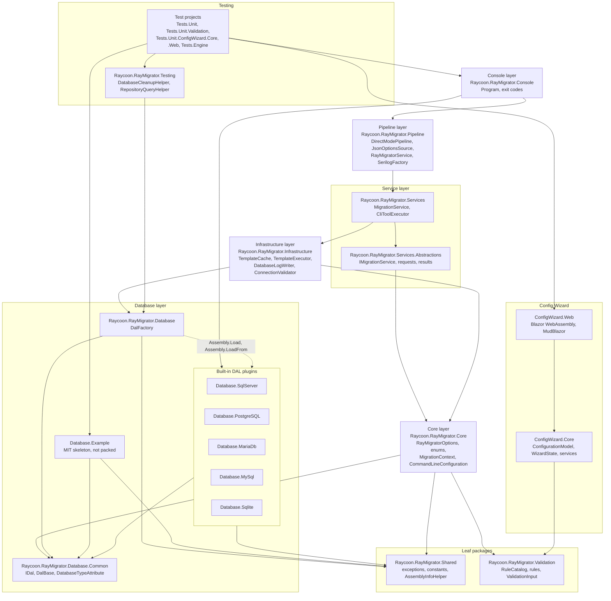
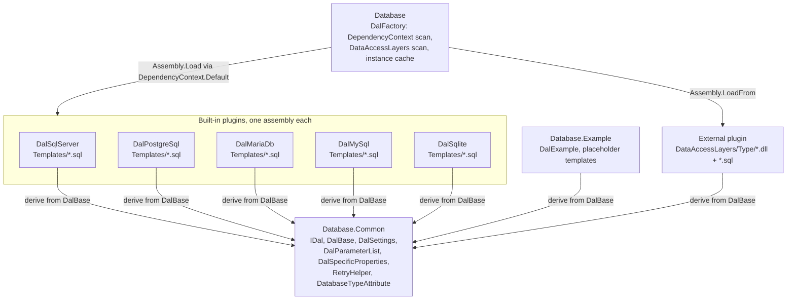

# 5. Building Block View

This chapter answers how RayMigrator is decomposed into building blocks: which
projects exist in `RayMigrator.sln`, which layer each belongs to, which
project references connect them, and which contracts cross the layer
boundaries. A whitebox shows the decomposition of a block (inner components,
responsibilities, dependencies); a blackbox states only its responsibility and
interfaces. Level 1 is the whitebox of the solution, level 2 opens each layer.
The layer names follow section 4.2 of the
[Solution Strategy](04-Solution-Strategy.md#42-top-level-decomposition); the
run time interaction is the subject of the [Runtime View](06-Runtime-View.md).

## 5.1 Whitebox Overall System

RayMigrator is one solution with 24 projects named `Raycoon.RayMigrator.*`:
15 NuGet packages, the executable (assembly name `raymigrator`), the two
Config Wizard projects, the MIT licensed DAL skeleton and five test projects.
The diagram shows the `ProjectReference` edges that define the layering;
references that only repeat a transitive path (for example `Console` to
`Core`) are omitted and listed in the table column "Direct project
references". The dashed edge is the runtime assembly loading by `DalFactory`.

Motivation. The vertical axis separates the reasons to change: CLI surface
(`Console`), hosting and configuration bootstrap (`Pipeline`), migration
logic (`Services`), migration repository template execution and logging plumbing
(`Infrastructure`), domain model (`Core`) and engine access (`Database.*`).
References only point downward, so `Core` is usable by RayMigrator Studio and
unit tests without the host, and a DAL plugin compiles against
`Database.Common` and `Shared` alone. The horizontal axis isolates the five
ADO.NET providers in five assemblies. `Validation` has no reference at all so
that one rule catalog runs in the engine and in the browser based Config
Wizard.

### Contained building blocks

The prefix `Raycoon.RayMigrator.` is omitted in the reference column.

| Project | Layer | Responsibility | Packable | Key public types | Direct project references |
|---------|-------|----------------|----------|------------------|---------------------------|
| `Raycoon.RayMigrator.Console` | Console | Parses the command line, resolves the environment, loads JSON options and hands over to the pipeline; owns the exit codes `0`, `1`, `5`, `100`. | no | `Program`, `AssemblyInfoHelper` | Pipeline, Core, Database.Common, Database, the five `Database.{Engine}`, Infrastructure, Shared, Services, Services.Abstractions |
| `Raycoon.RayMigrator.Pipeline` | Pipeline | Builds the DI host, creates the Serilog logger, validates product alias, schema names and connections, dispatches the command to the service layer. | yes | `DirectModePipeline`, `JsonOptionsSource`, `RayMigratorService`, `SerilogFactory` | Core, Database, Database.Common, Infrastructure, Services, Services.Abstractions, Shared |
| `Raycoon.RayMigrator.Services` | Service | Implements the migration logic: file discovery, TOML parsing, block execution, hashing, rollback, repository bookkeeping, external CLI tool execution. | yes | `MigrationService`, `CliToolExecutor`, `ICliToolExecutor`, `ServiceCollectionExtensions` | Services.Abstractions, Core, Infrastructure, Database |
| `Raycoon.RayMigrator.Services.Abstractions` | Service | Contract of the service layer: the `IMigrationService` interface plus request and result DTOs. | yes | `IMigrationService`, `MigrateUpRequest`, `MigrationOperationResult`, `OperationResult` | Core |
| `Raycoon.RayMigrator.Infrastructure` | Infrastructure | Executes the repository SQL templates, caches templates per engine, validates connections at startup and hosts the database logging sink. | yes | `TemplateCache`, `TemplateExecutor`, `DatabaseLogWriter`, `RayMigratorDatabaseSink` | Core, Database, Shared |
| `Raycoon.RayMigrator.Core` | Core | Domain model: options hierarchy, enums, `MigrationContext` and its accessor, command line definition, environment resolution, validation glue, template types. | yes | `RayMigratorOptions`, `MigrationContext`, `IMigrationContextAccessor`, `CommandLineConfiguration` | Database.Common, Shared, Validation |
| `Raycoon.RayMigrator.Database` | Database | Static discovery and caching of DAL instances by `DatabaseType` and connection string. | yes | `DalFactory` | Shared, Database.Common |
| `Raycoon.RayMigrator.Database.Common` | Database | Plugin contract: `IDal`, the `DalBase` base class, parameter and settings types, retry helper, discovery attribute. | yes | `IDal`, `DalBase`, `DalSpecificProperties`, `DatabaseTypeAttribute` | none |
| `Raycoon.RayMigrator.Database.SqlServer`, `.PostgreSQL`, `.MariaDb`, `.MySql`, `.Sqlite` | Database | One DAL class and 21 SQL templates per engine on top of `Microsoft.Data.SqlClient`, `Npgsql`, `MySqlConnector` (both MariaDB and MySQL), `Microsoft.Data.Sqlite`. | yes | `DalSqlServer`, `DalPostgreSql`, `DalMariaDb`, `DalMySql`, `DalSqlite` | Database.Common, Shared |
| `Raycoon.RayMigrator.Database.Example` | Database | MIT licensed skeleton with `DalExample` and placeholder templates for external plugin authors. | no | `DalExample` | Database.Common, Shared |
| `Raycoon.RayMigrator.Shared` | Leaf | Exceptions, `InternalConstants`, `TemplateResultCode`, version and banner helper. | yes | `ApplicationStartupException`, `MigrationAlreadyRunningException`, `AssemblyInfoHelper`, `TemplateResultCode` | none |
| `Raycoon.RayMigrator.Validation` | Leaf | Engine independent configuration rule catalog shared with the Config Wizard; no NuGet or project dependency, WebAssembly safe. | yes | `RuleCatalog`, `ValidationInput`, `ValidationReport`, `RuleIds` | none |
| `Raycoon.RayMigrator.ConfigWizard.Core` | Config Wizard | IO free model and services of the wizard: configuration model, serializer, merger, validator, scaffolder, defaults promotion, help texts. | no | `ConfigurationModel`, `WizardState`, `ConfigurationSerializer`, `ConfigurationValidator` | Validation |
| `Raycoon.RayMigrator.ConfigWizard.Web` | Config Wizard | Blazor WebAssembly user interface (`net10.0` only) with MudBlazor components, state service, ZIP export and localization. | no | `WizardStateService`, `ZipExportService`, `FileInteropService`, `LocalizationService` | ConfigWizard.Core |
| `Raycoon.RayMigrator.Testing` | Testing | Reusable helpers for integration tests: Docker health check, database cleanup, repository queries through `IDal`. | yes | `DatabaseCleanupHelper`, `DockerHealthCheck`, `RepositoryQueryHelper`, `MigrationRecordDto` | Database |
| `Raycoon.RayMigrator.Tests.Unit`, `.Tests.Unit.Validation`, `.Tests.Unit.ConfigWizard.Core`, `.Tests.Unit.ConfigWizard.Web`, `.Tests.Engine` | Testing | xUnit v3 suites; see [5.2.9](#529-testing-support-and-test-projects). | no | test classes, `EngineTestHost`, `ScenarioBuilder` | the projects under test; `Tests.Engine` additionally Console, Testing and ConfigWizard.Core |

### Important interfaces

| Interface or contract | Defined in | Implemented by | Consumed by |
|-----------------------|------------|----------------|-------------|
| `IDal` (execute, scalar, reader, connection check, shared connection calls) and `DalBase` | `Raycoon.RayMigrator.Database.Common` | `DalSqlServer`, `DalPostgreSql`, `DalMariaDb`, `DalMySql`, `DalSqlite`, `DalExample` | `TemplateExecutor`, `MigrationService`, `ConnectionValidator`, `DatabaseLogWriter`, `RepositoryQueryHelper` |
| `[DatabaseType("...")]` (`DatabaseTypeAttribute`) | `Raycoon.RayMigrator.Database.Common` | applied by every DAL class | `DalFactory` (type discovery), the DAL constructor (reads its own `DatabaseType`) |
| `DalFactory.TryGetDal(databaseType, connectionString, out IDal?)` | `Raycoon.RayMigrator.Database` | static class | `DirectModePipeline`, `MigrationService`, `TemplateExecutor`, `ConnectionValidator`, `Raycoon.RayMigrator.Testing` helpers |
| `IMigrationService` (`MigrateUpAsync`, `MigrateDownAsync`, `ValidateHashAsync`, `UpdateHashAsync`, `BaselineAsync`, `GetStatusAsync`, `GetHistoryAsync`, `FixIssuesAsync`) | `Raycoon.RayMigrator.Services.Abstractions` | `MigrationService` | `RayMigratorService`, `EngineTestHost` |
| `ICliToolExecutor` | `Raycoon.RayMigrator.Services` | `CliToolExecutor` | `MigrationService` |
| `DirectModePipeline.ExecuteAsync(args, OptionsSourceResult, RayMigratorConsoleOptions, assemblyInfo, environment, environmentOrigin)` | `Raycoon.RayMigrator.Pipeline` | static class | `Program.RunDirectMode` in `Raycoon.RayMigrator.Console` |
| `IOptionsSource.LoadAsync(product, environment)` returning `OptionsSourceResult` | `Raycoon.RayMigrator.Core` | `JsonOptionsSource` | `Program` (Console); alternative sources may be supplied by other hosts |
| `IMigrationContextAccessor` | `Raycoon.RayMigrator.Core` | `SingletonMigrationContextAccessor` (CLI), `AsyncLocalMigrationContextAccessor` (API hosts) | `MigrationService`, `TemplateExecutor`, `DirectModePipeline` |
| `IMigrationContextFactory.Create(...)` | `Raycoon.RayMigrator.Core` | `MigrationContextFactory` | registered by `ServiceCollectionExtensions.AddRayMigratorServices`; used by external hosts such as RayMigrator Studio (`EngineTestHost` constructs `MigrationContext` directly) |
| `TemplateExecutor` and `TemplateCache` (classes, no interface) | `Raycoon.RayMigrator.Infrastructure`, namespaces `Raycoon.RayMigrator.Core` and `Raycoon.RayMigrator.Core.Templates` | concrete classes | `MigrationService`, `DatabaseLogWriter.InitDatabaseLogger`, `DirectModePipeline` |
| `RuleCatalog.RunAll(ValidationInput)` returning `ValidationReport` | `Raycoon.RayMigrator.Validation` | static class over nine `internal sealed` rules implementing `IValidationRule` | `RayMigratorOptionsValidator` (engine), `ConfigurationValidator` via `WizardValidationInputAdapter` (wizard) |
| `ILogEventSink`, `ILogEventEnricher` (Serilog) | Serilog | `RayMigratorDatabaseSink`, `MigrationContextEnricher` | `SerilogFactory.Create` |

## 5.2 Level 2

### 5.2.1 Console layer (`Raycoon.RayMigrator.Console`)

Purpose: the only executable. It is deliberately thin: `Program.Main` creates
`CommandLineConfiguration` (defined in `Core`) with the ASCII banner from
`AssemblyInfoHelper`, parses the arguments into `RayMigratorConsoleOptions`,
initializes `SensitiveDataMasker`, resolves the environment with
`EnvironmentResolver.Resolve` and calls `RunDirectMode` with a
`JsonOptionsSource` built from `--config-dir`. `RunDirectMode` loads the
options and delegates to `DirectModePipeline.ExecuteAsync`.

| Inner component | Responsibility |
|-----------------|----------------|
| `Program.cs` | Entry point; exit code `5` when System.CommandLine throws (ordinary parse errors return System.CommandLine's own code), `0` for help and version, `1` for `ApplicationStartupException`, `100` for any other exception; codes `2` and `3` come back from `EnvironmentResolver`, `4` from `DirectModePipeline`. |
| `AssemblyInfoHelper.cs` | Local wrapper delegating to `Raycoon.RayMigrator.Shared.AssemblyInfoHelper` for banner and version. |
| `appsettings*.json`, `Properties/launchSettings.json` | Development configurations and launch profiles per engine and platform; none of them is copied to the publish output (`CopyToPublishDirectory=Never`), so the release archive ships without configuration files. |
| MSBuild targets in the `.csproj` | `CopyDalAssembliesToDataAccessLayers` copies the five DAL assemblies into `DataAccessLayers/{Engine}/` after build; `CopyDalTemplatesToDataAccessLayersPublish` copies their `Templates/*.sql` on publish; `CopyExamplesToOutput`, `CopyLicenseToPublishOutput` ship examples and license files. |

The console references the five DAL projects only so that plugins and
templates land in the output directory; command registration lives in `Core`
(`CommandLineConfiguration`), dispatch in `Pipeline` (`RayMigratorService`).
Authoritative pages:
[Command structure](https://github.com/RAYCOON/RayMigrator/blob/main/Docs/05-console-layer/command-structure.md),
[RayMigratorService](https://github.com/RAYCOON/RayMigrator/blob/main/Docs/05-console-layer/raymigrator-service.md),
[Launch profiles](https://github.com/RAYCOON/RayMigrator/blob/main/Docs/05-console-layer/launch-profiles.md).

### 5.2.2 Pipeline layer (`Raycoon.RayMigrator.Pipeline`)

Purpose: everything between "options are loaded" and "the service method
returns", independent of how the options were obtained. Four classes, no
folders; the flow is linear: `JsonOptionsSource` produces an
`OptionsSourceResult`, `DirectModePipeline.ExecuteAsync` creates the logger
through `SerilogFactory.Create`, builds the host and resolves
`RayMigratorService`, whose `DoWorkAsync` calls `IMigrationService` and
returns the exit code.

| Inner component | Responsibility |
|-----------------|----------------|
| `JsonOptionsSource` | Loads `appsettings.json`, `appsettings.{Environment}.json`, `appsettings.{Product}.json`, `appsettings.{Product}.{Environment}.json` from the working directory or `--config-dir`, replaces `{ENV:NAME}` placeholders through `EnvironmentVariableReplacer`, returns `OptionsSourceResult` with the `RayMigrator` section, host configuration and file diagnostics. |
| `DirectModePipeline` | Static pipeline with the stages: check that a `Serilog` node exists (exit code `4`), create the logger, build the host and register `RayMigratorOptions` with `ValidateDataAnnotations` and `ValidateOnStart`, `ProductDefaultsPostConfigureOptions`, `RayMigratorOptionsValidator`, `DatabaseLogWriter`, `AddRayMigratorServices(RayMigratorHostMode.Cli)`, `TemplateCache`, `TemplateExecutor`, `RayMigratorService` and the singleton `MigrationContext`; then validate the product alias, set `MigrationLoggingContext.Current`, initialize database logging, fill `DalSpecificPropertiesDictionary`, run `SchemaNameValidator` and `ConnectionValidator`, execute `RayMigratorService.DoWorkAsync`, flush the log queue and stop the host. |
| `RayMigratorService` | Bridge from `RayMigratorConsoleOptions` to `IMigrationService`: one private `Execute*Async` method per `MigrationCommand` (`ExecuteMigrateUpAsync`, `ExecuteMigrateDownAsync`, `ExecuteValidateHashAsync`, `ExecuteUpdateHashAsync`, `ExecuteBaselineAsync`, `ExecuteInfoAsync`, `ExecuteFixIssuesAsync`) builds the request DTO, calls the service and maps the result to exit code `0` or `1`; `MigrationAlreadyRunningException` is handled here. |
| `SerilogFactory` | Creates the Serilog logger from the `RayMigrator.Serilog` section via `Serilog.Settings.Configuration` and adds `RayMigratorDatabaseSink` when `DatabaseLogging` is configured. |

`EnvironmentResolver` (Core) runs before the pipeline; the resolved name is
passed in. Authoritative pages:
[Dependency injection](https://github.com/RAYCOON/RayMigrator/blob/main/Docs/01-architecture/dependency-injection.md),
[Configuration hierarchy](https://github.com/RAYCOON/RayMigrator/blob/main/Docs/06-configuration-reference/appsettings-hierarchy.md).

### 5.2.3 Service layer (`Raycoon.RayMigrator.Services`, `Raycoon.RayMigrator.Services.Abstractions`)

Purpose: the migration logic behind a host agnostic contract. The abstractions
package holds `IMigrationService.cs`, `Models/Requests.cs`
(`MigrateUpRequest`, `MigrateDownRequest`, `ValidateHashRequest`,
`UpdateHashRequest`, `BaselineRequest`, `FixIssuesRequest`) and
`Models/Results.cs` (`OperationResult` with `MigrationOperationResult`,
`ValidationResult`, `HashUpdateResult`, `BaselineResult`, `FixIssuesResult`,
plus `MigrationStatusInfo` and `MigrationHistory`). The implementation
package has three files.

| Inner component | Responsibility |
|-----------------|----------------|
| `MigrationService` (one file, about 5200 lines) | Implements all eight `IMigrationService` methods. Responsibility groups, named by their methods: file discovery (`DiscoverAndPrepareMigrationFiles`, `ParseMigrationFile`, `ValidateTargetGroupAliasCasing`, `ValidateFlatLayoutAmbiguity`, `LoadMigSettingsDefaults`, `ResolveMigSettingsForFile`, `IsEnvironmentSpecificFile`, `DetectOutOfOrderFiles`); TOML parsing without a library (`ExtractTomlAndSql`, `ParseTomlConfig`, `ParseTomlEnum<T>`, `SerializeTomlAsJson`); block handling (`SplitSqlIntoBlocks`, `ShouldSkipBlockSplitting`, `GetBlockDelimiter`, `ReplaceEnvironmentVariablesInSqlBlock`); execution per loop order (`ExecuteTargetGroupFileByFile`, `ExecuteTargetGroupTargetByTarget`), the atomic shared connection path (`CanUseSharedConnection`, `ExecuteRollbackBlocksAtomic`) and resume (`FindResumableBlock`, `TryFinalizeCompletedMigration`); hashing and filtering (`HashesDiffer`, `FilterAlreadyMigratedFiles`, `FilterByTargetRelease`, `FilterByTargetGroups`, `ResolveHashValidationScope`); error handling and rollback (`HandleMigrationError`, `RollbackSingleMigration`, `ExecuteRollbackForMigrations`, `GetRollbackFilename`); run handling and the lock (`InitializeRepositoryAsync`, `ResolveRepositoryIdsReadOnlyAsync`, `RepositoryMigrationRunInsertWithAutoFix`, `BuildMigrationRunSettingsJson`, `DeriveRunOperation`); CLI tool routing (`ResolveUseCliToolAlias`, `GetCliToolByAlias`, `ResolveCliToolArguments`); repair (`RepairsFor`). Many helpers are `internal static` so that `Raycoon.RayMigrator.Tests.Unit` covers them without a database. |
| `CliToolExecutor` | `ICliToolExecutor` implementation over `System.Diagnostics.Process`: `CliToolExecutionRequest` in, `CliToolExecutionResult` out; handles `CliToolInputMode` `File` and `Stdin`, the timeout and `ExitCodeMatcher`. |
| `ServiceCollectionExtensions` | `AddRayMigratorServices(RayMigratorHostMode)` registers `IMigrationService` and `ICliToolExecutor` as scoped, the context accessor as singleton (`Cli`) or scoped (`Api`), and `IMigrationContextFactory` as singleton. |

The service never branches on an engine name: repository operations go
through `TemplateExecutor`, target SQL through the `IDal` from `DalFactory`,
engine facts through `DalSpecificPropertiesDictionary` on the
`MigrationContext`. Authoritative pages:
[Migration service](https://github.com/RAYCOON/RayMigrator/blob/main/Docs/04-service-layer/migration-service.md),
[File discovery](https://github.com/RAYCOON/RayMigrator/blob/main/Docs/04-service-layer/file-discovery.md),
[Block execution](https://github.com/RAYCOON/RayMigrator/blob/main/Docs/04-service-layer/block-execution.md),
[Activity diagrams](https://github.com/RAYCOON/RayMigrator/blob/main/Docs/04-service-layer/activity-diagrams.md).

### 5.2.4 Core layer (`Raycoon.RayMigrator.Core`)

Purpose: the domain model that every engine layer and RayMigrator Studio
share. The project performs no database access and no process execution; its
only I/O is reading environment variables (`EnvironmentVariableReplacer`,
`EnvironmentResolver`), the directory check in `RayDirectoryExistsAttribute`
and the unused `CultureDependentSorting` helper.

| Folder or class group | Responsibility |
|-----------------------|----------------|
| `Configuration/Options/` | `RayMigratorOptions` with `RepositoryOptions`, `DatabaseLoggingOptions`, `SerilogOptions`, `ProductDefaultOptions`, `TargetGroupDefaultOptions`, `TargetDefaultsOptions`, `ProductOptions`, `TargetGroupOptions`, `TargetOptions`, `CliToolOptions`, `ExitCodeMatcher`; `RayMigratorConsoleOptions` (parsed CLI values); `RayMigratorBootstrapOptions` and `AdminDbOptions` (Studio contract); `CommandLineConfiguration` (System.CommandLine root with the seven subcommands). |
| `Configuration/Enums/` | `MigrationCommand`, `MigrationRunMode`, `MigrationOperation`, `MigrationRunResult`, `MigrationStatus`, `MigrationErrorAction`, `RollbackErrorAction`, `TargetMigrationOrder`, `HashValidationScope`, `FixScope`, `OperatingMode`, `CliToolInputMode`. |
| `Configuration/` root | `CommandProfile` record struct (its `GetProfile` lives in `Extensions/MigrationCommandExtensions`: which commands connect to targets, write the repository, write the database log); `EnvironmentResolver`; `SensitiveDataMasker`; `ConfigurationConstants`; `EncodingSupport`; `ConfigurationHelper`. |
| `Configuration/Validation/` | Engine side glue to the shared rule catalog: `RayMigratorOptionsValidator` (`IValidateOptions`), `OptionsValidationInputAdapter`, `ProductDefaultsPostConfigureOptions.MergeDefaults`, `SchemaNameValidator`, custom attributes under `RayAttributes/`. |
| `Configuration/Sources/`, `Configuration/Replacer/` | `IOptionsSource`, `OptionsSourceResult`; `EnvironmentVariableReplacer`, `EnvironmentVariableWithMetadata`. |
| State machine and context | `MigrationContext` (options, `MigrationState`, `DalSpecificPropertiesDictionary`, `Clone`), `MigrationState` (ids, current file and block, `MigrationRunResult`, `MigrationOperation`, `MigrationStatus`), `MigrationStateSnapshot`, `MigrationLoggingContext` (static `AsyncLocal`), `IMigrationContextAccessor` with both accessors, `IMigrationContextFactory` with `MigrationContextFactory`, `RayMigratorHostMode`. |
| `Models/`, `Recovery/`, `Templates/`, `Logging/` | `MigrationFileInfo`, `MigrationRecord`; `InterruptedMigrationInfo`; `Template`, `TemplateResponse`, `TemplateType` (21 template kinds plus `Undefined`); `MigrationEvent` with the `EventId` constants. |
| `Extensions/` | `StringExtensions` (SHA-256, path helpers), `MigrationRunModeExtensions`, `MigrationCommandExtensions`, `RayMigratorOptionsExtensions`, `EnumTypeExtensions`, `ExceptionExtensions`. |

Authoritative pages:
[Component responsibilities](https://github.com/RAYCOON/RayMigrator/blob/main/Docs/01-architecture/component-responsibilities.md),
[MigrationContext](https://github.com/RAYCOON/RayMigrator/blob/main/Docs/02-core-concepts/migration-context.md),
[Migration state machine](https://github.com/RAYCOON/RayMigrator/blob/main/Docs/02-core-concepts/migration-state-machine.md).

### 5.2.5 Infrastructure layer (`Raycoon.RayMigrator.Infrastructure`)

Purpose: the technical services that need both the domain model and a DAL:
template execution against the repository, startup connection checks and the
database log sink. Serilog is configured in `Pipeline` (`SerilogFactory`);
this layer supplies the sink and enricher. Process execution for external CLI
tools (`CliToolExecutor`) and the migration file system access
(`MigrationService`) live in `Services`, not here.

| Inner component | Namespace | Responsibility |
|-----------------|-----------|----------------|
| `TemplateCache.cs` | `Raycoon.RayMigrator.Core.Templates` | Loads every `*.sql` under `DataAccessLayers/{Type}/` next to the binary at construction, resolves `{ENV:*}` once, validates that each discovered type has all `TemplateType` templates, and resolves `{CFG:*}` per call in `GetTemplate<T>`, `GetRepositoryTemplate<T>`, `GetTemplateContent<T>`; `GetAvailableDatabaseTypes`, `ValidateConfigurationAgainstTemplateCache`. |
| `TemplateExecutor.cs` | `Raycoon.RayMigrator.Core` | One synchronous method per repository operation (`RepositoryCheckCreate`, `RepositoryMigrationRunInsert`, `RepositoryMigrationInsert`, `RepositoryMigrationUpdate`, `RepositoryMigrationRecordHistorySelect`, ...) that fetches the template, binds a `DalParameterList`, executes through the repository `IDal` obtained lazily from `DalFactory`, and parses `ResultCode,ResultMessage` into `TemplateResponse`; negative codes become exceptions. |
| `ConnectionValidator.cs` | `Raycoon.RayMigrator.Core.Configuration.Validation` | `ValidateTargetConnections` and `ValidateDatabaseLoggerConnection`; whether a connection is actually opened depends on `CommandProfile.ConnectsToTargets` and `WritesDatabaseLog`. |
| `RepositoryExtensions.cs` | `Raycoon.RayMigrator.Core.Extensions` | `GetDalSettings()` builds `DalSettings` (timeout, retries) from `RepositoryOptions`. |
| `Logging/DatabaseLogWriter.cs` | `Raycoon.RayMigrator.Infrastructure.Logging` | Owns the logging `IDal`, `InitDatabaseLogger` (runs `DatabaseLogging_CheckCreate` through `TemplateExecutor`), `EnqueueLogEntry`, `Flush`. |
| `Logging/DatabaseLoggerQueue.cs` | same | `BlockingCollection` backed background writer with deterministic `Flush()`. |
| `Logging/RayMigratorDatabaseSink.cs`, `Logging/MigrationContextEnricher.cs` | same | Serilog `ILogEventSink` that forwards to `DatabaseLogWriter`; `ILogEventEnricher` that reads `MigrationLoggingContext.Current` and adds run, target group, target, file and block ids. |

The four files with `Raycoon.RayMigrator.Core` namespaces are the one
documented deviation from the layering: consumers see Core types but must
reference `Raycoon.RayMigrator.Infrastructure`. Authoritative pages:
[Template executor](https://github.com/RAYCOON/RayMigrator/blob/main/Docs/04-service-layer/template-executor.md),
[Template system](https://github.com/RAYCOON/RayMigrator/blob/main/Docs/03-database-layer/template-system.md),
[Logging schema](https://github.com/RAYCOON/RayMigrator/blob/main/Docs/03-database-layer/logging-schema.md).

### 5.2.6 Database layer

Purpose: engine specific access behind one contract, packaged so that a plugin
can be built outside the repository.

| Building block | Responsibility and interfaces |
|----------------|-------------------------------|
| `Raycoon.RayMigrator.Database.Common` | The contract package. `IDal` defines `DatabaseType`, `DalSpecificProperties`, `ExecuteNonQueryAsync`, `ExecuteNonQuery`, `ExecuteScalarAsync`, `ExecuteReaderAsync`, `IsConnectionValid`, `CheckConnectionStringOrValidateConnection`, parameter mapping, and the shared connection trio `CreateConnection`, `ExecuteNonQueryAsync(DbConnection, DbTransaction, ...)`, `ExecuteScalarAsync(DbConnection, DbTransaction, ...)`. `DalBase` adds `IsTransient`, the `ExecuteWithRetryAsync` helpers over `RetryHelper` (linear backoff, `RetryExhaustedException`), type and parameter mapping. `DalSpecificProperties` carries `SqlBlockDelimiter`, `SupportsSchema`, `SupportsTransactionalDdl`, identifier quotes, `DefaultSchema`, `FoldsUnquotedIdentifiersToLower`. `DatabaseTypeAttribute` is the discovery key. |
| `Raycoon.RayMigrator.Database` | `DalFactory` only. The static constructor loads every runtime library named `Raycoon.RayMigrator.*` from `DependencyContext.Default` (works in single file publish) and every `*.dll` under `DataAccessLayers/*/`, collects non-abstract `IDal` classes with `[DatabaseType]` into a type map (`TryAdd`, first wins), and `TryGetDal` creates instances with `Activator.CreateInstance(type, connectionString)` cached per `{databaseType}_{connectionString}`; an unknown type throws `ConfigurationValidationException`. The package depends on `Microsoft.Extensions.DependencyModel`. |
| Built-in plugins `Database.SqlServer`, `.PostgreSQL`, `.MariaDb`, `.MySql`, `.Sqlite` | Each project contains exactly one DAL class and a `Templates/` folder with the 21 files named `Repository_*.sql` and `DatabaseLogging_*.sql` (one per `TemplateType`). `RayMigratorDatabaseType` in the `.csproj` names the `DataAccessLayers/{Type}/` folder; the `CopyDalToDataAccessLayers` target and the `Content` items with `contentFiles` packaging put assembly and templates there for build, publish and NuGet consumers. |
| `Raycoon.RayMigrator.Database.Example` | `DalExample` with `[DatabaseType("Example")]`, every abstract member stubbed, and 22 placeholder templates (the 21 required ones plus `Repository_MigrationRecordHistory_Archive.sql`, which `TemplateCache` ignores). Own MIT `LICENSE.md`; `IsPackable` is `false` and the ADO.NET provider reference is a commented example. |
| External plugins | A class library referencing the `Database.Common` and `Shared` packages, deployed as `DataAccessLayers/{Type}/` with assembly, provider assemblies and templates; discovered by the file system scan without any registration. |

Authoritative pages:
[DAL architecture](https://github.com/RAYCOON/RayMigrator/blob/main/Docs/03-database-layer/dal-architecture.md),
[SQL dialects](https://github.com/RAYCOON/RayMigrator/blob/main/Docs/03-database-layer/sql-dialects.md),
[External DAL development](https://github.com/RAYCOON/RayMigrator/blob/main/Docs/09-extending/external-dal-development.md).

### 5.2.7 Validation and Shared

`Raycoon.RayMigrator.Validation` is the rule catalog that both the engine and
the Config Wizard execute, which is why it has neither a project nor a package
reference.

| Inner component | Responsibility |
|-----------------|----------------|
| `RuleCatalog`, `RuleIds`, `Rules/IValidationRule` | `RunAll(ValidationInput)` executes a fixed, hand registered list of rules (no reflection) and returns a `ValidationReport` of `ValidationIssue` records with `ValidationSeverity` and a rule id such as `RULE_3_8`. |
| `Rules/` | `AliasUniquenessRule`, `TargetGroupMigrationOrderRule`, `SemanticContradictionsRule`, `CliToolDefinitionsRule`, `CliToolReferencesRule`, `CliToolParametersRule`, `SchemaRule`, `ConnectionStringRule`, `DefaultCascadeRule`; each owns one rule id category (alias uniqueness, target group order, contradictory error and rollback settings, CLI tool definitions, references and parameters, schema names, connection strings, defaults cascade). |
| `Models/` | `ValidationInput` with `RepositoryInput`, `ProductDefaultsInput`, `ProductInput`, `TargetGroupInput`, `TargetInput`, `CliToolInput`; adapters in Core (`OptionsValidationInputAdapter`) and in the wizard (`WizardValidationInputAdapter`) flatten their own models into it. |
| `Helpers/`, `Messages/` | `ExitCodeExpressionValidator` (single source of truth for `SuccessExitCodes` expressions, used by `ExitCodeMatcher`), `CliToolPlaceholderExtractor`; `ValidationMessages`, an internal class of constant format strings (the localized `.resx` texts belong to the Config Wizard Core). |

Rules that need engine knowledge stay outside the catalog: `SchemaNameValidator`
(needs `DalSpecificProperties.SupportsSchema`) and `ConnectionValidator` (opens
connections) live in Core and Infrastructure. The full rule list is in
[Validation rules](https://github.com/RAYCOON/RayMigrator/blob/main/Docs/appendix/validation-rules.md).

`Raycoon.RayMigrator.Shared` holds what every layer including plugins needs:
`Exceptions/CustomExceptions.cs` (`ApplicationStartupException`,
`ConfigurationValidationException`, `TemplateExecutionException`,
`TemplateResultException`, `MigrationExecutionException`,
`CliToolExecutionException`, `MigrationAlreadyRunningException`,
`MigrationRecoveryException` and others), `Constants/InternalConstants.cs`,
`Constants/TemplateResultCode.cs` and `AssemblyInfoHelper`.

### 5.2.8 Config Wizard (`Raycoon.RayMigrator.ConfigWizard.Core`, `Raycoon.RayMigrator.ConfigWizard.Web`)

Purpose: generate and validate the `appsettings*.json` hierarchy in the
browser. Core is the model and service library (multi-targeted, unit tested
without a browser); Web is the user interface
(`Microsoft.NET.Sdk.BlazorWebAssembly`, `net10.0`, MudBlazor).

| Building block | Inner components | Responsibility |
|----------------|------------------|----------------|
| `ConfigWizard.Core/Models/` | `ConfigurationModel` with `RepositoryModel`, `DatabaseLoggingModel`, `ProductDefaultsModel`, `ProductModel`, `TargetGroupModel`, `TargetModel`, `SerilogModel`, `CliToolModel`, `OverridableValue<T>`, `ConfigFileRole`; `WizardState`, `WizardSetupAnswers`, `ProductEnvironmentEntry`; `WizardValidationResult`, `ValidationCapability`; help records in `HelpModels.cs`. | In-memory representation of one configuration file and of the whole file family; `PreservedDocument` keeps unknown JSON keys for round trips. |
| `ConfigWizard.Core/Services/` | `ConfigurationSerializer`, `ConfigFileMerger`, `ConfigurationFileParser`, `ConfigurationValidator` with `WizardValidationInputAdapter`, `ValidationReportToWizardResultMapper`, `WizardOnlyChecks`, `AdoNetChecks`, `FilesystemChecks`; `InheritanceResolver`, `DefaultsPromoter`, `HierarchyFactoring`, `ConfigurationScaffolder`, `EnvironmentSkeletonGenerator`, `EnvFileGenerator`, `CliToolPresetProvider`, `WizardCliToolParameterResolver`, `ContextHelpProvider`, `JsonPathRegistry`. | Static, IO free services: JSON round trip, merge semantics identical to the engine (shared code), validation through `RuleCatalog` plus wizard only checks, defaults promotion, factoring of the export into the hierarchy (ADR-021), scaffolding, help texts from `Resources/*.resx` in English and German. |
| `ConfigWizard.Web` | `Program.cs`; `Pages/WizardPage.razor`; `Components/Phase1/WelcomeMask`, `Phase2/WizardHost`, `Phase3/OverviewHost`, `Hub/HubPage`, `Sections/*`, `Shared/*`; `Services/WizardStateService`, `ZipExportService`, `FileInteropService`, `LocalizationService`, `WizardMudLocalizer`, `TermsAcceptanceService`, `JsonHighlightService`; `wwwroot/js/fileInterop.js`, `wwwroot/staticwebapp.config.json`. | Phase driven UI (`WizardPhase` `Start`, `Hub`, `GuidedConfig`, `Overview`; `WizardStepId` for the six stepper steps), scoped `WizardStateService` per browser tab, export of the pruned file family plus `example.env` as `raymigrator-config.zip`. |

Output artefacts are only files: `appsettings.json`,
`appsettings.{Environment}.json`, `appsettings.{Product}.json`,
`appsettings.{Product}.{Environment}.json`, `example.env` and the
`TERMS-ACCEPTANCE.txt` record inside the ZIP.
The wizard opens no database connection: the only `System.Data` usage in Core
is `DbConnectionStringBuilder` parsing in `AdoNetChecks` and
`WizardOnlyChecks`, gated by `ValidationCapability.AdoNetParsing`; the Web
project calls the `ConfigurationValidator.ValidateAll(model)` overload, which
runs with `Structural` only because `Filesystem` and `AdoNetParsing` are
unavailable in WebAssembly. Neither project references any engine package
besides `Validation`. Authoritative pages:
[Config Wizard architecture](https://github.com/RAYCOON/RayMigrator/blob/main/Docs/12-config-wizard/architecture.md),
[Services reference](https://github.com/RAYCOON/RayMigrator/blob/main/Docs/12-config-wizard/services.md),
[File hierarchy](https://github.com/RAYCOON/RayMigrator/blob/main/Docs/12-config-wizard/file-hierarchy.md).

### 5.2.9 Testing support and test projects

`Raycoon.RayMigrator.Testing` is a packable library (references only
`Raycoon.RayMigrator.Database`) for integration tests against real engines:
`DockerHealthCheck.IsDatabaseAvailable`, `DatabaseCleanupHelper.CleanDatabase`
and `CleanAllDatabases`, and `RepositoryQueryHelper` (`CountRows`,
`TableExists`, `CountMigrationsWithStatus`, `GetLatestMigrationRunResultId`,
`CountLogEntries`, `ProductExists`, ...) returning `MigrationRecordDto` and
`MigrationRunRecordDto`. All helpers obtain their `IDal` from `DalFactory`.

| Test project | Kind | Structure and notable contents |
|--------------|------|--------------------------------|
| `Raycoon.RayMigrator.Tests.Unit` | Unit, no database, runs in CI | About 100 flat test files prefixed by priority `P0_` to `P3_` (for example `P0_SplitSqlIntoBlocksTests`, `P0_TomlParsingTests`, `P1_CanUseSharedConnectionTests`, `P1_DalFactoryTests`); `Helpers/` with `CapturingLogger`, `ProfileTestContext`, `TestFactories`; references every engine project including `Database.Example` and `Testing`. |
| `Raycoon.RayMigrator.Tests.Unit.Validation` | Unit | `RuleCatalogTests`, one test class per rule under `Rules/`, `Helpers/InputFactory`. |
| `Raycoon.RayMigrator.Tests.Unit.ConfigWizard.Core` | Unit | One or more test classes per Core service (serializer, merger, parser, validator, promoter, scaffolder, help provider). |
| `Raycoon.RayMigrator.Tests.Unit.ConfigWizard.Web` | Unit (`Microsoft.NET.Sdk.Razor`) | `WizardStateServiceTests`, `ZipExportServiceTests`, `LocalizationServiceTests`, `TermsAcceptanceServiceTests`, `WizardHostStepIndexTests`. |
| `Raycoon.RayMigrator.Tests.Engine` | Engine tests against Docker containers and a SQLite file, local duty before a release | `Fixtures/` (`SqlServerFixture`, `PostgreSqlFixture`, `MariaDbFixture`, `MySqlFixture`, `SqliteFixture` with `IsDatabaseAvailable`), `Collections/` (xUnit collection per engine), `Infrastructure/` (`EngineTestHost` rebuilding the `DirectModePipeline` DI wiring without CLI parsing, `ScenarioBuilder` and `ScenarioContext` for injecting errors and TOML into copied migration files, `SqlDialect`, engine test bases, `MigrationRecordExpectation`, `MigrationRunExpectation`, `DockerExecHelper`, `CliToolConfigHelper`), `Tests/{MigrateUp,MigrateDown,Compound,Features,CliTool}` with traits `MigrateUp`, `MigrateDown`, `Compound`, `Features`, `CliTool`, `CliToolDocker`, and `MigrationFiles/` per engine. |

The unit suite is the CI gate; the engine suite is run locally before a
release (see [Architecture Constraints](02-Architecture-Constraints.md#22-organizational-constraints)).
Authoritative pages:
[Test infrastructure](https://github.com/RAYCOON/RayMigrator/blob/main/Docs/10-testing/test-infrastructure.md),
[Unit tests](https://github.com/RAYCOON/RayMigrator/blob/main/Docs/10-testing/unit-tests.md), [Engine tests](https://github.com/RAYCOON/RayMigrator/blob/main/Docs/10-testing/engine-tests.md).

## 5.3 Level 3: Inside a DAL plugin (`Raycoon.RayMigrator.Database.PostgreSQL`)

A built-in plugin is small enough to serve as the reference for external
authors. `DalPostgreSql` (about 300 lines) is annotated
`[DatabaseType("PostgreSQL")]`, derives from `DalBase` and has the mandatory
constructor `DalPostgreSql(string connectionString)`, which fills
`DalSpecificProperties` (`SqlBlockDelimiter` `;`, `SupportsSchema` `true`,
`SupportsTransactionalDdl` `true`, `DefaultSchema` `public`,
`FoldsUnquotedIdentifiersToLower` `true`).

| Member group | Content |
|--------------|---------|
| Dialect facts and retry | `DalSpecificProperties`; `IsTransient` override maps `PostgresException.SqlState` to the transient SQLSTATE list that `RetryHelper` reacts to. |
| Managed lifecycle calls | `ExecuteNonQueryAsync`, `ExecuteNonQuery`, `ExecuteScalarAsync`, `ExecuteReaderAsync`: thin wrappers calling `ExecuteWithRetryAsync` or `ExecuteWithRetry` around private `*Internal` methods that open an `NpgsqlConnection`, begin a transaction per `IDalSettings.UseTransaction`, bind parameters and dispose everything; `CheckConnectionStringOrValidateConnection` serves `ConnectionValidator` (`IsConnectionValid` has no caller). |
| Shared connection calls | `CreateConnection`, `ExecuteNonQueryAsync(DbConnection, DbTransaction, ...)`, `ExecuteScalarAsync(DbConnection, DbTransaction, ...)`: no retry, no connection management; used by the atomic path in `MigrationService`. |
| `Templates/` | The 21 PostgreSQL templates (`snake_case` identifiers, `pg_advisory_xact_lock` in `Repository_MigrationRun_Insert.sql`), copied to `DataAccessLayers/PostgreSQL/` by the `CopyDalToDataAccessLayers` target. |

The other four plugins have the same shape and differ only in provider,
transient error codes, dialect facts and template bodies (see
[SQL dialects](https://github.com/RAYCOON/RayMigrator/blob/main/Docs/03-database-layer/sql-dialects.md#naming-conventions-per-engine)).

## Related documentation

- [Architecture overview](https://github.com/RAYCOON/RayMigrator/blob/main/Docs/01-architecture/overview.md), [Component responsibilities](https://github.com/RAYCOON/RayMigrator/blob/main/Docs/01-architecture/component-responsibilities.md), [Dependency injection](https://github.com/RAYCOON/RayMigrator/blob/main/Docs/01-architecture/dependency-injection.md), [Architectural patterns](https://github.com/RAYCOON/RayMigrator/blob/main/Docs/01-architecture/patterns.md)
- [DAL architecture](https://github.com/RAYCOON/RayMigrator/blob/main/Docs/03-database-layer/dal-architecture.md), [Template system](https://github.com/RAYCOON/RayMigrator/blob/main/Docs/03-database-layer/template-system.md), [External DAL development](https://github.com/RAYCOON/RayMigrator/blob/main/Docs/09-extending/external-dal-development.md)
- [Migration service](https://github.com/RAYCOON/RayMigrator/blob/main/Docs/04-service-layer/migration-service.md), [RayMigratorService](https://github.com/RAYCOON/RayMigrator/blob/main/Docs/05-console-layer/raymigrator-service.md)
- [Config Wizard architecture](https://github.com/RAYCOON/RayMigrator/blob/main/Docs/12-config-wizard/architecture.md), [Test infrastructure](https://github.com/RAYCOON/RayMigrator/blob/main/Docs/10-testing/test-infrastructure.md), [RayMigrator.sln](https://github.com/RAYCOON/RayMigrator/blob/main/RayMigrator.sln)
- [Runtime View](06-Runtime-View.md), [Deployment View](07-Deployment-View.md), [Crosscutting Concepts](08-Crosscutting-Concepts.md)
