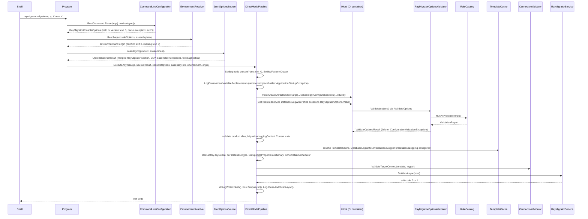
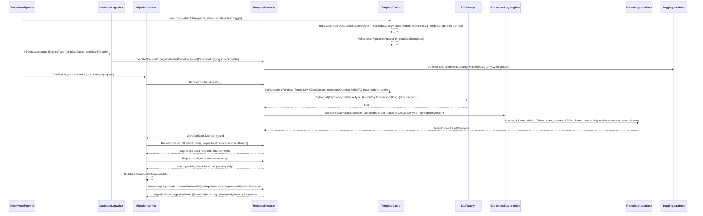
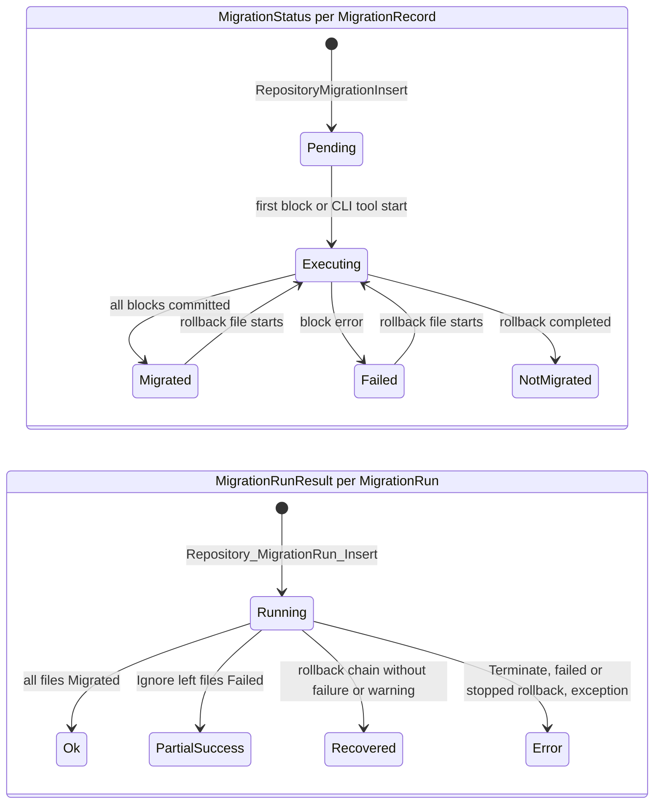
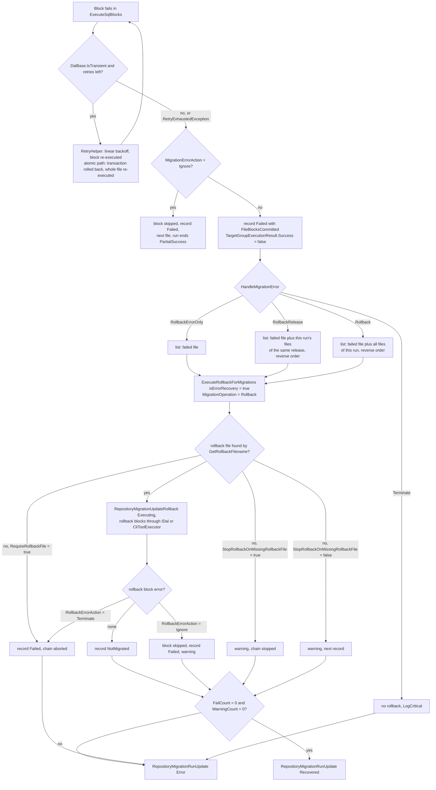

# 6. Runtime View

This chapter answers how the building blocks of the
[Building Block View](05-Building-Block-View.md) cooperate at run time: which
classes are involved in a scenario, in which order they call each other, and
what a scenario leaves behind in the migration repository (the RayMigrator
bookkeeping database), in the log sinks and in the process exit code. The
scenarios are chosen by three criteria: the most important ones (startup,
repository bootstrap and `migrate-up`, which every installation runs), the
most risky ones (error handling with rollback, the exclusive run lock,
external CLI tools) and the most instructive ones (`migrate-down`, hash
validation, the Config Wizard), because they show mechanisms that recur in
the [Crosscutting Concepts](08-Crosscutting-Concepts.md).

| Scenario | Trigger | Why it is documented |
|----------|---------|----------------------|
| 6.1 Startup and Configuration Resolution | any `raymigrator` invocation | every run passes through it; produces exit codes `2` to `5` |
| 6.2 Repository Bootstrap | first state changing command against a repository database | creates the schema that every later run depends on |
| 6.3 `migrate-up` | `raymigrator migrate-up -p X -env Y` | the primary use case |
| 6.4 Error Handling and Rollback | a failing SQL block during 6.3 | highest risk for the target databases |
| 6.5 `migrate-down` | `raymigrator migrate-down --to-release R` | explicit use of the rollback engine |
| 6.6 Hash Validation | `validate-hash`, `update-hash` | integrity mechanism of the audit trail |
| 6.7 Exclusive Run Lock and `fix` | two concurrent runs, a crashed run | integrity of the repository under concurrency |
| 6.8 External CLI Tool Execution | `UseCliToolAlias` on a file, target, target group or product | leaves the ADO.NET path |
| 6.9 Config Wizard Session | a developer opens the wizard in the browser | the only runtime outside the engine process |

## 6.1 Startup and Configuration Resolution

Trigger: the shell starts `raymigrator` with a subcommand. Participants:
`Program` (Console), `CommandLineConfiguration` and `EnvironmentResolver`
(Core), `JsonOptionsSource`, `DirectModePipeline`, `SerilogFactory` and
`RayMigratorService` (Pipeline), `RayMigratorOptionsValidator` (Core) over
`RuleCatalog` (Validation), `TemplateCache` and `ConnectionValidator`
(Infrastructure), `DalFactory` (Database).



1. `Program.Main` registers code page encodings, builds `CommandLineConfiguration` with the banner from `AssemblyInfoHelper` and parses `args` with System.CommandLine. A parse exception returns `5`; a help or version request leaves `ParsedOptions` empty and returns `0`. `SensitiveDataMasker.Initialize` receives `--reveal-sensitive-data`.
2. `EnvironmentResolver.Resolve` combines `--environment` and `DOTNET_ENVIRONMENT`: both set and different returns `2`, neither set returns `3`; otherwise the name and its origin are passed on.
3. `Program.RunDirectMode` calls `JsonOptionsSource.LoadAsync(product, environment)`, which layers `appsettings.json`, `appsettings.{Environment}.json`, `appsettings.{Product}.json` and `appsettings.{Product}.{Environment}.json` from the working directory or `--config-dir`, extracts the `RayMigrator` section and replaces `{ENV:NAME}` placeholders through `EnvironmentVariableReplacer`. Missing files are reported as diagnostics; a `ConfigurationValidationException` is thrown only when `--config-dir` does not exist, the product is empty, no file carries a `RayMigrator` node at all, or loading fails.
4. `DirectModePipeline.ExecuteAsync` first checks for a `Serilog` node. If it is missing, it prints the files that were not found and returns `4`. Then `SerilogFactory.Create` builds the logger (with `RayMigratorDatabaseSink` when `DatabaseLogging` exists), and every environment variable replacement is logged; an unresolved placeholder throws `ApplicationStartupException`.
5. The host is built: `RayMigratorOptions` bound from the section with `ValidateDataAnnotations` and `ValidateOnStart`, `ProductDefaultsPostConfigureOptions`, `RayMigratorOptionsValidator`, `DatabaseLogWriter`, `AddRayMigratorServices(RayMigratorHostMode.Cli)`, `TemplateCache`, `TemplateExecutor`, `RayMigratorService` and the singleton `MigrationContext`. A failure inside `Build()` becomes `ApplicationStartupException`.
6. Resolving `DatabaseLogWriter` touches `IOptions<RayMigratorOptions>.Value` for the first time, which runs the data annotations and `RayMigratorOptionsValidator.Validate`; the latter flattens the options through `OptionsValidationInputAdapter` and calls `RuleCatalog.RunAll`. Any issue of severity error is wrapped into `ConfigurationValidationException`.
7. The product alias is validated case sensitively, `MigrationLoggingContext.Current` is set so that `MigrationContextEnricher` can tag all events, and, if `DatabaseLogging` is configured, `TemplateCache` is resolved and `DatabaseLogWriter.InitDatabaseLogger` runs `DatabaseLogging_CheckCreate` (see 6.2).
8. `DalFactory.TryGetDal` is called for the repository, every target and the logging database; the returned `DalSpecificProperties` fill `MigrationContext.DalSpecificPropertiesDictionary`, and `SchemaNameValidator` rejects a `SchemaName` on an engine without schema support.
9. `ConnectionValidator.ValidateTargetConnections` opens a connection to every target only when `CommandProfile.ConnectsToTargets` is true for the command and run mode (`migrate-up` and `migrate-down` in `Migrate` or `Simulate` mode); otherwise it only validates the connection string.
10. `RayMigratorService.DoWorkAsync` dispatches on `MigrationCommand` (6.3 to 6.7). Afterwards the pipeline flushes `DatabaseLoggerQueue`, stops the host and returns the exit code.

Exit codes produced on failure: `5` (parse exception), System.CommandLine's own code for parse errors, `0` (help), `2`, `3` from steps 1 and 2; `4` from step 4; `1` for every `ApplicationStartupException` (steps 4, 5, 7, 8, 9); `100` for any other exception in the pipeline, which includes `ConfigurationValidationException` from steps 3, 6, 7 and 8 because that type does not derive from `ApplicationStartupException`. Detailed page:
[Configuration hierarchy](https://github.com/RAYCOON/RayMigrator/blob/main/Docs/06-configuration-reference/appsettings-hierarchy.md),
[Global options](https://github.com/RAYCOON/RayMigrator/blob/main/Docs/08-cli-reference/global-options.md#exit-codes).

## 6.2 Repository Bootstrap (first contact with a database)

Trigger: the first state changing command (`migrate-up`, `migrate-down`,
`baseline`, `update-hash`, `fix` in `Migrate` mode) against a repository
database without RayMigrator tables. Participants: `DirectModePipeline`,
`DatabaseLogWriter`, `MigrationService`, `TemplateExecutor`, `TemplateCache`,
`DalFactory`, the repository `IDal` (`DalSqlServer`, `DalPostgreSql`,
`DalMariaDb`, `DalMySql` or `DalSqlite`).



1. `TemplateCache` is a DI singleton; its constructor scans `DataAccessLayers/{Type}/` next to the binary, maps file names to `TemplateType`, resolves `{ENV:*}` once and throws `ConfigurationValidationException` when a type lacks one of the 21 templates or when a configured `DatabaseType` has no template folder. No SQL runs in this phase.
2. If `DatabaseLogging` is configured, `DatabaseLogWriter.InitDatabaseLogger` executes `DatabaseLogging_CheckCreate` on the logging database during startup, regardless of run mode, and keeps `DatabaseLogging_Insert` in memory for the asynchronous queue. Log rows are written only when `CommandProfile.WritesDatabaseLog` is true.
3. `TemplateExecutor.RepositoryCheckCreate` executes `Repository_CheckCreate` with the parameters `RepositoryDatabaseType` and `RayMigratorVersion`. On a fresh database the template creates the schema (SQL Server, PostgreSQL), the lookup tables `MigrationOperation`, `MigrationRunResult`, `MigrationRunMode`, `MigrationStatus`, the data tables `MigratorMeta`, `Product`, `Environment`, `MigrationRun`, `MigrationRunMeta`, `MigrationRecord`, `MigrationRecordHistory`, the indexes and foreign keys, seeds the lookup tables and inserts the first `MigratorMeta` row. The result code is the `MigratorMetaId`.
4. `RepositoryProductCheckInsert` and `RepositoryEnvironmentCheckInsert` register the product and environment by lowercase name. Commands whose profile does not write the repository (`info`, `validate-hash`, `fix` and `migrate-up`/`migrate-down` in `Simulate` mode) call `RepositoryProductSelect` and `RepositoryEnvironmentSelect` instead and treat an unknown product as an empty repository (`MigrationService.InitializeRepositoryAsync`, `ResolveRepositoryIdsReadOnlyAsync`).
5. `RepositoryMigrationGetInterrupted` reports a record left in `Executing` by a crashed run as a warning; `RepositoryMigrationRunInsert` then creates the `MigrationRun` row with `MigrationRunResult.Running` and a JSON snapshot of the effective settings in `MigrationRunMeta` (6.7 for the lock).

On later runs the same calls execute, but `Repository_CheckCreate` finds the version table and only returns the existing `MigratorMetaId`; lookup tables are seeded at creation only and no engine upgrades an existing repository in place. `DatabaseLogging_CheckCreate` behaves the same way for the log tables. `Validate` run mode skips the repository part of the phase because it never connects to the repository; only step 2 still runs. Detailed page:
[Template execution order](https://github.com/RAYCOON/RayMigrator/blob/main/Docs/03-database-layer/template-execution-order.md),
[Template executor](https://github.com/RAYCOON/RayMigrator/blob/main/Docs/04-service-layer/template-executor.md).

## 6.3 `migrate-up` (the primary scenario)

Trigger: `raymigrator migrate-up -p X -env Y [--run-mode migrate|simulate|validate] [--to-release R] [--target-group A] [--allow-out-of-order]`. Participants: `RayMigratorService`, `MigrationService`, `TemplateExecutor`, `DalFactory`, the target `IDal`, `DatabaseLogWriter`; optionally `CliToolExecutor` (6.8).

```mermaid
sequenceDiagram
    participant RMS as RayMigratorService
    participant MS as MigrationService
    participant TE as TemplateExecutor
    participant REPO as Repository database
    participant DF as DalFactory
    participant DAL as IDal (target engine)
    participant TGT as Target database
    participant DLW as DatabaseLogWriter

    RMS->>MS: MigrateUpAsync(MigrateUpRequest)
    MS->>MS: MigrationState.MigrationRunResult = Running, MigrationOperation = MigrateUp
    MS->>TE: repository bootstrap and run lock (6.2), Migrate mode only
    MS->>MS: DiscoverAndPrepareMigrationFiles: ParseMigrationFile, ExtractTomlAndSql, ParseTomlConfig, SplitSqlIntoBlocks, SHA-256 hashes
    MS->>TE: RepositoryMigrationSelect() (Migrate and Simulate)
    TE->>REPO: Repository_MigrationRecord_Select
    MS->>MS: FilterAlreadyMigratedFiles (HashesDiffer per HashValidationScope), FilterByTargetRelease, FilterByTargetGroups, DetectOutOfOrderFiles
    MS->>MS: LogMigrationSafetyWarnings
    loop release, then target group in ResolveTargetGroupMigrationOrder
        MS->>MS: ExecuteTargetGroupFileByFile or ExecuteTargetGroupTargetByTarget
        loop pending (file, target) pair
            MS->>MS: TryFinalizeCompletedMigration
            MS->>TE: RepositoryMigrationInsert(...) creates MigrationRecord as Pending
            MS->>MS: FindResumableBlock
            MS->>DF: TryGetDal(targetGroup.DatabaseType, target.ConnectionString)
            MS->>MS: ExecuteSqlBlocks; CanUseSharedConnection selects ExecuteSqlBlocksAtomic
            loop SQL block
                MS->>DAL: ExecuteNonQueryAsync(block, DalSettings)
                DAL->>TGT: block, in a transaction when UseTransaction is true
                MS->>TE: RepositoryMigrationUpdate(id, Executing, blocksMigrated)
            end
            MS->>TE: RepositoryMigrationUpdate(id, Migrated, FileUpBlocksTotal)
            TE->>REPO: update MigrationRecord, historize into MigrationRecordHistory
        end
    end
    MS->>TE: RepositoryMigrationRunUpdate(Ok or PartialSuccess)
    MS-->>RMS: MigrationOperationResult
    Note over DLW: every log event passes MigrationContextEnricher and RayMigratorDatabaseSink into DatabaseLoggerQueue, which executes DatabaseLogging_Insert
```

1. `RayMigratorService.ExecuteMigrateUpAsync` maps `RayMigratorConsoleOptions` to `MigrateUpRequest` and calls `IMigrationService.MigrateUpAsync`.
2. `MigrationService` checks that product and run mode match the `MigrationContext`, sets `MigrationRunResult.Running` and `MigrationOperation.MigrateUp`, and, when `MigrationRunMode.ShouldWriteRepository()` is true (`Migrate` only), performs the bootstrap and takes the run lock (6.2, 6.7).
3. `DiscoverAndPrepareMigrationFiles` scans `MigrationFilesRootDirectory` recursively, sorted by relative path with `StringComparer.OrdinalIgnoreCase`, skips rollback files, `migsettings` files and files that are not for this environment, and calls `ParseMigrationFile` per file: `ExtractTomlAndSql`, `ParseTomlConfig`, `ResolveMigSettingsForFile` for directory defaults, `SplitSqlIntoBlocks` with the engine's `SqlBlockDelimiter`, and the three SHA-256 hashes `FileUpHash`, `FileUpConfigHash`, `FileUpBlocksHash`. `RequireRollbackFile` and flat layout ambiguity are validated here, before any SQL runs.
4. In `Migrate` and `Simulate` mode the existing `MigrationRecord` rows are read and `FilterAlreadyMigratedFiles` keeps a `(file, target)` pair only when there is no `Migrated` record with a matching hash under the target group's `HashValidationScope`; `Failed` and `NotMigrated` records are always pending. `FilterByTargetRelease` (`--to-release`), `FilterByTargetGroups` (`--target-group`) and `DetectOutOfOrderFiles` follow; out of order files abort the run unless `--allow-out-of-order` is given. `Validate` mode processes every file without repository access.
5. The outer loop is release, then target group in the order from `ResolveTargetGroupMigrationOrder` (CLI, release `migsettings`, product `TargetGroupMigrationOrder`, configuration order). Per target group `TargetMigrationOrder` selects `ExecuteTargetGroupFileByFile` (file, then target) or `ExecuteTargetGroupTargetByTarget` (target, then file); `Undefined` behaves as `TargetByTarget`.
6. For each pending pair, `TryFinalizeCompletedMigration` closes a record whose blocks were all committed by an interrupted run, `FindResumableBlock` returns the number of blocks already committed for a `Failed` record with unchanged `FileUpBlocksHash`, and `RepositoryMigrationInsert` creates (or reuses) the `MigrationRecord` with status `Pending`. `MigrationState` receives record id, file, block and target so that log events are enriched.
7. `ExecuteSqlBlocks` obtains the target `IDal` from `DalFactory`, builds `DalSettings` from `UseTransaction`, `DbCommandTimeoutInSeconds`, `DbCommandMaxRetries` and `DbCommandWaitTimeInMsBeforeRetry`, and executes block by block through `ExecuteNonQueryAsync`; after each block `RepositoryMigrationUpdate` persists `Executing` with the committed block count. When `CanUseSharedConnection` holds (`UseTransaction`, error action not `Ignore`, repository and target with identical `DatabaseType` and connection string), `ExecuteSqlBlocksAtomic` runs all blocks and the repository updates on one connection and transaction. In `Simulate` mode the blocks are logged instead of executed.
8. A file that succeeds on a target is recorded as `Migrated` with `FileUpBlocksTotal` and added to `successfullyMigratedRecords`; the record update templates historize the previous row into `MigrationRecordHistory`. A failing block leads to 6.4.
9. After the last release, `RepositoryMigrationRunUpdate` closes the `MigrationRun` with `Ok`, or `PartialSuccess` when `MigrationErrorAction.Ignore` left files `Failed`. `RayMigratorService` returns `0` for `Success`, otherwise `1`.

Result: one `MigrationRun` row with `MigrationRunMeta`, one `MigrationRecord` per `(file, target)` with history rows, `MigrationLog` rows when `DatabaseLogging` is configured, console and file log output, exit code `0` or `1`. The state machine that these writes follow:



`MigrationStatus` values: `Undefined` 0, `Pending` 10, `Executing` 20, `Failed` 30, `NotMigrated` 50, `Migrated` 100. `MigrationRunResult` values: `Undefined` 0, `Running` 10, `PartialSuccess` 50, `Recovered` 80, `Error` 90, `Ok` 100. Detailed pages:
[Activity diagrams](https://github.com/RAYCOON/RayMigrator/blob/main/Docs/04-service-layer/activity-diagrams.md),
[Migration service](https://github.com/RAYCOON/RayMigrator/blob/main/Docs/04-service-layer/migration-service.md),
[File discovery](https://github.com/RAYCOON/RayMigrator/blob/main/Docs/04-service-layer/file-discovery.md),
[Block execution](https://github.com/RAYCOON/RayMigrator/blob/main/Docs/04-service-layer/block-execution.md),
[Execution modes](https://github.com/RAYCOON/RayMigrator/blob/main/Docs/02-core-concepts/execution-modes.md),
[Migration state machine](https://github.com/RAYCOON/RayMigrator/blob/main/Docs/02-core-concepts/migration-state-machine.md).

## 6.4 Error Handling and Rollback during `migrate-up`

Trigger: `IDal.ExecuteNonQueryAsync` throws for a block, or `CliToolExecutor` reports an exit code outside `SuccessExitCodes`. Participants: the target `IDal` with `DalBase.IsTransient` and `RetryHelper` (Database.Common), `MigrationService` (`ExecuteSqlBlocks`, `ExecuteSqlBlocksAtomic`, `HandleMigrationError`, `RollbackSingleMigration`, `ExecuteRollbackForMigrations`, `ExecuteRollbackBlocksAtomic`), `TemplateExecutor`.



1. Retry path. The block by block path relies on the DAL: `ExecuteNonQueryAsync` wraps the provider call in `DalBase.ExecuteWithRetryAsync`, and `RetryHelper` repeats it with linear backoff while `IsTransient` recognizes the provider error code and `DbCommandMaxRetries` is not exhausted; then it throws `RetryExhaustedException`. The atomic path retries at file level: `ExecuteSqlBlocksAtomic` rolls the shared transaction back, waits `RetryDelayMs` and re-executes every block.
2. A non transient error inside `ExecuteTargetGroupFileByFile` or `ExecuteTargetGroupTargetByTarget` is caught per file. The record is updated to `Failed` with `MigrationState.FileBlocksCommitted` so that the next run can resume (`FindResumableBlock`). With `MigrationErrorAction.Ignore` the file counts as failed, the loop continues and the run ends as `PartialSuccess`; with any other action the target group returns `Success = false` and `MigrateUpAsync` calls `HandleMigrationError`.
3. `HandleMigrationError` resolves the effective action (`MigrationFileInfo.MigrationErrorActionOverride` from TOML or `migsettings`, else `ProductOptions.MigrationErrorActionEnum`; enum values `Undefined` 0, `Terminate` 10, `Rollback` 20, `RollbackErrorOnly` 21, `RollbackRelease` 22, `Ignore` 30) and builds the list of `MigrationRecord` entries to roll back, each with the `TargetAlias` it was executed on.
4. `ExecuteRollbackForMigrations` sets `MigrationOperation.Rollback`, locates `{name}.{MigrationRollbackFilesPreExtension}.{ext}` next to the migration file (or in the flat release directory for single target group products), parses it with `ParseMigrationFile`, writes `Executing` through `RepositoryMigrationUpdateRollback` and executes the rollback blocks; the atomic path (`ExecuteRollbackBlocksAtomic`) applies when `CanUseSharedConnection` accepts the rollback file itself (its `UseTransaction`, shared repository and target connection, `RollbackErrorAction` not `Ignore`). `RollbackErrorAction` (`Undefined` 0, `Terminate` 10, `Ignore` 30) decides whether a failing rollback block aborts the chain or is skipped; a missing rollback file is governed by `RequireRollbackFile` and `StopRollbackOnMissingRollbackFile` (CLI `--stop-rollback-on-missing-rollback-file`, target group, product).
5. `MigrateUpAsync` persists the run as `Recovered` only when the `RollbackResult` has neither failures nor warnings, otherwise as `Error`; `Terminate` always yields `Error`. `RayMigratorService` returns `1` in every case, so a scheduler notices the failure and reads `MigrationRunResult` to tell a clean recovery from an inconsistent state.

Detailed pages:
[Error handling](https://github.com/RAYCOON/RayMigrator/blob/main/Docs/02-core-concepts/error-handling.md),
[Error scenarios and recovery](https://github.com/RAYCOON/RayMigrator/blob/main/Docs/02-core-concepts/error-scenarios-and-recovery.md),
[Resilience](https://github.com/RAYCOON/RayMigrator/blob/main/Docs/02-core-concepts/resilience.md).

## 6.5 `migrate-down`

Trigger: `raymigrator migrate-down -p X -env Y --to-release R [--run-mode migrate|simulate|validate] [--target-group A]`. Participants: `RayMigratorService.ExecuteMigrateDownAsync`, `MigrationService.MigrateDownAsync`, `ExecuteRollbackForMigrations`, `TemplateExecutor`, target `IDal`.

1. `Validate` mode never touches a database: the migration files are discovered, `FilterReleasesAfterTarget` keeps releases greater than `--to-release` (ordinal, case insensitive string comparison), and for each file the rollback file must exist and parse; a missing file is a warning and makes the result `Error` (exit code `1`).
2. In `Migrate` mode `Repository_CheckCreate`, `Repository_Product_CheckInsert`, `Repository_Environment_CheckInsert` and the run lock (`RepositoryMigrationRunInsertWithAutoFix`) of 6.2 are taken with `MigrationOperation.MigrateDown`, without the interrupted-run query; `Simulate` resolves product and environment read only.
3. `RepositoryMigrationSelect` returns the current records. Candidates are records with status `Migrated`, plus `Failed` records whose rollback was interrupted (`FileDownBlocksMigrated` between 0 and `FileDownBlocksTotal`), whose `ReleaseVersion` is greater than the target release and whose `TargetGroupAlias` matches `--target-group`, ordered by `FileOrderId` descending. Unlike `migrate-up`, the loop order comes from the repository, not from the release and target group nesting.
4. `ExecuteRollbackForMigrations` runs with `isErrorRecovery = false`: a missing rollback file with `RequireRollbackFile = false` is logged and skipped, `StopRollbackOnMissingRollbackFile` is not consulted, `RollbackErrorAction` applies to block errors as in 6.4. Each record passes `Executing` and ends as `NotMigrated` or `Failed`, with `FileDownHash`, `FileDownBlocksHash` and `FileDownBlocksMigrated` written by `RepositoryMigrationUpdateRollback`.
5. The run is closed with `RollbackResult.RunResult`: `Ok`, `PartialSuccess` (warnings only) or `Error` (at least one failure); `Recovered` is not used here. Exit code `0` only when every rollback succeeded.

Detailed pages:
[migrate-down](https://github.com/RAYCOON/RayMigrator/blob/main/Docs/08-cli-reference/migrate-down.md),
[Rollback files](https://github.com/RAYCOON/RayMigrator/blob/main/Docs/07-migration-files/rollback-files.md).

## 6.6 Hash Validation (`validate-hash`, `update-hash`) and `HashValidationScope`

Trigger: `raymigrator validate-hash -p X -env Y [--scope file|sqlblocks|disabled] [--target-group A]` or `raymigrator update-hash -p X -env Y [--target-group A]`. Participants: `RayMigratorService`, `MigrationService.ValidateHashAsync` and `UpdateHashAsync`, `ResolveHashValidationScope`, `HashesDiffer`, `TemplateExecutor.RepositoryMigrationSelect` and `RepositoryMigrationUpdateHash`.

1. Both commands call `InitializeRepositoryAsync`: `RepositoryCheckCreate` always, then `RepositoryProductCheckInsert` and `RepositoryEnvironmentCheckInsert` for `update-hash` (profile writes the repository) or the read only `RepositoryProductSelect` and `RepositoryEnvironmentSelect` for `validate-hash`. Neither command connects to a target.
2. `DiscoverAndPrepareMigrationFiles` computes the current hashes, `FilterByTargetGroups` applies `--target-group`, and `RepositoryMigrationSelect` loads the records with status `Migrated`.
3. `validate-hash` resolves the scope per file: `--scope` overrides everything, otherwise `ResolveHashValidationScope` takes the target group's `HashValidationScope` (`Undefined` 0, `File` 1, `SqlBlocks` 2, `Disabled` 3). `File` compares `FileUpHash`, `SqlBlocks` compares `FileUpBlocksHash`, `Disabled` counts the file as valid. Files without a `Migrated` record are reported as `New`; `Migrated` records without a file on disk as `Missing`; mismatches as `Modified`. `RayMigratorService.ExecuteValidateHashAsync` returns `1` when `InvalidFiles` or `MissingFiles` is greater than zero, otherwise `0`.
4. `update-hash` ignores the scope: for every `Migrated` record where `HashesDiffer` (any of `FileUpHash`, `FileUpConfigHash`, `FileUpBlocksHash`) it calls `RepositoryMigrationUpdateHash` with the three current hashes and reports updated files and records, new files and files missing from disk. Exit code `0` unless the service throws.
5. During `migrate-up` the same comparison decides whether a `Migrated` file is pending again (6.3, step 4); a mismatch re-executes the file, it does not abort. Block level resume and interrupted run recovery always require an unchanged `FileUpBlocksHash`, even with `Disabled`.

Detailed page:
[Hash validation](https://github.com/RAYCOON/RayMigrator/blob/main/Docs/02-core-concepts/hash-validation.md),
[validate-hash](https://github.com/RAYCOON/RayMigrator/blob/main/Docs/08-cli-reference/validate-hash.md),
[update-hash](https://github.com/RAYCOON/RayMigrator/blob/main/Docs/08-cli-reference/update-hash.md).

## 6.7 Concurrency: exclusive run lock and orphaned run recovery (`fix`)

Trigger: a second `migrate-up`, `migrate-down` or `baseline` for the same product and environment while a `MigrationRun` row is still open, or `raymigrator fix -p X -env Y [--scope orphanedruns|all] [--older-than 60] [--run-mode migrate|simulate] [--last-migration-status not-migrated|migrated]`. Participants: `MigrationService.RepositoryMigrationRunInsertWithAutoFix` and `FixIssuesAsync`, `TemplateExecutor.RepositoryMigrationRunInsert`, `RepositoryMigrationRunSelectOrphaned`, `RepositoryMigrationRunFixOrphaned`, `RepositoryMigrationRecordFixOrphaned`, the repository `IDal`.

1. Refusal of a second run. `Repository_MigrationRun_Insert` checks inside the database for a `MigrationRun` with the same `ProductId` and `EnvironmentId` and `FinishedAt IS NULL` before inserting; the check is serialized per engine (`UPDLOCK, HOLDLOCK` on SQL Server, `pg_advisory_xact_lock` on PostgreSQL, `GET_LOCK` on MariaDB and MySQL, a write transaction on SQLite). An open run makes the template return `-2` (`TemplateResultCode.MigrationAlreadyRunning`); `ExecuteScalarWithNegativeResultCodeException` raises `TemplateResultException`, which `RepositoryMigrationRunInsert` converts into `MigrationAlreadyRunningException`. Different products or environments do not block each other.
2. Auto-fix. `RepositoryMigrationRunInsertWithAutoFix` catches that exception, calls `RepositoryMigrationRunSelectOrphaned` and looks for runs with `MinutesRunning` of at least `AutoFixOrphanedRunsThresholdMinutes` (10). For each such run it sets the run's `Executing` records to `NotMigrated` (`RepositoryMigrationRecordFixOrphaned`), marks the run as `Error` with `FinishedAt` (`RepositoryMigrationRunFixOrphaned`) and retries the insert once. Without an old enough orphan it logs the hint to use `fix` and rethrows; `MigrateUpAsync` catches the exception, returns a failed `MigrationOperationResult` with `ErrorCode` `-2`, and `RayMigratorService` returns `1`.
3. Orphan detection by `fix`. `FixIssuesAsync` resolves the repairs for the scope (`FixScope` `All` 1 and `OrphanedRuns` 2 both run the orphaned run repair), resolves product and environment (read only in `Simulate`), selects all runs with `MigrationRunResult.Running` and `FinishedAt IS NULL` and filters by `--older-than` (default 60 minutes). `Simulate` lists them and writes nothing.
4. Repair. In `Migrate` mode `RepositoryMigrationRecordFixOrphaned` sets the run's open records to `--last-migration-status` (`MigrationStatus.NotMigrated` by default, `Migrated` when the operator has verified the target) and `RepositoryMigrationRunFixOrphaned` closes the run as `Error`. The lock is released because `FinishedAt` is set. Exit code `0`; `1` only when the service throws.
5. A normally finished run releases the lock through `RepositoryMigrationRunUpdate`, which sets `MigrationRunResultId`, `FinishedAt` and `DurationInMs`; a `Validate` or `Simulate` run never inserts a row and therefore never holds the lock.

Detailed pages:
[Concurrency control](https://github.com/RAYCOON/RayMigrator/blob/main/Docs/02-core-concepts/concurrency-control.md),
[Command reference, Fix](https://github.com/RAYCOON/RayMigrator/blob/main/Docs/08-cli-reference/command-reference.md#fix).

## 6.8 External CLI Tool Execution

Trigger: `ResolveUseCliToolAlias(file, targetOptions)` returns an alias, taken from the file's TOML header or `migsettings` (`UseCliToolAlias`), else from the target, the target group or the product. Participants: `MigrationService.ExecuteWithCliTool`, `GetCliToolByAlias`, `ResolveCliToolArguments`, `CliToolExecutor` (`ICliToolExecutor`), `ExitCodeMatcher` (Core), `TemplateExecutor`.

1. Files routed to a CLI tool are not split into blocks (`ShouldSkipBlockSplitting`); the whole file is one unit and `FileUpBlocksTotal` counts as one block for the record. Repository bookkeeping is unchanged: the `MigrationRecord` is created as in 6.3 and set to `Executing` before the process starts.
2. `GetCliToolByAlias` looks the alias up in `RayMigratorOptions.CliTools` (`CliToolOptions`), and `ResolveCliToolArguments` renders `ArgumentTemplate` with the placeholders from the target's `CliToolParameters` and the file path. In `Simulate` and `Validate` mode the call is only logged (`ShouldExecuteSql` false); the record is advanced to `Executing` only in `Migrate` mode.
3. `MigrationService` builds a `CliToolExecutionRequest` with `ExecutablePath`, the rendered arguments, `CliToolInputMode` (`File` passes the path in the arguments, `Stdin` passes the file content read with `MigrationFilesEncoding`), `CliToolTimeoutInSeconds` (default 120) and the `ExitCodeMatcher` parsed from `SuccessExitCodes`.
4. `CliToolExecutor.ExecuteAsync` creates a `ProcessStartInfo` with `UseShellExecute = false`, `CreateNoWindow = true`, redirected stdout and stderr and, for `Stdin`, redirected stdin with UTF-8 without BOM. `Process.Start` failures become `CliToolExecutionException`. Stdout and stderr are read asynchronously before `WaitForExitAsync` to avoid deadlocks; when the timeout elapses the process tree is killed and `CliToolTimeoutException` is thrown. Arguments are never logged because they may carry passwords; stdout is logged at debug level, stderr as a warning.
5. Only the exit code is evaluated: `ExitCodeMatcher.IsMatch(exitCode)` decides `Success`. A mismatch makes `ExecuteWithCliTool` throw `MigrationExecutionException` with the exit code and the first 500 characters of stderr, which enters the error handling of 6.4 exactly like a failing SQL block; success marks the record `Migrated`. The same path executes rollback files during 6.4 and 6.5.

Repository and log writes still require a DAL, so a plugin for the repository engine is mandatory even when every target is migrated by a vendor client. Detailed page:
[CLI tools options](https://github.com/RAYCOON/RayMigrator/blob/main/Docs/06-configuration-reference/cli-tools-options.md),
[External CLI Tool Execution](https://github.com/RAYCOON/RayMigrator/blob/main/Docs/01-architecture/design-decisions.md#external-cli-tool-execution).

## 6.9 Config Wizard session (short)

Trigger: a developer opens `Raycoon.RayMigrator.ConfigWizard.Web` in the browser. Participants: `WizardStateService`, `FileInteropService`, `ZipExportService`, `LocalizationService` (Web), `ConfigurationFileParser`, `ConfigFileMerger`, `ConfigurationScaffolder`, `DefaultsPromoter`, `ConfigurationValidator`, `ConfigurationSerializer` (Core), `RuleCatalog` (Validation).

1. The static files are served by Azure Static Web Apps; from then on everything runs in WebAssembly. `WizardStateService` is scoped per browser tab and holds one `WizardState`; the language lives in `localStorage`, terms acceptance in memory only.
2. Phase `Start`: the user either scaffolds a minimal `WizardState` (`ConfigurationScaffolder`) or uploads existing `appsettings*.json` files, which `ConfigurationFileParser` and `ConfigFileMerger` turn into `ConfigurationModel` instances with unknown keys preserved for the round trip.
3. Phase `Hub` and `GuidedConfig`: the product and environment matrix and the six stepper steps (`WizardStepId`) edit the model; `ConfigurationValidator.ValidateAll(model)` runs after each change with `ValidationCapability.Structural`, that is `RuleCatalog.RunAll` plus wizard only checks; `Filesystem` and `AdoNetParsing` checks are unavailable in the browser.
4. Phase `Overview`: `DefaultsPromoter` lifts repeated values into `ProductDefaults`, `ZipExportService.ComputeExportJsons` merges the layers per combination with the shared `ConfigurationJsonMerger` and lets `HierarchyFactoring` place every value in the highest file it holds for (ADR-021), and `ZipExportService` packs `appsettings.json`, `appsettings.{Environment}.json`, `appsettings.{Product}.json`, `appsettings.{Product}.{Environment}.json`, `example.env` and `TERMS-ACCEPTANCE.txt` into `raymigrator-config.zip`, handed to the browser by `FileInteropService` through `downloadFileFromBytes`.

No database connection is opened at any point and no request reaches a RayMigrator server; the output is used only when the files are placed next to `raymigrator` or in `--config-dir` (6.1). Detailed page:
[Config Wizard overview](https://github.com/RAYCOON/RayMigrator/blob/main/Docs/12-config-wizard/overview.md).

## Related documentation

- [Data flow](https://github.com/RAYCOON/RayMigrator/blob/main/Docs/01-architecture/data-flow.md), [Activity diagrams](https://github.com/RAYCOON/RayMigrator/blob/main/Docs/04-service-layer/activity-diagrams.md), [Migration service](https://github.com/RAYCOON/RayMigrator/blob/main/Docs/04-service-layer/migration-service.md)
- [Migration state machine](https://github.com/RAYCOON/RayMigrator/blob/main/Docs/02-core-concepts/migration-state-machine.md), [MigrationContext](https://github.com/RAYCOON/RayMigrator/blob/main/Docs/02-core-concepts/migration-context.md), [Execution modes](https://github.com/RAYCOON/RayMigrator/blob/main/Docs/02-core-concepts/execution-modes.md)
- [Error handling](https://github.com/RAYCOON/RayMigrator/blob/main/Docs/02-core-concepts/error-handling.md), [Resilience](https://github.com/RAYCOON/RayMigrator/blob/main/Docs/02-core-concepts/resilience.md), [Concurrency control](https://github.com/RAYCOON/RayMigrator/blob/main/Docs/02-core-concepts/concurrency-control.md), [Hash validation](https://github.com/RAYCOON/RayMigrator/blob/main/Docs/02-core-concepts/hash-validation.md)
- [Template execution order](https://github.com/RAYCOON/RayMigrator/blob/main/Docs/03-database-layer/template-execution-order.md), [Command reference](https://github.com/RAYCOON/RayMigrator/blob/main/Docs/08-cli-reference/command-reference.md), [Config Wizard overview](https://github.com/RAYCOON/RayMigrator/blob/main/Docs/12-config-wizard/overview.md)
- [Context and Scope](03-Context-and-Scope.md), [Building Block View](05-Building-Block-View.md), [Crosscutting Concepts](08-Crosscutting-Concepts.md)
