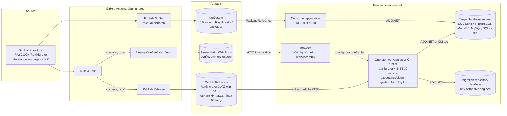

# 7. Deployment View

This chapter answers on which infrastructure RayMigrator is built, packaged,
distributed and executed: which artifacts leave the repository (release
archives per RID, NuGet packages, the Config Wizard static site), where each
building block of the [Building Block View](05-Building-Block-View.md) ends
up at run time, what an operator machine, a CI runner and the database side
must provide, and how the GitHub Actions pipeline turns a tag into these
artifacts. Toolchain constraints (frameworks, RIDs, release gate) are stated
in [Architecture Constraints](02-Architecture-Constraints.md) and reused here.

## 7.1 Infrastructure Level 1: Distribution and Runtime Environments



Motivation: RayMigrator has no server component. Everything that changes a
database happens inside one process, `raymigrator`, started by a person or a
pipeline on a machine that can reach all configured databases. The
distribution is therefore one directory per platform plus library packages
for consumers who embed the engine; the only hosted component is the Config
Wizard, which runs entirely in the browser and never contacts the engine or a
database. The operational footprint is "a binary, a directory of JSON files
and a directory of SQL files", and network reachability from the executing
host to every database is the single deployment prerequisite.

Quality and performance features:

| Feature | Consequence |
|---------|-------------|
| Framework dependent single file publish per RID (`--no-self-contained`, `PublishSingleFile`, `IncludeNativeLibrariesForSelfExtract`, `IncludeAllContentForSelfExtract`, `-f net10.0`) | Small archives and one executable per platform, but the host needs the .NET 10 runtime (`README.md`: "pre-built releases require the .NET 10 runtime"). `DalFactory` finds the bundled DAL assemblies through `DependencyContext.Default`, so the single file bundle needs no unpacking of plugins. |
| Libraries multi-targeted to `net10.0;net9.0;net8.0` | Consumers on .NET 8 LTS, 9 or 10 can embed the engine or build a DAL plugin without upgrading their runtime. |
| No server, no agent, no daemon | Nothing to install on database servers; scaling is a question of where the CLI runs. The exclusive run per product and environment is enforced in the repository database, not by a service. |
| Migrations are executed from wherever the CLI runs | The executing host needs TCP reachability to every target, to the repository and to the optional logging database, plus the vendor client on `PATH` when `UseCliToolAlias` is used. SQLite targets and repositories must be local files of that host. |
| Plugins and templates are files next to the binary | External engines are added by copying a directory (`DataAccessLayers/{Type}/`); templates can be inspected and, if required, adapted on site without a rebuild. |
| Config Wizard as static site | Hosting cost and attack surface of a static file host; no data leaves the browser except the ZIP the user downloads. |

Mapping of building blocks to infrastructure:

| Artifact | Contains | Deployed where | Runtime prerequisites |
|----------|----------|----------------|-----------------------|
| `RayMigrator-{version}-{rid}.zip` / `.tar.gz` (GitHub Releases; RIDs `win-x64`, `osx-arm64`, `linux-x64`) | `raymigrator` single file executable built from `Raycoon.RayMigrator.Console` with all engine libraries bundled; `DataAccessLayers/{SqlServer,PostgreSQL,MariaDb,MySql,Sqlite}/` with the SQL templates (and the DAL assemblies copied by the build targets); `Examples/`; `LICENSE.md`, `NOTICE.md`, `THIRD-PARTY-NOTICES.md` | Operator workstation, build agent or CI runner, extracted into any directory on `PATH` | .NET 10 runtime; Windows 10+, Ubuntu 24.04+ or macOS 10.15+; network access to all databases; optional `sqlcmd`, `psql`, `mysql`, `mariadb`, `sqlite3` or `docker` on `PATH` |
| 15 NuGet packages `Raycoon.RayMigrator.*` (see 7.2.2) | One assembly per package for each of the three target frameworks, `LICENSE.md`, `NUGET_README.md` as package README; the five engine packages additionally ship their templates as `contentFiles` under `DataAccessLayers/{Engine}/` | Consumer application or external DAL project via `PackageReference` | .NET 8, 9 or 10 SDK; `PackageRequireLicenseAcceptance` is `true` |
| Config Wizard static site (`publish-output/wwwroot` of `Raycoon.RayMigrator.ConfigWizard.Web`) | Blazor WebAssembly app (`net10.0`) with `Raycoon.RayMigrator.ConfigWizard.Core` and `Raycoon.RayMigrator.Validation`, `staticwebapp.config.json`, `index.html` | Azure Static Web Apps, reachable as `config.raymigrator.com` | A browser with WebAssembly; the legal pages on `raymigrator.com` must be live (checked before every deploy) |
| Migration repository schema (created by `Repository_CheckCreate`) | Tables `MigratorMeta`, `Product`, `Environment`, `MigrationRun`, `MigrationRunMeta`, `MigrationRecord`, `MigrationRecordHistory` and lookup tables, prefixed by `TableBaseName` | Database named by `Repository.DatabaseType` and `Repository.ConnectionString` on any of the five engines | Login with rights to create schema and tables in that database (7.2.3) |
| Optional database logging tables (`DatabaseLogging_CheckCreate`) | `MigrationLog`, `MigrationEvent` | Database named by `DatabaseLogging.DatabaseType` and `DatabaseLogging.ConnectionString`; may share the repository connection | Same as repository |

## 7.2 Infrastructure Level 2

### 7.2.1 CLI installation on an operator machine or CI runner

The console is not a .NET global tool (`Raycoon.RayMigrator.Console.csproj`
has `IsPackable=false` and neither `PackAsTool` nor `ToolCommandName`); it is
installed by extracting the archive and adding the directory to `PATH`, as the
[Quick start](https://github.com/RAYCOON/RayMigrator/blob/main/Docs/user-manual/02-quick-start.md)
and the CI example in the
[Operations guide](https://github.com/RAYCOON/RayMigrator/blob/main/Docs/user-manual/11-operations-guide.md)
show (`gh release download --pattern "RayMigrator-*-linux-x64.tar.gz"`, then
`tar -xzf`). Two directories matter at run time: the installation directory
(`AppDomain.CurrentDomain.BaseDirectory`) and the working directory or
`--config-dir`, from which configuration and migration files are resolved.

```
/opt/raymigrator/                          installation directory, on PATH
+-- raymigrator                            single file executable (raymigrator.exe on win-x64)
+-- LICENSE.md, NOTICE.md, THIRD-PARTY-NOTICES.md
+-- DataAccessLayers/                      scanned by DalFactory and TemplateCache
|   +-- SqlServer/                         Repository_*.sql, DatabaseLogging_*.sql
|   +-- PostgreSQL/  MariaDb/  MySql/  Sqlite/
|   +-- YourDb/                            external plugin: Raycoon.RayMigrator.Database.YourDb.dll,
|                                          its ADO.NET provider assemblies, its 21 templates
+-- Examples/                              MySimpleApplication, MyComplexApplication, Docker

/srv/bookstore/                            working directory, or the directory given by --config-dir
+-- appsettings.json                       node RayMigrator
+-- appsettings.{Environment}.json
+-- appsettings.{Product}.json
+-- appsettings.{Product}.{Environment}.json
+-- Migrations/                            Products[].MigrationFilesRootDirectory (absolute, or
    +-- migsettings.txt                    relative to the working directory)
    +-- {Release}/{TargetGroup}/001_Description.sql, 001_Description.rollback.sql

/var/log/raymigrator/RayMigratorLog.txt    wherever the Serilog File sink "path" or SQLite sink "databasePath" points
```

Points verified against the tree:

- The release archive ships no `appsettings*.json` (the console project marks
  every `*.json` with `CopyToPublishDirectory=Never`). Configuration is
  written by the operator or exported from the Config Wizard and placed in
  the working directory or in `--config-dir` (`{ENV:NAME}` allowed).
- `MigrationFilesRootDirectory` is a per product setting that must exist; the
  quick start uses `./Migrations`, the reference docs absolute paths or
  `{ENV:MigrationFilesRootDirectory}`.
- External DAL plugins are located only under `DataAccessLayers/{Type}/` of
  the installation directory (`DalFactory` loads every `*.dll` there with
  `Assembly.LoadFrom`, `TemplateCache` reads the `*.sql` files there).
  `Raycoon.RayMigrator.Database.Common.dll` and `Raycoon.RayMigrator.Shared.dll`
  must not be copied into the plugin directory; provider assemblies missing
  from the root directory must be. See
  [External DAL development](https://github.com/RAYCOON/RayMigrator/blob/main/Docs/09-extending/external-dal-development.md).
- External CLI tools are started from `CliTools[].ExecutablePath`; a bare
  name such as `sqlcmd` is resolved through `PATH` of the RayMigrator process.

Environment variables that influence startup:

| Variable | Effect |
|----------|--------|
| `DOTNET_ENVIRONMENT` | Fallback for `--environment`. Both set with different values: exit code `2`; neither set: exit code `3`. There is no default environment. |
| Any name used in `{ENV:NAME}` (regex `\{ENV:(\w+)\}`) | Substituted in every string value of the configuration, in `--config-dir` and in the DAL SQL templates at startup; an unset, empty or whitespace value terminates the run with `ApplicationStartupException` or `ConfigurationValidationException`. In migration and rollback file content the placeholder is replaced at execution time and an unset variable becomes an empty string with a warning. Resolved values are masked in logs. |
| `PATH` | Must contain the installation directory (the CI example invokes `raymigrator` by name) and the vendor clients referenced by `CliTools` unless `ExecutablePath` is absolute. |

RayMigrator defines no further variables of its own; names such as
`REPO_CONNECTION` or `ConnectionString_Backend1` in the documentation and in
`Properties/launchSettings.json` are conventions of the respective
configuration. The 20 launch profiles (`Docker_Mac_*`, `Docker_Win_*`,
`Staging`, `Production`) are a development convenience only.

### 7.2.2 Library consumption via NuGet

All 15 packable projects carry a `PackageId` equal to the project name and
are pushed together by `Publish NuGet`. The package version is
`RayMigratorVersion` from `Directory.Build.props` of the checked out ref
(passed as `-p:Version=`), so published packages carry the bare release
version (for example `0.14.0`); builds outside the workflows are pre-releases
`X.Y.Z-dev+<hash>`. Every package packs `LICENSE.md` and `NUGET_README.md`.

| Purpose | Packages to reference | Notes |
|---------|-----------------------|-------|
| (a) Embedding the migration engine in an own host | `Raycoon.RayMigrator.Pipeline` (brings `Services`, `Services.Abstractions`, `Infrastructure`, `Core`, `Database`, `Database.Common`, `Shared` transitively) plus one or more of `Raycoon.RayMigrator.Database.SqlServer`, `.PostgreSQL`, `.MariaDb`, `.MySql`, `.Sqlite` | The engine packages ship their templates as `contentFiles` into `DataAccessLayers/{Engine}/` of the consumer's output and their assembly is discovered through `DependencyContext` because its name starts with `Raycoon.RayMigrator.`; the host still has to configure Serilog and the `RayMigrator` configuration node the way `DirectModePipeline` expects. |
| (b) Writing an external DAL plugin | `Raycoon.RayMigrator.Database.Common` (`IDal`, `DalBase`, `DalSpecificProperties`, `DatabaseTypeAttribute`) and `Raycoon.RayMigrator.Shared` (exceptions), plus the ADO.NET provider of the engine | Start from the MIT licensed `Raycoon.RayMigrator.Database.Example`, which is deliberately not packaged. |
| (c) Test support | `Raycoon.RayMigrator.Testing` (`DatabaseCleanupHelper`, `DockerHealthCheck`, `RepositoryQueryHelper`; depends on `Raycoon.RayMigrator.Database`) | Used by `Raycoon.RayMigrator.Tests.Engine`; intended for integration tests that inspect or clean the repository through `IDal`. |
| Shared validation without the engine | `Raycoon.RayMigrator.Validation` | No dependencies, WebAssembly safe; what the Config Wizard uses. |

`Raycoon.RayMigrator.Console`, both `ConfigWizard` projects,
`Raycoon.RayMigrator.Database.Example` and the five test projects are `IsPackable=false`.

### 7.2.3 Database side

| Aspect | What must exist before the first run |
|--------|--------------------------------------|
| Repository location | A database reachable under `Repository.ConnectionString` on the engine named by `Repository.DatabaseType`. It may be a dedicated database or one of the target databases: `Repository` is configured independently of every target, and when repository and a target share engine and connection string the engine switches to one atomic transaction (`MigrationService.CanUseSharedConnection`). A SQLite repository (`Data Source=...`) is a file on the executing host and cannot be shared between hosts. |
| Schema and tables | Nothing has to be created by hand. `Repository_CheckCreate` creates the schema (`CREATE SCHEMA` on SQL Server and PostgreSQL, `SchemaName` is ignored on MariaDB, MySQL and SQLite) and all tables with `TableBaseName` prefix on first use, and inserts the lookup rows and the `MigratorMeta` row of the creating version. The same applies to `DatabaseLogging_CheckCreate` when the `DatabaseLogging` node is present. |
| Rights of the login | The login used for the repository needs `CREATE SCHEMA` (SQL Server, PostgreSQL) and `CREATE TABLE` plus DML on the repository tables; the troubleshooting guide names `GRANT CREATE TABLE` as the typical missing right. The login used for a target needs whatever the migration files execute. The operations guide advises not to grant `DELETE` on repository tables to preserve the audit trail. The test containers use `sysadmin` (`rmlogin`) and `db_owner` (`rmuser`) on SQL Server and `GRANT ALL PRIVILEGES` plus `CREATE USER` on MariaDB and MySQL; production logins should be narrower. |
| Network and ports | TCP from the executing host to every server: `1433` (SQL Server), `5432` (PostgreSQL), `3306` (MariaDB, MySQL) by default, or whatever the connection string names. No inbound connection to the host is ever needed. |
| Engine versions and DDL semantics | SQL Server 2016+, PostgreSQL 11+, MariaDB 10.5+, MySQL 8.0+, SQLite 3.35+; DDL is not transactional on MariaDB and MySQL, so rollback files are the recovery path there. See [Architecture Constraints](02-Architecture-Constraints.md#database-engines-and-adonet-providers). |
| Concurrency | One `raymigrator` process per product and environment at a time; a second one is rejected by the repository (`-2` from `Repository_MigrationRun_Insert`). Pipelines should serialize runs. |

### 7.2.4 Config Wizard hosting

`Deploy ConfigWizard Web` publishes `Raycoon.RayMigrator.ConfigWizard.Web`
with `dotnet publish -c Release -o publish-output -p:Version=<tag>` and
uploads `publish-output/wwwroot` with `Azure/static-web-apps-deploy@v1`
(`action: upload`, `skip_app_build: true`, token from the secret
`AZURE_STATIC_WEB_APPS_API_TOKEN`). The host is Azure Static Web Apps, not
GitHub Pages; `wwwroot/staticwebapp.config.json` rewrites unknown routes to
`/index.html`, sets `X-Content-Type-Options`, `X-Frame-Options: DENY` and a
referrer policy, and registers MIME types for `.dll`, `.dat`, `.blat` and
`.wasm`. The public address is `config.raymigrator.com` (`SECURITY.md`).

The application runs entirely in the browser: the Web project references
only `Microsoft.AspNetCore.Components.WebAssembly`, `MudBlazor` and the Core
project, opens no database connection and calls no API; language and terms
lives in `localStorage` (terms acceptance stays in memory), and the only external requests are the
Google Fonts stylesheet in `index.html` and the links to `raymigrator.com`
(imprint, privacy, terms of use in EN and DE). Its output is
`raymigrator-config.zip` with the `appsettings*.json` family, `example.env`
listing every `{ENV:...}` variable, and `TERMS-ACCEPTANCE.txt` recording
`TermsVersion` (`2026-08-17`). Before every deploy
`.github/scripts/check-legal-pages.sh` requires the six legal URLs from
`LocalizationService.cs` to answer `200` and both terms pages to state that
version. Details:
[Config Wizard overview](https://github.com/RAYCOON/RayMigrator/blob/main/Docs/12-config-wizard/overview.md).

### 7.2.5 Development and test environment

Engine tests (`Raycoon.RayMigrator.Tests.Engine`) run against four Docker
containers defined in `Testing/Docker/docker-compose.yml`; SQLite tests use
a temporary file. The images are built locally from
`Testing/Docker/{SqlServer,MariaDB,MySQL,PostgreSQL}/Dockerfile`; variables
come from `Testing/Docker/default.env` (`COMPOSE_PROJECT_NAME=ray_project`,
users, passwords, `MSSQL_PID=Developer`).

| Container | Image (built from) | Host port | Compose profile | Initialization |
|-----------|--------------------|-----------|-----------------|----------------|
| `rm_db_sqlserver` | `rm_img_db_sqlserver` (`mcr.microsoft.com/mssql/server:2022-latest`) | `1433` | `sqlserver` | `sql-scripts/`: login `rmlogin`, databases `Backend_1`, `Backend_2`, `Frontend`, user `rmuser` |
| `rm_db_postgresql` | `rm_img_db_postgresql` (`postgres:latest`) | `5432` | `postgresql` | `POSTGRES_USER=postgres`, `POSTGRES_DB=raydb` |
| `rm_db_mariadb` | `rm_img_db_mariadb` (`mariadb:11.6`) | `3306` | `mariadb` | `init/01-init-database.sql`: user `rayuser`, databases `raydb`, `raydb2`, `raydb_frontend` |
| `rm_db_mysql` | `rm_img_db_mysql` (`mysql:8.4`) | `3307` (container `3306`) | `mysql` | same layout as MariaDB; port `3307` avoids the clash with MariaDB |

All four share the bridge network `ray_network`; the profile `all` starts
them together (`docker compose -f docker-compose.yml --profile all --env-file default.env up -d`
after a `build --no-cache`, wrapped by
`RunDocker.default.{all,sqlserver,mariadb,mysql,postgresql}.ps1`,
torn down with volumes by `TeardownDocker.ps1` or `teardown.sh`). The
fixtures embed the connection strings in code (`Fixtures/*Fixture.cs`) and
report `IsDatabaseAvailable` from a live probe; tests skip with
`Assert.SkipUnless` when a container is missing, and the `CliTool` and
`CliToolDocker` categories pipe SQL through `docker exec` into these containers.

What runs where: `Build & Test` on `ubuntu-latest` installs the 8.0.x, 9.0.x
and 10.0.x SDKs, builds `Release` and runs only
`Raycoon.RayMigrator.Tests.Unit` on `net10.0`. The engine suite, Windows and
macOS behavior and the Docker based CLI tool tests are a local duty before a
release. `Examples/Docker/` is a reduced compose set (SQL Server and
PostgreSQL) for the two example products, shipped in the release archive. See
[Test infrastructure](https://github.com/RAYCOON/RayMigrator/blob/main/Docs/10-testing/test-infrastructure.md)
and [Engine tests](https://github.com/RAYCOON/RayMigrator/blob/main/Docs/10-testing/engine-tests.md).

## 7.3 Release Pipeline

```mermaid
flowchart TD
    TAG[tag vX.Y.Z on main] --> BT
    subgraph BT[Build & Test]
        B1[check-license-version.sh] --> B2[dotnet restore, build Release] --> B3[unit tests net10.0]
    end
    BT -->|workflow_run success, head_branch starts with v| PR
    BT -->|workflow_run success, head_branch starts with v| DCW
    subgraph PR[Publish Release]
        P1[matrix win-x64, osx-arm64, linux-x64:<br/>check-license-version.sh . X.Y.Z<br/>dotnet publish single file, -p:Version=X.Y.Z -p:BuildStage=Production<br/>verify LICENSE, NOTICE, THIRD-PARTY-NOTICES and 5x DataAccessLayers/*.sql<br/>zip or tar.gz, upload-artifact 1 day] --> P2[release job: download-artifact,<br/>gh release create vX.Y.Z --title RayMigrator vX.Y.Z --generate-notes]
    end
    subgraph DCW[Deploy ConfigWizard Web]
        D1[check-legal-pages.sh] --> D2[dotnet publish ConfigWizard.Web -p:Version=X.Y.Z] --> D3[Azure/static-web-apps-deploy@v1 upload wwwroot]
    end
    MAN[manual workflow_dispatch on the release ref] --> PN
    subgraph PN[Publish NuGet]
        N1[verify repository variable NUGET_USER] --> N2[version from Directory.Build.props<br/>dotnet build and pack -p:Version] --> N3[NuGet/login@v1 OIDC] --> N4[dotnet nuget push --skip-duplicate<br/>every bin/Release/*.nupkg]
    end
```

1. The tag `vX.Y.Z` (on the commit fast forwarded to `main`) triggers
   `Build & Test`; tag runs are never cancelled by the concurrency rule.
2. `Publish Release` and `Deploy ConfigWizard Web` start on `workflow_run`
   completion of `Build & Test`, only if the conclusion is `success` and
   `head_branch` starts with `v`; both check out that ref and derive
   `VERSION` by stripping the `v`.
3. The publish matrix runs `check-license-version.sh` with the tag version
   (`LICENSE.md`, `Directory.Build.props` and the tag must agree), publishes
   the console framework dependent as a single file with `-p:Version` and
   `-p:BuildStage=Production`, verifies `LICENSE.md`, `NOTICE.md`,
   `THIRD-PARTY-NOTICES.md` and at least one `*.sql` in each of the five
   `DataAccessLayers/` directories, and packs `RayMigrator-X.Y.Z-win-x64.zip`,
   `-osx-arm64.tar.gz` and `-linux-x64.tar.gz`. No checksum or signature
   files are produced.
4. The `release` job downloads the three artifacts and runs
   `gh release create "$TAG" --title "RayMigrator vX.Y.Z" --generate-notes`.
5. `Publish NuGet` is a separate manual `workflow_dispatch`: it fails early
   if the repository variable `NUGET_USER` is missing, reads
   `RayMigratorVersion` from `Directory.Build.props` of the checked out ref
   (the dispatch must target the release ref, not `develop` after the
   version bump), builds and packs with that version, obtains a short lived
   API key through `NuGet/login@v1` (Trusted Publishing, `id-token: write`,
   no stored secret) and pushes every `bin/Release/*.nupkg` with
   `--skip-duplicate`, collecting failures before exiting non-zero.
6. `Deploy ConfigWizard Web` runs in parallel to `Publish Release` with the
   steps of 7.2.4; a failing legal page check blocks only the wizard deploy.

## Related documentation

- [GitHub workflows](https://github.com/RAYCOON/RayMigrator/tree/main/.github/workflows) and [scripts](https://github.com/RAYCOON/RayMigrator/tree/main/.github/scripts), [NUGET_README.md](https://github.com/RAYCOON/RayMigrator/blob/main/NUGET_README.md), [Directory.Build.props](https://github.com/RAYCOON/RayMigrator/blob/main/Directory.Build.props)
- [Quick start](https://github.com/RAYCOON/RayMigrator/blob/main/Docs/user-manual/02-quick-start.md), [Operations guide](https://github.com/RAYCOON/RayMigrator/blob/main/Docs/user-manual/11-operations-guide.md), [Launch profiles](https://github.com/RAYCOON/RayMigrator/blob/main/Docs/05-console-layer/launch-profiles.md)
- [Configuration hierarchy](https://github.com/RAYCOON/RayMigrator/blob/main/Docs/06-configuration-reference/appsettings-hierarchy.md), [Environment variables](https://github.com/RAYCOON/RayMigrator/blob/main/Docs/06-configuration-reference/environment-variables.md), [Repository options](https://github.com/RAYCOON/RayMigrator/blob/main/Docs/06-configuration-reference/repository-options.md), [Directory structure](https://github.com/RAYCOON/RayMigrator/blob/main/Docs/07-migration-files/directory-structure.md), [External DAL development](https://github.com/RAYCOON/RayMigrator/blob/main/Docs/09-extending/external-dal-development.md)
- [Test infrastructure](https://github.com/RAYCOON/RayMigrator/blob/main/Docs/10-testing/test-infrastructure.md), [Engine tests](https://github.com/RAYCOON/RayMigrator/blob/main/Docs/10-testing/engine-tests.md), [Config Wizard overview](https://github.com/RAYCOON/RayMigrator/blob/main/Docs/12-config-wizard/overview.md)
- [Architecture Constraints](02-Architecture-Constraints.md), [Building Block View](05-Building-Block-View.md), [Runtime View](06-Runtime-View.md)
