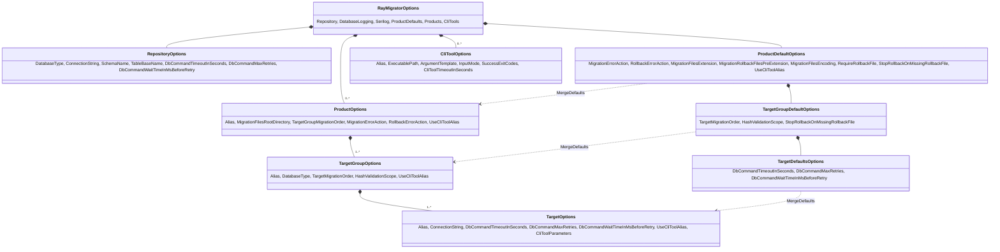
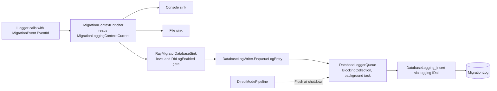

# 8. Crosscutting Concepts

This chapter answers which rules, models and mechanisms apply across many building blocks of RayMigrator at once: the domain model
shared by configuration, migration files and the migration repository (the RayMigrator bookkeeping database), the configuration
layering, and the execution, safety, observability, security and development principles that every layer follows. Each concept
names the classes and keys that implement it and links to the authoritative page under `Docs/`; the sequences in which they
interact are the scenarios of the [Runtime View](06-Runtime-View.md). The concept titles match the approaches of section 4.3 of
the [Solution Strategy](04-Solution-Strategy.md#43-approaches-to-achieve-the-quality-goals).

## 8.1 Domain Model

### Products, target groups, targets and environments

The configuration model is the option class tree bound from the `RayMigrator` section: a product owns target groups (one
`DatabaseType` each), a target group owns targets (one `ConnectionString` each), and three nested defaults nodes supply inherited
values. Environments are not configuration nodes: the environment name comes from `--environment` or `DOTNET_ENVIRONMENT`, selects
the `appsettings.{Environment}.json` files and is registered in the repository table `Environment` next to `Product`.

Aliases match `^(?=.{1,50}$)[\p{L}\p{N}_]+$` (CLI tool aliases also allow hyphens) and are unique case insensitively. Enum valued
keys are strings in JSON, resolved lazily by the `*Enum` getters (`MigrationErrorActionEnum`, `TargetMigrationOrderEnum`,
`HashValidationScopeEnum`, `InputModeEnum`) through `ParsedEnumOption`.
Authoritative page: [Configuration system](https://github.com/RAYCOON/RayMigrator/blob/main/Docs/02-core-concepts/configuration-system.md).

### Migration files, releases and metadata

A migration file is a `*.{MigrationFilesExtension}` file (default `sql`) under
`MigrationFilesRootDirectory/{Release}/{TargetGroupAlias}/`; a product with one target group may use the flat layout `{Release}/`.
The file name is only a sort key (`{OrderPrefix}_{Name}.sql` by convention); the release version is the release directory name.

| File | Pattern | Handling |
|------|---------|----------|
| Rollback file | `{BaseName}.{MigrationRollbackFilesPreExtension}.{Extension}` (default `rollback`) | skipped during discovery, located by `GetRollbackFilename` |
| Environment specific file | `{BaseName}.{Environment}.{Extension}` | included only when the suffix matches the environment case insensitively; a generic file with the same base name is still included |
| Directory defaults | `migsettings.txt`, `migsettings.{Environment}.txt` | six levels: product, release, target group, each with an environment variant; always read as UTF-8 |

The optional header `/* [RayMigrator] ... */` is parsed by `MigrationService.ExtractTomlAndSql` and `ParseTomlConfig` without a
TOML library; keys are case insensitive, unknown keys throw `MigrationFileParsingException`. Keys: `Description`, `Environments`,
`Targets`, `UseTransaction` (default `true`), `RunAlways` (default `false`), `RequireRollbackFile`, `MigrationErrorAction`,
`RollbackErrorAction`, `UseCliToolAlias`, plus `StopRollbackOnMissingRollbackFile` and `TargetGroupMigrationOrder`, which the
parser accepts but does not apply at file level (`TargetGroupMigrationOrder` acts only in release level `migsettings.txt`).
`Targets` restricts a file to named targets of its target group and must match configured aliases exactly.
Authoritative pages: [File naming](https://github.com/RAYCOON/RayMigrator/blob/main/Docs/07-migration-files/file-naming.md), [TOML metadata](https://github.com/RAYCOON/RayMigrator/blob/main/Docs/07-migration-files/toml-metadata.md), [migsettings files](https://github.com/RAYCOON/RayMigrator/blob/main/Docs/07-migration-files/migsettings-files.md), [Environment specific files](https://github.com/RAYCOON/RayMigrator/blob/main/Docs/07-migration-files/environment-specific.md).

### Migration repository schema

`Repository_CheckCreate` creates 11 tables (canonical names below; PostgreSQL, MariaDB and MySQL use unquoted `snake_case`, SQL
Server and SQLite PascalCase), prefixed by `TableBaseName` and placed in `SchemaName` where the engine supports schemas. Lookup
tables are seeded once at creation; an existing repository is never upgraded in place.

| Table | Purpose |
|-------|---------|
| `MigratorMeta` | One row per RayMigrator version that used the repository (`RayMigratorVersion`, `RepositoryDatabaseType`); the first row is the version that created the schema |
| `Product`, `Environment` | Registered names with a `NameLower` unique index; their ids are referenced by every run and record |
| `MigrationRun` | One row per run: mode, result, `FromReleaseVersion`, `ToReleaseVersion`, `StartedAt`, `FinishedAt`, `DurationInMs`; the open row is the run lock |
| `MigrationRunMeta` | `MigrationRunSettingsJson`, the masked snapshot of the effective settings of a run |
| `MigrationRecord` | One row per file and target: status, `FileOrderId`, three up hashes, three down hashes, block counters, config JSON, timestamps |
| `MigrationRecordHistory` | Snapshot of a record whenever it reaches `Failed`, `NotMigrated` or `Migrated`; source of the `info` run history |
| `MigrationRunMode`, `MigrationOperation`, `MigrationRunResult`, `MigrationStatus` | Lookup tables mirroring the Core enums of the same names |

The optional logging database holds `MigrationEvent` and `MigrationLog`, created by `DatabaseLogging_CheckCreate` without foreign
keys to the repository because it may live elsewhere.
Authoritative pages: [Repository schema](https://github.com/RAYCOON/RayMigrator/blob/main/Docs/03-database-layer/repository-schema.md), [Logging schema](https://github.com/RAYCOON/RayMigrator/blob/main/Docs/03-database-layer/logging-schema.md).

## 8.2 Configuration

### Configuration Inheritance with Validation

Four layers contribute to the effective settings of a file on a target. The CLI selects product, environment, run mode and per run
switches; it overrides configured values only through `--stop-rollback-on-missing-rollback-file` and
`--target-group-migration-order`.

| Layer | Source and precedence (later wins) | Implemented by |
|-------|-------------------------------------|----------------|
| JSON files | `appsettings.json`, `appsettings.{Environment}.json`, `appsettings.{Product}.json`, `appsettings.{Product}.{Environment}.json`; objects merge, arrays replace | `JsonOptionsSource` |
| Placeholders | `{ENV:NAME}` (`\{ENV:(\w+)\}`) replaced after the merge and before binding; an unresolved placeholder aborts with `ApplicationStartupException` | `EnvironmentVariableReplacer` |
| Defaults cascade | `ProductDefaults` to `ProductOptions`; `TargetGroupDefaults` to `TargetGroupOptions`; `TargetDefaults` to `TargetOptions`; `UseCliToolAlias` additionally product to target group to target; only null or blank values are filled | `ProductDefaultsPostConfigureOptions.MergeDefaults` |
| Directory and file | six `migsettings` levels, then the TOML header; arrays replace | `LoadMigSettingsDefaults`, `ResolveMigSettingsForFile`, `ParseTomlConfig` |

Validation runs in three stages at startup: data annotations (`[Required]`, `[RegularExpression]`, `[RayEnum]`, `[RayRangeInt]`,
`[RayEncoding]`, `[RayConnectionString]`, `[RayDirectoryExists]`; `RayRangeInt` also writes its default into a null property),
then `RuleCatalog.RunAll(ValidationInput)` invoked by `RayMigratorOptionsValidator` through `OptionsValidationInputAdapter`, then
engine aware checks outside the catalog (`SchemaNameValidator`, `ConnectionValidator`,
`TemplateCache.ValidateConfigurationAgainstTemplateCache`). Rule ids follow `RULE_{group}_{n}` as declared in `RuleIds`
(`RULE_1_1` to `RULE_8_3`): group 1 alias uniqueness and target group order, 2 semantic contradictions, 3 CLI tools, 4 schema and
lowercase identifiers, 7 connection string hygiene, 8 default cascade completeness. Errors stop the start, warnings are logged;
the Config Wizard runs the same catalog.
Authoritative pages: [Settings inheritance](https://github.com/RAYCOON/RayMigrator/blob/main/Docs/06-configuration-reference/settings-inheritance-overview.md), [Configuration hierarchy](https://github.com/RAYCOON/RayMigrator/blob/main/Docs/06-configuration-reference/appsettings-hierarchy.md), [Validation rules](https://github.com/RAYCOON/RayMigrator/blob/main/Docs/appendix/validation-rules.md).

### Environments and profiles

`EnvironmentResolver.Resolve` combines `--environment` (`-env`) with `DOTNET_ENVIRONMENT`: a conflict exits with `2`, no value
with `3`, there is no default. The name selects the environment JSON files, the `migsettings.{Environment}.txt` levels, the
`.{Environment}.sql` variants and the TOML `Environments` filter. `--product` (`-p`) names a `ProductOptions.Alias`, compared case
sensitively by `DirectModePipeline`; `--product`, `--environment` and `--to-release` accept a `{ENV:NAME}` value. `--config-dir`
(`-cd`) moves the JSON search directory away from the working directory; the other global options are `--startup-info` (`-si`) and
`--reveal-sensitive-data` (`-rsd`). Launch profiles in `Properties/launchSettings.json`, one per engine and platform, set
`DOTNET_ENVIRONMENT` and the connection variables for developers.
Authoritative pages: [Environment variables](https://github.com/RAYCOON/RayMigrator/blob/main/Docs/06-configuration-reference/environment-variables.md), [Launch profiles](https://github.com/RAYCOON/RayMigrator/blob/main/Docs/05-console-layer/launch-profiles.md).

## 8.3 Execution Concepts

### Block-Level Execution and Transactions

`SplitSqlIntoBlocks` splits the SQL part of a file at the engine's `DalSpecificProperties.SqlBlockDelimiter` standing alone on a
line (case insensitive) and falls back to one block; files routed to a CLI tool are not split (`ShouldSkipBlockSplitting`). Each
block is one `IDal.ExecuteNonQueryAsync` call: the DAL opens a connection and, when `UseTransaction` is `true`, begins and commits
a transaction per block, and `RepositoryMigrationUpdate` persists `Executing` with the committed block count after every block.
The transaction spans a block, not a file, and `FindResumableBlock` uses the counter to continue an interrupted file. Only when
`CanUseSharedConnection` holds (same `DatabaseType` and byte identical connection string for repository and target,
`UseTransaction`, error action not `Ignore`) does `ExecuteSqlBlocksAtomic` run all blocks and the repository updates in one
transaction.

| Engine | `SqlBlockDelimiter` | `SupportsTransactionalDdl` | `SupportsSchema` |
|--------|---------------------|----------------------------|------------------|
| SQL Server | `GO` | true | true |
| PostgreSQL | `;` | true | true |
| MariaDB | `;` | false (implicit commit) | false |
| MySQL | `;` | false (implicit commit) | false |
| SQLite | `;` | true | false |

`LogMigrationSafetyWarnings` reports DDL on an engine without transactional DDL (Rule 2.8) and related combinations (Rules 2.1 to
2.12) as warnings before any block runs.
Authoritative pages: [Block execution](https://github.com/RAYCOON/RayMigrator/blob/main/Docs/04-service-layer/block-execution.md), [SQL dialects](https://github.com/RAYCOON/RayMigrator/blob/main/Docs/03-database-layer/sql-dialects.md).

### Deterministic File Ordering

`DiscoverAndPrepareMigrationFiles` sorts every discovered file by its relative path with `StringComparer.OrdinalIgnoreCase` and
assigns a sequential `FileOrderId`, so release directory, target group directory and file name order as strings. The outer loop is
fixed: release, then target group in the order from `ResolveTargetGroupMigrationOrder` (`--target-group-migration-order`, release
level `migsettings` `TargetGroupMigrationOrder`, `ProductOptions.TargetGroupMigrationOrder`, configuration order), then the inner
order of `TargetMigrationOrder`. `DetectOutOfOrderFiles` compares a pending file's release with the highest migrated release of
each pending target and aborts unless `--allow-out-of-order` (`-ooo`) is given for that run; `migrate-down` orders by
`FileOrderId` descending from the repository.
Authoritative page: [File discovery](https://github.com/RAYCOON/RayMigrator/blob/main/Docs/04-service-layer/file-discovery.md).

### Execution modes

Three orthogonal enums describe how a run executes; a fourth, `OperatingMode` (`Standalone`, `ManagedLocal`, `ManagedRemote`), is
a contract for RayMigrator Studio; the engine never reads it and always behaves as `Standalone`.

| Enum | Values | Effect |
|------|--------|--------|
| `TargetMigrationOrder` (target group) | `FileByFile` 1 (file, then target), `TargetByTarget` 2 (target, then file); `Undefined` 0 behaves as `TargetByTarget` | `ExecuteTargetGroupFileByFile` or `ExecuteTargetGroupTargetByTarget`; identical with a single target |
| `MigrationRunMode` (`--run-mode`, `-rm`) | `Validate` 10, `Simulate` 20, `Migrate` 100 | `ShouldExecuteSql`, `ShouldWriteRepository`, `ShouldReadRepository`, `ShouldConnectToTargets` in `MigrationRunModeExtensions` |
| `TargetGroupMigrationOrder` (product, release, CLI) | ordered list of all target group aliases | order of target groups inside each release for `migrate-up` and `baseline` |

`MigrationCommandExtensions.GetProfile` turns command and run mode into a `CommandProfile(ConnectsToTargets, WritesRepository,
WritesDatabaseLog)`; commands other than `migrate-up`, `migrate-down` and `fix` always run in `Migrate` mode and take their side
effects from the profile.
Authoritative page: [Execution modes](https://github.com/RAYCOON/RayMigrator/blob/main/Docs/02-core-concepts/execution-modes.md).

### Template-Driven Repository Schema

All repository and log access goes through SQL templates. `TemplateType` has 21 members besides `Undefined`: 19 `Repository_*`
(among them `Repository_MigrationRecordHistory_Select`) plus `DatabaseLogging_CheckCreate` and `DatabaseLogging_Insert`.
`TemplateCache` loads `DataAccessLayers/{Type}/*.sql` below the application base directory at construction, maps file names to
`TemplateType`, replaces `{ENV:*}` once and throws `ConfigurationValidationException` when a type misses a template, a template is
empty or a configured `DatabaseType` has no folder. `{CFG:*}` is replaced per call and limited to `SchemaName` and
`TableBaseName`; values are bound as `@Parameter` through `DalParameterList`. Every template returns one scalar
`ResultCode,ResultMessage`, parsed by `TemplateExecutor` into `TemplateResponse`; a negative code raises `TemplateResultException`
for codes of the `TemplateResultCode` catalog (`-2` `MigrationAlreadyRunning`, `-10` `RepositoryIncomplete`, `-12`
`RepositoryMultipleVersionEntries`, ...) and `UndefinedTemplateResultException` for unknown ones.
Authoritative pages: [Template system](https://github.com/RAYCOON/RayMigrator/blob/main/Docs/03-database-layer/template-system.md), [Template customization](https://github.com/RAYCOON/RayMigrator/blob/main/Docs/09-extending/template-customization.md).

### DAL Abstraction and plugin discovery

`IDal` is the only engine contract: execute, scalar, reader, connection check and the shared connection overloads
(`CreateConnection` plus calls taking `DbConnection` and `DbTransaction`). `DalBase` supplies the retry wrappers and type mapping;
engine facts are data in `DalSpecificProperties`, copied into `MigrationContext.DalSpecificPropertiesDictionary`, so
`MigrationService` never branches on an engine name. Discovery is static: the `DalFactory` constructor loads every runtime library
named `Raycoon.RayMigrator.*` from `DependencyContext.Default` and every `DataAccessLayers/*/*.dll` next to the binary, keeps
non abstract `IDal` classes with `[DatabaseType("...")]` (`TryAdd`, first wins), and `TryGetDal(databaseType,
connectionString, out IDal?)` caches one instance per `{databaseType}_{connectionString}`; an unknown type throws
`ConfigurationValidationException`. An external plugin references only `Raycoon.RayMigrator.Database.Common` and
`Raycoon.RayMigrator.Shared` and is deployed as `DataAccessLayers/{Type}/` with assembly, provider assemblies and templates;
`Raycoon.RayMigrator.Database.Example` is the MIT licensed skeleton.
Authoritative pages: [DAL architecture](https://github.com/RAYCOON/RayMigrator/blob/main/Docs/03-database-layer/dal-architecture.md), [External DAL development](https://github.com/RAYCOON/RayMigrator/blob/main/Docs/09-extending/external-dal-development.md).

### Plugin and Command Registration

Both extension points follow a fixed checklist without touching existing code paths. A new engine: derive from `DalBase` with
`[DatabaseType]` and the connection string constructor, override `IsTransient`, write the 21 templates in the engine's dialect
with `AS "PascalCase"` reader aliases, and set `RayMigratorDatabaseType` in the project so build output and NuGet `contentFiles`
land in `DataAccessLayers/{Type}/`. A new CLI command: add a `MigrationCommand` value and its `CommandProfile` row in
`GetProfile`, request and result DTOs in `Raycoon.RayMigrator.Services.Abstractions`, a method on `IMigrationService`, a
`Create*Command()` factory and `Setup*Handler()` in `CommandLineConfiguration`, and an `Execute*Async` case in
`RayMigratorService.DoWorkAsync`.
Authoritative pages: [Adding a new CLI command](https://github.com/RAYCOON/RayMigrator/blob/main/Docs/09-extending/new-command.md), [Adding a new database type](https://github.com/RAYCOON/RayMigrator/blob/main/Docs/09-extending/new-database-type.md).

## 8.4 Safety and Consistency

### Hash Validation

`ParseMigrationFile` computes three SHA-256 hashes with `StringExtensions.GenerateSha256` over the UTF-8 bytes of the decoded text
(a BOM or a changed `{ENV:*}` value does not alter them): `FileUpHash` over the whole file, `FileUpConfigHash` over the TOML
section, `FileUpBlocksHash` over the SQL returned by `ExtractTomlAndSql`; rollback files get `FileDownHash`, `FileDownConfigHash`
and `FileDownBlocksHash` when they run. `HashValidationScope` per target group (`File` 1, `SqlBlocks` 2, `Disabled` 3) decides in
`IsAppliedOnTarget` whether `FileUpHash` or `FileUpBlocksHash` is compared, or nothing (`HashesDiffer`, used by
`update-hash`, always compares all three up hashes). During `migrate-up` a `Migrated` record with a
differing hash makes the file pending again (re-executed with a warning); `validate-hash` reports `Modified` and `Missing` files
and exits with `1`; `update-hash` rewrites all three hashes where any differs. Block level resume and interrupted run recovery
always require an unchanged `FileUpBlocksHash`, even with `Disabled`.
Scenario: [Runtime View 6.6](06-Runtime-View.md#66-hash-validation-validate-hash-update-hash-and-hashvalidationscope). Authoritative page: [Hash validation](https://github.com/RAYCOON/RayMigrator/blob/main/Docs/02-core-concepts/hash-validation.md).

### Rollback Strategies

`HandleMigrationError` resolves the effective `MigrationErrorAction` of the failed file
(`MigrationFileInfo.MigrationErrorActionOverride`, else `ProductOptions.MigrationErrorActionEnum`) and selects the
`MigrationRecord` rows to roll back; `ExecuteRollbackForMigrations` runs their rollback files in reverse order through the same
block or CLI tool path.

| Setting | Values | Meaning |
|---------|--------|---------|
| `MigrationErrorAction` | `Terminate` 10, `Rollback` 20, `RollbackErrorOnly` 21, `RollbackRelease` 22, `Ignore` 30 | no rollback; failed file plus all files of this run; failed file only; failed file plus this run's files of the same release; skip the block, mark the file `Failed`, continue |
| `RollbackErrorAction` | `Terminate` 10, `Ignore` 30 | a failing rollback block aborts the chain or is skipped with a warning |
| `RequireRollbackFile` | bool, default `true` | a missing rollback file is rejected during discovery, before any SQL; inside a chain it aborts and marks the record `Failed` |
| `StopRollbackOnMissingRollbackFile` | bool, default `true`; `--stop-rollback-on-missing-rollback-file`, target group, product | with `RequireRollbackFile = false`: stop the chain with a warning, or continue past the missing file; the record keeps its status |

The rollback file lives next to the migration file as `{BaseName}.{MigrationRollbackFilesPreExtension}.{Extension}`. A clean chain
ends the run as `MigrationRunResult.Recovered` 80, everything else as `Error` 90, `Ignore` as `PartialSuccess` 50; the exit code
is `1` in all three cases.
Scenarios: [Runtime View 6.4](06-Runtime-View.md#64-error-handling-and-rollback-during-migrate-up) and [6.5](06-Runtime-View.md#65-migrate-down). Authoritative pages: [Error handling](https://github.com/RAYCOON/RayMigrator/blob/main/Docs/02-core-concepts/error-handling.md), [Rollback files](https://github.com/RAYCOON/RayMigrator/blob/main/Docs/07-migration-files/rollback-files.md).

### Retry on Transient Errors

`RetryHelper.ExecuteWithRetryAsync` and `ExecuteWithRetry` repeat an operation while the DAL's `IsTransient(Exception)` predicate
returns true and attempts remain, sleeping `retryDelayMs * attempt` (linear backoff), then throw `RetryExhaustedException` (declared in `RetryHelper.cs` of `Database.Common`) with
`AttemptsMade` and `LastErrorCode`. `DalBase.IsTransient` treats `TimeoutException` as transient and walks inner exceptions; each
plugin adds its provider codes (for example SQL Server `-2` and `10060`, PostgreSQL SQLSTATE `08xxx` and `40001`, MariaDB and
MySQL `1205` and `2013`, SQLite `5` and `6`). Retries wrap every block on the standard path; the atomic path re-executes the whole
file after a rollback.

| Scope | `DbCommandMaxRetries` | `DbCommandWaitTimeInMsBeforeRetry` | `DbCommandTimeoutInSeconds` | Source of the default |
|-------|-----------------------|------------------------------------|-----------------------------|-----------------------|
| Repository | 100 | 250 ms | 60 s | `[RayRangeInt]` defaults on `RepositoryOptions`, written into the options during validation |
| Target | 0 (retry disabled) | 250 ms | 20 s | `TargetDefaultsOptions` merged into each `TargetOptions`; the `TargetOptions` annotation default of 500 ms applies only when no `TargetDefaults` node exists |

The `?? 3` and `?? 500` fallbacks in `RepositoryExtensions.GetDalSettings()` and the `?? 0` and `?? 250` fallbacks in
`MigrationService` are unreachable after validation, so the effective repository default is 100 retries, not 3.
Authoritative page: [Resilience](https://github.com/RAYCOON/RayMigrator/blob/main/Docs/02-core-concepts/resilience.md).

### Exclusive Run Lock and Orphaned Run Detection

The lock is the open `MigrationRun` row. `Repository_MigrationRun_Insert` refuses the insert with `-2` when a row with the same
`ProductId` and `EnvironmentId` and `FinishedAt IS NULL` exists; the run mode is not part of the predicate, and `Validate` and
`Simulate` runs never insert a row. The check is serialized inside the engine: `UPDLOCK, HOLDLOCK` on SQL Server,
`pg_advisory_xact_lock` keyed by product on PostgreSQL, `GET_LOCK` named by product and environment on MariaDB and MySQL, a write
transaction on SQLite. `TemplateExecutor.RepositoryMigrationRunInsert` converts the code into `MigrationAlreadyRunningException`;
`RepositoryMigrationRunInsertWithAutoFix` closes runs older than `AutoFixOrphanedRunsThresholdMinutes` (10) as `Error` and retries
once. `RepositoryMigrationRunUpdate` releases the lock by setting `FinishedAt`. The `fix` command (`FixScope` `All` 1 or
`OrphanedRuns` 2, `--older-than` default 60, `--last-migration-status`) lists or repairs younger orphans with the
`Repository_MigrationRun_SelectOrphaned` and `*_FixOrphaned` templates.
Scenario: [Runtime View 6.7](06-Runtime-View.md#67-concurrency-exclusive-run-lock-and-orphaned-run-recovery-fix). Authoritative page: [Concurrency control](https://github.com/RAYCOON/RayMigrator/blob/main/Docs/02-core-concepts/concurrency-control.md).

### Validate and Simulate Run Modes

`Validate` parses, filters and hashes every file and, for `migrate-down`, checks that every rollback file exists and parses,
without opening any database connection; it processes all files regardless of repository state. `Simulate` validates connections,
reads the repository read only (`Repository_Product_Select`, `Repository_Environment_Select`, `Repository_MigrationRecord_Select`)
and logs the blocks or CLI tool calls it would execute, but writes neither repository nor log rows and never holds the lock.
Authoritative page: [Execution modes](https://github.com/RAYCOON/RayMigrator/blob/main/Docs/02-core-concepts/execution-modes.md#run-mode).

## 8.5 Observability

### Structured Logging to Console, File and Database

One Serilog pipeline serves all sinks. `SerilogFactory.Create` reads the `RayMigrator.Serilog` node with
`Serilog.Settings.Configuration` (console, file and `Raycoon.Serilog.Sinks.SQLite` sinks are referenced), adds
`Enrich.FromLogContext()` and `MigrationContextEnricher`, and, when a `DatabaseLogging` node exists, `RayMigratorDatabaseSink`
with `DatabaseLogging.MinimumLevel` (default `Information`). The enricher reads the static `MigrationLoggingContext.Current` (an
`AsyncLocal`) and adds run, target group, target, file and block properties for the text sinks plus `RunModeId`, `DbLogEnabled`,
`ProductId`, `EnvironmentId`, `MigrationRecordId` and `ReleaseVersion` for the database sink. `DbLogEnabled` carries
`CommandProfile.WritesDatabaseLog`, so `info`, `validate-hash` and simulated runs produce no rows.

`MigrationEvent` in Core defines the `EventId` constants (`10` `CommandLineParsing` to `1000` `RayMigratorServiceShutdown`) that
are seeded into the `MigrationEvent` table and stored per row.
Authoritative pages: [Logging options](https://github.com/RAYCOON/RayMigrator/blob/main/Docs/06-configuration-reference/logging-options.md), [Logging schema](https://github.com/RAYCOON/RayMigrator/blob/main/Docs/03-database-layer/logging-schema.md), [MigrationContext](https://github.com/RAYCOON/RayMigrator/blob/main/Docs/02-core-concepts/migration-context.md).

### Migration history and `info`

The repository is the audit trail (current state, terminal transitions, runs with their masked settings snapshot). `info` connects
to the repository only and calls `IMigrationService.GetStatusAsync` and `GetHistoryAsync(product, 10)`: `MigrationStatusInfo`
reports `CurrentRelease`, `PendingMigrations` (counted per file and target pair), `TotalMigrationsExecuted` and a
`TargetGroupStatus` per target group (`DatabaseType`, `CurrentRelease`, `ExecutedMigrations`, `Targets`); `MigrationHistory.Runs`
lists `MigrationRunInfo` entries (`Operation`, `Result`, `RunMode`, timestamps, counts) built from
`Repository_MigrationRun_Select` and `Repository_MigrationRecordHistory_Select`.
Authoritative pages: [Command reference](https://github.com/RAYCOON/RayMigrator/blob/main/Docs/08-cli-reference/command-reference.md), [Migration state machine](https://github.com/RAYCOON/RayMigrator/blob/main/Docs/02-core-concepts/migration-state-machine.md).

## 8.6 Security

### Credentials and secrets

RayMigrator stores no secrets. Connection strings, `CliToolParameters` and any other string value are expected as `{ENV:NAME}`
placeholders resolved by `EnvironmentVariableReplacer` at startup; `RULE_7_3` warns about a `Password=` or `Pwd=` literal outside
a placeholder. Every resolved environment value and, through `SensitiveDataMasker.RegisterSensitiveData`, all connection strings,
`SchemaName`, `TableBaseName` and `MigrationFilesRootDirectory` are replaced with `*** HIDDEN ***` at the call sites that log SQL
blocks, template content and the `MigrationRunSettingsJson` snapshot; `--reveal-sensitive-data` (`-rsd`) disables the masker for
one run. `CliToolExecutor` never logs the rendered argument string and starts the process with `UseShellExecute = false`, passing
the rendered template as `ProcessStartInfo.Arguments`; placeholder values are not shell interpreted but also not quoted by
RayMigrator. Migration SQL runs exactly as written and `{ENV:*}` values are substituted into it without escaping; repository
templates bind values as parameters. Least privilege: the repository account must create the schema and the 11 tables on first
contact (`Repository_CheckCreate`) and needs only DML afterwards. `SECURITY.md` asks operators to restrict database accounts to
what the migrations need and to keep a verified backup; vulnerabilities are reported privately (GitHub private reporting or
`raymigrator@raycoon.com`), acknowledged within five business days and fixed in the latest 0.14.x only.
Authoritative pages: [Security policy](https://github.com/RAYCOON/RayMigrator/blob/main/SECURITY.md), [Environment variables](https://github.com/RAYCOON/RayMigrator/blob/main/Docs/06-configuration-reference/environment-variables.md), [CLI tools options](https://github.com/RAYCOON/RayMigrator/blob/main/Docs/06-configuration-reference/cli-tools-options.md).

## 8.7 Development Concepts

### Dependency injection and the context pattern

`DirectModePipeline` builds a standard `IHost`: `RayMigratorOptions` with `ValidateDataAnnotations` and `ValidateOnStart`, the
singletons `DatabaseLogWriter`, `TemplateCache`, `TemplateExecutor` and `MigrationContext`, the scoped `RayMigratorService`, and
`AddRayMigratorServices(RayMigratorHostMode.Cli)` from `Raycoon.RayMigrator.Services`, which registers `IMigrationService` and
`ICliToolExecutor` as scoped, `IMigrationContextFactory` as singleton and the accessor per host mode:
`SingletonMigrationContextAccessor` for `Cli`, `AsyncLocalMigrationContextAccessor` (scoped, `AsyncLocal` backed, one context per
request) for `Api` as used by RayMigrator Studio. Services read `IMigrationContextAccessor.Current` instead of receiving
`MigrationContext` directly, and `TemplateExecutor` resolves the repository `IDal` lazily on first use. `MigrationContext` carries
the immutable options plus the mutable `MigrationState` (ids, current file and block, `MigrationRunResult`, `MigrationOperation`);
`Clone` yields a snapshot for logging.
Authoritative pages: [Dependency injection](https://github.com/RAYCOON/RayMigrator/blob/main/Docs/01-architecture/dependency-injection.md), [Architectural patterns](https://github.com/RAYCOON/RayMigrator/blob/main/Docs/01-architecture/patterns.md).

### Test Pyramid

| Level | Projects | Characteristics |
|-------|----------|-----------------|
| Unit | `Raycoon.RayMigrator.Tests.Unit` (files prefixed `P0_` critical parsing to `P3_` models), `Tests.Unit.Validation` (one class per rule), `Tests.Unit.ConfigWizard.Core`, `Tests.Unit.ConfigWizard.Web` | xUnit v3, `AwesomeAssertions`, `NSubstitute`; no database; `internal static` helpers such as `SplitSqlIntoBlocks`, `ParseTomlConfig` and `GetFullExecutionOrder` are reachable through `InternalsVisibleTo` |
| Engine | `Raycoon.RayMigrator.Tests.Engine` | real engines from `Testing/Docker/docker-compose.yml` (SQLite as a temp file); fixtures per engine skip with `Assert.SkipUnless(Fixture.IsDatabaseAvailable, ...)`; traits `MigrateUp`, `MigrateDown`, `Compound`, `Features`, `CliTool`, `CliToolDocker` |

`Raycoon.RayMigrator.Testing` is the packable helper library (`DockerHealthCheck`, `DatabaseCleanupHelper`,
`RepositoryQueryHelper`) that queries and cleans repositories through `IDal`. The engine suite's own infrastructure lives in
`Raycoon.RayMigrator.Tests.Engine/Infrastructure`: `EngineTestHost` rebuilds the `DirectModePipeline` DI wiring without CLI
parsing, `ScenarioBuilder` copies the per engine migration set and mutates it (`InjectError`, `RemoveRollback`, `SetFileToml`,
`WithMigrationErrorAction`, `WithMultiTarget`, ...). `Build & Test` (`.github/workflows/build-test.yml`) runs only
`Raycoon.RayMigrator.Tests.Unit` on `net10.0`; the engine suite and the other unit projects are a local duty before a release.
Authoritative pages: [Unit tests](https://github.com/RAYCOON/RayMigrator/blob/main/Docs/10-testing/unit-tests.md), [Engine tests](https://github.com/RAYCOON/RayMigrator/blob/main/Docs/10-testing/engine-tests.md), [Test infrastructure](https://github.com/RAYCOON/RayMigrator/blob/main/Docs/10-testing/test-infrastructure.md).

### Error model and exit codes

All custom exceptions but `RetryExhaustedException` live in `Raycoon.RayMigrator.Shared` (`CustomExceptions.cs`) and derive directly from `Exception`, except
`UndefinedTemplateResultException : TemplateResultException`, `CliToolExecutionException : MigrationExecutionException` and
`CliToolTimeoutException : CliToolExecutionException`; `ConfigurationValidationException` is therefore not an
`ApplicationStartupException`. `DirectModePipeline` wraps startup problems: host construction failures, unresolved placeholders
and DAL or logger setup become `ApplicationStartupException`, while option validation failures raised on first access to
`IOptions<RayMigratorOptions>.Value` are wrapped in `ConfigurationValidationException`. Inside a command, `MigrationService` turns
exceptions into a failed `OperationResult` whose `ErrorCode` (`ExtractErrorCode`) is negative for a template `ResultCode` (`-2`
`MigrationAlreadyRunning`), positive for engine codes (`1001` to `1003` in `TemplateResultCode`) and null when unclassified;
`RayMigratorService.DoWorkAsync` maps every failed result and every escaped exception to `1`.

| Exit code | Produced by | Condition |
|-----------|-------------|-----------|
| `0` | `Program`, `RayMigratorService` | help or version; command succeeded |
| `1` | `Program`, `DirectModePipeline`, `RayMigratorService` | `ApplicationStartupException`; any command failure including `MigrationAlreadyRunningException`, `validate-hash` mismatches and recovered runs |
| `2`, `3` | `EnvironmentResolver` | conflicting `--environment` and `DOTNET_ENVIRONMENT`; no environment |
| `4` | `DirectModePipeline` | no `Serilog` node in the merged configuration |
| `5` | `Program` | command line parse error |
| `100` | `Program`, `DirectModePipeline` | any other exception before the command runs, which includes `ConfigurationValidationException` from option validation, `TemplateCache` and `DalFactory` |

Authoritative pages: [Error handling](https://github.com/RAYCOON/RayMigrator/blob/main/Docs/02-core-concepts/error-handling.md#error-categories), [Global options and exit codes](https://github.com/RAYCOON/RayMigrator/blob/main/Docs/08-cli-reference/global-options.md#exit-codes), [Context and Scope](03-Context-and-Scope.md#exit-codes-as-the-automation-contract).

## Related documentation

- [Runtime View](06-Runtime-View.md), [Architecture Decisions](09-Architecture-Decisions.md), [Quality Requirements](10-Quality-Requirements.md)
- [Configuration system](https://github.com/RAYCOON/RayMigrator/blob/main/Docs/02-core-concepts/configuration-system.md), [Execution modes](https://github.com/RAYCOON/RayMigrator/blob/main/Docs/02-core-concepts/execution-modes.md), [Error handling](https://github.com/RAYCOON/RayMigrator/blob/main/Docs/02-core-concepts/error-handling.md), [Hash validation](https://github.com/RAYCOON/RayMigrator/blob/main/Docs/02-core-concepts/hash-validation.md), [Resilience](https://github.com/RAYCOON/RayMigrator/blob/main/Docs/02-core-concepts/resilience.md), [Concurrency control](https://github.com/RAYCOON/RayMigrator/blob/main/Docs/02-core-concepts/concurrency-control.md), [Settings inheritance](https://github.com/RAYCOON/RayMigrator/blob/main/Docs/06-configuration-reference/settings-inheritance-overview.md), [Validation rules](https://github.com/RAYCOON/RayMigrator/blob/main/Docs/appendix/validation-rules.md)
- [Repository schema](https://github.com/RAYCOON/RayMigrator/blob/main/Docs/03-database-layer/repository-schema.md), [Logging schema](https://github.com/RAYCOON/RayMigrator/blob/main/Docs/03-database-layer/logging-schema.md), [Template system](https://github.com/RAYCOON/RayMigrator/blob/main/Docs/03-database-layer/template-system.md), [SQL dialects](https://github.com/RAYCOON/RayMigrator/blob/main/Docs/03-database-layer/sql-dialects.md), [Security policy](https://github.com/RAYCOON/RayMigrator/blob/main/SECURITY.md), [Test infrastructure](https://github.com/RAYCOON/RayMigrator/blob/main/Docs/10-testing/test-infrastructure.md), [External DAL development](https://github.com/RAYCOON/RayMigrator/blob/main/Docs/09-extending/external-dal-development.md)
