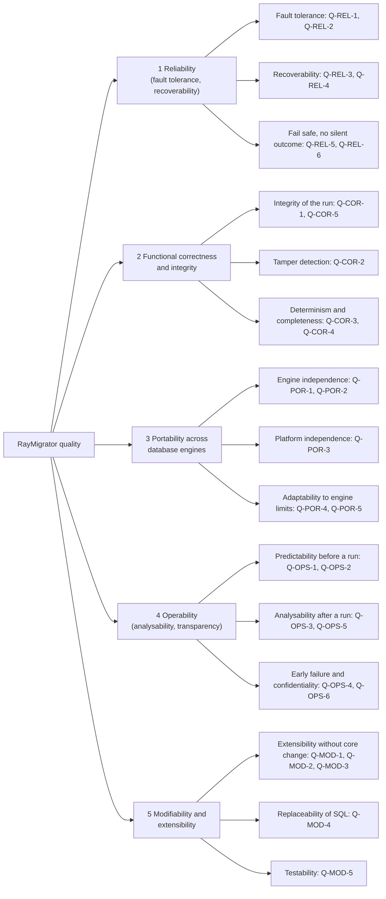

# 10. Quality Requirements

This chapter answers which quality goals RayMigrator has to meet, how they
break down into measurable attributes and which concrete scenarios make them
testable. It refines section 1.2 of the
[Introduction and Goals](01-Introduction-and-Goals.md#12-quality-goals): the
five quality goals appear here under the same names and in the same priority
order, each split into ISO 25010 sub-characteristics and backed by scenarios
whose responses are observable facts (repository rows, enum values, exit codes,
log entries) rather than measured figures. Every scenario names the concept of
the [Crosscutting Concepts](08-Crosscutting-Concepts.md) that fulfils it and
the test project, manual duty or gap that verifies it. Section 10.3 states
honestly what is verified automatically, what is a local duty before a release
and what is not verified at all; the
[Risks and Technical Debt](11-Risks-and-Technical-Debt.md) chapter picks up
the gaps.

## 10.1 Quality Tree

Scenario ids follow `Q-{GOAL}-{n}` with `REL`, `COR`, `POR`, `OPS` and `MOD`
for the five goals of section 1.2. The leaves are ISO 25010 sub-characteristics
chosen for what RayMigrator actually does; sub-characteristics that do not
drive the architecture (for example user interface aesthetics, or time
behavior, for which nothing is measured) are left out on purpose.

| Quality goal (1.2) | ISO 25010 sub-characteristics refined here | What "good" means for a migration tool |
|--------------------|--------------------------------------------|----------------------------------------|
| Reliability | Fault tolerance, recoverability, maturity | A failing block never leaves an unknown state: it is retried, rolled back or recorded as `Failed` with its committed block count, and the next run can continue from there |
| Functional correctness and integrity | Functional correctness, functional completeness, integrity | The repository is the truth about what ran where: one record per file and target, refused double runs, tamper detection by hash, the same order on every machine |
| Portability | Adaptability, installability, replaceability | The same configuration, files and repository schema behave identically on five engines and three operating systems; engine differences are data, not code paths |
| Operability | Analysability, transparency (ISO 25010 operability and analysability) | An operator can see the effect before (`Validate`, `Simulate`), trace it afterwards (`info`, history tables, logs) and rely on stable exit codes without leaking secrets |
| Modifiability and extensibility | Modifiability, testability, reusability | A new engine, command, host or SQL template is added by adding files, guarded by unit tests that run on every push to `develop` and every pull request against `main` |

## 10.2 Quality Scenarios

All numbers, option names and enum values below are the ones verified in the
[Runtime View](06-Runtime-View.md) and the
[Crosscutting Concepts](08-Crosscutting-Concepts.md). Test projects are named
as in the [Test Pyramid](08-Crosscutting-Concepts.md#test-pyramid); "x5" means
that the engine test class exists once per engine (SQL Server, PostgreSQL,
MariaDB, MySQL, SQLite).

### Reliability (fault tolerance, recoverability)

Priority 1. The scenarios follow the life of one failing block: what happens
while it fails (Q-REL-1, Q-REL-2, Q-REL-5), what the next run finds
(Q-REL-3, Q-REL-4) and what is refused before any SQL runs (Q-REL-6). The
common response measure is the pair `MigrationStatus` per record and
`MigrationRunResult` per run, because chapter 1 demands that a wrong outcome
must never be silent.

| ID | Stimulus (source + event) | Environment | Response | Response measure | Fulfilled by | Verified by |
|----|---------------------------|-------------|----------|------------------|--------------|-------------|
| Q-REL-1 | A SQL block of file `R2/03_x.sql` fails on a PostgreSQL target during `migrate-up`; the product runs with `MigrationErrorAction=Rollback` and every file has a rollback file | Production run in `Migrate` mode, three files of this run already `Migrated` | `HandleMigrationError` lists the failed file plus all files of this run in reverse order; `ExecuteRollbackForMigrations` executes each `*.rollback.sql` | Every listed `MigrationRecord` ends as `NotMigrated` (50), the failed one included; the `MigrationRun` ends as `Recovered` (80) when no rollback block failed or was skipped, otherwise `Error` (90); the process exits with `1` in both cases | [Rollback Strategies](08-Crosscutting-Concepts.md#rollback-strategies), [Runtime View 6.4](06-Runtime-View.md#64-error-handling-and-rollback-during-migrate-up) | `Tests.Engine` `RollbackTests`, `RollbackReleaseTests`, `RollbackErrorOnlyTests` x5; `Tests.Unit` `P1_HandleMigrationErrorBehaviorTests`, `P1_RollbackErrorActionTests` |
| Q-REL-2 | The repository engine returns a transient error (SQL Server `-2`, PostgreSQL SQLSTATE `08006`, MariaDB or MySQL `2013`, SQLite `5`) while a repository template executes | Any command that writes the repository; default `RepositoryOptions` | `DalBase.ExecuteWithRetryAsync` repeats the call through `RetryHelper` with linear backoff while `IsTransient` matches and attempts remain | Up to `DbCommandMaxRetries` = 100 attempts, `DbCommandWaitTimeInMsBeforeRetry` = 250 ms times the attempt number; each retry is logged through `RetryLogCallback`; after exhaustion `RetryExhaustedException` carries `AttemptsMade` and `LastErrorCode`. Targets default to `DbCommandMaxRetries` = 0, so a target block is not retried unless configured | [Retry on Transient Errors](08-Crosscutting-Concepts.md#retry-on-transient-errors) | `Tests.Unit` `P1_RetryHelperTests`, `P1_RetryHelperCustomPredicateTests`, `P1_DalIsTransientTests`; `Tests.Engine` `SqlServerAtomicSharedConnectionTests` (SQL Server only, atomic path) |
| Q-REL-3 | A block by block `migrate-up` fails at block 3 of 5 of one file (block error, `MigrationErrorAction=Terminate`); the operator fixes the SQL error and starts `migrate-up` again | `Migrate` mode, same file content (`FileUpBlocksHash` unchanged) | The record was persisted as `Failed` with `FileUpBlocksMigrated` = 2; on the second run `FindResumableBlock` skips the committed blocks | The second run executes blocks 3 to 5 only, the record ends as `Migrated` with `FileUpBlocksMigrated` = `FileUpBlocksTotal` = 5, and `MigrationRecordHistory` holds the `Failed` and the `Migrated` snapshot. A changed `FileUpBlocksHash` restarts the file at block 1 | [Block-Level Execution and Transactions](08-Crosscutting-Concepts.md#block-level-execution-and-transactions), [Resilience](https://github.com/RAYCOON/RayMigrator/blob/main/Docs/02-core-concepts/resilience.md) | `Tests.Unit` `P1_ResumeFromBlockTests`, `P1_TryFinalizeCompletedMigrationTests`; `Tests.Engine` `SqlServerResumeTests`, `SqlServerBlockLevelTests` (SQL Server only); no test kills the process |
| Q-REL-4 | A `migrate-up` process was killed and left a `MigrationRun` with `MigrationRunResult.Running` (10) and `FinishedAt IS NULL`; a scheduler starts the next `migrate-up` for the same product and environment | Unattended pipeline, repository on any engine | `Repository_MigrationRun_Insert` returns `-2`; `RepositoryMigrationRunInsertWithAutoFix` closes orphans older than 10 minutes and retries once, younger ones are left to `fix` | Orphan older than 10 minutes: it ends as `Error` with `FinishedAt` set, its `Executing` records become `NotMigrated`, the new run starts normally. Younger orphan: the run is refused with `ErrorCode` `-2`, exit code `1` and a log hint naming `fix`; `fix --older-than N` performs the same repair and exits `0` | [Exclusive Run Lock and Orphaned Run Detection](08-Crosscutting-Concepts.md#exclusive-run-lock-and-orphaned-run-detection), [Runtime View 6.7](06-Runtime-View.md#67-concurrency-exclusive-run-lock-and-orphaned-run-recovery-fix) | `Tests.Engine` `FixTests` x5 (9 facts, among them `Fix_AfterFixing_MigrateUpSucceeds`, `Fix_Simulate_DoesNotModifyRepository`); `Tests.Unit` `P1_AutoFixOrphanedRunTests`, `P2_FixCommandTests` |
| Q-REL-5 | A block fails on a MariaDB or MySQL target in a file with `UseTransaction=true` that contains DDL; `MigrationErrorAction=Terminate` | Engine without transactional DDL (`SupportsTransactionalDdl` = false) | `LogMigrationSafetyWarnings` reports Rule 2.8 before any block runs; the failure is recorded, not hidden | A warning naming the file is logged before execution; the record ends as `Failed` (30) with the committed block count, the run as `Error` (90), exit code `1`; the log names the failing block and the provider error; no record is left in `Executing` (20) by a completed process | [Block-Level Execution and Transactions](08-Crosscutting-Concepts.md#block-level-execution-and-transactions), [Error scenarios S05](https://github.com/RAYCOON/RayMigrator/blob/main/Docs/02-core-concepts/error-scenarios-and-recovery.md) | `Tests.Unit` `P1_MigrationSafetyWarningTests`; `Tests.Engine` `TerminateTests` x5 (migrate-up), `ErrorTests` x5 (migrate-down chain) |
| Q-REL-6 | A migration file has no rollback file and the product runs with `RequireRollbackFile=true` (default) | Discovery phase of `migrate-up`, any run mode | `DiscoverAndPrepareMigrationFiles` rejects the file set before any connection to a target is used for execution | The run fails with `TemplateResultCode` `1001` (`RequireRollbackFileValidationFailed`), exit code `1`; no `MigrationRecord` is inserted and no user table changes on any target (scenario S24) | [Rollback Strategies](08-Crosscutting-Concepts.md#rollback-strategies) | `Tests.Unit` `P1_RequireRollbackFileValidationTests`; `Tests.Engine` `RollbackTests.MissingRollback_RequireTrue_PreValidationFails` x5 |

### Functional correctness and integrity

Priority 2. These scenarios protect the migration repository as the audit
trail: nobody can run twice at once (Q-COR-1), nobody can change executed SQL
unnoticed (Q-COR-2), every machine computes the same order (Q-COR-3), every
file and target pair has exactly one record (Q-COR-4), and where repository
and target share a connection the two cannot diverge (Q-COR-5).

| ID | Stimulus (source + event) | Environment | Response | Response measure | Fulfilled by | Verified by |
|----|---------------------------|-------------|----------|------------------|--------------|-------------|
| Q-COR-1 | A second `migrate-up` (or `migrate-down`, `baseline`) for the same product and environment starts while the first run's `MigrationRun` row is still open | Two pipeline agents, repository on any of the five engines | `Repository_MigrationRun_Insert` checks for an open run inside the engine's own serialization (`UPDLOCK, HOLDLOCK`, `pg_advisory_xact_lock`, `GET_LOCK`, SQLite write transaction) and refuses the insert | The template returns `-2`; the second process fails with `MigrationAlreadyRunningException`, `ErrorCode` `-2`, exit code `1`, and a log hint pointing to `fix`; exactly one `MigrationRun` row exists for the product and environment; `validate-hash` and `update-hash` still succeed; runs for a different product or environment are not blocked | [Exclusive Run Lock and Orphaned Run Detection](08-Crosscutting-Concepts.md#exclusive-run-lock-and-orphaned-run-detection) | `Tests.Engine` `RunningGuardTests` x5 (6 facts); `Tests.Unit` `P2_MigrationAlreadyRunningTests` |
| Q-COR-2 | A developer edits a file that is already `Migrated` on a target; the pipeline runs `validate-hash` before `migrate-up` | Target group with `HashValidationScope` = `File` or `SqlBlocks` | `validate-hash` recomputes SHA-256 (`FileUpHash` or `FileUpBlocksHash` per scope) and compares it with the `Migrated` record; `migrate-up` treats the file as pending again | `validate-hash` lists the file as `Modified`, a deleted file as `Missing`, and exits with `1`, so the pipeline stops; if `migrate-up` runs anyway it logs a hash mismatch warning and re-executes the file, it does not refuse; `update-hash` rewrites the three stored hashes only for records where any differs. With `Disabled` the file counts as valid | [Hash Validation](08-Crosscutting-Concepts.md#hash-validation), [Runtime View 6.6](06-Runtime-View.md#66-hash-validation-validate-hash-update-hash-and-hashvalidationscope) | `Tests.Engine` `ValidateHashTests`, `UpdateHashTests` x5; `Tests.Unit` `P2_HashComparisonTests`, `P1_Sha256Tests`, `P1_ResolveHashValidationScopeTests`, `P2_ValidateHashExitCodeTests` |
| Q-COR-3 | A release directory with many files whose names mix upper and lower case is migrated from machines with different operating systems, file system creation times and cultures; one file belongs to a release lower than the highest migrated release | `migrate-up` without `--allow-out-of-order` | Files are sorted by relative path with `StringComparer.OrdinalIgnoreCase` and receive a sequential `FileOrderId`; `DetectOutOfOrderFiles` compares releases per pending target | The `FileOrderId` sequence and the loop order release, target group, then `TargetMigrationOrder` are identical on every machine; the out of order file aborts the run with exit code `1` and leaves existing data untouched; with `--allow-out-of-order` (`-ooo`) the same run succeeds | [Deterministic File Ordering](08-Crosscutting-Concepts.md#deterministic-file-ordering) | `Tests.Unit` `P1_TargetMigrationOrderExecutionTests` (`GetFullExecutionOrder`), `P1_OutOfOrderDetectionTests`, `P1_TargetGroupMigrationOrderTests`; `Tests.Engine` `OutOfOrderBlockingTests`, `TargetGroupMigrationOrderTests` x5; no test runs under a non-invariant culture |
| Q-COR-4 | A target group with two targets migrates one release of three files; afterwards `migrate-up` runs a second time without changes | `TargetByTarget` or `FileByFile`, `Migrate` mode | `RepositoryMigrationInsert` creates one `MigrationRecord` per `(file, target)` pair; every terminal transition is historized inline | After the first run six `MigrationRecord` rows exist, each `Migrated` (100), with six `MigrationRecordHistory` rows; `info` reports `PendingMigrations` = 0; the second run inserts no record, closes its `MigrationRun` as `Ok` (100) and exits `0` (scenario S40) | [Migration repository schema](08-Crosscutting-Concepts.md#migration-repository-schema), [Migration history and info](08-Crosscutting-Concepts.md#migration-history-and-info) | `Tests.Engine` `MultiTargetTests` (15 facts), `RepositoryIntegrityTests`, `RecoveryTests.NothingToMigrate_SecondRun`, `HappyPathTests` x5 |
| Q-COR-5 | Repository and target share the same `DatabaseType` and a byte identical connection string; a permanent error hits block 2 of 3 of a file with `UseTransaction=true` | SQL Server, `MigrationErrorAction` not `Ignore` (`CanUseSharedConnection` holds) | `ExecuteSqlBlocksAtomic` runs all blocks and the repository updates on one connection and one transaction and rolls the whole transaction back | No user table from block 1 exists after the run, the record shows no partial block count, the run ends as `Error` (90); a transient error in block 2 instead rolls back and re-executes the entire file, ending as `Migrated` | [Block-Level Execution and Transactions](08-Crosscutting-Concepts.md#block-level-execution-and-transactions), [Atomic Shared Connection](https://github.com/RAYCOON/RayMigrator/blob/main/Docs/01-architecture/design-decisions.md#atomic-shared-connection) | `Tests.Unit` `P1_CanUseSharedConnectionTests`; `Tests.Engine` `SqlServerAtomicSharedConnectionTests` (SQL Server only) |

### Portability across database engines

Priority 3. Portability has two axes: the five engines (Q-POR-1, Q-POR-2,
Q-POR-4) and the operating systems of build agents and workstations
(Q-POR-3). Q-POR-5 covers the escape hatch for engine features that the ADO.NET
path cannot express, which keeps the repository bookkeeping portable even when
a vendor client executes the SQL.

| ID | Stimulus (source + event) | Environment | Response | Response measure | Fulfilled by | Verified by |
|----|---------------------------|-------------|----------|------------------|--------------|-------------|
| Q-POR-1 | The same product configuration and the same error scenario (for example error in release 2, `RollbackRelease`) are executed against each of the five engines | Engine test suite with one unified migration file set per engine | `MigrationService` never branches on an engine name; engine facts come from `DalSpecificProperties`, engine SQL from the DAL templates | For every scenario the `MigrationRunResult` and the per file `MigrationStatus` values asserted by the PostgreSQL test class are asserted unchanged by the SQL Server, MariaDB, MySQL and SQLite copies of that class (full copies deriving from their engine's test base, not wrappers) (33 to 37 test classes per engine, traits `Engine=...`) | [DAL Abstraction and plugin discovery](08-Crosscutting-Concepts.md#dal-abstraction-and-plugin-discovery), [SQL dialects](https://github.com/RAYCOON/RayMigrator/blob/main/Docs/03-database-layer/sql-dialects.md) | `Tests.Engine`, all traits, per engine; local duty with Docker (`Testing/Docker/docker-compose.yml`), SQLite without Docker |
| Q-POR-2 | An operator points `Repository.DatabaseType` at any of the five engines on a database without RayMigrator tables | First state changing command | `Repository_CheckCreate` creates the schema from the engine's template; `TemplateCache` validates template completeness at startup | The 11 repository tables exist with identical canonical names (PascalCase or `snake_case` per engine), lookup tables seeded, one `MigratorMeta` row; every engine ships the same 21 templates; a missing or empty template ends the start with `ConfigurationValidationException` and exit code `100` before any SQL runs | [Template-Driven Repository Schema](08-Crosscutting-Concepts.md#template-driven-repository-schema) | `Tests.Engine` `RepositoryIntegrityTests.AllRepoTables_ShouldExist` x5; `Tests.Unit` `P1_TemplateCacheCfgValidationTests`, `P1_SqlTemplateStructureTests`, `P1_RepositorySelectTemplateTests` |
| Q-POR-3 | A release engineer needs `raymigrator` on a Linux build agent, a macOS laptop and a Windows server | Pre-built release, .NET 10 runtime | `publish-release.yml` publishes one framework dependent single-file archive per RID | Archives for `win-x64`, `linux-x64` and `osx-arm64` are attached to every release; the workflow fails when `LICENSE.md`, `NOTICE.md`, `THIRD-PARTY-NOTICES.md` or a `DataAccessLayers/{Type}/` folder with its `*.sql` templates is missing from an archive; the libraries multi-target `net8.0`, `net9.0` and `net10.0` | [Deployment View](07-Deployment-View.md), [README system requirements](https://github.com/RAYCOON/RayMigrator/blob/main/README.md) | Release workflow checks; CI builds and tests on `ubuntu-latest` only; Windows and macOS runs are a local duty |
| Q-POR-4 | A configuration sets `Repository.SchemaName` for a MariaDB, MySQL or SQLite repository, or a migration file issues DDL inside a transaction on MariaDB or MySQL | Startup and `LogMigrationSafetyWarnings` | Engine limits are data (`SupportsSchema`, `SupportsTransactionalDdl`) checked by `SchemaNameValidator` and Rule 2.8 | The `SchemaName` case ends the start with `ConfigurationValidationException` (exit code `100`) before a connection is opened; the DDL case logs a Rule 2.8 warning before the first block and continues | [Block-Level Execution and Transactions](08-Crosscutting-Concepts.md#block-level-execution-and-transactions), [Configuration Inheritance with Validation](08-Crosscutting-Concepts.md#configuration-inheritance-with-validation) | `Tests.Unit` `P1_SchemaNameValidationTests`, `P1_MigrationSafetyWarningTests`, `P1_MySqlMariaDbTypeConventionsTests`, `P1_PostgreSqlTypeConventionsTests`, `P1_SqliteTypeConventionsTests` |
| Q-POR-5 | A target group must be migrated with the vendor's own client (`sqlcmd`, `psql`, `mysql`) instead of ADO.NET, for example for `GO` heavy scripts | `CliTools` entry with `ArgumentTemplate`, `InputMode` `File` or `Stdin`, `SuccessExitCodes`; `UseCliToolAlias` on the target group | `CliToolExecutor` starts the process, streams stdin when configured and evaluates only the exit code through `ExitCodeMatcher` | The `MigrationRecord` passes `Pending`, `Executing`, `Migrated` exactly as with the DAL path with `FileUpBlocksTotal` = 1; an exit code outside `SuccessExitCodes` enters the rollback path of Q-REL-1; a timeout after `CliToolTimeoutInSeconds` (default 120) kills the process tree and fails the file | [Runtime View 6.8](06-Runtime-View.md#68-external-cli-tool-execution), [CLI tools options](https://github.com/RAYCOON/RayMigrator/blob/main/Docs/06-configuration-reference/cli-tools-options.md) | `Tests.Engine` traits `CliTool` and `CliToolDocker` for SQL Server, PostgreSQL, MariaDB, MySQL (not SQLite; Docker required); `Tests.Unit` `P1_CliToolExecutorTests`, `P1_ExitCodeMatcherTests`, `P1_CliToolStdinEncodingTests` |

### Operability (analysability, transparency)

Priority 4. Operators must know what will happen (Q-OPS-1, Q-OPS-2), what
happened (Q-OPS-3), why a run did not start (Q-OPS-4), how to react in a
pipeline (Q-OPS-5) and that all of this can be logged centrally without
exposing credentials (Q-OPS-6). The response measures are repository rows,
log entries and exit codes, never console wording.

| ID | Stimulus (source + event) | Environment | Response | Response measure | Fulfilled by | Verified by |
|----|---------------------------|-------------|----------|------------------|--------------|-------------|
| Q-OPS-1 | A DBA runs `migrate-up -p X -env Y --run-mode simulate` against production connections before the real run | Repository with earlier runs, targets reachable | `Simulate` validates connections, reads the repository read only and logs every block or CLI tool call it would execute | The log lists exactly the pending `(file, target)` pairs; no `MigrationRun`, `MigrationRecord` or `MigrationLog` row is written, no user table is created, no run lock is held; an unregistered product or environment is treated as an empty repository without inserting it; exit code `0` | [Validate and Simulate Run Modes](08-Crosscutting-Concepts.md#validate-and-simulate-run-modes), [Execution modes](08-Crosscutting-Concepts.md#execution-modes) | `Tests.Engine` `SimulateModeTests` x5 (14 facts, among them `Simulate_ShouldNotWriteRepositoryRecords`, `Simulate_ShouldNotCreateUserTables`); `Tests.Unit` `P0_CommandProfileTests`, `P0_MigrationRunModeExtensionsTests` |
| Q-OPS-2 | A developer runs `migrate-down --to-release R --run-mode validate` on a laptop without database access | No reachable database | `Validate` discovers, parses and hashes every file and checks that every rollback file above `R` exists and parses; no connection is opened | Every missing or unparsable rollback file is reported by name; the result is `Error` and exit code `1` when at least one is missing, `0` otherwise; no connection attempt appears in the log | [Validate and Simulate Run Modes](08-Crosscutting-Concepts.md#validate-and-simulate-run-modes), [Runtime View 6.5](06-Runtime-View.md#65-migrate-down) | `Tests.Engine` `SimulateModeTests.ValidateMigrateDown_MissingRollback_ShouldFail`, `Validate_ShouldNotWriteAnything` x5 |
| Q-OPS-3 | A run failed overnight; an operator has to find out which files reached which target and what to do next | `info -p X -env Y`, repository tables, logs | `info` reads status and the last 10 runs from the repository; `MigrationRecordHistory` keeps every terminal transition; the error scenario matrix maps the observed states to a recovery procedure | `info` prints `CurrentRelease`, `PendingMigrations`, `TotalMigrationsExecuted`, one `TargetGroupStatus` per target group and the runs with `Operation`, `Result` and timestamps; every `Failed` file has a history row with its block counters; the documented scenarios S01 to S47 name the resulting statuses and the recovery steps | [Migration history and info](08-Crosscutting-Concepts.md#migration-history-and-info), [Error scenarios and recovery](https://github.com/RAYCOON/RayMigrator/blob/main/Docs/02-core-concepts/error-scenarios-and-recovery.md) | `Tests.Engine` `InfoTests` x5 (12 facts), `MigrationRunMetaTests` x5; `Tests.Unit` `P3_BaselineAndInfoModelTests`, `P2_MigrationHistoryOperationTests` |
| Q-OPS-4 | A configuration contains a contradiction (duplicate alias, `UseCliToolAlias` without a matching `CliTools` entry, `SchemaName` on an engine without schemas) or an unresolved `{ENV:NAME}` placeholder | Startup of any command | Data annotations, `RuleCatalog.RunAll` (`RULE_1_1` to `RULE_8_3`) and the engine aware validators run before any command logic | Every error is reported with its rule id at startup; the process ends with exit code `100` (`ConfigurationValidationException`) or `1` (`ApplicationStartupException` for the placeholder) before a target connection is opened; warnings are logged and do not stop the start; the Config Wizard reports the same rule ids while editing | [Configuration Inheritance with Validation](08-Crosscutting-Concepts.md#configuration-inheritance-with-validation), [Error model and exit codes](08-Crosscutting-Concepts.md#error-model-and-exit-codes) | `Tests.Unit.Validation` (69 tests, one class per rule group); `Tests.Unit` `P1_RayMigratorOptionsValidatorTests`, `P1_RayAttributeTests`, `P0_EnvironmentVariableReplacerTests`, `P1_CliToolValidationTests`; `Tests.Unit.ConfigWizard.Core` `ConfigurationValidator*Tests` |
| Q-OPS-5 | A CI pipeline step calls `raymigrator` and must decide from the exit code alone whether to continue, retry or page somebody | Unattended pipeline, any command | `Program`, `EnvironmentResolver`, `DirectModePipeline` and `RayMigratorService` map every outcome to a fixed exit code | `0` success or help, `1` any command failure including recovered runs, hash mismatches and the refused run of Q-COR-1, `2` conflicting environments, `3` no environment, `4` no `Serilog` node, `5` exception while parsing (ordinary parse errors return System.CommandLine's own code), `100` any other startup exception; a `1` is distinguished further by `MigrationRunResult` in the repository (`Recovered` 80 vs `Error` 90) | [Error model and exit codes](08-Crosscutting-Concepts.md#error-model-and-exit-codes), [Operations guide](https://github.com/RAYCOON/RayMigrator/blob/main/Docs/user-manual/11-operations-guide.md) | `Tests.Unit` `P2_ValidateHashExitCodeTests`, `P2_UpdateHashExitCodeTests`, `P2_MigrationRunResultTests`, `MigrationCommandExhaustivenessTests`; engine tests assert `MigrationRunResult`, not process exit codes (`EngineTestHost` bypasses `Program`) |
| Q-OPS-6 | Connection strings with passwords are supplied through `{ENV:NAME}` placeholders; logs, the `MigrationRunSettingsJson` snapshot and SQL block traces are shipped to a central log store | Any run without `--reveal-sensitive-data` | `SensitiveDataMasker` replaces every registered value at the logging call sites; `CliToolExecutor` never logs rendered arguments | Connection strings, `SchemaName`, `TableBaseName`, `MigrationFilesRootDirectory` and resolved environment values appear as `*** HIDDEN ***` in console, file and `MigrationRunMeta`; `RULE_7_3` warns about a literal `Password=` in configuration; only `-rsd` reveals the values for one run | [Credentials and secrets](08-Crosscutting-Concepts.md#credentials-and-secrets), [Structured Logging](08-Crosscutting-Concepts.md#structured-logging-to-console-file-and-database) | `Tests.Unit` `P1_SensitiveDataMaskerTests`, `P2_ToDetailStringMaskingTests`, `P2_MigrationFileSqlLoggingTests`; `Tests.Engine` `MigrationRunMetaTests` (M4, M6) x5 |

### Modifiability and extensibility

Priority 5. The measure for every extension scenario is the list of files
that must change: a new engine (Q-MOD-1), a new command (Q-MOD-2), a new host
(Q-MOD-3) and a changed SQL template (Q-MOD-4) each touch a fixed, documented
set and nothing else. Q-MOD-5 is the testability scenario that keeps the
first four honest.

| ID | Stimulus (source + event) | Environment | Response | Response measure | Fulfilled by | Verified by |
|----|---------------------------|-------------|----------|------------------|--------------|-------------|
| Q-MOD-1 | A partner adds support for a sixth engine (for example Oracle) as a DAL plugin | Copy of `Raycoon.RayMigrator.Database.Example` (MIT), released `Raycoon.RayMigrator.Database.Common` and `Raycoon.RayMigrator.Shared` packages | `DalFactory` discovers the plugin from `DataAccessLayers/{Type}/` at startup; `TemplateCache` loads its templates | One new project only: a class deriving from `DalBase` with `[DatabaseType("X")]`, the connection string constructor and an `IsTransient` override, 21 templates in the engine's dialect and `RayMigratorDatabaseType` in the `.csproj`; zero files change in `Core`, `Services`, `Infrastructure` or `Console`; the plugin references only `Database.Common` and `Shared` | [DAL Abstraction and plugin discovery](08-Crosscutting-Concepts.md#dal-abstraction-and-plugin-discovery), [Plugin and Command Registration](08-Crosscutting-Concepts.md#plugin-and-command-registration), [External DAL development](https://github.com/RAYCOON/RayMigrator/blob/main/Docs/09-extending/external-dal-development.md) | `Tests.Unit` `P1_DalFactoryTests` (`ScanAssemblyForDals_DalAssembly_FindsType`, `TryGetDal_UnknownType_ThrowsConfigurationValidationException`); the `Database.Example` project compiles in the solution; no automated test loads an external plugin from a `DataAccessLayers/` folder |
| Q-MOD-2 | A maintainer adds a new CLI command (for example `migrate-status`) | Engine solution | The command follows the fixed registration checklist; compile time and unit guards flag incomplete registrations | Touched files are limited to: `MigrationCommand` enum and its `GetProfile` row (Core), request and result DTOs plus one `IMigrationService` method (Services.Abstractions), the service method (Services), `Create*Command()` and `Setup*Handler()` in `CommandLineConfiguration`, and one `Execute*Async` case in `RayMigratorService.DoWorkAsync`; `MigrationCommandExhaustivenessTests` and `P0_CommandProfileTests` fail until every switch and profile row exists | [Plugin and Command Registration](08-Crosscutting-Concepts.md#plugin-and-command-registration), [Adding a new CLI command](https://github.com/RAYCOON/RayMigrator/blob/main/Docs/09-extending/new-command.md) | `Tests.Unit` `MigrationCommandExhaustivenessTests`, `P0_CommandProfileTests`, `P0_CommandRunModeMappingTests`, `P0_CommandVerbCasingTests` |
| Q-MOD-3 | RayMigrator Studio hosts the same services in a web API with one migration context per request instead of the CLI singleton | `AddRayMigratorServices(RayMigratorHostMode.Api)` | Services read `IMigrationContextAccessor.Current`; the `Api` mode registers `AsyncLocalMigrationContextAccessor`, the `Cli` mode `SingletonMigrationContextAccessor`; `IOptionsSource` replaces `JsonOptionsSource` | No class in `Raycoon.RayMigrator.Services` changes between the two hosts; the host selects accessor and options source by registration only | [Dependency injection and the context pattern](08-Crosscutting-Concepts.md#dependency-injection-and-the-context-pattern) | `Tests.Unit` `P1_MigrationContextGuardTests`, `P1_MigrationContextCloneTests`; the `Api` host itself lives in the separate Studio product and is not tested in this repository |
| Q-MOD-4 | An operator needs different repository SQL (for example a customized `Repository_MigrationRecordHistory_Select`) without rebuilding RayMigrator | Edited template under `DataAccessLayers/{Type}/` next to the binary | `TemplateCache` reads the file system at startup; the template contract stays `ResultCode,ResultMessage` with `{CFG:*}`, `{ENV:*}` and `@Parameter` binding | The changed template is used on the next start without a code change; a template that is missing, empty or returns an unknown negative code fails fast with `ConfigurationValidationException` or `UndefinedTemplateResultException` instead of corrupting state | [Template-Driven Repository Schema](08-Crosscutting-Concepts.md#template-driven-repository-schema), [Template customization](https://github.com/RAYCOON/RayMigrator/blob/main/Docs/09-extending/template-customization.md) | `Tests.Unit` `P1_SqlTemplateStructureTests`, `P1_TemplateCacheCfgValidationTests`, `P2_TemplateResultCodeTests`; custom templates are not covered by engine tests |
| Q-MOD-5 | A contributor changes the TOML parser, the block splitter or the ordering logic and opens a pull request | `Build & Test` workflow on every push to `develop` and every pull request against `main` | The parsing and ordering logic is reachable as `internal static` helpers without a database and runs in CI | `Raycoon.RayMigrator.Tests.Unit` (about 1,380 `[Fact]`/`[Theory]` methods in the `P0_` to `P3_` files) runs on `ubuntu-latest` for `net10.0` and blocks the merge on failure; a regression in `SplitSqlIntoBlocks`, `ParseTomlConfig` or `GetFullExecutionOrder` fails a `P0_` or `P1_` test before any engine is involved | [Test Pyramid](08-Crosscutting-Concepts.md#test-pyramid), [Unit tests](https://github.com/RAYCOON/RayMigrator/blob/main/Docs/10-testing/unit-tests.md) | `.github/workflows/build-test.yml`; the other unit projects and the engine suite are a local duty before a release |

## 10.3 Verification Status

The counts are approximate `[Fact]` and `[Theory]` method counts from the
test projects; theories expand into several cases at run time. `Build & Test`
(`.github/workflows/build-test.yml`) runs only `Raycoon.RayMigrator.Tests.Unit`
on `ubuntu-latest` for `net10.0`. Everything else is executed locally by the
maintainers before a release, with the four Docker engines from
`Testing/Docker/docker-compose.yml` and SQLite as a temporary file; engine
tests skip, not fail, when a container is unavailable.

### Test inventory

| Project | Approx. test methods | Needs | Runs in |
|---------|----------------------|-------|---------|
| `Raycoon.RayMigrator.Tests.Unit` | 1,380 in `P0_` to `P3_` files plus `MigrationCommandExhaustivenessTests` | nothing | CI (`Build & Test`, `ubuntu-latest`, `net10.0`) and locally |
| `Raycoon.RayMigrator.Tests.Unit.Validation` | 69, one class per rule class plus `RuleCatalogTests` and helper tests | nothing (references only `Raycoon.RayMigrator.Validation`) | locally |
| `Raycoon.RayMigrator.Tests.Unit.ConfigWizard.Core` | 430 | nothing | locally |
| `Raycoon.RayMigrator.Tests.Unit.ConfigWizard.Web` | 260 | nothing (no component rendering) | locally |
| `Raycoon.RayMigrator.Tests.Engine` | 1,080 in 33 to 37 classes per engine; class traits `MigrateUp` 52, `MigrateDown` 15, `Compound` 10, `Features` 81, `CliTool` 13, `CliToolDocker` 4 | Docker containers for SQL Server, PostgreSQL, MariaDB, MySQL; SQLite temp file; vendor clients for `CliTool` | locally, before a release |

### Status per quality goal

| Quality goal | Currently verified by | Known gaps |
|--------------|-----------------------|------------|
| Reliability | `Tests.Unit`: retry helper, transient error predicates per DAL, resume and finalize helpers, error action and rollback action behavior. `Tests.Engine` (about 1,080 methods, 33 to 37 classes per engine): `Terminate`, `Rollback`, `RollbackRelease`, `RollbackErrorOnly`, `Ignore`, `Error`, `RunAlways`, `Recovery`, `RoundTrip`, `Fix` on all five engines; block level and resume scenarios and the atomic path on SQL Server only. All engine runs are local duty | No test kills the process or drops the connection mid-run; interrupted run detection (`RepositoryMigrationGetInterrupted`) has no engine test. Transient retries are verified with fake predicates and one SQL Server atomic test, never against a real network fault on PostgreSQL, MariaDB, MySQL or SQLite. Block level resume is exercised on SQL Server only |
| Functional correctness and integrity | `Tests.Engine`: `RunningGuard`, `ValidateHash`, `UpdateHash`, `OutOfOrderBlocking`, `TargetGroupMigrationOrder`, `TargetGroupFilter`, `MultiTarget`, `RepositoryIntegrity`, `HappyPath`, `Incremental`, `Baseline`, `Info` on all five engines. `Tests.Unit`: hash comparison, ordering (`GetFullExecutionOrder`), out of order detection, template result codes, `CanUseSharedConnection` | The concurrent insert is verified sequentially (an open row, then a second insert), not with two processes racing the lock. Ordering is never run under a non-invariant culture. Atomic shared connection is verified on SQL Server only |
| Portability across database engines | Identical engine test classes per engine (the PostgreSQL classes copied for SQL Server, MariaDB, MySQL and SQLite); `RepositoryIntegrityTests` on all five; `Tests.Unit` type and casing convention tests per engine; `publish-release.yml` checks the `DataAccessLayers` content of the `win-x64`, `linux-x64` and `osx-arm64` archives | CI compiles and tests on Ubuntu only; Windows and macOS are exercised on developer machines. Only `net10.0` runs in CI although the libraries target `net8.0` and `net9.0` as well. The engine suite depends on maintainers starting Docker; no engine test runs in CI. CLI tool tests exist for four engines and need Docker |
| Operability | `Tests.Engine`: `SimulateMode` (14 facts x5), `Info`, `MigrationRunMeta`, `DatabaseLog`, `CommandProfile` classes; `Tests.Unit`: command profiles, run mode extensions, masking, logging pipeline; `Tests.Unit.Validation` (69 tests) and `Tests.Unit.ConfigWizard.Core` (about 430) and `.Web` (about 260) for the rule catalog and the wizard | Process exit codes `2` to `5` and `100` are verified at component level only; no end to end test starts `Program`. `--startup-info` output is untested. No test covers the operations guide procedures (backups, manual recovery) themselves |
| Modifiability and extensibility | `Tests.Unit`: `DalFactory` discovery and caching, command exhaustiveness and profile guards, template structure and cache validation; the `Database.Example` skeleton builds in the solution; `Build & Test` on every push to `develop` | Filesystem discovery of an external plugin from `DataAccessLayers/` is not covered by an automated test. The extending guides still speak of 20 required templates while `TemplateType` and every shipped DAL have 21. No test covers customized templates or the `Api` host mode used by Studio |
| All goals | | No performance, load or long running migration tests exist and no throughput or duration figures are measured; the operations guide gives only qualitative advice (`DbCommandTimeoutInSeconds`, batching). The unit test documentation counts (about 1,196 cases in 77 files) lag behind the tree |

### How to read the status

- "Verified" means an automated test asserts the response measure of the
  scenario. Unit tests do so without a database, engine tests against a real
  engine started by the maintainer.
- "Local duty" means the maintainers run the suite on their own machines
  before tagging a release, as described in
  [Engine tests](https://github.com/RAYCOON/RayMigrator/blob/main/Docs/10-testing/engine-tests.md)
  and the [Test Pyramid](08-Crosscutting-Concepts.md#test-pyramid); nothing
  in CI enforces it, and `CONTRIBUTING.md` does not yet ask contributors to
  run it.
- "Not verified" is a valid answer for a pre-1.0 tool and is stated where it
  applies; the maturity notice in `README.md` and `SECURITY.md` asks operators
  for a verified backup before every run for exactly this reason.
- The gaps are input for the
  [Risks and Technical Debt](11-Risks-and-Technical-Debt.md) chapter, which
  decides which of them are accepted for 0.14.x and which block a 1.0.

## Related documentation

- [Introduction and Goals](01-Introduction-and-Goals.md), section 1.2, the quality goals refined here
- [Solution Strategy](04-Solution-Strategy.md#43-approaches-to-achieve-the-quality-goals), the architectural approach per goal
- [Runtime View](06-Runtime-View.md), the scenarios whose outcomes the response measures cite
- [Crosscutting Concepts](08-Crosscutting-Concepts.md), the concepts that fulfil the scenarios
- [Risks and Technical Debt](11-Risks-and-Technical-Debt.md), where the gaps of section 10.3 are tracked
- [Unit tests](https://github.com/RAYCOON/RayMigrator/blob/main/Docs/10-testing/unit-tests.md), [Engine tests](https://github.com/RAYCOON/RayMigrator/blob/main/Docs/10-testing/engine-tests.md), [CLI test coverage matrix](https://github.com/RAYCOON/RayMigrator/blob/main/Docs/10-testing/cli-test-coverage-matrix.md), [Test infrastructure](https://github.com/RAYCOON/RayMigrator/blob/main/Docs/10-testing/test-infrastructure.md)
- [Resilience](https://github.com/RAYCOON/RayMigrator/blob/main/Docs/02-core-concepts/resilience.md), [Error scenarios and recovery](https://github.com/RAYCOON/RayMigrator/blob/main/Docs/02-core-concepts/error-scenarios-and-recovery.md), [Concurrency control](https://github.com/RAYCOON/RayMigrator/blob/main/Docs/02-core-concepts/concurrency-control.md), [Hash validation](https://github.com/RAYCOON/RayMigrator/blob/main/Docs/02-core-concepts/hash-validation.md)
- [SECURITY.md](https://github.com/RAYCOON/RayMigrator/blob/main/SECURITY.md), [CONTRIBUTING.md](https://github.com/RAYCOON/RayMigrator/blob/main/CONTRIBUTING.md)
