<!-- _class: lead -->
<!-- _paginate: false -->
<!-- _footer: '' -->

# <span class="wordmark">Ray<span>Migrator</span></span>

## Database migrations for development and operations

A hands-on workshop · 60 minutes · bring your laptop

SQL Server · PostgreSQL · MariaDB · MySQL · SQLite

<!--
Timing: 0:00. Welcome, who is in the room (developers, DBAs, release engineers, evaluators).
Everyone finished Exercise 0 (setup) before the session: raymigrator 0.15.0 on PATH, their own BookStore_<Name> database, appsettings.Workshop.json filled in.
Ask who has NOT run the setup check; pair them with a neighbour now.
-->

---

<!-- _class: question -->

# One minute, show of hands

How do you ship schema changes today?

- SQL scripts sent around by e-mail or chat?
- A DBA with a folder of numbered files?
- ORM-generated migrations?
- Do you know, for every database, which scripts already ran there?

<!--
Timing: 0:01. Let three people answer in one sentence each. Collect the pain points on the next slide.
-->

---

# The problem: schema drift

- **Schema drift**: development, staging and production diverge because changes are applied by hand.
- **Lost scripts**: ad-hoc SQL lives on laptops and in chat threads. Nobody knows what ran where.
- **Team coordination**: two developers change the same table; the conflict shows up at deployment.
- **No rollback path**: a failed production migration has no automated way back.
- **No audit trail**: who ran what, on which database, when?

> What a disciplined process needs: versioned files, a defined order, a record of what ran where, a way back, and a gate against tampering.

<!--
Timing: 0:02. Pain points from Docs/user-manual/01-introduction.md. Tie them back to the answers from the room.
-->

---

# What RayMigrator is

- **Plain SQL files** in release folders, with an optional TOML header. No DSL, no code generation.
- **One CLI, seven commands**: `migrate-up`, `migrate-down`, `validate-hash`, `update-hash`, `info`, `baseline`, `fix`.
- **A repository database** that records every run, file, block and hash.
- **Five engines, one workflow**: SQL Server, PostgreSQL, MariaDB, MySQL, SQLite. A product can mix them.
- **Rollback files, error strategies, hash validation**, and `Validate` / `Simulate` before `Migrate`.

> Configure. Drop files. Migrate.

<!--
Timing: 0:03. "Configure. Drop files. Migrate." is the one-sentence version.
-->

---

# The system in one picture



<!--
Timing: 0:03. Files and configuration in, SQL to the targets, bookkeeping to the repository, an exit code to the pipeline. The log database is optional.
-->

---

# What it deliberately is not

- **Not an ORM or query builder.** It runs the SQL you wrote, split into blocks.
- **Not a schema-diff tool.** State is tracked by file name, release and hash, not by comparing catalogs.
- **Not a parallel executor.** Targets and target groups run one after another; a second run for the same product and environment is refused while one is unfinished.
- **Not an undo for arbitrary failures.** Rollback relies on your rollback files and the engine's transactions.
- **Not a managed service.** That is RayMigrator Studio, a separate product (outlook at the end).
- **No Oracle yet.**

> Pre-1.0: not yet proven in production. Back up before every run.

<!--
Timing: 0:04. Source: Docs/arc42/01-Introduction-and-Goals.md. Being honest here builds trust with evaluators.
-->

---

# Two hats, one tool

<div class="columns">
<div>

### <span class="badge badge-dev">Dev</span> writes and tests

- migration and rollback files
- TOML header per file, `migsettings.txt` per folder
- runs `migrate-up` locally, checks `info`

### <span class="badge badge-ops">Ops</span> runs and repairs

- `Validate` → `Simulate` → `Migrate` in pipelines
- exit codes, `info`, repository tables
- `validate-hash` gate, `baseline`, `fix`

</div>
<div>

| | Part | ⌨️ |
|---|---|---|
| 0:04 | 1 First migration | Ex 1 · 7 min |
| 0:17 | 2 Real migrations | Ex 2 · 8 min |
| 0:30 | 3 Integrity and lifecycle | Ex 3 · 5 min |
| 0:39 | 4 When things go wrong | Ex 4 · 10 min |
| 0:54 | 5 Operating at scale | |
| 0:58 | 6 Wrap-up | Q&A |

</div>
</div>

<!--
Timing: 0:04. Explain the formats: hands-on blocks (green slides, timer), predict questions (blue slides, answer before I reveal), spot-the-bug slides.
Catch-up rule: every exercise slide has a footer line; solutions are in Workshop/exercises/solutions.
-->

---

<!-- _class: lead -->

# Part 1 · Your first migration

Vocabulary · folders · the minimal configuration · `migrate-up` · the repository · `info`

---

# Vocabulary

| Term | Meaning | In this workshop |
|---|---|---|
| **Product** | An application or service. Has an alias and a migration root folder. | `BookStore` |
| **TargetGroup** | Databases of one engine that receive the same files. Its alias **is** the folder name. | `Backend` (SqlServer) |
| **Target** | One database, one connection string. | `MainDB` |
| **Release** | A top-level folder of migration files. Any name; sorted as text. | `Release 1.0`, `Release 1.1` |
| **Environment** | The `-env` value. Selects `appsettings.{Environment}.json` and filters files. | `Workshop` |
| **Repository** | Where RayMigrator records what it did. Any of the five engines. | schema `ray` in your database |

<!--
Timing: 0:05. The folder-name = alias rule is the one people trip over (case-sensitive match).
A product can have several target groups, each on a different engine; each group can have several targets.
-->

---

# Folder layout and file names

<div class="columns">
<div>

```text
Migrations/                     ← MigrationFilesRootDirectory
└── Release 1.0/                ← release = folder name
    └── Backend/                ← target group alias
        ├── 001_CreateBooks.sql
        └── 001_CreateBooks.rollback.sql
```

</div>
<div>

- `{Root}/{Release}/{TargetGroup}/NNN_Name.sql`
- The prefix is **only a sort key**. Nothing is parsed from the name.
- Sorting is **text**, ordinal and case-insensitive: zero-pad your numbers and your releases.
- Any extra dot is an environment suffix: `003_Seed.Workshop.sql` runs only with `-env Workshop`.
- Flat layout (files directly in the release folder) is allowed when the product has exactly one target group.

</div>
</div>

<!--
Timing: 0:06. Mention: the root path is absolute in appsettings.Workshop.json because a relative path resolves against the executable's folder, not the working directory.
-->

---

<!-- _class: spot -->

# In which order do these run?

```text
Migrations/
├── Release 2.0/Backend/1_Setup.sql
├── Release 9.0/Backend/10_CreateTable.sql
├── Release 9.0/Backend/2_AddIndex.sql
└── Release 10.0/Backend/1_Baseline.sql
```

Thirty seconds. Call out the first file and the last file.

<!--
Timing: 0:07. Let them guess. Reveal on the next slide.
-->

---

<!-- _class: reveal -->

# Text sort, not number sort

```text
1. Release 10.0/Backend/1_Baseline.sql      ← "10" < "2" as text
2. Release 2.0/Backend/1_Setup.sql
3. Release 9.0/Backend/10_CreateTable.sql   ← "10_" < "2_" as text
4. Release 9.0/Backend/2_AddIndex.sql
```

- Releases and files sort as text. Zero-pad: `Release 02.0`, `Release 09.0`, `Release 10.0`; `001_`, `002_`, `010_`.
- Prefixes restart in every release folder.
- `validate` mode lists the exact order without touching a database.

<!--
Timing: 0:08. This is the single most common surprise in the first week with any file-based migration tool.
-->

---

# The minimal configuration

<div class="columns">
<div>

`appsettings.json` (structure, tracked)

```json
{ "RayMigrator": {
    "Repository": { "DatabaseType": "SqlServer",
                    "SchemaName": "ray" },
    "ProductDefaults": {
      "MigrationErrorAction": "Terminate",
      "RollbackErrorAction": "Terminate",
      "RequireRollbackFile": false,
      "TargetGroupDefaults": {
        "TargetMigrationOrder": "TargetByTarget",
        "HashValidationScope": "File" } },
    "Products": [ { "Alias": "BookStore",
      "TargetGroups": [ { "Alias": "Backend",
        "DatabaseType": "SqlServer",
        "Targets": [ { "Alias": "MainDB" } ] } ] } ],
    "Serilog": {
      "MinimumLevel": { "Default": "Information" },
      "WriteTo": [ { "Name": "Console" } ] } } }
```

</div>
<div>

`appsettings.Workshop.json` (your values)

```json
{ "RayMigrator": {
    "Repository": {
      "ConnectionString": "Server=…;Database=BookStore_Ann;…" },
    "Products": [ { "Alias": "BookStore",
      "MigrationFilesRootDirectory":
        "C:/git/RayMigrator/…/bookstore/Migrations",
      "TargetGroups": [ { "Alias": "Backend",
        "Targets": [ { "Alias": "MainDB",
          "ConnectionString":
            "Server=…;Database=BookStore_Ann;…" } ] } ] } ] } }
```

- Files are read from the current directory (or `--config-dir`).
- Entries with the same `Alias` merge across files.
- `Serilog` is mandatory: without it, exit code 4 and no output.

</div>
</div>

<!--
Timing: 0:09. The split is deliberate: structure in git, connection strings per environment. Part 5 shows the full four-file hierarchy.
RULE_8_1..8_3 require MigrationErrorAction, TargetMigrationOrder and HashValidationScope somewhere in the cascade; RULE_4_2 requires SchemaName on SQL Server.
-->

---

# The CLI

```bash
raymigrator <command> -p <Product> -env <Environment> [-rm migrate|simulate|validate] [options]
```

| Command | Purpose | Touches |
|---|---|---|
| `migrate-up` | apply pending files (`-tr`, `-tg`, `-ooo`, `-tgmo`) | targets + repository |
| `migrate-down -tr <release>` | roll back to a release; that release stays applied | targets + repository |
| `validate-hash` | compare stored hashes with the files; exit 1 on changes | repository, read-only |
| `update-hash` | accept intentional edits | repository |
| `info` | status and the last ten runs | repository, read-only |
| `baseline` | record files as applied without running them | repository |
| `fix` | repair runs that crashed | repository |

Exit codes: **0** success · **1** run failed, hash mismatch or startup error · 2/3 environment problems · 4 no configuration · 5 bad arguments · 100 unexpected exception

<!--
Timing: 0:10. Product and environment are matched case-sensitively. -rm defaults to migrate.
The exit code is the only machine-readable result; there is no JSON report. Pipelines call info afterwards.
-->

---

# The repository: your audit trail

<div class="columns">
<div>

Schema `ray`, created on first contact, eleven tables:

- `MigrationRun`: one row per run, also the lock
- `MigrationRunMeta`: the settings used, as JSON
- `MigrationRecord`: one row per file **and target**: status, hashes, block progress
- `MigrationRecordHistory`: a snapshot at every terminal state
- `Product`, `Environment`, `MigratorMeta`
- four lookup tables: run mode, operation, run result, status

</div>
<div>

```sql
SELECT Filename, ReleaseVersion, TargetAlias,
       MigrationStatusId, FileUpBlocksMigrated,
       FileUpBlocksTotal
FROM ray.MigrationRecord;

SELECT Id, MigrationRunResultId, StartedAt, FinishedAt
FROM ray.MigrationRun ORDER BY Id DESC;
```

- Can live in another database or even another engine than the targets.
- Never upgraded in place: a schema change in a new RayMigrator version means drop and recreate (pre-1.0 policy).
- The login needs `CREATE SCHEMA` and `CREATE TABLE` once, then only DML.

</div>
</div>

<!--
Timing: 0:11. In the exercise, participants look at exactly these two queries in SSMS.
-->

---

<!-- _class: exercise -->

<div class="timer">⏱ 7 min</div>

# Exercise 1 · Your first migration

**Goal:** apply one file and see what RayMigrator records.

1. In `Workshop/exercises/bookstore/`, create `Migrations/Release 1.0/Backend/001_CreateBooks.sql`:
   ```sql
   /* [RayMigrator]  Description = "Create table dbo.Books" */
   CREATE TABLE dbo.Books (Id INT NOT NULL CONSTRAINT PK_Books PRIMARY KEY, Title NVARCHAR(200) NOT NULL);
   ```
2. `raymigrator migrate-up -p BookStore -env Workshop` → `Migration successful … 001_CreateBooks.sql … SqlBlocks: 1`
3. `raymigrator info -p BookStore -env Workshop` → `Current Release: Release 1.0`, `Total Executed: 1`
4. SSMS: `SELECT * FROM ray.MigrationRecord;` and the eleven `ray.*` tables
5. Run `migrate-up` again → `All migration files already applied`

**Check:** `info` shows `Total Executed: 1`. Full steps: `exercises/01-first-migration/README.md`.

<div class="catchup">Behind? Copy exercises/solutions/01-first-migration/ over bookstore/, run 00-setup/reset-database.sql in SSMS, then migrate-up.</div>

<!--
Timing: 0:11 to 0:18. Walk around. Typical problems: wrong folder name casing (Backend), file saved with a different extension, running from the wrong directory (exit 4).
The three warnings everyone sees are explained on the next slide; do not explain them twice.
-->

---

# What the three warnings meant

```text
[WRN] Config warning [RULE_7_3] at Repository > ConnectionString:
      Connection string appears to contain a hardcoded credential.
      Consider using {ENV:VARIABLE} placeholders.
[WRN] Config warning [RULE_7_1] at Products > BookStore > … > MainDB > ConnectionString:
      Repository ConnectionString is identical to Target 'MainDB' in Product 'BookStore' …
      Repository and migration target share the same database (Single Point of Failure).
```

- **Warnings** are logged and the run continues. **Errors** stop the start before any database is touched.
- `RULE_7_3`: a literal password. Production uses `{ENV:VARIABLE}` placeholders (Part 5).
- `RULE_7_1`: repository and target in one database. Convenient here; in production the repository gets its own database so the bookkeeping survives the target.
- The same rule catalog runs in the Config Wizard, with the same `RULE_` codes.

<!--
Timing: 0:18. Also mention: sharing the database switches on the "atomic shared connection" path; Part 4 shows what that changes.
-->

---

<!-- _class: lead -->

# Part 2 · Real migrations

The TOML header · Validate, Simulate, Migrate · blocks · rollback files · `migrate-down` · environments · `RunAlways`

---

# The TOML header

<div class="columns">
<div>

```sql
/*
[RayMigrator]
Description = "Seed authors and books"
Environments = ["Workshop", "Development"]
UseTransaction = true
*/
INSERT INTO dbo.Authors (Id, Name) VALUES (1, N'Ada');
GO
INSERT INTO dbo.Books (Id, Title) VALUES (1, N'Notes…');
```

- Optional. A file without a header is a migration for all environments and all targets.
- Keys are case-insensitive; an unknown key is an error.
- The header is hashed with the file and stored as JSON in the repository.

</div>
<div>

| Key | Default |
|---|---|
| `Description` | `""` |
| `Environments` | all |
| `Targets` | all targets of the group |
| `UseTransaction` | `true` (per block) |
| `RunAlways` | `false` |
| `RequireRollbackFile` | inherits, finally `true` |
| `MigrationErrorAction` | inherits |
| `RollbackErrorAction` | inherits |
| `UseCliToolAlias` | inherits (built-in execution) |

Precedence: file header › `migsettings.txt` (folder) › product › `ProductDefaults`

</div>
</div>

<!--
Timing: 0:19. migsettings.txt: plain TOML, same keys, applies to every file below its folder. Exercise 4 uses one.
-->

---

# Validate → Simulate → Migrate



- **Validate** parses every file and header and checks that rollback files exist. Every file counts as pending and no connection is opened, so it runs on any build agent.
- **Simulate** connects to the targets, reads the repository and lists the pending files with their block counts. It writes nothing and does not create the repository.
- **Migrate** executes and records. The default when `-rm` is omitted.

> The operator's habit: `-rm validate` in CI, `-rm simulate` against the real target, then `migrate-up`.

<!--
Timing: 0:20. In Exercise 2 participants will see Validate list four files and Simulate list three: Validate cannot know what is already applied.
-->

---

# Blocks: `GO` and `;`

<div class="columns">
<div>

```sql
ALTER TABLE dbo.Books ADD AuthorId INT NULL;
GO
ALTER TABLE dbo.Books ADD CONSTRAINT FK_Books_Authors
    FOREIGN KEY (AuthorId) REFERENCES dbo.Authors (Id);
```

`SqlBlocks: 2` in the log.

- SQL Server: `GO` alone on a line.
- PostgreSQL, MariaDB, MySQL, SQLite: `;` **alone on a line**. A `;` at the end of a statement does not split.
- Splitting is not SQL-aware: a `GO` on its own line inside a comment still splits.

</div>
<div>

A block is the unit of

- **transaction**: `UseTransaction = true` wraps each block, not the file
- **progress**: `FileUpBlocksMigrated` is saved after every block
- **retry** for transient errors
- **resume**: the next run continues at the first uncommitted block

Engine notes: MariaDB and MySQL commit DDL implicitly; a transaction cannot undo a `CREATE TABLE` there. Files executed by an external CLI tool are always one block.

</div>
</div>

<!--
Timing: 0:21. The docs say "file" in two places where they mean "block"; the slide is correct. Part 4 adds the one exception: repository and target in the same database make the whole file atomic.
-->

---

# Rollback files

- `001_CreateBooks.sql` ↔ `001_CreateBooks.rollback.sql`, same folder. The pre-extension `rollback` is configurable.
- `RequireRollbackFile` (default `true`) is checked for **every** discovered file, before any SQL runs, by every command that reads files. Error 1001 lists the missing ones.
- Rollback SQL must tolerate "nothing to undo": `DROP TABLE IF EXISTS`, `DROP CONSTRAINT IF EXISTS`, `DELETE` of zero rows.
- Order: drop foreign keys before tables. Test the loop apply → rollback → apply before you ship.
- `RollbackErrorAction` (`Terminate` or `Ignore`) decides what happens when a rollback block itself fails.

```text
[ERR] … RequireRollbackFile validation failed. 4 rollback file(s) are missing:
  - Release 1.0/Backend/001_CreateBooks.rollback.sql
  - Release 1.1/Backend/003_SeedBooks.Workshop.rollback.sql
```

<!--
Timing: 0:22. Environment-specific files keep their suffix in the rollback name: 003_SeedBooks.Workshop.rollback.sql.
-->

---

<!-- _class: question -->

# Predict

You are on Release 1.1 and run `raymigrator migrate-down -tr "Release 1.0"`.

- A: Release 1.0 is rolled back as well
- B: Release 1.0 stays, everything above it is rolled back
- C: RayMigrator asks which files to roll back

<!--
Timing: 0:23. Hands up for A, B, C. Answer: B. --to-release names the release you want to KEEP.
-->

---

# `migrate-down --to-release`

- Names the release that **stays applied**. Everything above it is rolled back, newest file first, release by release.
- Record-driven: the order comes from `ray.MigrationRecord`, not from the configuration. The environment must match the records.
- Only `Migrated` records are processed. Failed files are left alone: `migrate-down` is not a cleanup tool for a crashed run.
- Rolled-back files become `NotMigrated` (50) and run again on the next `migrate-up`.
- `-rm validate` checks that every rollback file exists and parses; `-rm simulate` previews the list.
- Irreversible statements (`DROP`, `TRUNCATE`) need a backup first. RayMigrator cannot restore data.

```text
[INF] Rolling back 3 migration(s) for product BookStore to release Release 1.0
[INF] Rollback successful | … | File: 003_SeedBooks.Workshop.sql | SqlBlocks: 1
[INF] Rollback successful | … | File: 002_AddBookAuthorFK.sql | SqlBlocks: 2
[INF] Rollback successful | … | File: 001_CreateAuthors.sql | SqlBlocks: 1
```

<!--
Timing: 0:24.
-->

---

# Environment-specific files and `RunAlways`

<div class="columns">
<div>

### Environment-specific

- File name suffix: `003_SeedBooks.Workshop.sql`
- or header: `Environments = ["Workshop"]`
- `-env` matches case-insensitively.
- **Pitfall:** a generic `003_SeedBooks.sql` and the `.Workshop` variant **both** run. There is no override, only addition.

</div>
<div>

### `RunAlways = true`

- Re-executed on every run: views, procedures, grants, reference data.
- Must be idempotent (`CREATE OR ALTER`).
- Always counted as pending in `info`.
- Keep RunAlways files in the **newest** release: a pending file in an older release trips the out-of-order guard (Part 3).
- With `HashValidationScope = File` you get warning Rule 2.6; it is informational.

</div>
</div>

<!--
Timing: 0:25. The RunAlways view is part of Exercise 4, where it lives in Release 1.2 for exactly the reason on the slide.
-->

---

<!-- _class: exercise -->

<div class="timer">⏱ 8 min</div>

# Exercise 2 · Releases, rollbacks and the way back

**Goal:** ship Release 1.1 with rollback files, preview it, apply it, go back, apply again.

1. `appsettings.json`: `"RequireRollbackFile": true`
2. Copy `exercises/02-releases-and-rollbacks/files/Release 1.1` into `Migrations/`
3. `migrate-up … -rm validate` → error 1001 lists **four** missing rollback files (one of them in Release 1.0)
4. Write them (the README has the SQL): `DROP TABLE IF EXISTS`, `DROP CONSTRAINT IF EXISTS` + `DROP COLUMN IF EXISTS`, `DELETE`
5. `-rm validate` (4 files) → `-rm simulate` (3 files) → `migrate-up`; SSMS: `SELECT * FROM dbo.Books`
6. `migrate-down -p BookStore -env Workshop -tr "Release 1.0"` → `info` → `migrate-up`

**Check:** `info` shows `Current Release: Release 1.1`, `Total Executed: 4`, history MigrateUp · MigrateDown · MigrateUp.

<div class="catchup">Behind? Copy exercises/solutions/02-releases-and-rollbacks/ over bookstore/, run reset-database.sql, then migrate-up.</div>

<!--
Timing: 0:25 to 0:33. Watch for: rollback file for the .Workshop file must keep the suffix; GO must be alone on its line; the first validate is SUPPOSED to fail.
-->

---

<!-- _class: lead -->

# Part 3 · Integrity and lifecycle

Hashes · `validate-hash` as a gate · `update-hash` · the status lifecycle · `baseline`

---

# Three hashes per file

<div class="columns">
<div>

For every file and target, `ray.MigrationRecord` stores SHA-256 hashes of

- the **whole file** (`FileUpHash`)
- the **TOML header** (`FileUpConfigHash`)
- the **SQL blocks** (`FileUpBlocksHash`)

and the same three for the rollback file.

</div>
<div>

`HashValidationScope` per target group decides what `migrate-up` compares:

| Scope | Edits that stay invisible |
|---|---|
| `File` (default) | none |
| `SqlBlocks` | header edits (description, environments) |
| `Disabled` | everything |

- CRLF ↔ LF changes the hash; adding or removing a BOM does not.
- Never run `Disabled` in production.

</div>
</div>

<!--
Timing: 0:33.
-->

---

<!-- _class: question -->

# Predict

You add a comment to an **already applied** migration file and run `migrate-up`.

- A: RayMigrator refuses: "file was modified"
- B: RayMigrator skips it: it is already applied
- C: RayMigrator runs it again

<!--
Timing: 0:34. Most rooms say A. The answer is C, with a twist shown on the next slide.
-->

---

<!-- _class: reveal -->

# It runs it again (and here, something else stops it)

```text
[WRN] Migration file 001_CreateBooks.sql has changed since it was executed on target MainDB
      (hash mismatch, scope: File). Re-executing on that target.
[ERR] Out-of-order migrations detected but --allow-out-of-order not specified.
      1 file(s) from releases before 'Release 1.1' not applied. Aborting.
[ERR] Migrate-Up failed for product BookStore: Out-of-order migrations detected:
      1 file(s) [Release 1.0/001_CreateBooks.sql] belong to releases older than what the
      target(s) they are pending on have already migrated (highest migrated release
      overall: 'Release 1.1'). Use --allow-out-of-order to execute them.
```

- A changed file is treated as **pending again** and would run from block 1, with a warning, not a refusal.
- Here the **out-of-order guard** stops the run first: a pending file in Release 1.0 while Release 1.1 is applied. `--allow-out-of-order` (`-ooo`) is a per-run opt-in.
- Had it run, `CREATE TABLE dbo.Books` would have failed. The gate you want is `validate-hash`, before `migrate-up`.

<!--
Timing: 0:35. Real output from this workshop's exercise set. Exit code 1, nothing was changed in the database.
-->

---

# `validate-hash` and `update-hash`

<div class="columns">
<div>

```text
$ raymigrator validate-hash -p BookStore -env Workshop
[INF] Validate-Hash completed.
      Total: 4, Valid: 3, Invalid: 1, Missing: 0
[WRN] Hash issue: 001_CreateBooks.sql - Modified:
      Hash mismatch detected for file in Release: Release 1.0,
      TargetGroup: Backend, Target(s): MainDB (Scope: File)
exit code 1
```

- Read-only, needs only the repository.
- Exit **1** on `Modified` or `Missing`; `New` files alone exit 0.
- `--scope file|sqlblocks|disabled` and `-tg` narrow the check.

</div>
<div>

```text
$ raymigrator update-hash -p BookStore -env Workshop
[INF] Updating hashes for migration 001_CreateBooks.sql
      (Release: Release 1.0, TargetGroup: Backend)
      on target(s) [MainDB]
[INF] Update-Hash completed.
      Updated: 1 file(s) / 1 record(s), New: 0, Removed: 0
exit code 0
```

- Rewrites all three stored hashes for `Migrated` records.
- Run it after a **review**, never as a reflex in the pipeline.

</div>
</div>

<!--
Timing: 0:36.
-->

---

# The status lifecycle



<div class="columns">
<div>

**Per file and target** (`MigrationStatusId`): Pending 10 · Executing 20 · Failed 30 · NotMigrated 50 · Migrated 100

Failed and NotMigrated files are retried automatically on the next `migrate-up`.

</div>
<div>

**Per run** (`MigrationRunResultId`): Ok 100 → exit 0 · PartialSuccess 50, Recovered 80, Error 90 → exit 1

Exit code 1 does not tell Recovered from Error; `info` or `ray.MigrationRun` does.

</div>
</div>

<!--
Timing: 0:37. Exit code 1 does not tell Recovered from Error; info or ray.MigrationRun does.
-->

---

# `baseline`: adopting a database that already exists

- Records files as `Migrated` **without executing them** and without contacting the target.
- `-tr "Release 1.2"` baselines everything up to and including that release; later `migrate-up` applies only newer releases.
- Idempotent; `-tg` lets you onboard one target group at a time; environments can sit at different levels.
- The historical files must be present, and `baseline` does **not** check that the schema really matches them. That check is yours.

```bash
raymigrator baseline -p BookStore -env Workshop -tr "Release 1.1"
raymigrator info -p BookStore -env Workshop
```

<!--
Timing: 0:38. Presenter demo (2 min) on BookStore_Demo: a fresh database, baseline to Release 1.1, info shows Release 1.1 with zero SQL executed, then migrate-up applies Release 1.2 only.
-->

---

<!-- _class: exercise optional -->

<div class="timer">⏱ 5 min</div>

# Exercise 3 · Who changed that file?

**Goal:** detect a changed file, accept the change.

1. Append `-- Reviewed during the workshop` to `Migrations/Release 1.0/Backend/001_CreateBooks.sql`
2. `raymigrator validate-hash -p BookStore -env Workshop` → `Invalid: 1`, exit code 1 (`echo $?` or `$LASTEXITCODE`)
3. Do **not** run `migrate-up` (you saw why on the reveal slide)
4. `raymigrator update-hash -p BookStore -env Workshop` → `Updated: 1 file(s)`
5. `raymigrator validate-hash -p BookStore -env Workshop` → `Valid: 4`, exit code 0

**Check:** `validate-hash` exits with 0.

<div class="catchup">Behind? Copy exercises/solutions/03-hash-validation/ over bookstore/, run reset-database.sql, then migrate-up.</div>

<!--
Timing: 0:39 to 0:44 in the 60-minute version. In the 45-minute version, show steps 2 and 4 yourself in two minutes and skip the exercise.
-->

---

<!-- _class: lead -->

# Part 4 · When things go wrong

A failing block · two execution paths · `MigrationErrorAction` · locks and orphaned runs · `fix`

---

# What happens when block 3 of 3 fails



- The failing block's transaction is rolled back and the record becomes `Failed` with its block progress.
- The configured `MigrationErrorAction` decides what happens to the **rest of the run**.
- On the next `migrate-up`, a `Failed` file resumes at the first uncommitted block if its SQL hash is unchanged, otherwise it starts again at block 1.
- Transient errors (deadlock, timeout, connection drop) are retried before any of this: linear backoff, `DbCommandMaxRetries` per target (default 0), 100 for the repository.

<!--
Timing: 0:44.
-->

---

# Two execution paths

| | Repository in its **own** database | Repository **shares** the target database |
|---|---|---|
| Trigger | different connection strings | byte-identical connection strings, `UseTransaction = true`, action ≠ `Ignore` |
| Transaction scope | one per block | one for **all blocks of the file plus the repository update** |
| After block 3 of 3 fails | blocks 1 and 2 stay committed, `FileUpBlocksMigrated = 2` | nothing of the file is committed, `FileUpBlocksMigrated = 0` |
| Next `migrate-up` | resumes at block 3 | starts again at block 1 |
| Repository status | `Failed`, written on its own connection | `Failed`, written on its own connection |
| Warning at startup | none | `RULE_7_1` single point of failure |

> Production recommendation: a separate repository database. This workshop shares one database so that you create only one, and Exercise 4 shows the atomic path.

<!--
Timing: 0:45. The "atomic shared connection" is announced at Debug level only: "Using atomic shared connection for {Filename}". Set the Serilog override "Raycoon.RayMigrator.Services": "Debug" to see it.
-->

---

# `MigrationErrorAction`

| Value | After a failed file | Run result | Exit |
|---|---|---|---|
| `Terminate` | stop; nothing is undone | `Error` (90) | 1 |
| `Rollback` | run the rollback files of **this run**, failed file first | `Recovered` (80) if all succeed | 1 |
| `RollbackErrorOnly` | roll back only the failed file, stop | `Recovered` (80) | 1 |
| `RollbackRelease` | roll back this run's files of the failing release | `Recovered` (80) | 1 |
| `Ignore` | mark the file `Failed`, continue with the next | `PartialSuccess` (50) | 1 |

- Set it in `ProductDefaults`, on the product, in a `migsettings.txt` folder file, or in a file's header. The most specific wins.
- Rollback is **scoped to the run**: files applied by an earlier run are not touched. Clean up those with `migrate-down`.
- `RollbackErrorAction` (`Terminate` / `Ignore`) covers a failing rollback block. With a rollback action in `appsettings.json`, RULE_2_11 requires it to be set.

<!--
Timing: 0:46. The recommended production pair is Terminate or RollbackRelease plus RollbackErrorAction Terminate.
-->

---

<!-- _class: question -->

# Predict

Release 1.2 has `001_CreateCategories.sql` and `002_SeedCategories.sql` (three blocks, the third fails).
Default action `Terminate`, repository in the same database.

After the run: does `dbo.Categories` exist, and how many rows does it have?

- A: no table
- B: the table with 2 rows (blocks 1 and 2 committed)
- C: the table with 0 rows

<!--
Timing: 0:47. Answer: C. 001 is its own file and stays. 002 is atomic because repository and target share the database, so its first two inserts were rolled back with the third. With a separate repository database the answer would be B.
-->

---

# Locks, orphaned runs and `fix`

<div class="columns">
<div>

### One run at a time

- One unfinished run per **product and environment**. A second `migrate-up`, `migrate-down` or `baseline` is refused (`MigrationAlreadyRunningException`, exit 1).
- Other products and environments run independently. Validate and Simulate never take the lock.
- Serialize your pipelines per product and environment anyway (concurrency groups).

</div>
<div>

### When a run dies

- A run whose process was killed stays `Running` with `FinishedAt = NULL`: an **orphaned run**.
- Every state-changing command repairs orphans older than **10 minutes** automatically.
- `fix` does it on demand: `--older-than` (default 60 min), `-rm simulate` to preview, `-lms` to keep records as migrated.

```text
[INF] Found 0 orphaned run(s),
      0 matching --older-than 60 minutes
[INF] Simulate mode: no changes applied
```

</div>
</div>

<!--
Timing: 0:48. fix does not touch Failed files; those retry on the next migrate-up.
-->

---

<!-- _class: exercise -->

<div class="timer">⏱ 10 min</div>

# Exercise 4 · When a migration fails

**Goal:** break Release 1.2, compare `Terminate` and `Rollback`, repair, watch a `RunAlways` file.

1. Copy `exercises/04-error-handling/files/Release 1.2` into `Migrations/` (Categories, a seed with a duplicate key in block 3, a `RunAlways` view)
2. `migrate-up` → `Migration FAILED … SqlBlock: 3/3`, `[FTL] MigrationErrorAction=Terminate …`; `info` → `Error`; SSMS: `dbo.Categories` has **0 rows**
3. `migrate-down -p BookStore -env Workshop -tr "Release 1.1"` → Categories gone
4. Copy `files/migsettings.txt` to `Migrations/Release 1.2/` (`MigrationErrorAction = "Rollback"`) → `migrate-up` → two `Rollback successful` lines; `info` → `Recovered`
5. Fix the seed: `(1, N'History')` → `(3, N'History')` → `migrate-up` → `Ok`
6. `migrate-up` again → only `900_vwBooks.sql` runs; then `fix -p BookStore -env Workshop -rm simulate`

**Check:** `info` history (newest first): Ok · Ok · **Recovered** · MigrateDown Ok · **Error**.

<div class="catchup">Behind? Copy exercises/solutions/04-error-handling/ over bookstore/, run reset-database.sql, then migrate-up.</div>

<!--
Timing: 0:48 to 0:58 in the 60-minute version. 45-minute version: stop after step 3.
Watch for: migsettings.txt needs the [RayMigrator] header line; the exit code stays 1 for Recovered.
-->

---

# Recommended production configuration

<div class="columns">
<div>

```json
"ProductDefaults": {
  "MigrationErrorAction": "RollbackRelease",
  "RollbackErrorAction": "Terminate",
  "RequireRollbackFile": true,
  "TargetGroupDefaults": {
    "TargetMigrationOrder": "TargetByTarget",
    "HashValidationScope": "File",
    "TargetDefaults": {
      "DbCommandMaxRetries": 3,
      "DbCommandWaitTimeInMsBeforeRetry": 500
    }
  }
}
```

</div>
<div>

- `Terminate` or `RollbackRelease`, never `Ignore`, in production.
- Repository in its **own** database.
- `UseTransaction = true` (default); separate DDL from DML on MariaDB and MySQL.
- `validate-hash` before every `migrate-up` in the pipeline.
- Backup before every run. Exit code 1 means "read `info` before you do anything else".
- Rollback files written and tested for every migration.

</div>
</div>

<!--
Timing: 0:58. Source: Docs/02-core-concepts/error-scenarios-and-recovery.md, "Recommended Production Configuration".
-->

---

<!-- _class: lead -->

# Part 5 · Operating at scale

Configuration hierarchy · secrets · the Config Wizard · several targets · logging · the pipeline

---

# Configuration hierarchy


- Up to four files are merged in this order. A later file overrides a value, never removes one.
- Arrays whose elements carry an `Alias` (`Products`, `TargetGroups`, `Targets`, `CliTools`) merge **by alias**; an override file names only what it changes. Everything else, including `Serilog.WriteTo`, is replaced as a whole.
- The environment comes from `-env` or `DOTNET_ENVIRONMENT`: both set and different → exit 2; neither → exit 3.
- `--config-dir` reads the files from another folder, for example a mounted secret.

<!--
Timing: 0:59 (or 0:49 in the 45-minute version). The Config Wizard exports exactly this file family.
-->

---

# Secrets: `{ENV:VARIABLE}`

<div class="columns">
<div>

```json
"ConnectionString": "{ENV:BOOKSTORE_CONNECTION}"
```

```bash
export BOOKSTORE_CONNECTION="Server=…;Password=…"
raymigrator migrate-up -p BookStore -env Production -cd /run/secrets/raymigrator
```

| Where | Missing variable |
|---|---|
| configuration value | startup aborts, all unresolved names listed |
| CLI option value | exit 5 |
| inside migration SQL | empty string plus a warning; the hash uses the original text |

</div>
<div>

- Resolved after the files are merged, before validation. Names are case-sensitive.
- Logs mask connection strings, schema names, paths and resolved values as `*** HIDDEN ***`; the settings snapshot in `MigrationRunMeta` is masked too.
- `--reveal-sensitive-data true` (`-rsd`) lifts the mask for one run. Never in production.
- RULE_7_3 flags `Password=` / `Pwd=` without a placeholder.

</div>
</div>

<!--
Timing: 1:00. Bonus exercise A does this with the workshop configuration.
-->

---

# The Config Wizard

- Browser only, no install: **config.raymigrator.com**. Blazor WebAssembly, nothing leaves the browser except the ZIP you download.
- Start new or **import** an existing `appsettings*.json` family; a hub shows every product × environment with its status.
- Runs the **same rule catalog** as the engine: structural checks with `RULE_` codes, red for errors, yellow for warnings. No connection test, no path check.
- Export: the factored file family (each value in the highest file where it holds), `example.env` listing every `{ENV:}` variable, `TERMS-ACCEPTANCE.txt`.
- Ten CLI-tool presets (five engines, native and Docker).

<!--
Timing: 1:01. Live demo, one minute: import the two workshop files, show the RULE_7_1 and RULE_7_3 hints in the overview, show the export dialog.
-->

---

<!-- _class: question -->

# Predict

A target group has three targets. File 2 of a release fails on target 2 only.

Which `TargetMigrationOrder` leaves the three databases **at the same release** afterwards?

- A: `TargetByTarget` (target 1 gets all files, then target 2, then target 3)
- B: `FileByFile` (file 1 goes to all targets, then file 2, …)
- C: neither, the result is the same

<!--
Timing: 1:02. Answer: neither is "in sync". With TargetByTarget, target 1 is complete, target 2 stopped at file 2, target 3 untouched. With FileByFile, all three have file 1, targets 1 and 3 have file 2, target 2 does not; target 3 never gets file 3 unless the action is Ignore. FileByFile keeps the targets closer together; TargetByTarget isolates the failure to one database. There is no parallel execution either way.
-->

---

# Several targets: `TargetMigrationOrder`



- **`TargetByTarget`** (recommended default): one target receives all files before the next target starts. A failure stays on one database.
- **`FileByFile`**: each file goes to every target before the next file. Targets stay close together, for example a primary and its read replicas.
- The outer loop is always release, then target group. Nothing runs in parallel, and a lagging target catches up on itself: the out-of-order guard compares per target.

<!--
Timing: 1:03. The 0.13.0 release renamed the old values; only FileByFile and TargetByTarget exist.
-->

---

<!-- _class: optional -->

# Target groups, filters and order

- A product can mix engines: `Backend` on SQL Server, `Reporting` on PostgreSQL, one repository.
- **Target filter** in a file header: `Targets = ["MainDB"]` limits the file to named targets of its group. An unknown alias aborts the run before anything executes.
- **Target-group order** per release: configuration order, overridden by `TargetGroupMigrationOrder = ["Reporting", "Backend"]` in the release's `migsettings.txt`, overridden by `-tgmo Reporting,Backend` on the command line. Every alias exactly once.
- **Scoping a run**: `-tr` stops after a release, `-tg` (repeatable) runs selected groups, for staged rollouts.

```bash
raymigrator migrate-up -p BookStore -env Production -tg Reporting -tr "Release 1.3" -rm simulate
```

<!--
60-minute version only. Bonus exercise B builds the PostgreSQL target group.
-->

---

<!-- _class: optional -->

# External CLI tools

- Let `sqlcmd`, `psql`, `mysql`, `mariadb`, `sqlite3` or `docker exec` run a file instead of the built-in ADO.NET layer: vendor syntax such as `:setvar`, or a tool the DBA already trusts.
- `CliTools[]` defines a tool: `ExecutablePath`, `ArgumentTemplate` with `{FilePath}` and your own placeholders, `InputMode` `File` or `Stdin`, `SuccessExitCodes`, timeout.
- `UseCliToolAlias` selects it, from `ProductDefaults` down to a single file header.
- The file runs as **one block**; `UseTransaction` is ignored. Only the exit code is evaluated, so pass `-b` to `sqlcmd` and `--set ON_ERROR_STOP=1` to `psql`.
- The repository still uses the built-in layer of its own engine.

```json
"CliTools": [{
  "Alias": "sqlcmd-docker", "ExecutablePath": "docker", "InputMode": "Stdin",
  "ArgumentTemplate": "exec -i rm_db_sqlserver /opt/mssql-tools18/bin/sqlcmd -U sa -P {Password} -d {Database} -C -b"
}]
```

<!--
60-minute version only. Demo material: Testing/MigrationFiles/Tests_SqlCmdDemo with appsettings.SqlCmdDemo.Docker.json.
-->

---

# Logging

<div class="columns">
<div>

### Serilog (`RayMigrator:Serilog`)

- Console, rolling file, SQLite file sink; each with its own minimum level.
- Enrichers for output templates: `{MigrationRunId}`, `{TargetGroupAlias}`, `{TargetAlias}`, `{MigrationFilename}`, `{MigrationBlockId}`.
- `Debug` shows repository creation, block execution and the atomic-path decision; `Verbose` prints the resolved configuration, masked.

</div>
<div>

### DatabaseLogging (optional)

- Tables `MigrationEvent` and `MigrationLog` in a log database of your choice, with run, release, group, target, file and block context per row.
- Written only by state-changing commands in `Migrate` mode. `info`, `validate-hash`, Validate and Simulate never touch it.
- Rows are flushed at shutdown; a killed process loses the tail.

</div>
</div>

<!--
Timing: 1:04. The log database is also never upgraded in place.
-->

---

# In the pipeline

```yaml
validate:            # any agent, no database access needed
  run: raymigrator migrate-up -p BookStore -env Production -rm validate -si false
       raymigrator validate-hash -p BookStore -env Production -si false
staging:
  run: raymigrator migrate-up -p BookStore -env Staging -rm simulate -si false
production:          # behind environment protection, after the backup step
  env: { BOOKSTORE_CONNECTION: ${{ secrets.BOOKSTORE_CONNECTION }} }
  run: raymigrator migrate-up -p BookStore -env Production -si false
       raymigrator info -p BookStore -env Production -si false
```

- Install with `gh release download`, extract the whole archive, symlink the executable.
- `--startup-info false` keeps the logs short; `--config-dir` points at mounted configuration.
- Secrets as environment variables, never in the repository. One concurrency group per product and environment.
- Fail fast on exit code 1, then read `info` or `ray.MigrationRun` to see `Recovered` versus `Error`.

<!--
Timing: 1:05. Full example with all three jobs: Docs/user-manual/11-operations-guide.md. Note: the validate job still needs every {ENV:} variable set to some parseable value, because placeholders are resolved at startup even in Validate mode.
-->

---

<!-- _class: lead -->

# Part 6 · Wrap-up

RayMigrator Studio · licence and maturity · take it with you

---

# Outlook: RayMigrator Studio

- Today the engine runs **Standalone**: everything comes from `appsettings*.json`.
- Two more operating modes exist as a contract that **RayMigrator Studio** implements:
  - **ManagedLocal**: products, environments, targets and repository settings come from an admin database; only logging stays in `appsettings`.
  - **ManagedRemote**: the CLI becomes a thin client that talks to a Studio API server.
- Studio adds the API server, the admin database and services around the same engine packages. It is a **separate commercial product**.
- Roadmap items, not promises: Oracle as a DAL plugin, Studio, Config Wizard improvements.

<!--
Timing: 1:06. Keep it to one minute. Source: Docs/02-core-concepts/execution-modes.md and Docs/appendix/open-features.md (F11, F12).
-->

---

# Licence and maturity

<div class="columns">
<div>

### Business Source License 1.1 with Additional Use Grant

- Production use is **free for anyone, for any purpose**, SaaS and managed services included. No seat or revenue threshold.
- **Source-available**, not OSI open source: you may read, modify and redistribute the source under the same licence; derivatives may not use the RayMigrator or RAYCOON marks.
- Each version converts to **Apache 2.0** four years after its release (0.15.0: September 2030).
- `Database.Example`, the plugin skeleton, is MIT.

</div>
<div>

### Where it stands

- **0.15.0**, released 2026-09-23. Pre-1.0: not yet proven in production. Use it where a failure is tolerable, with a verified backup before each run.
- No in-place repository upgrades before 1.0; a schema change means drop and recreate.
- 15 NuGet packages (`Raycoon.RayMigrator.*`, .NET 8/9/10) for embedding the engine or writing a DAL plugin.
- Security reports: see `SECURITY.md` in the repository.

</div>
</div>

<!--
Timing: 1:07. Wording rules: "source-available", no outcome guarantees.
-->

---

<!-- _class: lead -->

# Take it with you

- Repository and releases: **github.com/RAYCOON/RayMigrator**
- Documentation: `Docs/user-manual/` (BookStore tutorial, operations guide), `Docs/08-cli-reference/`
- Config Wizard: **config.raymigrator.com**
- This workshop: `Workshop/` in the repository: slides, exercises, model solutions, cheat sheet, bonus exercises
- Contact: **raymigrator@raycoon.com**

Questions?

<!--
Timing: 1:08. Point to the bonus sheet (secrets, PostgreSQL target group, CLI tools) for the Docker owners in the room.
-->
